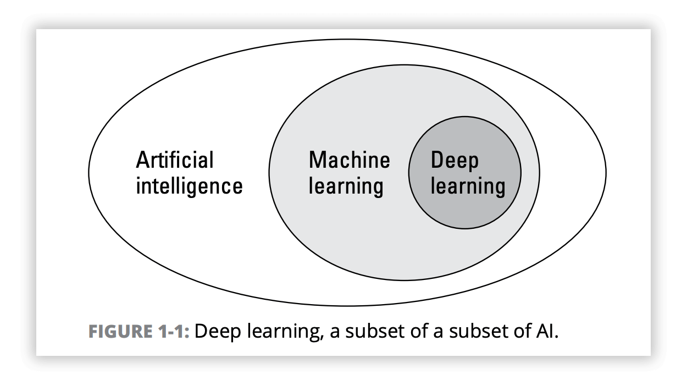
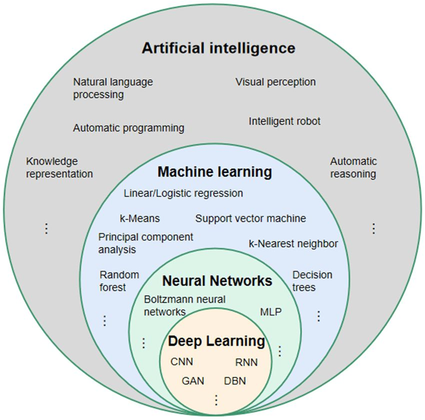
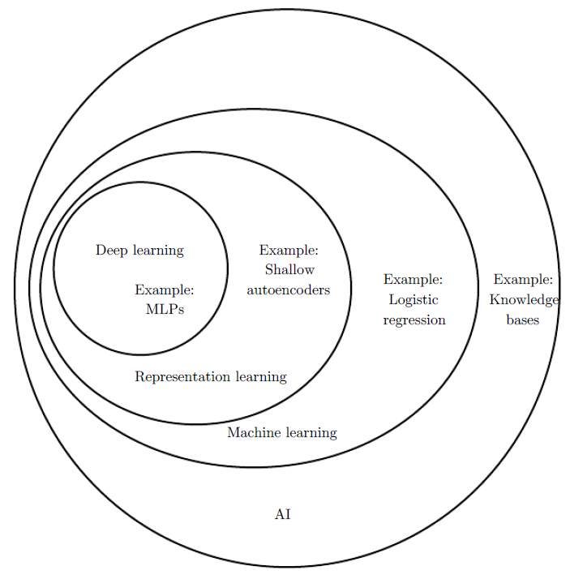
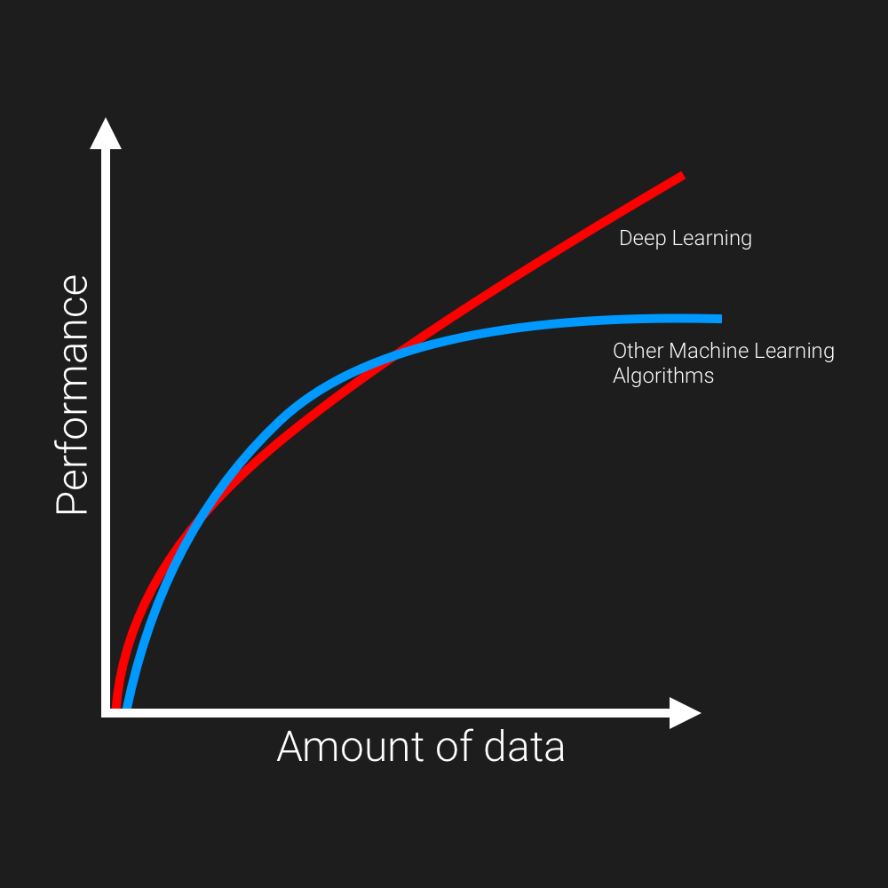

# Day_002 | What is Deep Learning | Why DL now 

## 1. What is Deep Learning (DL)? 🧠

Deep Learning is a specialized sub-field of Machine Learning (ML) that uses multi-layered structures called **Artificial Neural Networks (ANNs)** to learn complex patterns directly from raw data.

The "deep" in deep learning refers to the use of networks with **many hidden layers** (Deep Neural Networks or DNNs), allowing them to process data hierarchically—learning simple features in the early layers and highly abstract, complex features in the later layers.

* **Key Idea:** To automatically discover the feature representation needed for tasks like classification or regression, rather than relying on manual feature engineering.

## 2. What is Representation Learning? 💡

**Representation Learning** is the process by which a machine learning model is trained to automatically discover the best way to transform the raw data into a compact, meaningful internal representation (a set of features) necessary for a specific task.

In Deep Learning, the network's multiple hidden layers are explicitly performing representation learning:

* **Example (Image):** The first layer might learn simple features like **edges** and **corners**. The next layer combines these into **textures** and **patterns**. Later layers combine these into complex concepts like **eyes** or **wheels**.
* **The Output:** The final layer is the "representation" that is fed into the classification or regression head.

## 3. Deep Learning vs. Traditional Machine Learning (ML) ⚙️

The primary difference lies in the **Feature Engineering** step.

| Feature | Traditional Machine Learning (ML) | Deep Learning (DL) |
| :--- | :--- | :--- |
| **Feature Extraction** | **Manual** and explicit. An engineer must design algorithms (e.g., SIFT, TF-IDF) to convert raw data into features. | **Automatic** and implicit. The network learns the optimal features as part of the training process (Representation Learning). |
| **Data Size** | Works well with **small to medium-sized** datasets. | Requires **very large datasets** (Big Data) to unlock the power of deep architectures. |
| **Training Time** | Generally **faster** to train. | Generally **slower** to train; often requires GPUs/TPUs. |
| **Output** | Good for tabular, structured data. | Excels with unstructured data: **Images (CNNs), Text (RNNs/Transformers), Audio**. |

## Why Deep Learning Now?
1. **Dataset**: The proliferation of the internet, smartphones, and the Internet of Things (IoT) has led to an explosion of digital data, including text, images, and audio.
   
2. **Frameworks**: Open-source frameworks like TensorFlow and PyTorch have simplified the process of building and training deep learning models, making the technology accessible to a wider audience of developers and data scientists. Convert PyTorch, Tensorflow, PyTorch use *GUI* based *Drop-Down* $-$ AutoML
   
3. **Hardware**: Graphics Processing Units (GPUs), originally designed for video games, are built to handle thousands of parallel tasks at once. This architecture makes them vastly superior to general-purpose CPUs for deep learning and has dramatically reduced the time needed to train complex models.
   1. **Key Points:** *Moor's Law*, *FPGA*, *ASIC [TPU, Edge TPU, NPU]*,
4. **Architecture**: Deep learning architecture is characterized by its use of multilayered neural networks that automatically learn hierarchical feature representations from data. Instead of requiring explicit instructions, these systems use hidden layers to progressively extract more complex patterns. For example, a network processing images might identify edges in the first layer, shapes in the middle layers, and whole objects in the final layers, enabling applications like computer vision and generative AI. Specialized architectures have evolved to suit different data types: Convolutional Neural Networks (CNNs) excel at spatial data like images, Recurrent Neural Networks (RNNs) and their variants like LSTMs handle sequential data such as text, and Transformer networks use self-attention mechanisms to master complex language tasks.
   
5. **Community**: The contemporary impact of the deep learning community is both revolutionary and ethically challenging, driven by an open-source culture and rapid innovation. On one hand, deep learning has accelerated scientific discovery, transformed industries from healthcare to finance, and enabled new creative tools. On the other, the community faces significant ethical hurdles, including mitigating model biases inherited from training data, addressing the "black box" problem of explaining complex model decisions, and navigating privacy concerns when working with massive datasets. The ongoing evolution of this community, spanning researchers, developers, and ethicists, is constantly shaping how deep learning can be deployed responsibly for societal benefit.

## Conclusion
**Traditional ML** relies on human-crafted features and simpler models. **Deep Learning** replaces manual feature engineering with large, layered neural networks that *learn* the best data representation.

## Images

