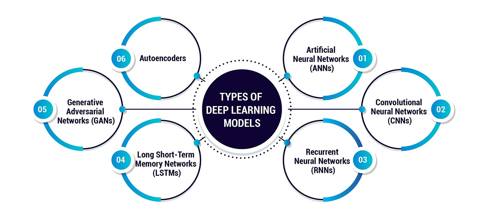
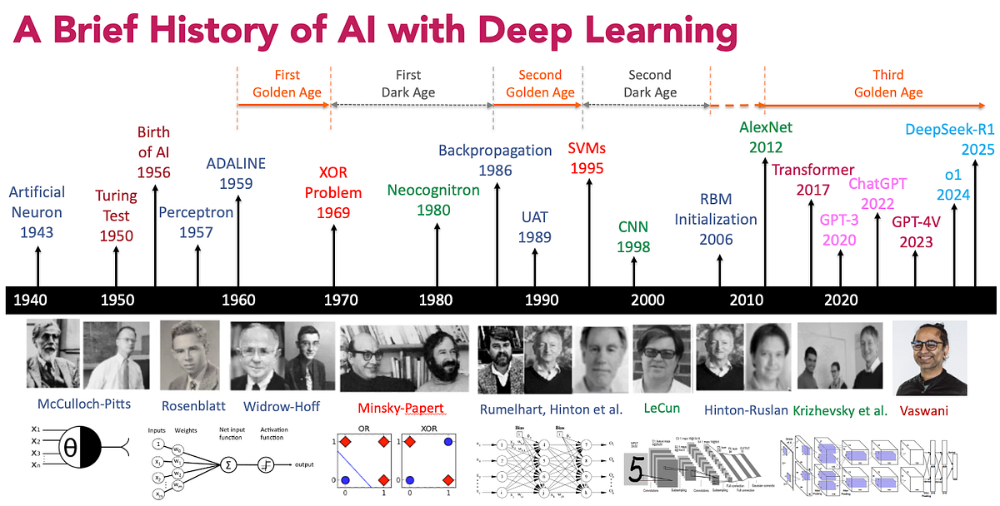
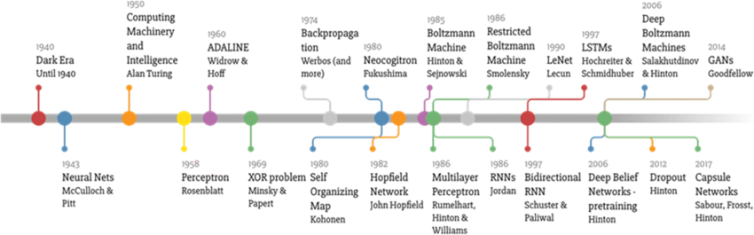

# Day_003 | 📂 Deep Learning: Types | History | Application 

## 1. Major Types of Deep Learning Architectures

Deep Learning models are generally categorized by the **type of data** they are best suited to process and the **internal mechanism** they employ.

| Architecture | Primary Use Case | Key Mechanism | Modern Examples |
| :--- | :--- | :--- | :--- |
| **Feedforward NN (FNN) / MLP** | Tabular data, simple classification/regression, fundamental building block. | Information flows one way (forward); fully connected layers. | Basic dense layers in Keras/PyTorch. |
| **Convolutional NN (CNN)** | **Images** (Computer Vision), spatial data, video. | Uses **Convolutional Layers** to extract local spatial features (edges, textures) that are location-invariant. | **AlexNet, ResNet, VGG**, YOLO (Object Detection). |
| **Recurrent NN (RNN)** | **Sequential Data** (time series, short text). | Has an internal **hidden state** (memory) that is passed from one time step to the next. | Basic language models. |
| **LSTM / GRU** | **Long Sequences** (long text, speech, long time series). | Special type of RNN with **Gates** (Forget, Input, Output) to control memory flow, solving the Vanishing Gradient problem. | Machine Translation, Speech Recognition. |
| **Transformer** | **Natural Language Processing (NLP)**, large sequence data. | Replaces recurrence with **Self-Attention** mechanism, allowing parallel processing and capturing long-range dependencies efficiently. | **BERT, GPT, LLaMA**. |
| **Generative Adversarial Network (GAN)** | **Generative AI** (creating new, realistic data like images/audio). | Two networks (Generator & Discriminator) compete in a zero-sum game. | StyleGAN, Midjourney (conceptually). |
| **Autoencoder (AE)** | **Dimensionality Reduction, Denoising, Anomaly Detection.** | **Encoder** compresses input to a latent space; **Decoder** reconstructs the original input from the latent space. | Variational Autoencoders (VAEs). |

---

## 2. History of Deep Learning: Key Milestones 📜

The history of DL is characterized by periods of excitement, followed by "AI Winters" (funding/interest declines), and finally, the current renaissance.

| Era | Year | Milestone/Key Concept | Significance |
| :--- | :--- | :--- | :--- |
| **Foundational** | 1943 | **McCulloch-Pitts Neuron** | First mathematical model of a biological neuron. |
| | 1958 | **Perceptron** (Rosenblatt) | First single-layer neural network model with a learning algorithm. |
| **The First Winter** | 1969 | Minsky & Papert publish *Perceptrons* | Highlighted the single-layer perceptron's inability to solve non-linear problems (like XOR), leading to a decline in NN research. |
| **The Revival** | 1986 | **Backpropagation** (Rumelhart, Hinton, Williams) | Popularized the efficient algorithm for training *multi-layer* NNs, enabling them to solve non-linear problems. |
| | 1997 | **Long Short-Term Memory (LSTM)** | Introduced a robust solution for the **Vanishing Gradient** problem in sequential data. |
| | 1998 | **LeNet-5** (LeCun) | First practical demonstration of a **CNN** for handwritten digit recognition. |
| **The Renaissance** | 2010s | **Availability of Big Data** | Explosion of data (ImageNet, web text) made large-scale training possible. |
| | 2012 | **AlexNet** (Krizhevsky, Sutskever, Hinton) | Won the ImageNet competition, demonstrating the power of deep CNNs trained on **GPUs**. Widely considered the "Big Bang" of modern DL. |
| **The Modern Era** | 2017 | **Transformer Architecture** | Introduced the **Attention** mechanism, completely removing the need for recurrence and allowing unprecedented parallelization and scale in NLP. |
| | 2018-Present | **Pre-trained Models (BERT, GPT)** | Leverage massive compute to pre-train huge models on vast datasets, which can then be fine-tuned for diverse tasks. |

This note covers the extensive real-world applications of deep learning across key industries.

***

## 🎯 Applications of Deep Learning

### 1. Computer Vision (CV)

Deep learning (primarily **CNNs** and **Vision Transformers**) has achieved superhuman performance in visual tasks.

| Application | Description | DL Mechanism |
| :--- | :--- | :--- |
| **Image Classification** | Identifying the main object or category in an image (e.g., "Cat," "Car," "X-Ray"). | CNNs |
| **Object Detection** | Locating and drawing bounding boxes around multiple objects in an image (e.g., traffic lights, pedestrians, other cars). | YOLO, R-CNN models |
| **Facial Recognition** | Identifying or verifying a person's identity from an image or video. | CNNs |
| **Autonomous Vehicles** | Real-time scene understanding, obstacle avoidance, and lane-keeping by processing live camera feeds. | CNNs, Segmentation models |
| **Medical Imaging** | Automated analysis of X-rays, MRIs, and CT scans to detect tumors, fractures, and diseases (e.g., diabetic retinopathy). | CNNs, U-Net |

### 2. Natural Language Processing (NLP)

DL (primarily **RNNs, LSTMs, and Transformers**) revolutionized how machines understand, interpret, and generate human language.

| Application | Description | DL Mechanism |
| :--- | :--- | :--- |
| **Machine Translation** | Real-time, highly contextual translation (e.g., Google Translate, deep language models). | Sequence-to-Sequence Models, **Transformers** (e.g., T5) |
| **Sentiment Analysis** | Determining the emotional tone (positive, negative, neutral) of text data like customer reviews or social media posts. | RNNs, BERT, etc. |
| **Large Language Models (LLMs)** | Generating human-quality text, coding, and complex reasoning (e.g., **ChatGPT, Gemini**). | **Transformer** Architecture (e.g., GPT, LLaMA) |
| **Virtual Assistants & Chatbots** | Interpreting spoken or typed commands and generating relevant, conversational responses. | Speech-to-Text, RNNs/Transformers |

### 3. Speech and Audio Processing

| Application | Description | DL Mechanism |
| :--- | :--- | :--- |
| **Speech Recognition** | Converting spoken words into text (e.g., voice typing, voice assistants like Siri/Alexa). | CNNs (for feature extraction) and RNNs/LSTMs |
| **Text-to-Speech (TTS)** | Generating realistic, human-like synthetic voices from text. | WaveNet, Generative Models |
| **Audio Classification** | Identifying sounds (e.g., distinguishing a car alarm from a dog bark). | CNNs on Spectrograms |

### 4. Healthcare and Medicine

| Application | Description | DL Mechanism |
| :--- | :--- | :--- |
| **Drug Discovery** | Predicting the efficacy and toxicity of new molecular compounds, significantly speeding up the research phase. | Autoencoders, Graph Neural Networks |
| **Personalized Medicine** | Analyzing patient genomics and clinical data to recommend the most effective, personalized treatment plan. | Deep Neural Networks |
| **Risk Prediction** | Analyzing Electronic Health Records (EHRs) to predict patient risk of specific conditions (e.g., heart failure, hospital readmission). | RNNs, Deep Learning on tabular data |

### 5. Business and Finance

| Application | Description | DL Mechanism |
| :--- | :--- | :--- |
| **Recommendation Systems** | Suggesting movies, products, or music based on user behavior and preferences (e.g., Netflix, Amazon). | Autoencoders, Deep Collaborative Filtering |
| **Fraud Detection** | Identifying anomalous or suspicious patterns in financial transactions, insurance claims, or credit card usage in real-time. | Autoencoders (for anomaly detection) |
| **Algorithmic Trading** | Analyzing massive time-series data of stock prices, news sentiment, and market trends to execute automated trades. | RNNs/LSTMs, Deep Reinforcement Learning |

### 6. Generative AI

The most rapidly evolving field, focused on creating new, original data.

| Application | Description | DL Mechanism |
| :--- | :--- | :--- |
| **Deepfakes & Synthesis** | Creating highly realistic synthetic images, videos, and voices. | **Generative Adversarial Networks (GANs)** |
| **AI Art Generation** | Generating unique images from text descriptions (e.g., DALL-E, Midjourney, Stable Diffusion). | **Diffusion Models**, VAEs |
| **Data Augmentation** | Creating synthetic training data to improve the robustness of other models. | GANs, VAEs |

## Images

