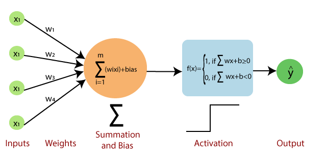
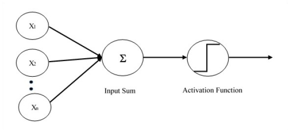

# Day 004 | What is Perceptron | Perceptron vs Neuron | Geometric Intuition

## The Single Perceptron (Artificial Neuron)

A single perceptron takes multiple inputs, performs a simple calculation, and produces a single output. Its function is to model a binary decision based on a weighted sum of inputs.

The process involves three steps:
1.  **Inputs and Weights:** It receives several inputs ($\mathbf{x}$), each multiplied by a corresponding numerical **weight** ($\mathbf{w}$).
2.  **Weighted Sum:** All the weighted inputs are summed up, and a **bias** ($b$) is added: $z = (\mathbf{w} \cdot \mathbf{x}) + b$.
3.  **Activation/Output:** The sum ($z$) is passed through an **activation function** (historically, a step function) to produce the final binary output (e.g., 0 or 1). The output is $\text{Output} = \text{Step}(z)$.

A single perceptron can only solve **linearly separable** classification problems (e.g., the AND or OR gates, but not the XOR gate).

***

## Single Perceptron vs. Biological Neuron

The perceptron is an extremely simplified mathematical model *inspired* by a biological neuron, not a direct replication.

| Feature | Single Perceptron (Artificial Neuron) | Biological Neuron |
| :--- | :--- | :--- |
| **Input** | $\mathbf{x}$ (Numerical values) | **Dendrites** receive electrochemical signals |
| **Input Strength** | **Weights** ($\mathbf{w}$) adjust the influence of each input. | **Synaptic Strength** determines the strength of the connection. |
| **Central Processor** | **Summation** of weighted inputs, plus **Bias** ($b$). | **Soma** (Cell body) integrates inputs spatially and temporally. |
| **Output Decision** | **Activation Function** (e.g., step function) fires a single output (0 or 1). | **Axon Hillock** fires an all-or-nothing **Action Potential** when a threshold is met. |
| **Output Structure** | A single output value, which is duplicated to serve as input for other neurons. | **Axon** transmits a signal to other cells via its terminals. |
| **Complexity** | Simple mathematical function; operates on floating-point numbers. | Highly complex, dynamic, and non-linear system involving millions of molecules and chemical processes. |

The key takeaway is that the perceptron captures the basic idea of weighted input and threshold-based firing, but the biological neuron is vastly more complex and powerful.

## Images

