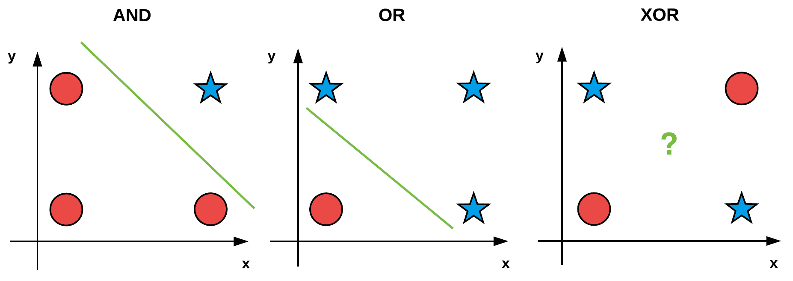

# Day 005 | Perceptron Trick | How to train perceptron | perceptron algorithm

## The Perceptron Trick

The **Perceptron Trick** is the specific rule for updating the weights and bias of the perceptron when a training example is **misclassified**. This adjustment effectively nudges the **decision boundary** (the line or hyperplane) in the feature space toward the misclassified point, helping it classify that point correctly in the future.

The weight update is calculated for a misclassified example ($\mathbf{x}$), its target output ($y$), and its actual predicted output ($\hat{y}$):

$$\Delta w_i = \eta \times (\mathbf{y} - \mathbf{\hat{y}}) \times x_i$$

* $\Delta w_i$: The change to be applied to weight $w_i$.
* $\eta$: The **learning rate**, a small positive constant that controls the size of the adjustment step.
* $(\mathbf{y} - \mathbf{\hat{y}})$: The **error** in prediction (which is either +1, -1, or 0).
* $x_i$: The $i^{th}$ input feature value corresponding to weight $w_i$.

The bias ($b$) is updated similarly: $\Delta b = \eta \times (\mathbf{y} - \mathbf{\hat{y}})$.

### Geometric Intuition

* **False Negative (Target $\mathbf{y=1}$, Predicted $\mathbf{\hat{y}=0}$):** The model underestimated the output. The error $(\mathbf{y} - \mathbf{\hat{y}})$ is $\mathbf{+1}$. The update rule **adds** $\eta \times \mathbf{x}$ to the weight vector $\mathbf{w}$, which moves the decision boundary closer to the misclassified $\mathbf{x}$ on the positive side.
* **False Positive (Target $\mathbf{y=0}$, Predicted $\mathbf{\hat{y}=1}$):** The model overestimated the output. The error $(\mathbf{y} - \mathbf{\hat{y}})$ is $\mathbf{-1}$. The update rule **subtracts** $\eta \times \mathbf{x}$ from the weight vector $\mathbf{w}$, which moves the decision boundary closer to the misclassified $\mathbf{x}$ on the negative side.
* **Correct Classification:** The error is $0$, so $\Delta w_i = 0$ and the weights are **not updated**.

---

## Perceptron Learning Algorithm (Training)

The full training process for a single perceptron uses the trick iteratively as follows:

1.  **Initialize Parameters:** Set the weights ($\mathbf{w}$) and bias ($b$) to small random values (or zero). Choose a **learning rate** ($\eta$).
2.  **Iterate Over Dataset (Epochs):** Repeat the following steps until the perceptron correctly classifies all training examples (or for a maximum number of epochs).
3.  **Process Training Example:** For each training example $(\mathbf{x}, y)$ in the dataset:
    a. **Forward Pass (Prediction):**
        * Calculate the **weighted sum** (or net input): $z = (\mathbf{w} \cdot \mathbf{x}) + b$.
        * Apply the **activation function** (typically a step function) to get the predicted output:
            $$\hat{y} = \begin{cases} 1 & \text{if } z > 0 \\ 0 & \text{otherwise} \end{cases}$$
    b. **Update Weights (Error Correction):**
        * Calculate the **error**: $\text{Error} = y - \hat{y}$.
        * If $\text{Error} \neq 0$, update the weights and bias using the Perceptron Trick:
            $$\mathbf{w}_{\text{new}} \leftarrow \mathbf{w}_{\text{old}} + \eta \times \text{Error} \times \mathbf{x}$$
            $$b_{\text{new}} \leftarrow b_{\text{old}} + \eta \times \text{Error}$$

**Perceptron Convergence Theorem:** The Perceptron Learning Algorithm is guaranteed to converge (i.e., find a set of weights and bias that correctly classifies all data points) **if and only if** the training data is **linearly separable**.

## Images
