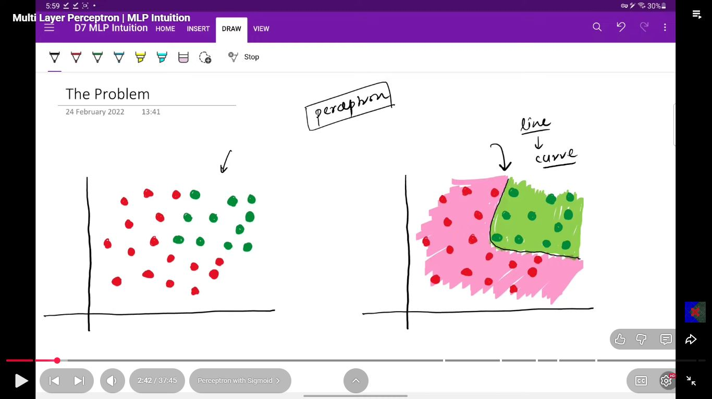
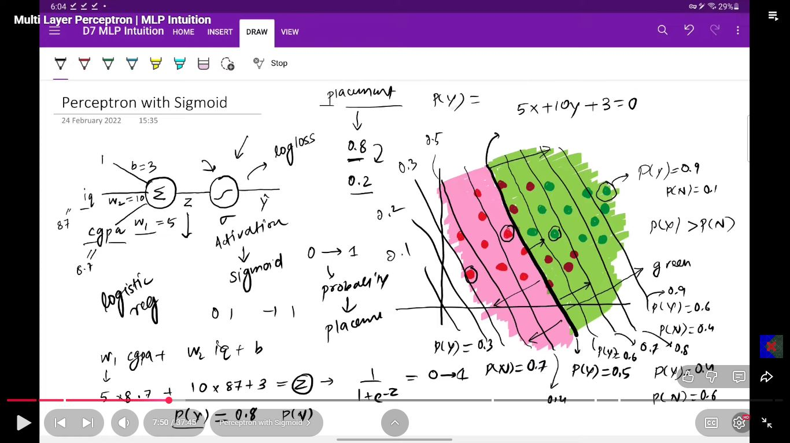
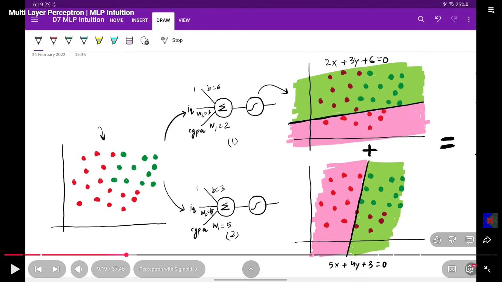
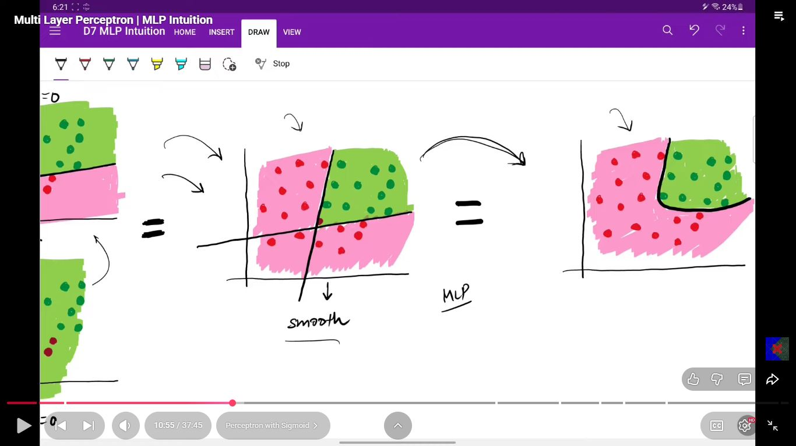
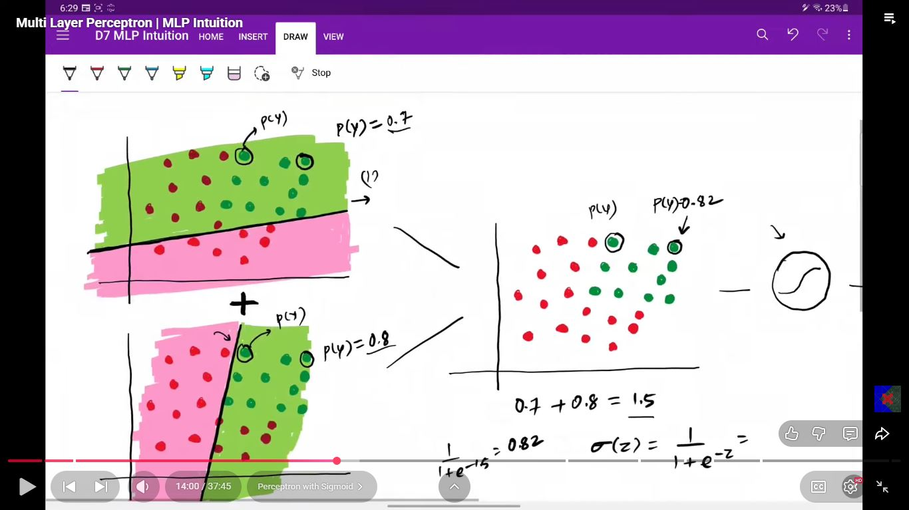
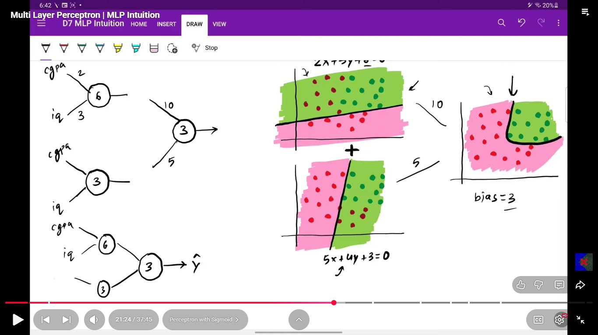

# Day 008 | Multi-Layer Perceptron (MLP) Intuition

The intuition behind the MLP is that by stacking multiple layers of simple processing units (neurons), the network can automatically learn to construct **complex, non-linear features** from the raw input data.

## 1. The Structure: Layers of Abstraction

An MLP is composed of at least three layers:

1.  **Input Layer:** Receives the raw data (e.g., pixel values of an image, features of a dataset).
2.  **Hidden Layer(s):** One or more layers between the input and output. This is the **magic** of the MLP. Each neuron in a hidden layer applies a weighted sum and a **non-linear activation function** (like ReLU or Sigmoid) to its inputs.
3.  **Output Layer:** Produces the final result (e.g., a class probability, a regression value).

## 2. The Core Mechanism: Non-Linear Feature Learning

The key to the MLP's power is the inclusion of **Non-Linear Activation Functions** in the hidden layers:

* **Single Perceptron:** Can only draw a single straight line (a linear decision boundary) to separate classes.
* **MLP with Hidden Layers:** Each neuron in the first hidden layer learns to draw a **different straight line** (a simple linear boundary) in the input space. The next layer then takes the outputs of these multiple lines as its input, and can effectively combine them to create a **complex, non-linear boundary** with corners, curves, and segments.
    * **Intuition:** Think of it like taking a complex shape and approximating it by combining several straight lines.
    * **The Power:** By adding more hidden layers (making it a **Deep Neural Network**), the network learns a **hierarchy of features**, where each layer builds upon the features learned by the previous one. The first layer might detect simple edges, the second layer might combine edges to form corners and shapes, and a later layer might combine shapes to recognize an entire object (like a face or a cat).

## 3. Solving the XOR Problem

The XOR problem, which breaks the single perceptron, is a perfect illustration of the MLP's intuition.

The XOR function requires a decision boundary that looks like two separate lines or a non-convex shape to separate the classes.

| Input $x_1$ | Input $x_2$ | Target Output (XOR) |
| :---: | :---: | :---: |
| 0 | 0 | **0** |
| 0 | 1 | **1** |
| 1 | 0 | **1** |
| 1 | 1 | **0** |

A single hidden layer can solve this by:
1.  **Hidden Neuron 1 (e.g., $x_1$ OR $x_2$):** Finds a line that separates $(0,0)$ from the other three points.
2.  **Hidden Neuron 2 (e.g., NOT ($x_1$ AND $x_2$)):** Finds a line that separates $(1,1)$ from the other three points.
3.  **Output Neuron (e.g., AND of the two Hidden Neurons):** Combines the simple linear classifications of the hidden layers to create the required non-linear separation (a convex area that separates the '1's from the '0's).

The ability to perform these compositions of simple linear boundaries is what gives the Multi-Layer Perceptron the power of a **Universal Function Approximator**—it can theoretically model any continuous function, given enough neurons and data.

## How to change Architectures  in MLP
1. Add Nodes in hidden layer
2. Add Hidden layers
3. Add nodes in input layer (if dataset have)
4. Add nodes in output layer (multicass classification)

## Images

## References:
Note Credit: [Gemini-Flash2.5](https://gemini.google.com/app/)\
Image credit: [CampusX](https://www.youtube.com/watch?v=qw7wFGgNCSU&list=PLKnIA16_RmvYuZauWaPlRTC54KxSNLtNn&index=9), [TensorBoard](https://playground.tensorflow.org/#activation=relu&batchSize=10&dataset=xor&regDataset=reg-plane&learningRate=0.001&regularizationRate=0&noise=5&networkShape=3,2&seed=0.54780&showTestData=false&discretize=false&percTrainData=80&x=true&y=true&xTimesY=false&xSquared=false&ySquared=false&cosX=false&sinX=false&cosY=false&sinY=false&collectStats=false&problem=classification&initZero=false&hideText=false)
