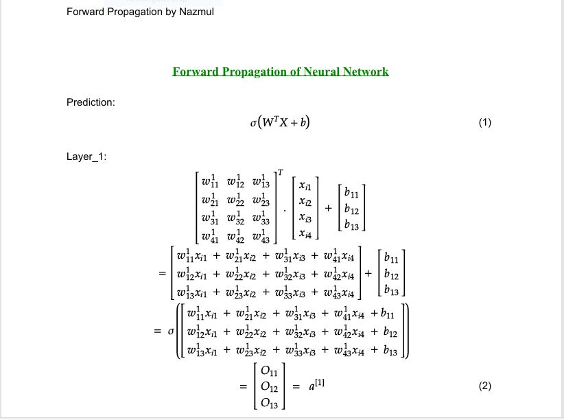
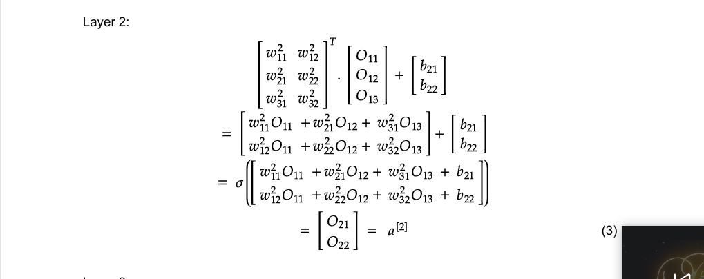
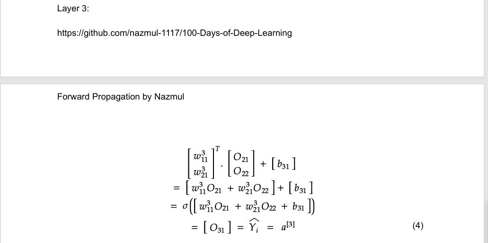
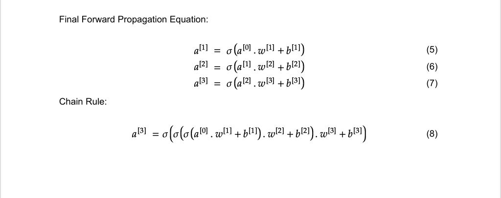

# Day_010 | Forward Propagation in a Multi-Layer Perceptron (MLP) | How MLP Predict

## 1. Overview

Forward Propagation is the process of computing the output of a neural network given a specific input. It involves a sequence of calculations, moving the data from the **Input Layer**, through one or more **Hidden Layers**, and finally to the **Output Layer** to produce a prediction.

## 2. Core Components and Notations

Before diving into the steps, we define the key learnable parameters and variables:

| Component | Notation | Description |
| :---: | :---: | :---: |
| **Input Data** | $\mathbf{x}$ or $a^{(0)}$ | The feature vector fed into the network. |
| **Layer Index** | $(l)$ | Denotes the specific layer (e.g., $l=1$ for the first hidden layer). |
| **Weights** | $\mathbf{W}^{(l)}$ | The matrix of weights connecting layer $l-1$ to layer $l$. $\mathbf{W}^{(l)}_{ji}$ is the weight from neuron $i$ in layer $l-1$ to neuron $j$ in layer $l$. |
| **Biases** | $\mathbf{b}^{(l)}$ | The vector of bias terms for the neurons in layer $l$. |
| **Pre-Activation** | $\mathbf{z}^{(l)}$ | The weighted sum of inputs before applying the activation function. Also called the **net input**. |
| **Activation / Output** | $\mathbf{a}^{(l)}$ | The output vector of layer $l$, after the activation function is applied. |
| **Activation Function** | $g(\cdot)$ or $\sigma(\cdot)$ | A non-linear function (e.g., ReLU, Sigmoid, Tanh) applied to the pre-activation. |

## 3. The Forward Propagation Process (Layer-by-Layer)

Forward propagation consists of repeating two fundamental mathematical steps for every hidden and output layer: the **Weighted Sum** and the **Activation**.

#### Step 3.1: Input Layer (Layer 0)

The input layer does not perform any computation; it simply passes the input data to the first hidden layer.

$$
\text{Input: } \mathbf{a}^{(0)} = \mathbf{x}
$$

#### Step 3.2: Computation in a Hidden Layer $l$

For any hidden layer $l$ (starting from $l=1$), the following two steps occur:

**A. Compute the Weighted Sum (Pre-Activation) - $\mathbf{z}^{(l)}$**

Each neuron in the layer calculates a weighted sum of the outputs from the previous layer $\mathbf{a}^{(l-1)}$ and adds its bias term.

$$\text{Scalar Form (for neuron } j \text{ in layer } l): \quad z_j^{(l)} = \sum_{i} W_{ji}^{(l)} a_i^{(l-1)} + b_j^{(l)}$$

$$\text{Vectorized Form (for the entire layer } l): \quad \mathbf{z}^{(l)} = \mathbf{W}^{(l)} \mathbf{a}^{(l-1)} + \mathbf{b}^{(l)}$$

**B. Apply the Activation Function to get the Layer Output - $\mathbf{a}^{(l)}$**

The pre-activation $\mathbf{z}^{(l)}$ is passed through a non-linear activation function $g(\cdot)$ (like ReLU or Tanh) to produce the final output of the layer. This introduces non-linearity, allowing the MLP to learn complex relationships.

$$\text{Vectorized Form: } \mathbf{a}^{(l)} = g(\mathbf{z}^{(l)})$$

### Step 3.3: Output Layer ($L$)

The final layer, $L$, is computed similarly to the hidden layers, but the activation function $g_{\text{out}}(\cdot)$ is chosen based on the task:

1.  **Regression (Predicting a continuous value):** Often no activation (identity function), or ReLU/Sigmoid if constraints exist.
2.  **Binary Classification:** Sigmoid function to output a probability between 0 and 1.
3.  **Multi-Class Classification:** Softmax function to output a probability distribution across all classes.

$$\text{Final Weighted Sum: } \mathbf{z}^{(L)} = \mathbf{W}^{(L)} \mathbf{a}^{(L-1)} + \mathbf{b}^{(L)}$$

$$\text{Final Prediction: } \mathbf{\hat{y}} = \mathbf{a}^{(L)} = g_{\text{out}}(\mathbf{z}^{(L)})$$

## 4. How the MLP Predicts (Making a Decision)

The final output $\mathbf{\hat{y}}$ from the forward propagation process is the MLP's prediction. The interpretation of this output depends on the task:

| Task | Output Interpretation |
| :--- | :--- |
| **Regression** | The values in $\mathbf{\hat{y}}$ are the predicted continuous values (e.g., house price, temperature). |
| **Binary Classification** | $\mathbf{\hat{y}}$ contains a single value (probability of the positive class). If $\hat{y} > 0.5$, the prediction is **Class 1**; otherwise, it is **Class 0**. |
| **Multi-Class Classification** | $\mathbf{\hat{y}}$ is a vector of probabilities (summing to 1). The predicted class is the one corresponding to the **highest probability** in the vector. |

## 5. Summary of the Prediction Flow

Forward propagation is the complete flow of data:

$$\mathbf{x} \xrightarrow[\text{Layer 1}]{\mathbf{W}^{(1)}, \mathbf{b}^{(1)}, g} \mathbf{a}^{(1)} \xrightarrow[\text{Layer 2}]{\mathbf{W}^{(2)}, \mathbf{b}^{(2)}, g} \mathbf{a}^{(2)} \dots \xrightarrow[\text{Layer L}]{\mathbf{W}^{(L)}, \mathbf{b}^{(L)}, g_{\text{out}}} \mathbf{\hat{y}}$$

## Images

