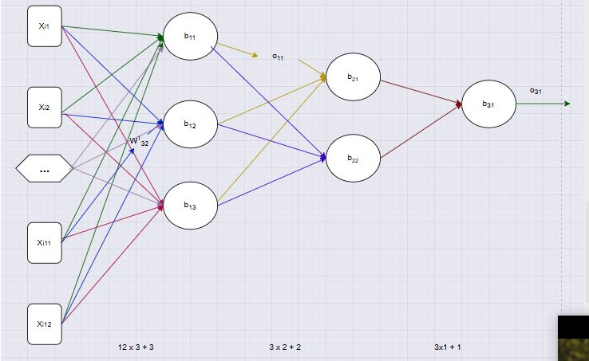

# Day 011 | Project 1 | Customer Churn Prediction using Keras and Tensorflow

## Table of Content
1. Quick overview (Sequential vs Functional)
2. Sequential API: docs + minimal example
3. Functional API: docs + minimal example
4. Full step-by-step workflow (compile, train, eval, save, load, callbacks, plotting)
5. Parameter counting, common layers, tips & troubleshooting

# 1 — Overview (when to use which)

* **Sequential API**

  * For *simple, linear* stacks of layers: `input → layer → layer → ... → output`.
  * Very concise and easy for standard feedforward networks.
* **Functional API (Model)**

  * For *any* architecture (including complex): multiple inputs/outputs, skip connections, shared layers, branching.
  * More flexible and explicit: you define tensors and connect them.

# 2 — Sequential API (documentation + example)

### Basic usage

```python
from tensorflow.keras.models import Sequential
from tensorflow.keras.layers import Dense, Dropout

model = Sequential([
    Dense(64, activation='relu', input_shape=(n_features,)),  # first layer needs input_shape
    Dropout(0.2),
    Dense(32, activation='relu'),
    Dense(1, activation='sigmoid')  # output for binary classification
])
```

### Notes

* `input_shape=(n_features,)` is only needed on the *first* layer when using `Sequential`.
* You can also call `model.add(...)` repeatedly instead of passing a list.
* Compile and train the `Sequential` model exactly like any Keras model (see section 4).

# 3 — Functional API (documentation + example)

### Basic usage

```python
from tensorflow.keras.layers import Input, Dense
from tensorflow.keras.models import Model

inputs = Input(shape=(n_features,))         # declare an input tensor
x = Dense(64, activation='relu')(inputs)   # connect layers by calling them
x = Dense(32, activation='relu')(x)
outputs = Dense(1, activation='sigmoid')(x)

model = Model(inputs=inputs, outputs=outputs)
```

### Notes

* `Input(...)` creates a symbolic input tensor.
* Each layer is a callable: `y = Layer()(x)`.
* You must pass `inputs` and `outputs` to `Model()` to construct the Keras model object.
* Use Functional API when you need branching, multiple inputs/outputs, or shared layers.

# 4 — Full step-by-step workflow (build → compile → train → evaluate → save)

### 1) Build the model (Sequential or Functional)

(see examples above)

### 2) Compile

Choose optimizer, loss, and metrics.

```python
model.compile(
    optimizer='adam',                 # or keras.optimizers.Adam(learning_rate=...)
    loss='binary_crossentropy',       # or categorical_crossentropy, mse, etc.
    metrics=['accuracy']              # monitoring metric(s)
)
```

### 3) Fit (train)

```python
history = model.fit(
    X_train, y_train,
    epochs=50,
    batch_size=32,
    validation_split=0.2,   # or validation_data=(X_val, y_val)
    callbacks=[...],        # optional
    verbose=1
)
```

### 4) Evaluate

```python
loss, accuracy = model.evaluate(X_test, y_test, batch_size=32)
print(f"Test loss: {loss:.4f}, Test accuracy: {accuracy:.4f}")
```

### 5) Predict

```python
y_pred_prob = model.predict(X_new)          # probabilities (or raw outputs)
y_pred = (y_pred_prob > 0.5).astype(int)    # binary labels thresholding if sigmoid
```

### 6) Save & load

* Save whole model (architecture + weights + optimizer state):

```python
model.save('my_model')          # saved in TensorFlow SavedModel format
# load
from tensorflow.keras.models import load_model
model = load_model('my_model')
```

* Save weights only:

```python
model.save_weights('weights.h5')
# later
model.load_weights('weights.h5')
```

# 5 — Common useful callbacks

```python
from tensorflow.keras.callbacks import ModelCheckpoint, EarlyStopping, ReduceLROnPlateau

callbacks = [
    ModelCheckpoint('best_model.h5', save_best_only=True, monitor='val_loss'),
    EarlyStopping(monitor='val_loss', patience=10, restore_best_weights=True),
    ReduceLROnPlateau(monitor='val_loss', factor=0.5, patience=5)
]
```

# 6 — Plotting training curves

```python
import matplotlib.pyplot as plt

hist = history.history
plt.plot(hist['loss'], label='train_loss')
plt.plot(hist['val_loss'], label='val_loss')
plt.plot(hist.get('accuracy', []), label='train_acc')
plt.plot(hist.get('val_accuracy', []), label='val_acc')
plt.legend()
plt.xlabel('epoch')
plt.show()
```

# 7 — How Keras counts parameters (quick formula)

For a `Dense` layer:

* If layer has `units = U` and receives `inputs = I`, then:

  * weights = `I * U`
  * biases = `U`
  * total params = `I * U + U = U * (I + 1)`

Example: `Dense(3)` receiving 10 inputs → `3 * (10 + 1) = 33 params`.

Convolutional, batchnorm, embedding, etc., have their own formulas.

# 8 — Typical layer types you’ll use

* `Dense(units, activation=...)` — fully connected layer
* `Conv2D(filters, kernel_size, ...)` — convolution for images
* `Flatten()` — flatten multi-D to 1-D vector
* `Dropout(rate)` — regularization
* `BatchNormalization()` — normalize activations (can speed training)
* Activation layers: `ReLU`, `sigmoid`, `softmax`, etc.

# 9 — Common mistakes & troubleshooting

* **Mixing Input() and input_shape incorrectly** — don’t pass an `Input()` instance into `input_dim`/`input_shape` of a Dense; use one approach. (You already saw that warning.)
* **Wrong loss for output activation**:

  * Binary problem → `Dense(1, activation='sigmoid')` + `loss='binary_crossentropy'`.
  * Multi-class → `Dense(n_classes, activation='softmax')` + `loss='categorical_crossentropy'` (or `sparse_categorical_crossentropy` for integer labels).
* **Mismatched shapes**: ensure `X` is shape `(n_samples, n_features)`, `y` shape `(n_samples,)` or `(n_samples, n_classes)`.
* **Numerical stability**: scale inputs (e.g., `StandardScaler`) for many optimizers.
* **Overfitting**: use `Dropout`, `EarlyStopping`, more data, or reduce model size.

# 10 — When to prefer which API — quick checklist

* Use **Sequential** if:

  * Your model is a straight stack of layers.
  * You want one-liner simplicity.
* Use **Functional** if:

  * You need multiple inputs or outputs.
  * You need skip connections, shared layers, or complex graphs.
  * You want to extract intermediate tensors easily.

# Example: two equivalent small models (Sequential vs Functional)

### Sequential

```python
from tensorflow.keras.models import Sequential
from tensorflow.keras.layers import Dense

model_seq = Sequential([
    Dense(16, activation='relu', input_shape=(n_features,)),
    Dense(8, activation='relu'),
    Dense(1, activation='sigmoid')
])
model_seq.compile(optimizer='adam', loss='binary_crossentropy', metrics=['accuracy'])
```

### Functional

```python
from tensorflow.keras.layers import Input, Dense
from tensorflow.keras.models import Model

inp = Input(shape=(n_features,))
x = Dense(16, activation='relu')(inp)
x = Dense(8, activation='relu')(x)
out = Dense(1, activation='sigmoid')(x)
model_fun = Model(inputs=inp, outputs=out)
model_fun.compile(optimizer='adam', loss='binary_crossentropy', metrics=['accuracy'])
```

Both behave the same for this linear architecture.


## Images

