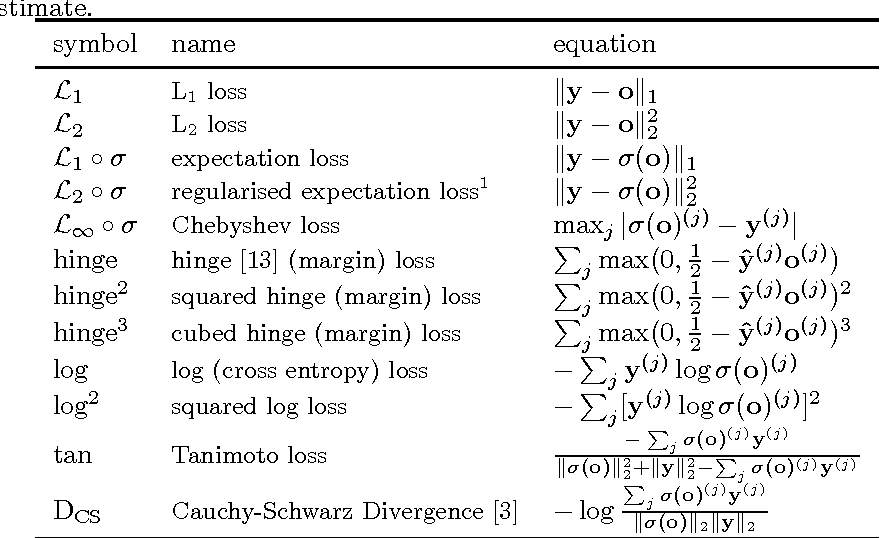

# Day_014 | Loss Functions in Deep Learning

A **Loss Function** (or **Cost Function**) is a fundamental component of any deep learning model. It serves as a compass, quantifying the difference between a model's predicted output ($\hat{y}$) and the actual target value ($y$). The primary goal of training a neural network is to minimize this loss.

Here is a comprehensive overview:

---

## Loss Functions in Deep Learning

### 1. Definition and Use Case

| Feature | Description |
| :--- | :--- |
| **Definition** | A mathematical function that takes the predicted output ($\hat{y}$) and the true value ($y$) as input and outputs a single real number representing the "cost" or "error" of the model's prediction. |
| **Use Case (Training)** | Guides the optimization algorithm (like Gradient Descent/Backpropagation). The gradient (derivative) of the loss function indicates the direction and magnitude by which the model's parameters (weights and biases) must be adjusted to reduce the error. |
| **Use Case (Evaluation)** | Provides a clear metric to evaluate the model's performance on both training and test data. |

### 2. General Equation

A general loss function $L$ for a single data point can be represented as:

$$
L(y, \hat{y}) = f(y, \hat{y})
$$

The **Cost Function** $J(\theta)$ is typically the average loss over the entire training set (or a batch), where $\theta$ represents the model's parameters (weights and biases).

$$
J(\theta) = \frac{1}{N} \sum_{i=1}^{N} L(y^{(i)}, \hat{y}^{(i)})
$$

### 3. Types of Loss Functions in Deep Learning

Loss functions are primarily categorized based on the type of machine learning task. 

#### A. Regression Losses (For Continuous Outputs)

| Loss Function | Equation | Use Case | Adv. & Disadv. |
| :--- | :--- | :--- | :--- |
| **Mean Squared Error (MSE)** or **L2 Loss** | $\text{MSE} = \frac{1}{N} \sum_{i=1}^{N} (y_i - \hat{y}_i)^2$ | Widely used for regression tasks (e.g., predicting house prices). | **Adv:** Differentiable everywhere, convex (single minimum). **Disadv:** Highly sensitive to outliers due to the squaring of errors, which can skew the model. |
| **Mean Absolute Error (MAE)** or **L1 Loss** | $\text{MAE} = \frac{1}{N} \sum_{i=1}^{N} \|y_i - \hat{y}_i\|$ | Used when robustness to outliers is critical. | **Adv:** More robust to outliers. The error is in the same unit as the output. **Disadv:** Non-differentiable at $y = \hat{y}$, which can cause issues for gradient-based optimization near the minimum. |
| **Huber Loss** (Smooth MAE) | $L_\delta(y, \hat{y}) = \begin{cases} \tfrac{1}{2}(y - \hat{y})^2, & \text{if } \|y - \hat{y}\| \le \delta [6pt] \delta \|y - \hat{y}\| - \tfrac{1}{2}\delta^2, & \text{otherwise} \end{cases}$ | Used to combine the benefits of MSE and MAE. | **Adv:** Quadratic for small errors (smooth convergence), linear for large errors (robust to outliers). **Disadv:** Requires tuning the $\delta$ hyperparameter (the threshold). |

#### B. Classification Losses (For Categorical Outputs)

| Loss Function | Equation | Use Case | Adv. & Disadv. |
| :--- | :--- | :--- | :--- |
| **Binary Cross-Entropy (BCE)** or **Log Loss** | $L = -\frac{1}{N} \sum_{i=1}^{N} [y_i \log(\hat{y}_i) + (1-y_i) \log(1-\hat{y}_i)]$ | Binary classification problems (e.g., Cat vs. Dog). Requires a Sigmoid activation in the output layer. | **Adv:** Heavily penalizes confident wrong predictions. Provides probabilistic interpretation. **Disadv:** Can be affected by class imbalance. |
| **Categorical Cross-Entropy (CCE)** | $L = -\frac{1}{N} \sum_{i=1}^{N} \sum_{c=1}^{C} y_{i,c} \log(\hat{y}_{i,c})$ | Multi-class classification with **one-hot encoded** labels. Requires a Softmax activation in the output layer. | **Adv:** Standard for multi-class tasks, works well with Softmax to produce probabilities. **Disadv:** Requires one-hot encoding of target labels. |
| **Sparse CCE** | (Uses the same mathematical function as CCE, but input is integer labels) | Multi-class classification with **integer encoded** labels. Requires a Softmax activation. | **Adv:** Saves memory and computational overhead compared to one-hot encoding. **Disadv:** Can only be used when each input belongs to a single class. |

### 4. Advantages and Disadvantages (General)

| Advantages | Disadvantages |
| :--- | :--- |
| **Optimization Guide** | Crucial for Backpropagation—they provide the gradient to update weights. | **Outlier Sensitivity** | Some losses (like MSE) are highly sensitive to noisy data or outliers. |
| **Performance Metric** | Provide a quantitative, objective measure of the model's prediction error. | **Non-Differentiability** | Some functions (like MAE at $y=\hat{y}$) are not fully differentiable, which complicates the use of standard gradient descent algorithms. |
| **Flexibility** | Different functions can be chosen to enforce desired model behavior (e.g., robustness to outliers, confidence in classification). | **Task Dependency** | The wrong choice of loss function for a task (e.g., MSE for classification) will lead to poor model convergence or performance. |

# ChatGPT
## 🧠 What is a Loss Function?

A **loss function** (also called **cost function** or **objective function**) measures how well or poorly a machine learning model performs.
It quantifies the **difference between predicted output** $(\hat{y})$ and **actual target value** $(y)$.
The goal of training a neural network is to **minimize this loss** using optimization algorithms like Gradient Descent.

### **General Form**

> Loss Function,
$$
L(y, \hat{y}) = \text{some measure of difference between } y \text{ and } \hat{y}
$$

> Cost Function,
$$
J(\theta) = \frac{1}{N} \sum_{i=1}^{N} L(y_i, \hat{y_i})
$$
where

* $(J(\theta))$ = overall cost
* $(N)$ = number of samples
* $(\theta)$ = model parameters

---

## ⚙️ Use Cases

* **Supervised Learning:** Training neural networks for regression or classification.
* **Unsupervised Learning:** Autoencoders (reconstruction loss).
* **Reinforcement Learning:** Reward-based loss (policy gradient).
* **Generative Models:** GANs (adversarial loss).

---

## ✅ Advantages

* Provides a **quantitative measure** to guide optimization.
* Enables **automatic differentiation** for backpropagation.
* Can be **customized** for specific tasks (e.g., class imbalance, sequence learning).

---

## ❌ Disadvantages

* Poor choice of loss can lead to **slow convergence** or **suboptimal learning**.
* Some losses are **not robust to outliers** (e.g., MSE).
* May not fully capture **human perception or task-specific goals** (e.g., image similarity).

---

## 📊 Types of Loss Functions in Deep Learning

### **1. Regression Loss Functions**

#### a. Mean Squared Error (MSE)

$$
L(y, \hat{y}) = \frac{1}{N} \sum_{i=1}^{N} (y_i - \hat{y_i})^2
$$

* **Use case:** Regression problems (e.g., predicting house prices).
* **Advantage:** Smooth, differentiable.
* **Disadvantage:** Sensitive to outliers.

#### b. Mean Absolute Error (MAE)

$$
L(y, \hat{y}) = \frac{1}{N} \sum_{i=1}^{N} |y_i - \hat{y_i}|
$$

* **Use case:** Robust regression.
* **Advantage:** Less sensitive to outliers.
* **Disadvantage:** Gradient not smooth at 0.

#### c. Huber Loss

$$
L(y, \hat{y}) =
\begin{cases}
\frac{1}{2}(y - \hat{y})^2 & \text{for } |y - \hat{y}| \le \delta \
\delta |y - \hat{y}| - \frac{1}{2}\delta^2 & \text{otherwise}
\end{cases}
$$

* **Use case:** Combines MSE and MAE advantages.

---

### **2. Classification Loss Functions**

#### a. Binary Cross-Entropy (Log Loss)

$$
L(y, \hat{y}) = -[y \log(\hat{y}) + (1 - y) \log(1 - \hat{y})]
$$

* **Use case:** Binary classification (e.g., spam detection).
* **Advantage:** Penalizes confident wrong predictions.
* **Disadvantage:** Can be unstable if (\hat{y}) ≈ 0 or 1.

#### b. Categorical Cross-Entropy

$$
L(y, \hat{y}) = -\sum_{c=1}^{C} y_c \log(\hat{y}_c)
$$

* **Use case:** Multi-class classification (e.g., image classification).

#### c. Kullback–Leibler Divergence (KL Divergence)

$$
L(y, \hat{y}) = \sum_{i} y_i \log \left( \frac{y_i}{\hat{y_i}} \right)
$$

* **Use case:** Comparing probability distributions (e.g., variational autoencoders).

---

### **3. Advanced / Specialized Loss Functions**

#### a. Hinge Loss

$$
L(y, \hat{y}) = \max(0, 1 - y \hat{y})
$$

* **Use case:** Support Vector Machines, binary classification.
* **Advantage:** Encourages large margin separation.

#### b. Contrastive Loss

$$
L = (1 - y) \frac{1}{2}(D)^2 + y \frac{1}{2}{\max(0, m - D)}^2
$$
where (D) = distance between embeddings.

* **Use case:** Siamese networks, face verification.

#### c. Triplet Loss

$$
L = \max(0, D(a, p) - D(a, n) + \alpha)
$$

* **Use case:** Face recognition, metric learning.

#### d. Dice Loss

$$
L = 1 - \frac{2|y \cap \hat{y}|}{|y| + |\hat{y}|}
$$

* **Use case:** Medical image segmentation.

#### e. Focal Loss

$$
L = -\alpha (1 - \hat{y})^\gamma \log(\hat{y})
$$

* **Use case:** Handling class imbalance (e.g., object detection).

---

## 🧩 Summary Table

| Type            | Common Loss          | Use Case              | Key Property               |
| --------------- | -------------------- | --------------------- | -------------------------- |
| Regression      | MSE, MAE, Huber      | Continuous output     | Measures numeric error     |
| Classification  | Cross-Entropy, Hinge | Discrete output       | Measures probability error |
| Probabilistic   | KL Divergence        | Distribution matching | Info-theoretic distance    |
| Metric Learning | Contrastive, Triplet | Embedding learning    | Distance-based             |
| Segmentation    | Dice, Focal          | Pixel-wise tasks      | Balances class imbalance   |

## Images
