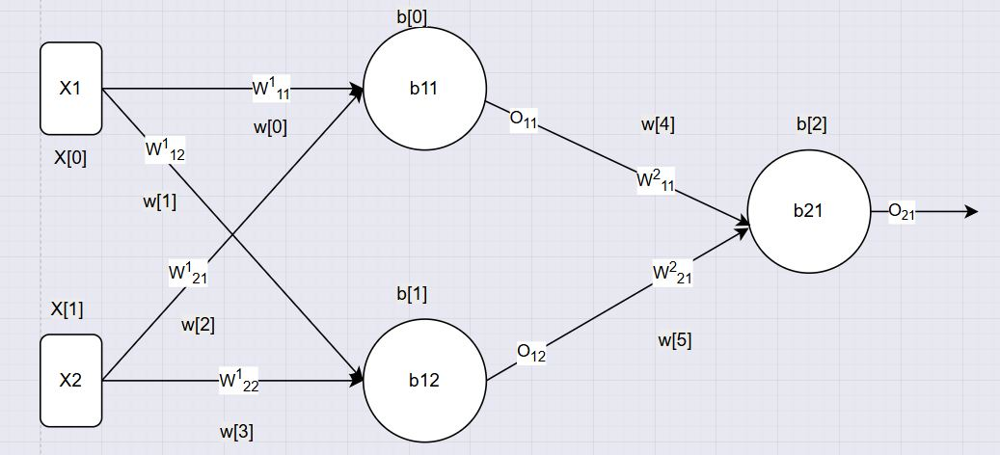

# Day_015 | 📘 Backpropagation in Deep Learning | Part 1 | What | Regression

## 1. Introduction

**Backpropagation** (short for *backward propagation of errors*) is the **learning algorithm** used to train **Artificial Neural Networks (ANNs)**.
It helps the network **minimize the error** between predicted output and actual target by **adjusting the weights**.

In simple terms:

> Backpropagation = Calculating how wrong the network is → figuring out which weights caused that error → updating them to make the network better.

---

## 2. The Idea Behind Backpropagation

* A neural network makes a prediction.
* The prediction is compared with the actual target (using a **loss function**).
* The error is calculated.
* The error is **propagated backward** through the layers using **calculus (chain rule)**.
* We adjust the weights slightly in the direction that **reduces the error**.

---


## 🧠 Network Structure

We have:

* **Input layer**: 2 neurons — $( x_1, x_2 )$
* **Hidden layer**: 2 neurons — $( h_1, h_2 )$
* **Output layer**: 1 neuron — $( \hat{y} )$
* **Loss**: MSE (for a single sample):
  
  $$
  L = \frac{1}{2}(\hat{y} - y)^2
  $$

---


## ⚙️ Forward Pass Equations

Let the parameters be:

* **Hidden layer weights and biases**
  
  $$
  W^{(1)} =
  \begin{bmatrix}
  w_{11}^{(1)} & w_{12}^{(1)} \
  w_{21}^{(1)} & w_{22}^{(1)}
  \end{bmatrix}, \quad
  b^{(1)} =
  \begin{bmatrix}
  b_1^{(1)} \ b_2^{(1)}
  \end{bmatrix}
  $$

  So each hidden neuron:
  > Hidden 1 $O_{11}$

  $$
  O_{(11)} = w_{11}^{(1)}x_1 + w_{21}^{(1)}x_2 + b_{11}
  $$

> Hidden 2 $O_{12}$

  $$
  O_{(12)} = w_{12}^{(1)}x_1 + w_{22}^{(1)}x_2 + b_{12}
  $$

> Final Function

  $$
  h_j = f(O_j^{(1)})
  $$

  where $( f(\cdot) )$ is the hidden activation function (e.g., sigmoid, tanh, ReLU).

* **Output layer weights and bias**
  
  $$
  W^{(2)} =
  \begin{bmatrix}
  w_{1}^{(2)} & w_{2}^{(2)}
  \end{bmatrix}, \quad
  b^{(2)} = b^{(2)}
  $$

  Output neuron:

  $$
  \hat{y} = O_{(21)}
  $$

  $$
   O_{(21)} = w_{11}^{(2)}O_{11} + w_{21}^{(2)}O_{12} + b_{(21)}
  $$

  $$
  \hat{y} = O_{(21)} \quad \text{(for regression, typically linear activation at output)}
  $$

---

## 🔁 Backpropagation Derivations

We’ll compute gradients for each parameter.

### Step 1: Output Layer Derivatives

> Loss Function

$$
y = (y - \hat{y})^2
$$

> Predict Function

$$
\hat{y} =  w_{11}^{(2)}O_{11} + w_{21}^{(2)}O_{12} + b_{(21)}
$$

> Derive of Loss Function

$$
\frac{\partial L}{\partial \hat{y}} = -2 (y - \hat{y})
$$

> Output Derive Calculate

$$
\frac{\partial L}{\partial w_{(11)}^{(2)}} = \frac{\partial L}{\partial \hat{y}} \cdot \frac{\partial \hat{y}}{\partial w_{(11)}^{(2)}} 
$$

$$
 = -2 (y - \hat{y}) \cdot O_{11}
$$

(since output activation is linear)

So:

$$
\delta^{(2)} = \hat{y} - y
$$

Gradients for output layer:

$$
\frac{\partial L}{\partial w_j^{(2)}} = \delta^{(2)} h_j
$$

$$
\frac{\partial L}{\partial b^{(2)}} = \delta^{(2)}
$$

For output neuron $(O_{21})$,
> Weight w11

$$
\frac{\partial L}{\partial w_{(11)}^{(2)}} =  \frac{\partial L}{\partial \hat{y}} \cdot \frac{\partial \hat{y}}{\partial w_{(11)}^{(2)}} 
$$

$$
 = -2 (y - \hat{y}) \cdot  O_{(11)}
$$

> Weight w21

$$
\frac{\partial L}{\partial w_{(11)}^{(2)}} =  \frac{\partial L}{\partial \hat{y}} \cdot \frac{\partial \hat{y}}{\partial w_{(21)}^{(2)}} 
$$

$$
 = -2 (y - \hat{y}) \cdot  O_{(12)}
$$

> Bias b21

$$
\frac{\partial L}{\partial b_{(21)}} =  \frac{\partial L}{\partial \hat{y}} \cdot \frac{\partial \hat{y}}{\partial b_{(21)}} 
$$

$$
 = -2 (y - \hat{y})
$$


---

### Step 2: Hidden Layer Derivatives

For hidden neuron $( O_{11} )$,

> Weight w11

$$
\frac{\partial L}{\partial w_{(11)}^{(1)}} =  \frac{\partial L}{\partial \hat{y}} \cdot \frac{\partial \hat{y}}{\partial O_{(11)}} \cdot \frac{\partial O_{(11)}}{\partial w_{(11)}^{(1)}} 
$$

$$
 = -2 (y - \hat{y}) \cdot  w_{(11)}^{(2)} \cdot X_1
$$

> Weight w21

$$
\frac{\partial L}{\partial w_{(11)}^{(1)}} =  \frac{\partial L}{\partial \hat{y}} \cdot \frac{\partial \hat{y}}{\partial O_{(11)}} \cdot \frac{\partial O_{(11)}}{\partial w_{(21)}^{(1)}} 
$$

$$
 = -2 (y - \hat{y}) \cdot  w_{(11)}^{(2)} \cdot X_2
$$

> Bias b11

$$
\frac{\partial L}{\partial b_{(11)}} =  \frac{\partial L}{\partial \hat{y}} \cdot \frac{\partial \hat{y}}{\partial O_{(11)}} \cdot \frac{\partial O_{(11)}}{\partial b_{(11)}} 
$$

$$
 = -2 (y - \hat{y}) \cdot  w_{(11)}^{(2)}
$$


% Hidden newron O12
For hidden neuron $( O_{12} )$,
> Weight w12

$$
\frac{\partial L}{\partial w_{(12)}^{(1)}} =  \frac{\partial L}{\partial \hat{y}} \cdot \frac{\partial \hat{y}}{\partial O_{(12)}} \cdot \frac{\partial O_{(12)}}{\partial w_{(12)}^{(1)}} 
$$

$$
 = -2 (y - \hat{y}) \cdot  w_{(21)}^{(2)} \cdot X_1
$$

> Weight w22

$$
\frac{\partial L}{\partial w_{(22)}^{(1)}} =  \frac{\partial L}{\partial \hat{y}} \cdot \frac{\partial \hat{y}}{\partial O_{(12)}} \cdot \frac{\partial O_{(12)}}{\partial w_{(22)}^{(1)}} 
$$

$$
 = -2 (y - \hat{y}) \cdot  w_{(21)}^{(2)} \cdot X_2
$$

> Bias b12

$$
\frac{\partial L}{\partial b_{(12)}} =  \frac{\partial L}{\partial \hat{y}} \cdot \frac{\partial \hat{y}}{\partial O_{(12)}} \cdot \frac{\partial O_{(12)}}{\partial b_{(12)}} 
$$

$$
 = -2 (y - \hat{y}) \cdot  w_{(21)}^{(2)}
$$

---

## 📘 Full Algorithm (per training sample)

**Given:** learning rate $( \eta )$

---

### 1️⃣ Forward Pass

```css
O_11 = w1_11*x1 + w1_21*x2 + b11
O_11 = w1_12*x1 + w1_22*x2 + b12
y_hat = O_11*w2_11 + O_21.w2_12 + b_21 
```

### 2️⃣ Compute Loss

```css
L = (y - y_hat)^2
```

### 3️⃣ Backward Pass

```css
δ2 = -2 (y - y_hat)

∂L/∂w1_2 = δ2 * h1
∂L/∂w2_2 = δ2 * h2
∂L/∂b_2 = δ2

δ1 = δ2 * w1_2 * f'(z1_1)
δ2h = δ2 * w2_2 * f'(z1_2)

∂L/∂w11_1 = δ1 * x1
∂L/∂w21_1 = δ1 * x2
∂L/∂b1_1 = δ1

∂L/∂w12_1 = δ2h * x1
∂L/∂w22_1 = δ2h * x2
∂L/∂b2_1 = δ2h
```

### 4️⃣ Parameter Updates

```
w <- w - η * (∂L/∂w)
b <- b - η * (∂L/∂b)
```

---

### Final Algorithm

1. Initialize all weights and biases randomly.
2. For each epochs
   1. For each training example:
      * **Select Sample:** Select a random sample
      * **Forward Pass:** Compute outputs.
      * **Compute Loss:** Compare with actual target.
      * **Backward Pass:**

        * Calculate gradients (partial derivatives).
        * Propagate error backward.
      * **Update Weights:** Adjust using gradient descent.
   2. Repeat until the error is very small or a fixed number of epochs is reached.

## 8. Example Pseudocode

```css
for each epoch:
    for each (x, y) in training_data:
        # Forward pass
        h = sigmoid(w1*x1 + w2*x2 + b1)
        y_hat = sigmoid(w3*h + b2)
        
        # Compute loss
        L = 0.5 * (y - y_hat)**2
        
        # Backward pass
        dL_dyhat = y_hat - y
        dL_dz2 = dL_dyhat * y_hat * (1 - y_hat)
        dL_dw3 = dL_dz2 * h
        
        dL_dh = dL_dz2 * w3
        dL_dz1 = dL_dh * h * (1 - h)
        dL_dw1 = dL_dz1 * x1
        dL_dw2 = dL_dz1 * x2
        
        # Update weights
        w1 -= eta * dL_dw1
        w2 -= eta * dL_dw2
        w3 -= eta * dL_dw3
```


## 9. Intuition

* **Forward pass:** Predict the output.
* **Backward pass:** Measure how much each weight contributed to the error.
* **Weight update:** Move each weight slightly to reduce the total error.

---

## 10. Key Concepts Recap

| Term          | Meaning                                         |
| ------------- | ----------------------------------------------- |
| Loss Function | Measures how wrong the network is               |
| Gradient      | Direction & rate of fastest change in error     |
| Learning Rate | Controls how much weights are updated           |
| Chain Rule    | Used to propagate error backward through layers |
| Epoch         | One full pass through the training data         |

---

## 11. Advantages

* Efficient and widely used in deep learning.
* Works well with differentiable activation functions.
* Can handle multi-layer networks.

---

## 12. Limitations

* Can get stuck in **local minima**.
* Requires **differentiable** activation functions.
* Can suffer from **vanishing gradients** in deep networks.

---

## 13. Summary Diagram (Conceptually)

```
Input → [Weights] → Hidden Layer → [Weights] → Output
                ↓                        ↑
             Forward Pass           Backward Pass (Error)
```

---


## Custom Implementation

> Python
```python

class MyBackpropagationNNRegressor:
  def __init__(self, lr=0.1, epochs=5) -> None:
    self.lr = lr
    self.epochs = epochs
    self.weights_ = []
    self.bias_ = []
    self.mse_loss = []
    self.epochs_loss = []

    self._init_weights = []
    self._init_bias = []

  def forward_propagation(self, X, y):

    # Hidden Layer
    O11 = self.weights_[0]*X[0] + self.weights_[2]*X[1] + self.bias_[0]
    O12 = self.weights_[1]*X[0] + self.weights_[3]*X[1] + self.bias_[1]

    # Output Layer
    O21 = self.weights_[4]*O11 + self.weights_[5]*O12 + self.bias_[2]
    # print(f'O11: {O11:.4f}, O12: {O12:.4f}, O21 (output): {O21:.4f}\n')

    return O11, O12, O21

  def update_parameters(self, X, y, O21, O11, O12):
    y_hat = O21
    dO21 = -2*(y-y_hat)
    dO11 = self.weights_[4]*dO21
    dO12 = self.weights_[5]*dO21


    # Calculate for Y_hat or O21
    self.weights_[4] = self.weights_[4]  - self.lr * dO21 * O11
    self.weights_[5] = self.weights_[5]  - self.lr * dO21 * O12
    self.bias_[2] = self.bias_[2] - self.lr * dO21

    # Calculate for O11
    self.weights_[0] = self.weights_[0]  - self.lr * dO11 * X[0]
    self.weights_[2] = self.weights_[2]  - self.lr * dO11 * X[1]
    self.bias_[0] = self.bias_[0] - self.lr * dO11

    # Calculate for O12
    self.weights_[1] = self.weights_[1]  - self.lr * dO12 * X[0]
    self.weights_[3] = self.weights_[3]  - self.lr * dO12 * X[1]
    self.bias_[1] = self.bias_[1] - self.lr * dO12


  def fit(self, X, y):
    self.weights_ = np.array([random.random() for _ in range(6)])
    self.bias_ = np.array([random.random() for _ in range(3)])

    self._init_weights = self.weights_.copy()
    self._init_bias = self.bias_.copy()

    for _ in range(self.epochs):
      for __ in range(X.shape[0]):

        index = random.randint(0, X.shape[0]-1)
        O11, O12, O21 = self.forward_propagation(X[index], y)
        # print(f'Data for index = {index}, prediction = {y_hat}, actual_data = {y[index]}')

        self.mse_loss.append((y[index] - O21)**2)

        # Update Weight and Bias
        self.update_parameters(X[index], y[index], O21, O11, O12)

      self.epochs_loss.append(np.mean(self.mse_loss))
      print(f'epochs {_}/{self.epochs}, loss = {self.epochs_loss[_]}')
      self.mse_loss.clear()


  def get_weights(self, type: str = 'updated'):
      # Select which set of weights to return
      if type == 'init':
          w = self._init_weights
          b = self._init_bias
      else:
          w = self.weights_
          b = self.bias_

      # Map to Keras format
      return [
          np.array([[w[0], w[1]],      # dense_4 kernel (2x2)
                    [w[2], w[3]]]),
          np.array([b[0], b[1]]),      # dense_4 bias (2,)
          np.array([[w[4]],            # dense_5 kernel (2x1)
                    [w[5]]]),
          np.array([b[2]])             # dense_5 bias (1,)
      ]

```

## Neural Net Design
