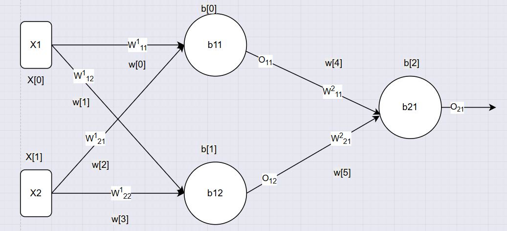

# Day_016 | 📘 Backpropagation in Deep Learning | Part 2 | How | **Classification (Binary Cross-Entropy)**

---

## 1. Introduction

**Backpropagation** (short for *backward propagation of errors*) is the **learning algorithm** used to train **Artificial Neural Networks (ANNs)**.
It minimizes the **difference between predicted probability and actual label** by adjusting the **weights and biases** through the **gradient descent** process.

In simple terms:

> Backpropagation = Measure how wrong the network is → figure out which weights caused it → adjust them to improve predictions.

---

## 2. The Idea Behind Backpropagation

1. The neural network predicts an output (a probability between 0 and 1 for binary classification).
2. The prediction is compared with the actual target (using a **loss function**, e.g., *binary cross-entropy*).
3. The error is computed.
4. This error is **propagated backward** through the network (using calculus → chain rule).
5. The **weights are updated** slightly in the direction that reduces the error.

---

## 🧠 Network Structure

We’ll use a small feedforward neural network:

* **Input layer**: 2 neurons — $(x_1, x_2)$
* **Hidden layer**: 2 neurons — $(h_1, h_2)$
* **Output layer**: 1 neuron — $\hat{y}$ (sigmoid output → probability of class 1)
* **Loss function**: Binary Cross-Entropy (BCE)

$$
L = -[y \log(\hat{y}) + (1 - y)\log(1 - \hat{y})]
$$

---

## ⚙️ Forward Pass Equations

### Hidden Layer

Parameters:
$$
W^{(1)} =
\begin{bmatrix}
w_{11}^{(1)} & w_{12}^{(1)} \
w_{21}^{(1)} & w_{22}^{(1)}
\end{bmatrix},
\quad
b^{(1)} =
\begin{bmatrix}
b_1^{(1)} & b_2^{(1)}
\end{bmatrix}
$$

Hidden pre-activations:
$$
O_{(11)} = w_{11}^{(1)}x_1 + w_{21}^{(1)}x_2 + b_1^{(1)}
$$
$$
O_{(12)} = w_{12}^{(1)}x_1 + w_{22}^{(1)}x_2 + b_2^{(1)}
$$

Hidden activations:
$$
h_j = f(O_j^{(1)}) = \sigma(O_j^{(1)}) = \frac{1}{1 + e^{-O_j^{(1)}}}
$$

---

### Output Layer

Parameters:
$$
W^{(2)} =
\begin{bmatrix}
w_{1}^{(2)} & w_{2}^{(2)}
\end{bmatrix},
\quad
b^{(2)} = b^{(2)}
$$

Output neuron:
$$
z^{(2)} = w_{1}^{(2)}h_1 + w_{2}^{(2)}h_2 + b^{(2)}
$$

Predicted output (sigmoid activation):
$$
\hat{y} = \sigma(z^{(2)}) = \frac{1}{1 + e^{-z^{(2)}}}
$$

---

## 🔁 Backpropagation Derivations

### Step 1: Output Layer Derivatives

Loss function:
$$
L = -[y \log(\hat{y}) + (1 - y)\log(1 - \hat{y})]
$$

Derivative of loss w.r.t. output:
$$
\frac{\partial L}{\partial \hat{y}} = -\frac{y}{\hat{y}} + \frac{1 - y}{1 - \hat{y}}
$$

Since $\hat{y} = \sigma(z^{(2)})$, we can simplify:
$$
\frac{\partial L}{\partial z^{(2)}} = \hat{y} - y
$$

Thus,
$$
\delta^{(2)} = \hat{y} - y
$$

Gradients for the output layer:
$$
\frac{\partial L}{\partial w_j^{(2)}} = \delta^{(2)} \cdot h_j
$$

$$
\frac{\partial L}{\partial b^{(2)}} = \delta^{(2)}
$$

---

### Step 2: Hidden Layer Derivatives

Hidden layer error term (using chain rule):
$$
\delta_j^{(1)} = (\delta^{(2)} w_j^{(2)}) \cdot f'(O_j^{(1)})
$$

For sigmoid activation:
$$
f'(O_j^{(1)}) = h_j(1 - h_j)
$$

Gradients for hidden layer weights and biases:
$$
\frac{\partial L}{\partial w_{ij}^{(1)}} = \delta_j^{(1)} \cdot x_i
$$
$$
\frac{\partial L}{\partial b_j^{(1)}} = \delta_j^{(1)}
$$

---

## 📘 Full Algorithm (per training sample)

**Given:** learning rate $(\eta)$

---

### 1️⃣ Forward Pass

```
z1_1 = w11_1*x1 + w21_1*x2 + b1_1
z1_2 = w12_1*x1 + w22_1*x2 + b2_1

h1 = sigmoid(z1_1)
h2 = sigmoid(z1_2)

z2 = w11_2*h1 + w21_2*h2 + b_2
y_hat = sigmoid(z2)
```

---

### 2️⃣ Compute Loss

```
L = -[y*log(y_hat) + (1 - y)*log(1 - y_hat)]
```

---

### 3️⃣ Backward Pass

```
δ_output = (y_hat - y)
∂L/∂w11_2 = δ_output * h1
∂L/∂w21_2 = δ_output * h2
∂L/∂b_2   = δ_output

δ_h1 = δ_output * w11_2 * h1 * (1 - h1)
δ_h2 = δ_output * w21_2 * h2 * (1 - h2)

∂L/∂w11_1 = δ_h1 * x1
∂L/∂w21_1 = δ_h1 * x2
∂L/∂b1_1  = δ_h1

∂L/∂w12_1 = δ_h2 * x1
∂L/∂w22_1 = δ_h2 * x2
∂L/∂b2_1  = δ_h2
```

---

### 4️⃣ Parameter Updates

```
w <- w - η * (∂L/∂w)
b <- b - η * (∂L/∂b)
```

---

## 🧩 Final Algorithm Steps

1. Initialize all weights and biases randomly.
2. For each epoch:

   1. For each sample:

      * Forward pass → compute predictions.
      * Compute binary cross-entropy loss.
      * Backward pass → compute gradients.
      * Update parameters using gradient descent.
   2. Track average loss per epoch.
3. Stop when loss converges or max epochs reached.

---

## 🧮 Example Pseudocode

```python
for each epoch:
    for each (x, y) in training_data:
        # Forward pass
        h = sigmoid(w1*x1 + w2*x2 + b1)
        y_hat = sigmoid(w3*h + b2)

        # Compute binary cross-entropy loss
        L = - (y*np.log(y_hat) + (1-y)*np.log(1-y_hat))

        # Backward pass
        dL_dyhat = y_hat - y
        dL_dz2 = dL_dyhat
        dL_dw3 = dL_dz2 * h

        dL_dh = dL_dz2 * w3
        dL_dz1 = dL_dh * h * (1 - h)
        dL_dw1 = dL_dz1 * x1
        dL_dw2 = dL_dz1 * x2

        # Update weights
        w1 -= eta * dL_dw1
        w2 -= eta * dL_dw2
        w3 -= eta * dL_dw3
```

---

## 9. Intuition

* **Forward pass:** Compute predicted probability.
* **Backward pass:** Evaluate contribution of each weight to the error.
* **Weight update:** Nudge each parameter in the direction that reduces classification error.

---

## 10. Key Concepts Recap

| Term          | Meaning                                     |
| ------------- | ------------------------------------------- |
| Loss Function | Measures how wrong the prediction is (BCE)  |
| Gradient      | Direction of the steepest loss change       |
| Learning Rate | Controls how fast weights are updated       |
| Chain Rule    | Enables propagation of error through layers |
| Epoch         | One full pass through the dataset           |

---

## 11. Advantages

✅ Works well for **binary classification**\
✅ Compatible with **sigmoid activation + BCE loss**\
✅ Core foundation for **deep learning training**

---

## 12. Limitations

⚠️ Sensitive to learning rate\
⚠️ Can suffer from **vanishing gradients**\
⚠️ May converge to local minima

---

## 13. Summary Diagram (Conceptually)

```
Input → [Weights] → Hidden Layer → [Weights] → Output (Sigmoid → ŷ)
                ↓                        ↑
             Forward Pass           Backward Pass (Error)
```

---

## 🧰 Custom Python Implementation (Binary Classification)

```python
class MyBackpropagationNNClassifier:
  def __init__(self, lr=0.01, epochs=5) -> None:
    self.lr = lr
    self.epochs = epochs
    self.weights_ = []
    self.bias_ = []
    self.loss_calculate = []
    self.epochs_loss = []
    self._init_weights = []
    self._init_bias = []


  def sigmoid(self, x)-> float:
    return 1 / (1+np.exp(-x))


  def forward_propagation(self, X, y):

    # Hidden Layer
    Z11 = self.weights_[0]*X[0] + self.weights_[2]*X[1] + self.bias_[0]
    Z12 = self.weights_[1]*X[0] + self.weights_[3]*X[1] + self.bias_[1]

    # Output Layer
    Z21 = self.weights_[4]*Z11 + self.weights_[5]*Z12 + self.bias_[2]

    return self.sigmoid(Z11), self.sigmoid(Z12), self.sigmoid(Z21)


  def update_parameters(self, X, y, y_hat, O11, O12):
    dL_dYhat_dZ = y_hat-y

    # Gradients for hidden neurons
    dO11 = self.weights_[4] * O11 * (1 - O11) * dL_dYhat_dZ
    dO12 = self.weights_[5] * O12 * (1 - O12) * dL_dYhat_dZ

    # Output layer updates
    self.weights_[4] -= self.lr * dL_dYhat_dZ * O11
    self.weights_[5] -= self.lr * dL_dYhat_dZ * O12
    self.bias_[2] -= self.lr * dL_dYhat_dZ

    # Hidden layer updates
    self.weights_[0] -= self.lr * dO11 * X[0]
    self.weights_[2] -= self.lr * dO11 * X[1]
    self.bias_[0] -= self.lr * dO11

    self.weights_[1] -= self.lr * dO12 * X[0]
    self.weights_[3] -= self.lr * dO12 * X[1]
    self.bias_[1] -= self.lr * dO12


  def fit(self, X, y):
    # self.weights_ = np.array([random.random() for _ in range(6)])
    # self.bias_ = np.array([random.random() for _ in range(3)])

    self.weights_ = np.random.uniform(-1, 1, 6)
    self.bias_ = np.random.uniform(-1, 1, 3)


    self._init_weights = self.weights_.copy()
    self._init_bias = self.bias_.copy()

    for _ in range(self.epochs):
      for _i in range(X.shape[0]):

        index = random.randint(0, X.shape[0]-1)

        O11, O12, O21 = self.forward_propagation(X[index], y[index])
        O12 = np.clip(O12, 1e-10, 1-1e-10)
        O11 = np.clip(O11, 1e-10, 1-1e-10)
        O21 = np.clip(O21, 1e-10, 1-1e-10)

        binary_loss = -y[index]*np.log(O21) - (1-y[index])*np.log(1-O21)
        self.loss_calculate.append(binary_loss)

        # Update Parameter
        self.update_parameters(X=X[index], y=y[index], y_hat=O21, O11=O11, O12=O12)

      self.epochs_loss.append(np.mean(self.loss_calculate))
      print(f'epochs {_}/{self.epochs}, loss={self.epochs_loss[_]:.4f}')

      self.loss_calculate.clear()


  def get_weights(self, type: str = 'updated'):
      # Select which set of weights to return
      if type == 'init':
          w = self._init_weights
          b = self._init_bias
      else:
          w = self.weights_
          b = self.bias_

      # Map to Keras format
      return [
          np.array([[w[0], w[1]],      # dense_4 kernel (2x2)
                    [w[2], w[3]]]),
          np.array([b[0], b[1]]),      # dense_4 bias (2,)
          np.array([[w[4]],            # dense_5 kernel (2x1)
                    [w[5]]]),
          np.array([b[2]])             # dense_5 bias (1,)
      ]
```

---

## 🧠 Neural Net Design



---

Would you like me to include **a section comparing regression vs classification backpropagation** (to highlight the key mathematical difference between MSE and BCE)?
It’s a great addition for learners building intuition.
