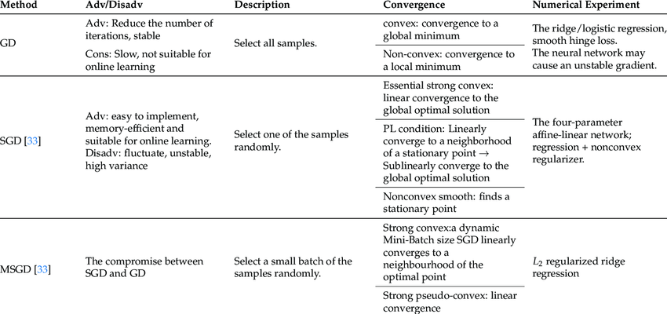
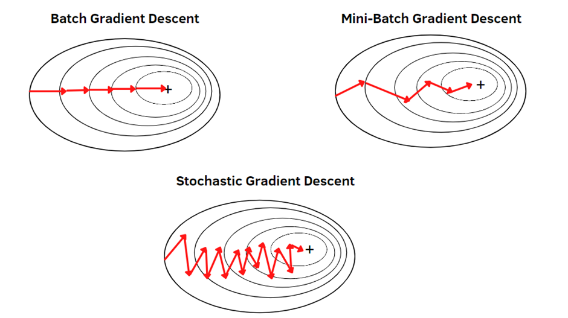

# Day_019 | 🏃 Gradient Descent in Neural Networks | Batch GD vs Stochastic GD vs Mini-Batch GD

## 🏃 Gradient Descent in Neural Networks

**Gradient Descent (GD)** is the primary optimization algorithm used to train neural networks. Its sole purpose is to find the set of weights and biases ($\theta$) that **minimize the Loss Function** ($J(\theta)$).

### Core Principle

1.  **Calculate the Gradient:** Use Backpropagation to find the gradient ($\nabla J(\theta)$), which tells you the direction of steepest *ascent* (highest error).
2.  **Update Parameters:** Move the parameters in the opposite direction (steepest *descent*) by a factor of the learning rate ($\eta$).

$$\theta_{\text{new}} = \theta_{\text{old}} - \eta \cdot \nabla J(\theta)$$

### The Three Flavors of Gradient Descent

The main difference between the variants lies in **how many data points** they use to calculate the gradient in each training step (or iteration). This batch size dictates the speed, memory usage, and stability of the learning process.

| Feature | Batch Gradient Descent (BGD) | Stochastic Gradient Descent (SGD) | Mini-Batch Gradient Descent (MBGD) |
| :--- | :--- | :--- | :--- |
| **Batch Size** | All $N$ training examples. | 1 single training example. | $1 < \text{Size} < N$ (e.g., 32, 64, 128) |
| **Gradient Calc.** | Sum of gradients across **all** data points. | Gradient from **one** data point. | Sum of gradients across the **mini-batch**. |
| **Updates per Epoch** | 1 update. | $N$ updates (one for every example). | $\frac{N}{\text{Batch Size}}$ updates. |
| **Convergence** | Smooth, direct path to the minimum. | Oscillates heavily, but generally moves toward the minimum. | Stable path with some oscillation (the best of both worlds). |

### 1. Batch Gradient Descent (BGD)

BGD computes the gradient using the **entire** training dataset before updating the model's parameters.

* **Pros:** Very stable convergence; guarantees finding the global minimum for convex error surfaces (and a good local minimum for non-convex neural network surfaces).
* **Cons:** Extremely slow and computationally expensive for large datasets because every update requires processing the whole dataset. Also, requires a lot of memory.

### 2. Stochastic Gradient Descent (SGD)

SGD computes the gradient using just **one randomly selected training example** at a time.

* **Pros:** Very fast updates and less memory required. The noisy updates help the network jump out of shallow local minima.
* **Cons:** The large variance in the updates causes the loss function to oscillate, which can make it hard to achieve true convergence (it "jitters" around the minimum). This often requires a decaying learning rate.
    > *Witty Take: SGD is the friend who gets excited by every little piece of information, making wildly fast but erratic decisions.*

### 3. Mini-Batch Gradient Descent (MBGD)

MBGD is the **most common and preferred method** in deep learning. It calculates the gradient using a small, randomly sampled subset (mini-batch) of the training data.

* **Pros:**
    * **Efficiency:** Gets the smooth convergence benefits of BGD, but with much faster updates.
    * **Vectorization:** Mini-batches allow for highly efficient matrix operations on GPUs and TPUs, leading to high throughput.
    * **Stability:** The updates are more stable than SGD, reducing the oscillation.
* **Cons:** Requires tuning the **batch size**, which is an extra hyperparameter to worry about.

---

### Conclusion: Why Mini-Batch Dominates

Mini-Batch Gradient Descent is the standard because it strikes the perfect balance: it provides enough stability to learn efficiently while offering computational advantages that make training large models in a reasonable timeframe possible.

## 🔍 Summary of All Three Modes
| Type              | Update Frequency  | Pros                                            | Cons                        |
| ----------------- | ----------------- | ----------------------------------------------- | --------------------------- |
| **SGD**           | Each sample       | Fast updates, noisy → helps escape local minima | Noisy, unstable             |
| **Batch GD**      | Once per epoch    | Stable, deterministic                           | Can be slow on large data   |
| **Mini-batch GD** | Every few samples | Best trade-off                                  | Needs tuning (`batch_size`) |

## Code
> Stochastic Gradient Descent
```python
class CustomStochasticGD:
    def __init__(self, lr=0.01, epochs=5):
        self.lr = lr
        self.epochs = epochs
        self.weights_ = []
        self.bias_ = []
        self.loss_calculate = []
        self.epochs_loss = []
        self._init_weights = []
        self._init_bias = []

    def sigmoid(self, x):
        return 1 / (1 + np.exp(-x))

    def sigmoid_derivative(self, x):
        return x * (1 - x)

    def forward_propagation(self, X):
        # Hidden layer
        Z11 = self.weights_[0]*X[0] + self.weights_[2]*X[1] + self.bias_[0]
        Z12 = self.weights_[1]*X[0] + self.weights_[3]*X[1] + self.bias_[1]
        O11 = self.sigmoid(Z11)
        O12 = self.sigmoid(Z12)
        # Output layer
        Z21 = self.weights_[4]*O11 + self.weights_[5]*O12 + self.bias_[2]
        O21 = self.sigmoid(Z21)
        return O11, O12, O21

    def update_parameters(self, X, y, y_hat, O11, O12):
        # Gradients for output neuron
        dL_dYhat_dZ = y_hat - y  # (y_hat - y) for BCE derivative wrt pre-activation

        # Gradients for hidden neurons
        dO11 = self.weights_[4] * O11 * (1 - O11) * dL_dYhat_dZ
        dO12 = self.weights_[5] * O12 * (1 - O12) * dL_dYhat_dZ

        # Output layer updates
        self.weights_[4] -= self.lr * dL_dYhat_dZ * O11
        self.weights_[5] -= self.lr * dL_dYhat_dZ * O12
        self.bias_[2]   -= self.lr * dL_dYhat_dZ

        # Hidden layer updates
        self.weights_[0] -= self.lr * dO11 * X[0]
        self.weights_[2] -= self.lr * dO11 * X[1]
        self.bias_[0]    -= self.lr * dO11

        self.weights_[1] -= self.lr * dO12 * X[0]
        self.weights_[3] -= self.lr * dO12 * X[1]
        self.bias_[1]    -= self.lr * dO12

    def fit(self, X, y):
        n_samples, n_features = X.shape

        # Initialize weights
        self.weights_ = np.random.uniform(-1, 1, 6)
        self.bias_ = np.random.uniform(-1, 1, 3)

        self._init_weights = self.weights_.copy()
        self._init_bias = self.bias_.copy()

        for epoch in range(self.epochs):
            epoch_losses = []
            for i in range(n_samples):
                index = random.randint(0, n_samples - 1)
                X_i, y_i = X[index], y[index]

                # Forward pass
                O11, O12, O21 = self.forward_propagation(X_i)
                O21 = np.clip(O21, 1e-10, 1 - 1e-10)

                # Binary cross-entropy loss
                loss = -y_i * np.log(O21) - (1 - y_i) * np.log(1 - O21)
                epoch_losses.append(loss)

                # Backward + parameter update
                self.update_parameters(X_i, y_i, O21, O11, O12)

            avg_loss = np.mean(epoch_losses)
            self.epochs_loss.append(avg_loss)
            print(f"Epoch {epoch+1}/{self.epochs}, Loss={avg_loss:.4f}")

    def predict(self, X):
        y_pred = []
        for x in X:
            _, _, out = self.forward_propagation(x)
            y_pred.append(int(out >= 0.5))
        return np.array(y_pred)

    def get_weights(self, type: str = 'updated'):
        if type == 'init':
            w = self._init_weights
            b = self._init_bias
        else:
            w = self.weights_
            b = self.bias_
        return [
            np.array([[w[0], w[1]],
                      [w[2], w[3]]]),
            np.array([b[0], b[1]]),
            np.array([[w[4]],
                      [w[5]]]),
            np.array([b[2]])
        ]

```

> Batch Gradient Descent
```python
class CustomBatchGD:
    def __init__(self, lr=0.01, epochs=5) -> None:
        self.lr = lr
        self.epochs = epochs
        self.weights_ = []
        self.bias_ = []
        self.loss_calculate = []
        self.epochs_loss = []
        self._init_weights = []
        self._init_bias = []

    def sigmoid(self, x):
        return 1 / (1 + np.exp(-x))

    def sigmoid_derivative(self, x):
        return x * (1 - x)

    def fit(self, X, y):
        n_samples, n_features = X.shape

        # Initialize weights
        self.weights_ = np.random.uniform(-1, 1, 6)
        self.bias_ = np.random.uniform(-1, 1, 3)

        self._init_weights = self.weights_.copy()
        self._init_bias = self.bias_.copy()

        for epoch in range(self.epochs):
            # Forward pass (vectorized)
            Z11 = X[:, 0] * self.weights_[0] + X[:, 1] * self.weights_[2] + self.bias_[0]
            Z12 = X[:, 0] * self.weights_[1] + X[:, 1] * self.weights_[3] + self.bias_[1]
            O11 = self.sigmoid(Z11)
            O12 = self.sigmoid(Z12)
            Z21 = O11 * self.weights_[4] + O12 * self.weights_[5] + self.bias_[2]
            O21 = self.sigmoid(Z21)

            # Compute loss (binary cross-entropy)
            O21 = np.clip(O21, 1e-10, 1 - 1e-10)
            loss = -np.mean(y * np.log(O21) + (1 - y) * np.log(1 - O21))
            self.epochs_loss.append(loss)

            # Compute gradients (batch version)
            dL_dYhat = O21 - y  # derivative of BCE wrt output

            # Gradients for output layer
            dW4 = np.mean(dL_dYhat * O11)
            dW5 = np.mean(dL_dYhat * O12)
            dB2 = np.mean(dL_dYhat)

            # Hidden layer error terms
            dO11 = dL_dYhat * self.weights_[4] * self.sigmoid_derivative(O11)
            dO12 = dL_dYhat * self.weights_[5] * self.sigmoid_derivative(O12)

            # Gradients for hidden layer
            dW0 = np.mean(dO11 * X[:, 0])
            dW2 = np.mean(dO11 * X[:, 1])
            dB0 = np.mean(dO11)

            dW1 = np.mean(dO12 * X[:, 0])
            dW3 = np.mean(dO12 * X[:, 1])
            dB1 = np.mean(dO12)

            # Update weights (batch update)
            self.weights_[0] -= self.lr * dW0
            self.weights_[1] -= self.lr * dW1
            self.weights_[2] -= self.lr * dW2
            self.weights_[3] -= self.lr * dW3
            self.weights_[4] -= self.lr * dW4
            self.weights_[5] -= self.lr * dW5

            self.bias_[0] -= self.lr * dB0
            self.bias_[1] -= self.lr * dB1
            self.bias_[2] -= self.lr * dB2

            print(f"Epoch {epoch+1}/{self.epochs}, Loss={loss:.4f}")

    def predict(self, X):
        Z11 = X[:, 0] * self.weights_[0] + X[:, 1] * self.weights_[2] + self.bias_[0]
        Z12 = X[:, 0] * self.weights_[1] + X[:, 1] * self.weights_[3] + self.bias_[1]
        O11 = self.sigmoid(Z11)
        O12 = self.sigmoid(Z12)
        Z21 = O11 * self.weights_[4] + O12 * self.weights_[5] + self.bias_[2]
        O21 = self.sigmoid(Z21)
        return (O21 >= 0.5).astype(int)

    def get_weights(self, type: str = 'updated'):
        if type == 'init':
            w = self._init_weights
            b = self._init_bias
        else:
            w = self.weights_
            b = self.bias_
        return [
            np.array([[w[0], w[1]],
                      [w[2], w[3]]]),
            np.array([b[0], b[1]]),
            np.array([[w[4]],
                      [w[5]]]),
            np.array([b[2]])
        ]

```

> Mini-Batch Gradient Descent
```python
class CustomMiniBatchGD:
    def __init__(self, lr=0.01, epochs=10, batch_size=32) -> None:
        self.lr = lr
        self.epochs = epochs
        self.batch_size = batch_size
        self.weights_ = []
        self.bias_ = []
        self.loss_calculate = []
        self.epochs_loss = []
        self._init_weights = []
        self._init_bias = []

    def sigmoid(self, x):
        return 1 / (1 + np.exp(-x))

    def sigmoid_derivative(self, x):
        return x * (1 - x)

    def fit(self, X, y):
        n_samples, n_features = X.shape

        # Initialize weights and biases
        self.weights_ = np.random.uniform(-1, 1, 6)
        self.bias_ = np.random.uniform(-1, 1, 3)

        self._init_weights = self.weights_.copy()
        self._init_bias = self.bias_.copy()

        for epoch in range(self.epochs):
            # Shuffle data
            indices = np.arange(n_samples)
            np.random.shuffle(indices)
            X = X[indices]
            y = y[indices]

            epoch_loss = []

            # Loop over mini-batches
            for start in range(0, n_samples, self.batch_size):
                end = start + self.batch_size
                X_batch = X[start:end]
                y_batch = y[start:end]

                # === Forward Pass ===
                Z11 = X_batch[:, 0] * self.weights_[0] + X_batch[:, 1] * self.weights_[2] + self.bias_[0]
                Z12 = X_batch[:, 0] * self.weights_[1] + X_batch[:, 1] * self.weights_[3] + self.bias_[1]
                O11 = self.sigmoid(Z11)
                O12 = self.sigmoid(Z12)
                Z21 = O11 * self.weights_[4] + O12 * self.weights_[5] + self.bias_[2]
                O21 = self.sigmoid(Z21)

                # === Compute Loss ===
                O21 = np.clip(O21, 1e-10, 1 - 1e-10)
                loss = -np.mean(y_batch * np.log(O21) + (1 - y_batch) * np.log(1 - O21))
                epoch_loss.append(loss)

                # === Gradients ===
                dL_dYhat = O21 - y_batch

                # Output layer
                dW4 = np.mean(dL_dYhat * O11)
                dW5 = np.mean(dL_dYhat * O12)
                dB2 = np.mean(dL_dYhat)

                # Hidden layer
                dO11 = dL_dYhat * self.weights_[4] * self.sigmoid_derivative(O11)
                dO12 = dL_dYhat * self.weights_[5] * self.sigmoid_derivative(O12)

                dW0 = np.mean(dO11 * X_batch[:, 0])
                dW2 = np.mean(dO11 * X_batch[:, 1])
                dB0 = np.mean(dO11)

                dW1 = np.mean(dO12 * X_batch[:, 0])
                dW3 = np.mean(dO12 * X_batch[:, 1])
                dB1 = np.mean(dO12)

                # === Update Parameters ===
                self.weights_[0] -= self.lr * dW0
                self.weights_[1] -= self.lr * dW1
                self.weights_[2] -= self.lr * dW2
                self.weights_[3] -= self.lr * dW3
                self.weights_[4] -= self.lr * dW4
                self.weights_[5] -= self.lr * dW5

                self.bias_[0] -= self.lr * dB0
                self.bias_[1] -= self.lr * dB1
                self.bias_[2] -= self.lr * dB2

            # Mean loss for epoch
            mean_loss = np.mean(epoch_loss)
            self.epochs_loss.append(mean_loss)
            print(f"Epoch {epoch+1}/{self.epochs}, Loss={mean_loss:.4f}")

    def predict(self, X):
        Z11 = X[:, 0] * self.weights_[0] + X[:, 1] * self.weights_[2] + self.bias_[0]
        Z12 = X[:, 0] * self.weights_[1] + X[:, 1] * self.weights_[3] + self.bias_[1]
        O11 = self.sigmoid(Z11)
        O12 = self.sigmoid(Z12)
        Z21 = O11 * self.weights_[4] + O12 * self.weights_[5] + self.bias_[2]
        O21 = self.sigmoid(Z21)
        return (O21 >= 0.5).astype(int)

    def get_weights(self, type: str = 'updated'):
        if type == 'init':
            w = self._init_weights
            b = self._init_bias
        else:
            w = self.weights_
            b = self.bias_
        return [
            np.array([[w[0], w[1]],
                      [w[2], w[3]]]),
            np.array([b[0], b[1]]),
            np.array([[w[4]],
                      [w[5]]]),
            np.array([b[2]])
        ]

```

## Images

