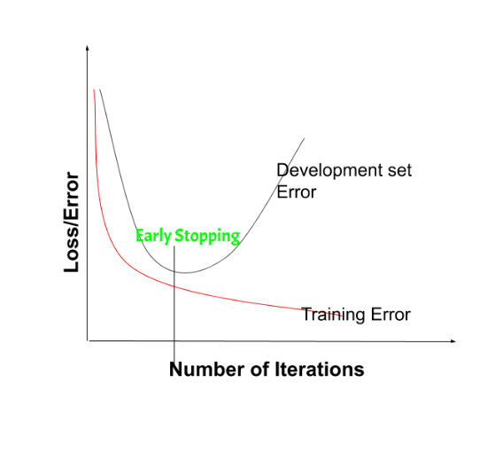

# Day_022 | Early Stopping in Neural Network

## ✅ **What Is Early Stopping?**

During training:

* **Training loss keeps decreasing** (the model memorizes the data).
* **Validation loss decreases first, then increases** (overfitting begins).

Early stopping identifies the point where validation performance stops improving and **halts training automatically**.

---

## 🎯 **Why Use Early Stopping?**

* Prevents overfitting
* Improves generalization
* Saves training time
* No extra computation (unlike dropout or ensembles)

---

## 🔍 **How It Works (Simple Explanation)**

1. Split your dataset into **training** and **validation** sets.
2. After each epoch, check validation loss or accuracy.
3. If validation metric does not improve for *X* consecutive epochs (called **patience**), stop training.
4. Restore the best model weights.

---

## ⚙️ **Key Parameters**

| Parameter                | Meaning                                  | Example      |
| ------------------------ | ---------------------------------------- | ------------ |
| **monitor**              | What metric to track                     | `"val_loss"` |
| **patience**             | How many epochs to wait before stopping  | 5            |
| **min_delta**            | Minimum improvement to count as progress | 0.001        |
| **restore_best_weights** | Rollback to best model                   | True         |

---

## 🧪 **Example in Keras / TensorFlow**

```python
from tensorflow.keras.callbacks import EarlyStopping

early_stop = EarlyStopping(
    monitor='val_loss',
    patience=5,
    min_delta=0.001,
    restore_best_weights=True
)

history = model.fit(
    X_train, y_train,
    validation_data=(X_val, y_val),
    epochs=100,
    callbacks=[early_stop]
)
```

---

## 🧪 **Example in PyTorch**

PyTorch does not have early stopping built-in, but you can implement it:

```python
import torch
import copy

patience = 5
best_loss = float('inf')
counter = 0
best_model = None

for epoch in range(num_epochs):
    train(...)
    val_loss = validate(...)

    if val_loss < best_loss - 1e-3:  # min_delta
        best_loss = val_loss
        best_model = copy.deepcopy(model.state_dict())
        counter = 0
    else:
        counter += 1
        if counter >= patience:
            print("Early stopping triggered!")
            model.load_state_dict(best_model)
            break
```

---

## 🛠️ **Tips for Effective Early Stopping**

### ✔ Choose correct metric

Use:

* `val_loss` for regression
* `val_accuracy`, `val_f1`, etc. for classification

### ✔ Use patience

Common: **3–10 epochs** depending on noise.

### ✔ Combine with learning-rate schedulers

Example: Reduce LR first, then early stop.

### ✔ Use `restore_best_weights=True`

Ensures your final model is the best—not the last.

---

## 🧠 Summary

Early stopping = **stop training when validation performance stops improving**.

It is simple, powerful, and one of the most widely used regularization techniques.

---

## Images
