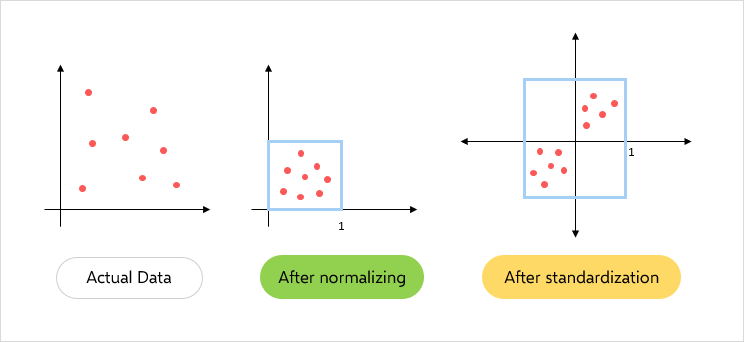
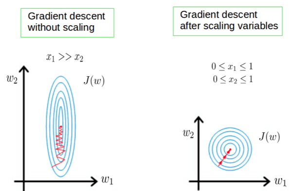
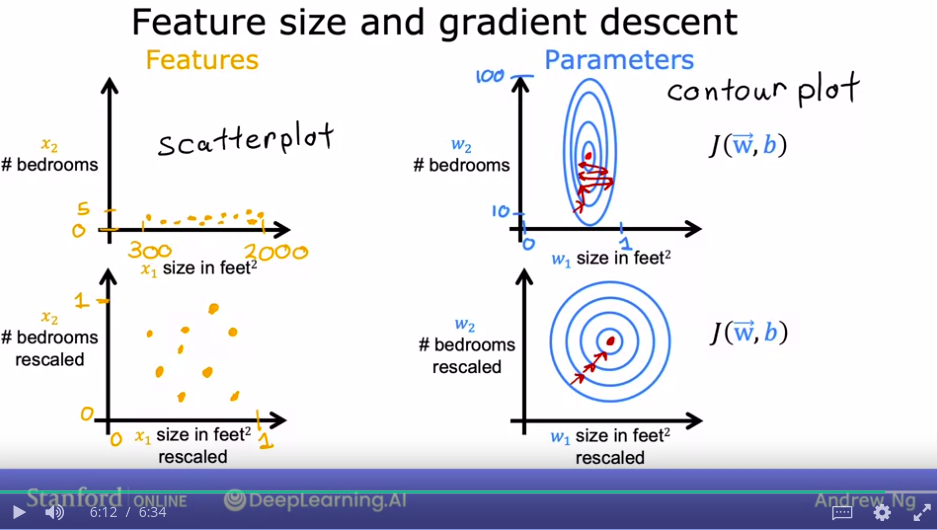

# Day_023 | 📈 Data Scaling in Neural Network

## 📈 Why Data Scaling is Necessary

The need for scaling arises primarily due to how the optimization process (Gradient Descent) works:

1.  **Uniform Contribution:** Neural network weights are initialized to small random values, often around zero. If input features have vastly different ranges (e.g., age from 0 to 100 and income from 10,000 to 1,000,000), the weights connected to the larger-ranged feature will receive much larger gradients. This causes the model to prioritize learning from that single feature, leading to slow and unstable training.
2.  **Faster Convergence:** When features are not scaled, the error surface (loss function) becomes elongated and skewed. Gradient Descent has to take small, winding steps (a "zig-zag" path) to find the minimum. Scaling squashes the error surface into a more symmetrical shape, allowing Gradient Descent to take a more direct path and converge much **faster**.
    * 

## 🛠️ Common Scaling Techniques

The two most common methods for data scaling are Normalization and Standardization:

### 1. Normalization (Min-Max Scaling)

Normalization transforms features into a specific range, usually between **0 and 1**.

* **Formula:**

$$
x_{\text{normalized}} = \frac{x - x_{\text{min}}}{x_{\text{max}} - x_{\text{min}}}
$$

* **Use Case:** Ideal when you need bounded outputs (e.g., for specific activation functions) or when the distribution of the data is not Gaussian.
* **Disadvantage:** Highly susceptible to **outliers**, as they directly determine the minimum and maximum values, compressing the non-outlier data into a tiny range.

### 2. Standardization (Z-Score Normalization)

Standardization transforms the data so that it has a **mean of 0** and a **standard deviation of 1** (a standard normal distribution).

* **Formula:**

$$
x_{\text{standardized}} = \frac{x - \mu}{\sigma}
$$

where $\mu$ is the mean and $\sigma$ is the standard deviation.
* **Use Case:** This is generally the **preferred method** for deep learning. It is useful when the data distribution is roughly Gaussian (bell-shaped) or when you need to retain information about outliers.
* **Advantage:** Less affected by extreme outliers than Min-Max scaling, as the presence of outliers only slightly affects the mean and standard deviation.

## 📝 Important Rule: Fit and Transform

It's critical to calculate the scaling parameters (mean and standard deviation for standardization; min and max for normalization) **only on the training set**.

* **Fit on Training Data:** Calculate $\mu$ and $\sigma$ (or $x_{\text{min}}$ and $x_{\text{max}}$) using the training data only.
* **Transform Training Data:** Apply the calculated parameters to scale the training data.
* **Transform Test/Validation Data:** Use the **same parameters** (derived from the training set) to scale the test and validation data.

**Reason:** The model is trained to learn from the characteristics of the training data. Applying the test set's scaling parameters would introduce information about the test set into the training process, leading to **data leakage** and overly optimistic performance estimates.

## Images

