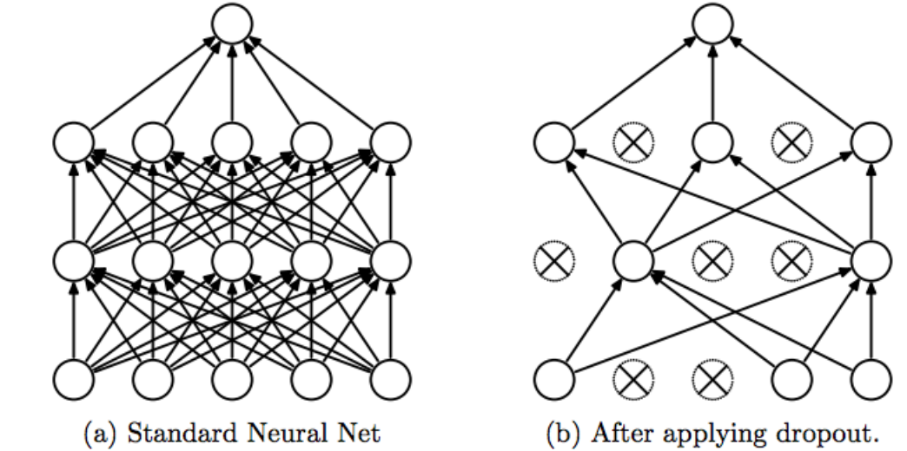
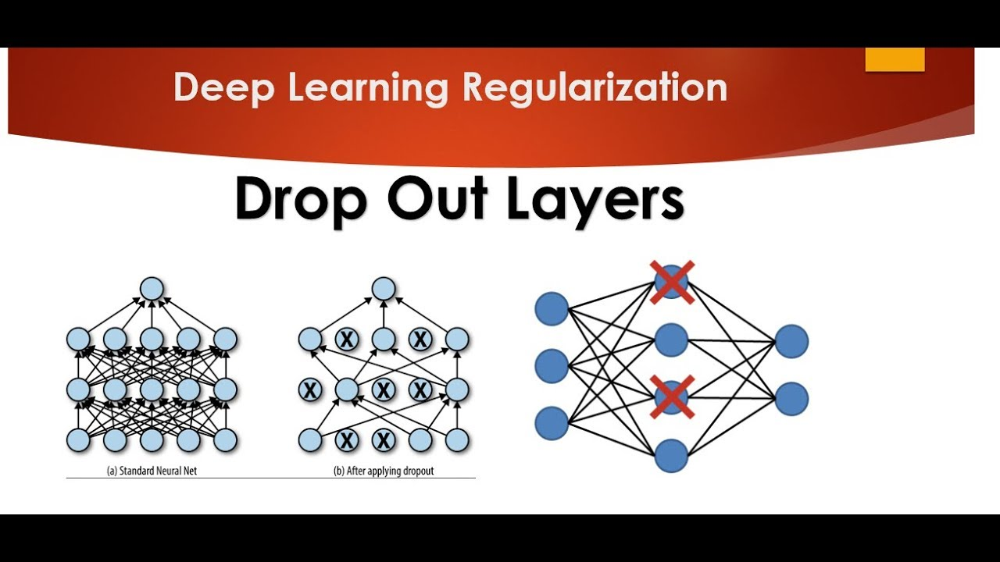

# Day_024 | Dropout Layers in ANN

## 💡 How Dropout Works

Dropout layers are typically inserted between hidden layers during the training phase.

1.  **The Mechanism:** During **each forward and backward pass** (i.e., for every mini-batch), the Dropout layer randomly sets the output of a fraction of its neurons to **zero**.
2.  **The Rate ($p$):** The fraction of neurons to drop is determined by the **dropout rate** ($p$), which is a hyperparameter (common values are 0.1 to 0.5). If $p=0.5$, half the neurons are randomly deactivated.
3.  **The Effect:** Because the outputs of these deactivated neurons are zero, they do not contribute to the forward pass, and no updates are made to their weights during the backward pass.


---

## 🧠 Why Dropout Works (Intuition)

The effectiveness of dropout comes from its ability to force the network to rely on redundant and diverse representations:

1.  **Prevents Co-adaptation:** Without dropout, neurons can become overly reliant on the presence of specific other neurons in the previous layer (a phenomenon called "co-adaptation"). Dropout **breaks these fragile co-dependencies**.
2.  **Ensemble Effect:** Because a different subset of the network is trained with every batch, dropout can be thought of as training a large **ensemble of smaller, different networks** simultaneously. The final trained network's weights are the average weights shared across all these sub-networks. This ensemble effect leads to much better generalization.

---

## ⚙️ Dropout During Training vs. Testing

It's crucial to understand that the dropout process is handled differently during training and testing:

| Phase | Dropout Layer Behavior | Necessary Adjustment |
| :--- | :--- | :--- |
| **Training** | **Active.** Randomly sets neurons to zero according to the dropout rate ($p$). | No adjustment needed. |
| **Testing/Inference** | **Inactive.** All neurons are used, and no outputs are set to zero. | The weights must be **scaled down** by the factor of $(1-p)$ to compensate for the fact that *more* neurons are now active than during training. This is often handled automatically by modern frameworks like Keras/PyTorch. |

The scaling ensures that the expected total input into the next layer remains the same during testing as it was during training.

---

## ChatGPT

## 🔍 **What is a Dropout Layer?**

A **Dropout layer** randomly disables a fraction of the neurons (say 20–50%) during each forward pass in training.
This forces the network to not rely too heavily on specific neurons and learn more robust, generalized features.

### 👇 Illustration

If dropout rate = 0.3 → 30% of neurons are ignored during each update step.

During **testing/inference**, dropout is *not applied*.
Instead, neuron outputs are scaled to match training-time expectations.

---

## 🧠 **Why Use Dropout?**

Dropout helps reduce:

* **Overfitting**
* Co-adaptation of neurons
* Dependence on specific features

It works especially well in:

* Fully-connected (dense) layers
* Large networks

---

## ⚙️ **How Dropout Works Internally**

During training:

```
neuron_output = neuron * mask
```

Where mask is a binary array (1 = keep, 0 = drop).

Probability of dropping a neuron = dropout rate.

---

## 🛠️ **How to Use Dropout**

### **1. Keras/TensorFlow Example**

```python
from tensorflow.keras.models import Sequential
from tensorflow.keras.layers import Dense, Dropout

model = Sequential([
    Dense(64, activation='relu', input_shape=(n_features,)),
    Dropout(0.3),   # Drop 30% of neurons
    Dense(32, activation='relu'),
    Dropout(0.2),
    Dense(1, activation='sigmoid')
])
```

---

### **2. PyTorch Example**

```python
import torch.nn as nn

model = nn.Sequential(
    nn.Linear(n_features, 64),
    nn.ReLU(),
    nn.Dropout(0.3),
    nn.Linear(64, 32),
    nn.ReLU(),
    nn.Dropout(0.2),
    nn.Linear(32, 1)
)
```

---

## ❓ **When Should You Use Dropout?**

Use dropout when:

* Training accuracy ≫ validation accuracy
* Model is very large (many parameters)
* You see signs of overfitting

Avoid dropout in:

* Convolutional layers (use very little, if at all)
* Batch Normalization layers (these can conflict with dropout)

---

## 🔢 Typical Dropout Rates

| Layer Type   | Typical Rate  |
| ------------ | ------------- |
| Dense layers | **0.2 – 0.5** |
| CNN layers   | **0.1 – 0.3** |
| RNN layers   | **0.1 – 0.3** |

---

# Images

