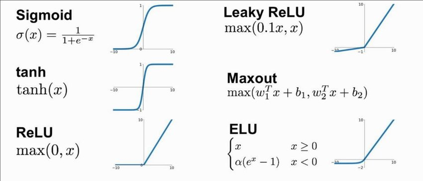
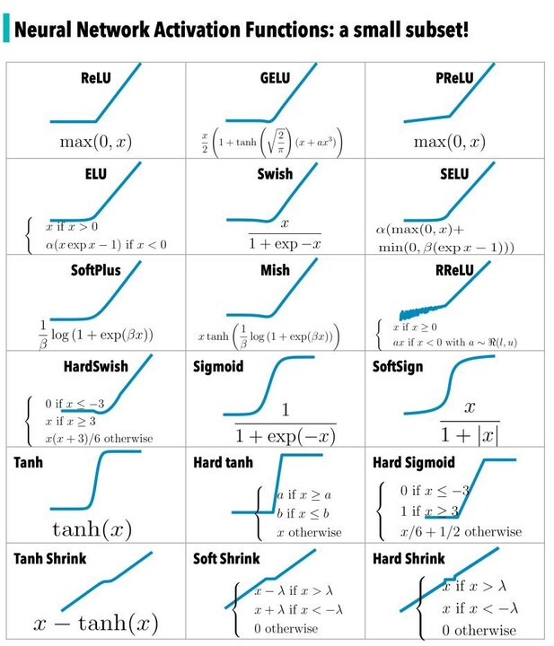
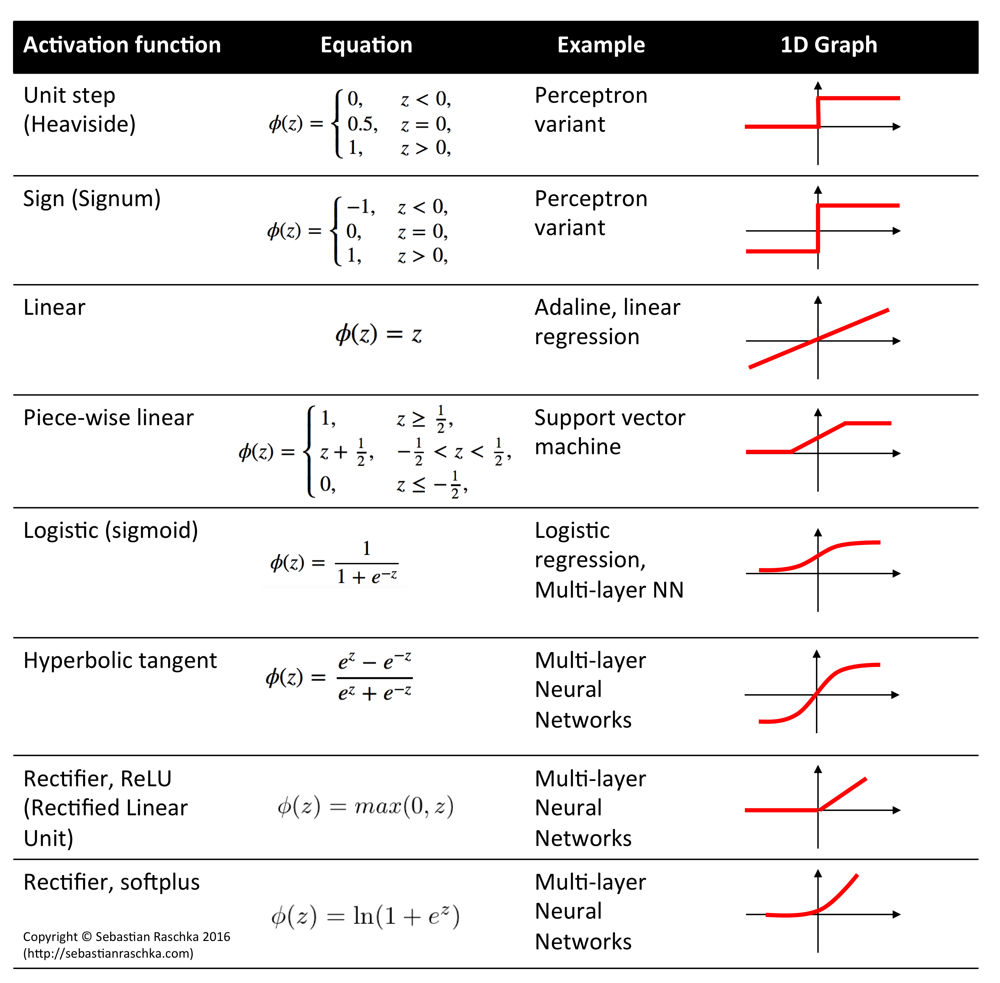

# Day_027 | Activation Functions | Sigmoid, Tanh, ReLU
The **Activation Function** is a critical component of a neural network neuron, determining whether the neuron should be "activated" (fired) and what output value it should pass on.

## 🧠 Why Non-Activated Layers Give Linear Output

If a neural network neuron uses **no activation function** (or uses the **Identity Function**, $f(z) = z$), the output is simply the weighted sum of inputs plus the bias:

$$
a^{(l)} = z^{(l)} = \mathbf{W}^{(l)} \mathbf{a}^{(l-1)} + \mathbf{b}^{(l)}
$$

If you stack multiple layers without a non-linear activation function, the entire network remains a **linear function**, regardless of how many layers you add.

* **Proof Intuition:** The composition of multiple linear functions is still a linear function. For example, if $f(x) = c_1 x$ and $g(x) = c_2 x$, then $f(g(x)) = c_1 (c_2 x) = (c_1 c_2) x$, which is a single linear function.
* **Consequence:** A network without non-linearity cannot learn complex, non-linear relationships in data (like the **XOR problem**) and is essentially equivalent to a single-layer linear model. Non-linear activation functions are required to make the network a powerful **Universal Function Approximator**.

---

## ✨ Ideal Activation Function Criteria

An effective activation function should meet several criteria to ensure efficient training and high performance in deep learning:

1.  **Non-Linearity:** It must be non-linear to allow the MLP to model complex, real-world data and solve non-linearly separable problems (like XOR).
2.  **Differentiability:** It must be easily differentiable everywhere (or nearly everywhere) to enable the calculation of the **gradient** required by the **Backpropagation** algorithm.
3.  **Monotonicity:** It should be monotonically increasing (its slope never decreases) to ensure the network is always moving towards a minimum during training.
4.  **Avoid Saturation:** The function's derivative should not approach zero across wide ranges of its domain, as this leads to the **Vanishing Gradient Problem**.

---

## 🎯 Common Activation Functions

### 1. Sigmoid Function (Logistic Function)

$$
\sigma(z) = \frac{1}{1 + e^{-z}}
$$

| Advantage (Adv.) | Disadvantage (Disadv.) |
| :--- | :--- |
| **Output Range:** Output is strictly between 0 and 1, making it ideal for the **output layer** in **binary classification** (interpretable as a probability). | **Vanishing Gradient:** The derivative is near zero for very large positive or very large negative inputs (**saturation**), causing gradients to vanish in deep layers. |
| **Clear Interpretation:** Gives a clean, continuous probability value. | **Not Zero-Centered:** The output is always positive, which can introduce a bias into the next layer and slow down convergence. |

### 2. Tanh Function (Hyperbolic Tangent)

$$
\tanh(z) = \frac{e^z - e^{-z}}{e^z + e^{-z}}
$$

| Advantage (Adv.) | Disadvantage (Disadv.) |
| :--- | :--- |
| **Zero-Centered:** Output is centered around zero (range is -1 to 1), which helps the optimization process converge faster than Sigmoid. | **Vanishing Gradient:** Still suffers from the saturation problem (derivative approaches zero at high/low inputs), though slightly less than Sigmoid. |
| **Steeper Gradient:** Tanh's gradient is generally steeper than Sigmoid's, resulting in faster learning in the middle range. | Not used often in hidden layers of very deep networks due to saturation. |

### 3. ReLU (Rectified Linear Unit)

$$
\text{ReLU}(z) = \max(0, z)
$$

| Advantage (Adv.) | Disadvantage (Disadv.) |
| :--- | :--- |
| **Solves Vanishing Gradient:** For positive inputs, the derivative is exactly **1**, ensuring the gradient does not shrink during backpropagation. | **Dying ReLU Problem:** If the weighted sum $z$ is negative, the gradient is 0. Once a neuron enters this state, it can never recover, permanently "killing" the neuron. |
| **Computational Efficiency:** Incredibly fast to compute (just a simple comparison operation), significantly speeding up training time. | **Not Zero-Centered:** Similar to Sigmoid, the output is always positive (for positive input), which can lead to biased updates. |

> **Note on Dying ReLU:** This is often mitigated by using variants like **Leaky ReLU** ($f(z) = \max(\alpha z, z)$ for a small $\alpha > 0$) or **PReLU**, which introduce a tiny slope for negative inputs, preventing the neuron from dying.

## ChatGPT
## ⭐ 1. Why Activation Functions?

Activation functions introduce **non-linearity** into neural networks.

Without them, a neural network becomes **a purely linear model**, no matter how many layers you stack.

### ✔ Why do networks without activation functions give linear output?

Consider a network with 2 layers:

$$
y = W_2 (W_1 x)
$$

This can be simplified to:

$$
y = (W_2 W_1) x
$$

➡ Still a linear transformation.\
➡ Adding more layers still produces:

$$
y = W_n W_{n-1} \dots W_1 x
$$

This is equivalent to a **single linear transformation**.

👉 Therefore **without activation functions, deep networks cannot learn complex patterns** like images, speech, or nonlinear relationships.

---

## ⭐ 2. Ideal Criteria for an Activation Function

An ideal activation function should be:

### ✔ **1. Non-linear**

So the network can learn complex patterns.

### ✔ **2. Differentiable**

Needed for gradient-based learning (backpropagation).

### ✔ **3. Computationally efficient**

Should be easy to evaluate (cheap operations).

### ✔ **4. Avoid vanishing/exploding gradients**

Helps deep networks train effectively.

### ✔ **5. Zero-centered output (optional but good)**

Helps optimization; gradients don’t get stuck.

### ✔ **6. Monotonic**

Useful for stable gradient behavior.

No activation function satisfies all criteria—each has trade-offs.

---

## ⭐ 3. Common Activation Functions

Below are the most commonly used functions with formulas, graphs (conceptually), and pros/cons.

---

## 🔵 3.1 Sigmoid (Logistic Function)

$$
\sigma(x) = \frac{1}{1 + e^{-x}}
$$

**Output Range:** (0, 1)

### ✔ Advantages

* Smooth and differentiable
* Historically used in early neural networks
* Good for probabilities (binary classification output layer)

### ✖ Disadvantages

* **Vanishing gradients** for large |x|
* Outputs are **not zero-centered**
* Slow training
* Saturates easily → gradients become very small

**Not preferred in hidden layers today.**

---

## 🟣 3.2 Tanh (Hyperbolic Tangent)

$$
\tanh(x) = \frac{e^{x}-e^{-x}}{e^{x}+e^{-x}}
$$

**Output Range:** (–1, 1)

### ✔ Advantages

* Zero-centered → better optimization
* Stronger gradients than Sigmoid
* Still smooth and differentiable

### ✖ Disadvantages

* Still **suffers vanishing gradient** at large |x|
* Can saturate
* More costly than ReLU

**Better than sigmoid, but still problematic in deep networks.**

---

## 🟩 3.3 ReLU (Rectified Linear Unit)

$$
\text{ReLU}(x) = \max(0, x)
$$

### ✔ Advantages

* **Fast, simple**
* Does not saturate for positive values → **no vanishing gradient**
* Allows sparse activation (neurons turn off)
* Works extremely well in deep networks

### ✖ Disadvantages

* **Dying ReLU problem**: for x < 0 → gradient = 0
* Not zero-centered
* Can cause unstable training for very large gradients

**Most widely used activation in hidden layers.**

---

## ⭐ Summary Table

| Activation  | Range  | Pros                         | Cons                                  | Use Cases                             |
| ----------- | ------ | ---------------------------- | ------------------------------------- | ------------------------------------- |
| **Sigmoid** | (0,1)  | Good for probabilities       | Vanishing gradient, not zero-centered | Output layer of binary classification |
| **Tanh**    | (–1,1) | Zero-centered, smoother      | Still vanishes                        | RNNs, hidden layers historically      |
| **ReLU**    | [0, ∞) | Fast, no saturation (for +x) | Dying ReLU, not zero-centered         | Modern CNNs, MLPs, deep networks      |

---

## ⭐ Which activation should you use?

* **Hidden layers:** ReLU (or variants like Leaky ReLU, GELU, ELU)
* **Binary classification output:** Sigmoid
* **Multiclass classification output:** Softmax
* **RNNs / LSTMs:** tanh + sigmoid are built-in

---

# Images

