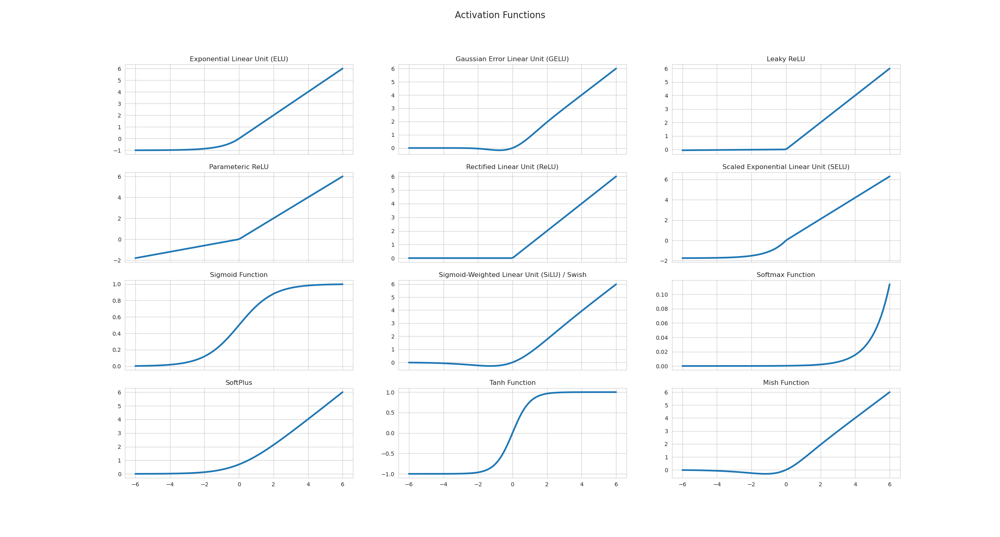

# Day_028 | Relu Variants | Leaky Relu | Parametric Relu | SELU | ELU | CELU

## 🛑 Problem with ReLU: The Dying ReLU

The ReLU function is defined as $f(z) = \max(0, z)$.

The main problem arises when the input $z$ is negative, which leads to the **Dying ReLU** issue:

1.  **Why it Happens:** When a large gradient flows backward through a ReLU neuron, it can cause the neuron's weights to update in such a way that the weighted input $z$ will **always be negative** for the entire training set.
2.  **The Consequence:** If $z$ is negative, the ReLU output $f(z)$ is **zero**, and its gradient $\frac{\partial f}{\partial z}$ is also **zero**.
3.  **The Death:** Once the gradient is zero, the neuron **stops learning permanently** because the weights can no longer be updated via Backpropagation. This dead neuron effectively renders the layer capacity smaller.

---

## 🛠️ ReLU Variants: The Fixes

To solve the Dying ReLU problem, variants introduce a small, non-zero gradient for negative inputs. These fall into linear and non-linear categories.

### A. Linear Variants (Non-Zero Slope for $z < 0$)

These variants maintain linearity for positive inputs but ensure a small slope for negative inputs.

| Function | Equation | Advantage (Adv.) | Disadvantage (Disadv.) |
| :--- | :--- | :--- | :--- |
| **Leaky ReLU (LReLU)** | $f(z) = \max(\alpha z, z)$ where $\alpha$ is a small, fixed constant (e.g., $0.01$). | **Adv.:** Solves Dying ReLU by preventing the zero gradient. Simple and fast computation. **Disadv.:** The small slope $\alpha$ is a hyperparameter that must be manually tuned. |
| **Parametric ReLU (PReLU)** | $f(z) = \max(\alpha z, z)$ where $\alpha$ is a **learnable** parameter initialized to a small value. | **Adv.:** Allows the network to adapt the slope $\alpha$ optimally for each neuron, theoretically leading to better performance than LReLU. **Disadv.:** Adds one extra parameter to the network per neuron, slightly increasing computational complexity. |

### B. Non-Linear Variants (Smooth and Self-Normalizing)

These aim to be smoother and closer to a zero-mean output, improving convergence stability.

| Function | Equation | Advantage (Adv.) | Disadvantage (Disadv.) |
| :--- | :--- | :--- | :--- |
| **Exponential Linear Unit (ELU)** | $f(z) = \begin{cases} z & \text{if } z > 0 \\ \alpha(e^z - 1) & \text{if } z \le 0 \end{cases}$ | **Adv.:** Smooth transition at $z=0$ and zero-centered output, leading to faster learning and better performance than LReLU. **Disadv.:** Requires the computationally expensive exponential operation, slowing down inference. |
| **Scaled ELU (SELU)** | $f(z) = \lambda \cdot \text{ELU}(z)$ where $\lambda > 1$. | **Adv.:** **Self-Normalizing Property:** Can normalize the mean and variance of activations across layers, making deeper networks more robust. **Disadv.:** Requires specific initialization (LeCun) and works best only in **dense (fully connected)** networks. |
| **Continous ELU (CELU)** | $f(z) = \begin{cases} z & \text{if } z > 0 \\ \alpha(\exp^{(z/\alpha)} - 1) & \text{if } z \le 0 \end{cases}$ | **Adv.:** A smoother, generalized version of ELU. | **Disadv.:** Requires tuning $\alpha$ and involves expensive exponentiation. |

### C. Other Famous Variant

| Function | Equation | Advantage (Adv.) | Disadvantage (Disadv.) |
| :--- | :--- | :--- | :--- |
| **GELU (Gaussian Error Linear Unit)** | $f(z) = z \cdot \Phi(z)$ where $\Phi(z)$ is the Cumulative Distribution Function (CDF) of the standard Gaussian distribution. | **Adv.:** State-of-the-art activation. Smooth, non-monotonic, and used extensively in **Transformer** architectures (BERT, GPT). | **Disadv.:** More computationally complex than ReLU due to the required calculation of the CDF. |

---

## 🌟 Most Useful and Common Variants

1.  **ReLU:** Still the most useful default, especially in CNNs, due to its **simplicity and computational speed**. It should be the first choice unless you encounter dying neurons.
2.  **Leaky ReLU / PReLU:** The standard fix for the Dying ReLU problem. **PReLU** is often preferred when computational budget allows, as the network learns the best slope $\alpha$.
3.  **GELU:** The dominant choice in modern **Natural Language Processing (NLP)** models (Transformers) due to its superior performance in deeper architectures.
4.  **SELU:** Highly effective when building very deep, **fully-connected** networks where the self-normalizing property can prevent vanishing/exploding gradients.

## ChatGPT
Below is a clear, compact, and complete explanation of **ReLU**, the **dying ReLU problem**, and the **most widely used ReLU variants**—linear and non-linear—with formulas, pros/cons, and when they are most useful.

---

## ✅ **1. ReLU (Rectified Linear Unit)**

**Equation:**

$$
f(x) = \max(0, x)
$$

### ✔ Advantages

* Computationally cheap (simple max() function)
* Sparse activation (helps generalization)
* Reduces vanishing gradients for (x > 0)

### ✖ Disadvantages — **Dying ReLU Problem**

Many neurons output **0 permanently** (usually when many negative values push weights to update in a direction that keeps the input to the neuron negative forever).
This leads to:

* No gradient (because derivative is 0 for (x<0))
* Neurons become "dead" → stop learning

---

## ❗ Why Does the **Dying ReLU Problem** Happen?

Because:

$$
f'(x) = \begin{cases} 1 & \text{if } x>0 \\ 0 & \text{if } x\le 0 \end{cases}
$$

When the weighted sum becomes negative, gradient is zero → weights don’t update → neuron never recovers.

---

## 🔁 **RELU VARIANTS**

## A. **Linear Variants**

These allow a small slope in the negative region → preventing neurons from dying.

---

## ⭐ **2. Leaky ReLU**

**Equation:**

$$
f(x)=
\begin{cases}
x & x\ge0 \\
\alpha x & x<0
\end{cases}
$$

Typically (\alpha = 0.01)

### ✔ Advantages

* Prevents dying ReLU
* Allows small gradient for negative values

### ✖ Disadvantages

* (\alpha) is fixed → might not be optimal

### ✔ When to use?

* Standard replacement for ReLU if dying ReLU appears.

---

## ⭐ **3. Parametric ReLU (PReLU)**

Same as leaky ReLU but (\alpha) is **learned**.

$$
f(x)=
\begin{cases}
x & x\ge0 \\
\alpha x & x<0
\end{cases}
$$

### ✔ Advantages

* Learns best slope → more flexible
* Can improve accuracy on deep CNNs

### ✖ Disadvantages

* More parameters → slight overfitting risk
* Not as stable as SELU for deep networks

### ✔ When to use?

* Computer vision tasks, deep CNNs (ResNet-type networks)

---

## ⭐ **4. Randomized Leaky ReLU (RReLU)**

$$
\alpha \sim U(l, u)
$$

A random (\alpha) during training.

### ✔ Advantage

* Regularization effect (reduces overfitting)

### ✖ Disadvantage

* Slightly unpredictable during training

---

---

## B. **Non-linear Variants**

These are smooth and often improve stability and reduce dying ReLU.

---

## ⭐ **5. ELU (Exponential Linear Unit)**

**Equation:**

$$
f(x)=
\begin{cases}
x & x\ge0 \\
\alpha(e^x - 1) & x<0
\end{cases}
$$

### ✔ Advantages

* Negative outputs (helps mean activations ~0)
* Reduces bias shift
* Smooth & differentiable everywhere

### ✖ Disadvantages

* Exp() operation is slower
* Can cause exploding gradients if α too large

### ✔ When to use?

* Deeper networks where smooth activations help
* If ReLU dying problem is severe

---

## ⭐ **6. SELU (Scaled Exponential Linear Unit)**

Used with **self-normalizing neural networks (SNNs)**

**Equation:**

$$
f(x) = \lambda
\begin{cases}
x & x>0 \\
\alpha (e^x - 1) & x\le0
\end{cases}
$$

(λ ≈ 1.0507, α ≈ 1.6733)

### ✔ Advantages

* Automatically normalizes activations (self-normalizing)
* Helps with deep feed-forward networks
* Good for avoiding vanishing/exploding gradients

### ✖ Disadvantages

* Only works well with **SELU-specific initialization** and **no BatchNorm**
* Not ideal for CNNs or RNNs

### ✔ When to use?

* Fully-connected feedforward networks

---

## ⭐ **7. CELU (Continuously Differentiable ELU)**

Smooth version of ELU.

$$
f(x)=
\begin{cases}
x & x\ge0 \\
\alpha \left(e^{x/\alpha} - 1\right) & x<0
\end{cases}
$$

### ✔ Advantages

* Smooth gradients everywhere
* More stable than ELU when adjusting α

### ✖ Disadvantages

* Slower than ReLU
* Not always higher accuracy

---

---

## C. **Other Famous Variants**

## ⭐ **8. GELU (Gaussian Error Linear Unit)**

Used in **Transformers (BERT, GPT, Vision Transformers)**.

$$
f(x)=x \Phi(x)
$$

where (\Phi(x)) = Gaussian CDF.

### ✔ Advantages

* Very smooth
* Better performance with attention models
* Probabilistic gating → better than ReLU for NLP

### ✖ Disadvantages

* Computationally expensive
* Overkill for simple CNNs/MLPs

---

## ⭐ **9. Swish (Self-Gated Activation)**

Proposed by Google.

$$
f(x) = x \cdot \sigma(x)
$$

### ✔ Advantages

* Outperforms ReLU in many deep networks
* Smooth and non-monotonic

### ✖ Disadvantages

* Slightly slower than ReLU
* Sometimes unstable at low batch sizes

---

## ⭐ Comparison Table

| Activation     | Negative Slope | Smooth | Solves Dying ReLU? | Speed | Best Use-Case       |
| -------------- | -------------- | ------ | ------------------ | ----- | ------------------- |
| **ReLU**       | 0              | No     | ❌                  | ⭐⭐⭐⭐⭐ | Default             |
| **Leaky ReLU** | Fixed          | No     | ✔                  | ⭐⭐⭐⭐  | CNNs                |
| **PReLU**      | Learned        | No     | ✔                  | ⭐⭐⭐   | Deep CNNs           |
| **ELU**        | Exp            | Yes    | ✔                  | ⭐⭐    | Deep FCNs           |
| **SELU**       | Exp + scaled   | Yes    | ✔✔                 | ⭐⭐    | Self-normalizing NN |
| **CELU**       | Exp/smooth     | Yes    | ✔                  | ⭐⭐    | Stable ELU version  |
| **GELU**       | Smooth prob.   | Yes    | ✔                  | ⭐⭐    | Transformers        |
| **Swish**      | Sigmoid gate   | Yes    | ✔                  | ⭐⭐    | Very deep nets      |

---

## 🎯 **Most Useful and Most Common in Practice**

**1. ReLU** – default for most models

**2. Leaky ReLU** – if dying ReLU occurs

**3. GELU** – for NLP and Transformers

**4. Swish** – high-performance deep CNNs

**5. SELU** – when using SNN (self-normalizing) MLPs

---

# Image
