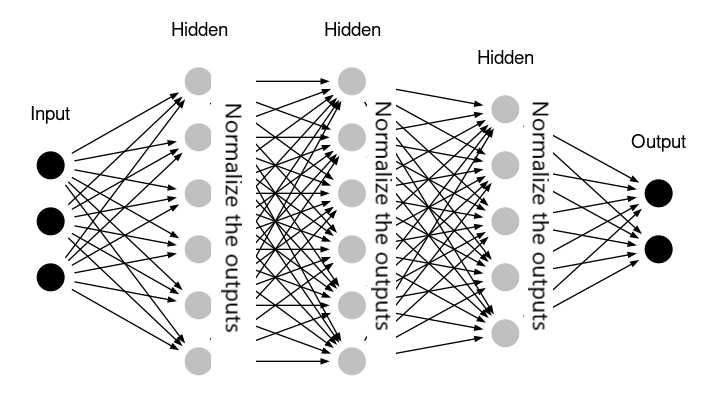
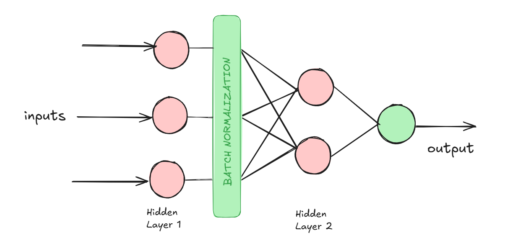

# Day_031 | Batch Normalization in Deep Learning

Batch Normalization (BN) is a technique used in deep learning to **stabilize and accelerate the training process** of neural networks, particularly deep ones. It involves normalizing the outputs of a previous layer's activation before passing them to the next layer.

---

## 💡 How Batch Normalization Works

BN works by addressing a phenomenon called **Internal Covariate Shift (ICS)**.

### 1. The ICS Problem
In a deep network, as the parameters of the earlier layers change during training, the distribution of the inputs to the later layers also changes dramatically. This constant shifting of input distribution forces the later layers to continuously adapt to new data ranges, which significantly slows down convergence and makes training unstable.

### 2. The BN Solution
A Batch Normalization layer performs two main steps for every **mini-batch** of data:

1.  **Standardization:** It calculates the **mean ($\mu_{\mathcal{B}}$)** and **variance ($\sigma^2_{\mathcal{B}}$)** of the pre-activation inputs ($\mathbf{z}$) across the current mini-batch ($\mathcal{B}$). It then normalizes these inputs to have a mean of 0 and a variance of 1.

$$
\hat{\mathbf{z}} = \frac{\mathbf{z} - \mu_{\mathcal{B}}}{\sqrt{\sigma^2_{\mathcal{B}} + \epsilon}}
$$

($\epsilon$ is a small constant added for numerical stability).

2.  **Scaling and Shifting (Learning):** The network would prefer to sometimes use a distribution other than a standard normal one. Therefore, BN introduces two learnable parameters per activation: a **scaling factor ($\gamma$)** and an **offset ($\beta$)**.

$$
\mathbf{y} = \gamma \hat{\mathbf{z}} + \beta
$$

These parameters allow the network to perform an **identity mapping** if needed, effectively letting the network undo the normalization if the model determines it's better not to normalize. The values $\gamma$ and $\beta$ are learned during backpropagation like regular weights. 

---

## 🎯 Advantages of Batch Normalization

Batch Normalization has several significant positive effects on network performance:

* **Higher Learning Rates:** BN prevents exploding/vanishing gradients, allowing you to use much **higher learning rates** without instability, which speeds up convergence.
* **Faster Convergence:** By keeping the distribution of layer inputs stable, the subsequent layers don't have to work as hard to adjust, leading to much faster training.
* **Reduced Regularization Needs:** BN acts as a mild regularizer because the computed statistics ($\mu_{\mathcal{B}}$ and $\sigma^2_{\mathcal{B}}$) are based only on the current mini-batch, injecting a small amount of noise into the network. This reduces the need for heavy use of techniques like Dropout.
* **Makes Deeper Networks Possible:** Stable gradient flow makes it easier to train very deep architectures without facing instability issues.

---

## ⚙️ Placement and Usage

* **Placement:** A BN layer is typically inserted immediately **before the activation function** (e.g., before ReLU) in the hidden layers.
* **Inference (Testing):** During inference, the mean and variance of a single mini-batch are often unreliable. Instead, the final **moving averages** of $\mu_{\mathcal{B}}$ and $\sigma^2_{\mathcal{B}}$, computed throughout the entire training process, are used for standardization.


## ChatGPT


## ⭐ **Batch Normalization (BatchNorm) in Deep Learning**

Batch Normalization is a technique that **normalizes the intermediate activations** of a neural network layer **for each mini-batch** during training.

Introduced by *Ioffe & Szegedy (2015)* with the goal of:
👉 **reducing internal covariate shift**
👉 making training faster and more stable
👉 allowing deeper networks to converge

---

## 🔍 1. Intuition Behind Batch Normalization

During training, as weights update, the distributions of activations in each layer keep changing.
This forces later layers to constantly adapt → **slows down training** and causes instability.

This phenomenon is called **Internal Covariate Shift**.

**BatchNorm stabilizes these distributions** so the layers don't need to relearn constantly.

---

## 🧮 2. How Batch Normalization Works (Step-by-Step)

Given an input mini-batch:

$$
x = (x_1, x_2, \ldots, x_m)
$$

BatchNorm performs:

---

### **Step 1 — Compute Batch Mean**

$$
\mu_B = \frac{1}{m}\sum_{i=1}^{m} x_i
$$

### **Step 2 — Compute Batch Variance**

$$
\sigma_B^2 = \frac{1}{m} \sum_{i=1}^{m} (x_i - \mu_B)^2
$$

---

### **Step 3 — Normalize the Batch**

$$
\hat{x}_i = \frac{x_i - \mu_B}{\sqrt{\sigma_B^2 + \epsilon}}
$$

(ε avoids division by zero)

---

### **Step 4 — Scale and Shift (Learnable Parameters)**

$$
y_i = \gamma \hat{x}_i + \beta
$$

Where:

* **γ (gamma)** → learnable scale
* **β (beta)** → learnable shift

This allows the network to **restore any needed distribution**.

---

## 📦 3. What BatchNorm Actually Does

### ✔ Normalizes activations

Keeps mean ≈ 0 and variance ≈ 1.

### ✔ Adds learnable parameters

Unlike Normalization, BatchNorm still lets the network shape the distribution.

### ✔ Improves gradient flow

Avoids vanishing/exploding gradients.

### ✔ Acts as regularizer

Reduces need for dropout in CNNs.

---

## 🚀 4. Benefits of Batch Normalization

### ⭐ **1. Allows Higher Learning Rates**

Training becomes much more stable.

### ⭐ **2. Faster Convergence**

Optimization landscape becomes smoother.

### ⭐ **3. Reduces Internal Covariate Shift**

More stable activations in deep networks.

### ⭐ **4. Works as Regularization**

Less need for dropout; reduces overfitting.

### ⭐ **5. Helps Deeper Networks Train**

Enabled training of very deep networks (e.g., ResNet, Inception-v3).

---

## ⚠️ 5. Limitations & Disadvantages

### ❌ **1. Depends on batch size**

Small batches → poor estimation of mean/variance.

BatchNorm performs best when:
👉 batch size ≥ 16
👉 ideally ≥ 32

### ❌ **2. Complicates RNNs**

Sequence length changes → batch statistics unstable
→ LayerNorm or GroupNorm used instead.

### ❌ **3. Not ideal for online, streaming, or reinforcement learning**

Because running statistics become unreliable.

### ❌ **4. Extra overhead**

Adds compute cost + memory for γ, β, µ, σ².

### ❌ **5. Training vs Inference mismatch**

Uses batch statistics in training
Uses *running averages* during inference

---

## 🏗 6. BatchNorm During **Training** vs **Inference**

### 🟦 During Training:

Use mini-batch mean & variance:

$$
* (\mu_B)
* (\sigma_B^2)
$$

### 🟩 During Inference:

Use *running averages* collected during training:

* running_mean
* running_variance

These are updated as:

$$
\text{running\_mean} \leftarrow \alpha \cdot \text{running\_mean} + (1-\alpha) \cdot \mu_B
$$

---

## 🧱 7. Where is BatchNorm Used?

### ✔ **CNNs (most common)**

Placed after Conv layers and before activation:

**Conv → BatchNorm → ReLU**

### ✔ **Fully-connected layers**

**Linear → BatchNorm → ReLU**

### ❌ **Not great for RNNs**

Use LayerNorm or GroupNorm instead.

---

## 🆚 8. BatchNorm vs Other Normalization Techniques

| Normalization    | Normalizes Over       | Best For            | Sensitive to Batch Size? |
| ---------------- | --------------------- | ------------------- | ------------------------ |
| **BatchNorm**    | Batch dimension       | CNNs                | ✔ Yes                    |
| **LayerNorm**    | Features              | RNNs / Transformers | ❌ No                     |
| **GroupNorm**    | Channel groups        | Small batch CNNs    | ❌ No                     |
| **InstanceNorm** | Single sample/channel | Style Transfer      | ❌ No                     |

---

## 🧪 9. PyTorch Example

### BatchNorm for fully connected layers:

```python
nn.BatchNorm1d(num_features)
```

### BatchNorm for CNNs:

```python
nn.BatchNorm2d(num_channels)
```

---

## 🧪 10. Keras / TensorFlow Example

```python
tf.keras.layers.BatchNormalization()
```

---

## 🏁 Final Summary

### **Batch Normalization:**

* Normalizes layer outputs per mini-batch
* Stabilizes training and speeds up convergence
* Reduces internal covariate shift
* Allows higher learning rates
* Acts as a regularizer
* Works best in CNNs with large batch sizes

# Images

