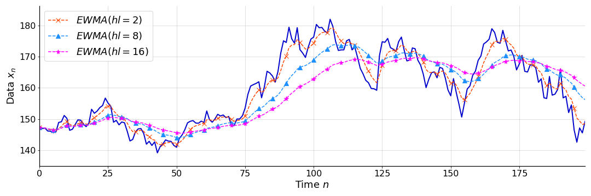
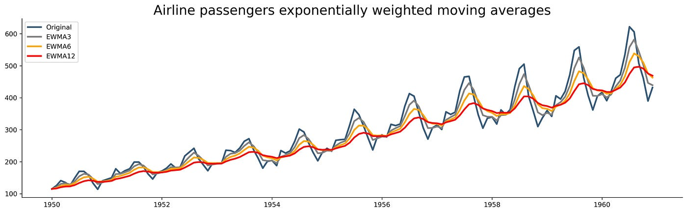

# Day_033 | Exponentially Weighted Moving Average

The **Exponentially Weighted Moving Average (EWMA)**, often referred to as **Exponentially Weighted Average (EWA)**, is a technique used to calculate an average of data points where more recent observations are given progressively greater weight than older observations.

It's a foundational concept used in many advanced deep learning optimizers like **RMSprop** and **Adam** to smooth out the noise in gradients.

---

## 💡 The EWMA Concept

The EWMA is calculated recursively. It is a linear combination of the current data point and the previous period's average.

### 1. The Equation

The estimate for the current time step $t$ is the new average $V_t$, which is based on the previous average $V_{t-1}$ and the current data point $\theta_t$:

$$
V_t = \beta V_{t-1} + (1 - \beta) \theta_t
$$

Where:
* $V_t$: The EWMA estimate at time $t$.
* $\theta_t$: The raw data point (e.g., the current gradient) at time $t$.
* $V_{t-1}$: The EWMA estimate at time $t-1$ (the previous average).
* $\beta$: The **smoothing factor** (a hyperparameter, typically $0 < \beta < 1$).

### 2. The Smoothing Factor ($\beta$)

The value of $\beta$ controls the decay rate and, consequently, how much the algorithm "remembers" past values:

* **Large $\beta$ (e.g., 0.99):** Gives a high weight to the past average ($V_{t-1}$) and a low weight to the current data ($\theta_t$). This results in a **very smooth** average that lags significantly behind the actual data.
    * *Intuition:* The average is calculated over approximately $\frac{1}{1-\beta}$ time steps. For $\beta=0.9$, the average smooths over about 10 time steps.
* **Small $\beta$ (e.g., 0.5):** Gives more weight to the current data ($\theta_t$). This results in a **less smooth** average that reacts quickly to changes but is more susceptible to noise.

### 3. Application in Deep Learning

In deep learning, EWMA is used to track the momentum of gradients:

* **Momentum Optimizer:** Used to compute the moving average of the gradients, ensuring the weight updates continue moving in a consistent direction across noisy mini-batches.
* **RMSprop and Adam:** Used to compute the moving average of the **squared gradients**. This provides an estimate of the variance (or second moment) of the gradient for each parameter, which is then used to adapt the learning rate individually.

Exponentially Weighted Moving Average (EWMA) — also called **Exponential Moving Average (EMA)** or **Exponential Smoothing** — is a technique used to compute a smoothed version of a sequence (e.g., gradients, velocities, loss values) by giving **more weight to recent values** and **exponentially decreasing weight to older values**.

It is used heavily in deep learning optimizers like **Momentum, RMSProp, Adam**, etc.

---

## ✅ **Definition**

Given a sequence of values ( $x_1, x_2, x_3, \dots$ ), EWMA is defined as:

$$
v_t = \beta v_{t-1} + (1 - \beta)x_t
$$

Where:

* ( $v_t$ ) = the smoothed value at time step ( t )
* ( $x_t$ ) = the raw value (e.g., gradient) at time step ( t )
* ( $\beta$ ) = smoothing factor, ( $0 < \beta < 1$ )
* ( $v_0$ ) = often initialized to 0

---

## ✅ **Intuition**

EWMA smooths out noise by:

* **Keeping a long-term memory** (through ( $\beta v_{t-1}$ ))
* **Reacting quickly to new values** (through ( $(1-\beta)x_t$ ))

A higher ( $\beta$ ) → smoother, slower response.
A lower ( $\beta$ ) → less smooth, responds faster to change.

Common values in deep learning:

* ( $\beta = 0.9$ ) → Momentum
* ( $\beta = 0.99$ ) → RMSProp
* ( $\beta_1 = 0.9, \beta_2 = 0.999$ ) → Adam

---

## 📌 **Why Exponential?**

The weights applied to past values decay exponentially:

$$
v_t = (1-\beta)x_t + \beta(1-\beta)x_{t-1} + \beta^2(1-\beta)x_{t-2} + \ldots
$$

Meaning:

* recent values are weighted most
* older values have exponentially smaller influence

This reduces noise while retaining important trends.

---

## ⚠️ **Bias Correction**

When ( $v_0 = 0$ ), early estimates are biased toward zero.
Adam corrects this by:

$$
\hat{v}_t = \frac{v_t}{1 - \beta^t}
$$

This helps get accurate smoothed values at the start of training.

---

## 🎯 **Why EWMA is Important in Deep Learning**

EWMA is used to improve training stability:

### **1. Momentum**

Uses EWMA of gradients to create a velocity term that smooths noisy gradients.

### **2. RMSProp**

Uses EWMA of squared gradients to adapt learning rates.

### **3. Adam**

Uses *two* EWMAs:

* ( $m_t$ ): EWMA of gradients
* ( $v_t$ ): EWMA of squared gradients

### **4. Loss smoothing**

Used in monitoring training metrics to avoid spikes.

---

## 🔥 Example (simple numbers)

Suppose ( $x_t = 10$ ) consistently, and ( $\beta = 0.9$ ):

Step 1:
$$
v_1 = 0.9(0) + 0.1(10) = 1
$$

Step 2:
$$
v_2 = 0.9(1) + 0.1(10) = 1.9
$$

Step 3:
$$
v_3 = 0.9(1.9) + 0.1(10) = 2.71
$$

… and so on.
It approaches 10 **smoothly**, rather than jumping there immediately.

---

# Image

