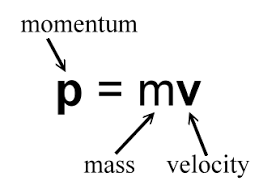
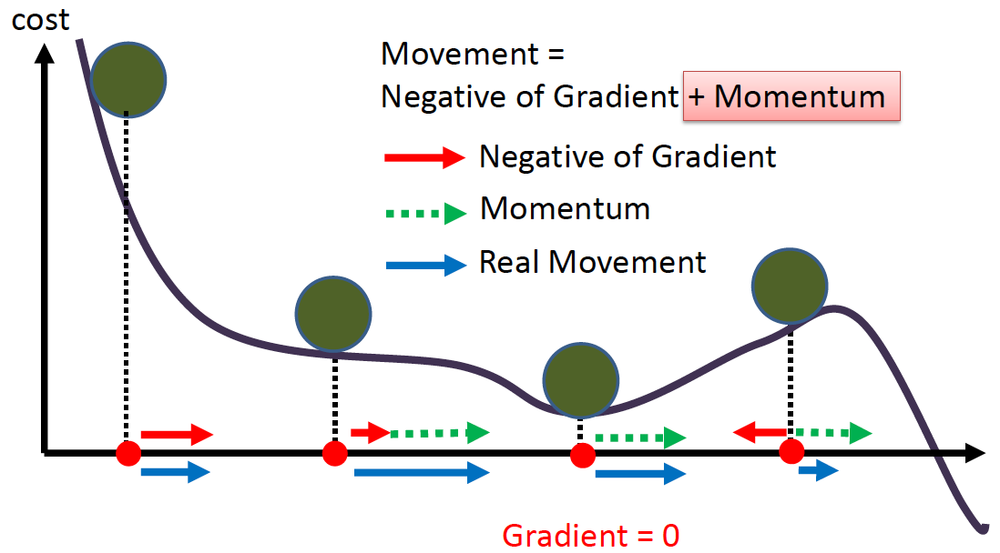
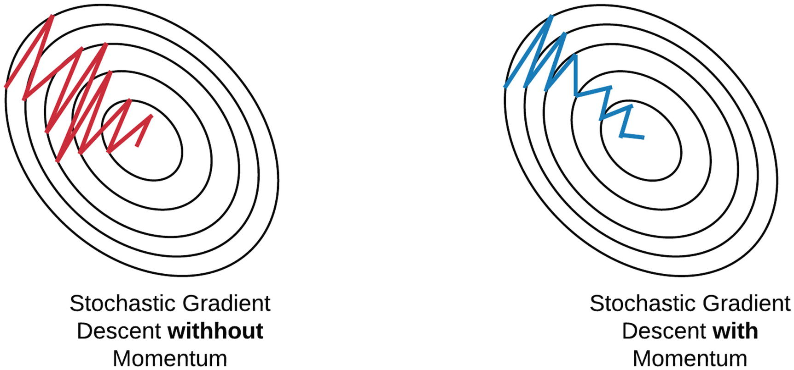
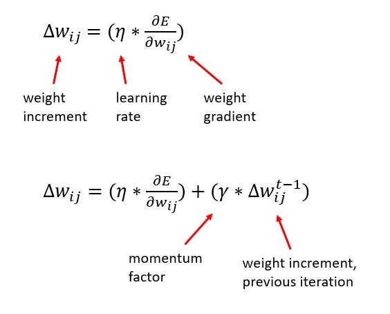

# Day_034 | 🚀 SGD with Momentum Explained

**SGD with Momentum** is an extension of the standard Stochastic Gradient Descent (SGD) algorithm that accelerates training, particularly in deep neural networks. It helps SGD overcome the problems of slow convergence and oscillation in areas where the loss function surface is uneven.

---

## 🚀 The Core Idea: Adding Inertia

Imagine the optimization process as a ball rolling down a hilly landscape (the loss function). Standard SGD can be thought of as a ball that stops and starts, making jerky movements. Momentum gives the ball inertia.

### 1. Mechanism: Exponentially Weighted Moving Average (EWMA)

SGD with Momentum calculates the update based not just on the current gradient, but also on an **Exponentially Weighted Moving Average (EWMA)** of past gradients. This moving average is often referred to as the **velocity vector** ($v$).

The process involves two main updates at each iteration $t$:

#### A. Compute the Velocity

The new velocity ($v_t$) is a combination of the previous velocity ($v_{t-1}$) and the current gradient ($\nabla J(\theta_t)$).

$$
v_t = \beta v_{t-1} + (1 - \beta) \nabla J(\theta_t)
$$

* $\beta$: The **momentum coefficient** (a hyperparameter, typically around $0.9$). It controls how much of the previous velocity is retained. A high $\beta$ means more inertia.
* $\nabla J(\theta_t)$: The gradient of the loss function at the current mini-batch.

#### B. Update the Parameters

The parameters ($\theta$) are updated in the direction of the computed velocity ($v_t$), scaled by the learning rate ($\eta$).

$$
\theta_{\text{new}} = \theta_{\text{old}} - \eta v_t
$$


---

## 🎯 Advantages Over Plain SGD

1.  **Faster Convergence:** When gradients point in the same direction over many iterations (like descending a long valley), the momentum term $v_{t-1}$ increases, causing the updates to accelerate.
2.  **Dampened Oscillation:** In areas where the loss surface is steep but shallow (a ravine), plain SGD oscillates rapidly back and forth. Momentum averages out these high-frequency, perpendicular oscillations because they cancel each other out over time. The net velocity remains focused on the primary direction of descent.
3.  **Escaping Local Minima/Saddle Points:** The built-up velocity can help the optimizer "push through" small, shallow local minima or flat saddle points, allowing it to find deeper, better minima.


Sure! Here is a **clear, intuitive, and mathematically correct explanation of SGD with Momentum**.

---

## 🔹 **1. Problem With Plain SGD**

Stochastic Gradient Descent (SGD) suffers from:

* noisy updates
* slow movement in the correct (averaged) direction
* oscillations in directions with steep curvature

Example: In a valley-shaped loss surface, SGD zig-zags instead of moving smoothly.

Momentum fixes this.

---

## 🔹 **2. Intuition Behind Momentum**

Think of optimization like **rolling a ball down a hill**:

* If the slope keeps going in the same direction, the ball speeds up.
* If the slope changes direction suddenly (noise), the ball’s inertia keeps it from wobbling too much.

Momentum gives the optimizer **inertia** so it builds up speed in consistent gradient directions and damps noise.

---

## 🔹 **3. The Equations**

SGD with momentum keeps an **Exponential Weighted Moving Average (EWMA)** of past gradients:

### **Velocity Update**

$$
v_t = \beta v_{t-1} + (1 - \beta) g_t
$$

Where:

* ( $g_t = \nabla_\theta L(\theta_t)$ ) is the current gradient
* ( $\beta \in [0,1)$ ) is the momentum coefficient (usually 0.9)
* ( $v_t$ ) is the “velocity” (smoothed gradient)

### **Parameter Update**

$$
\theta_{t+1} = \theta_t - \alpha v_t
$$

Where ( $\alpha$ ) is the learning rate.

---

## 🔹 **4. What This Means**

### ✓ Gradient directions that stay the same accumulate

→ The model accelerates in “good” directions.

### ✓ Noisy gradient directions get weakened

→ The model becomes more stable.

### ✓ Oscillations in steep directions are reduced

→ Faster convergence.

---

## 🔹 **5. Why Momentum Works**

### **a) Reduces Variance (Noise Smoothing)**

EWMA averages many past gradients → reduces randomness from small mini-batches.

### **b) Faster Convergence (Builds Speed)**

In deep ravines or flat regions, gradient direction stays consistent → momentum builds velocity → faster movement than plain SGD.

### **c) Avoids Getting Stuck at Local Minima**

A bit of inertia helps escape tiny bumps and noise-induced traps.

---

## 🔹 **6. Typical Hyperparameters**

| Hyperparameter           | Typical Value | Meaning                                        |
| ------------------------ | ------------- | ---------------------------------------------- |
| ( $\beta$ ) (momentum)     | 0.9           | How strongly past gradients influence velocity |
| Learning rate ( $\alpha$ ) | 0.01 → 0.0001 | Step size                                      |

---

## 🔹 **7. Short Code Example (PyTorch Style)**

```python
optimizer = torch.optim.SGD(model.parameters(), 
                            lr=0.01, 
                            momentum=0.9)
```

This uses the exact equations described above.

---

## 9. ✅ SGD with Momentum in Keras
```python

from tensorflow.keras.models import Sequential
from tensorflow.keras.layers import Dense
from tensorflow.keras.optimizers import SGD

# Build a small model
model = Sequential([
    Dense(64, activation='relu', input_shape=(100,)),
    Dense(10, activation='softmax')
])

# Compile with SGD + Momentum
optimizer = SGD(learning_rate=0.01, momentum=0.9)

model.compile(
    optimizer=optimizer,
    loss='categorical_crossentropy',
    metrics=['accuracy']
)

# Train
model.fit(x_train, y_train, epochs=10, batch_size=32, validation_data=(x_val, y_val))


```


---

## 🔹 **8. Visual Intuition**

Imagine the loss surface looks like a curved valley:

Without momentum → zig-zag, slow.
With momentum → smooth descent along the valley floor.

Momentum **damps oscillation** and **boosts consistent descent**.

---

## 🎯 **In One Sentence**

**SGD with Momentum = SGD + an exponential moving average of gradients → smoother, faster, and more stable convergence.**


# Images






