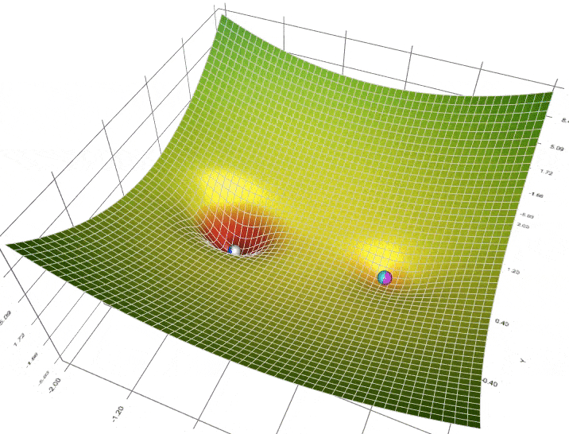
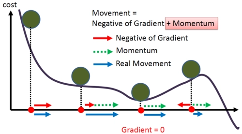
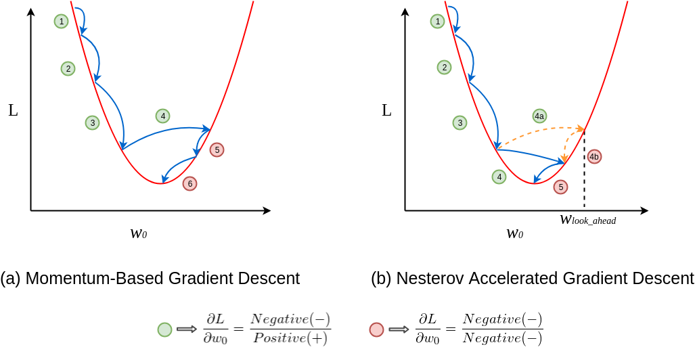

# Day_035 | 🏃 Nesterov Accelerated Gradient (NAG) Explained

**Nesterov Accelerated Gradient (NAG)** is an optimization algorithm that is a more advanced variant of **SGD with Momentum**. It modifies the standard momentum update by introducing a **"lookahead"** step, which often results in faster convergence and better performance.

### 1. The Core Idea: Lookahead Correction

In standard Momentum, the algorithm calculates the gradient at the current position ($\theta_t$) and then applies the update in the direction of the accumulated momentum ($v_t$).

NAG improves this by performing the following two steps:

1.  **Project Ahead:** It first makes a **"jump"** in the direction of the *previous* momentum vector ($v_{t-1}$).
2.  **Calculate Gradient at the Projected Position:** It then calculates the gradient ($\nabla J$) at this **projected future position** ($\theta_{\text{lookahead}}$), which is a better estimate of the direction the parameters should move.

This "lookahead" prevents overshooting and makes the descent path more precise. 

### 2. The Mathematical Update

NAG modifies the update process into two sequential steps:

#### Step 1: Lookahead (Momentum Applied)

The parameters are temporarily updated based on the accumulated velocity ($v_{t-1}$) to find the lookahead point $\tilde{\theta}$:

$$\tilde{\theta} = \theta_{t} - \eta \beta v_{t-1}$$

* $\theta_t$: Current parameters.
* $\eta$: Learning rate.
* $\beta$: Momentum coefficient (e.g., 0.9).

#### Step 2: Compute Velocity and Update Parameters

The gradient is calculated at the lookahead point $\tilde{\theta}$, and the velocity and parameters are updated based on this corrected gradient:

$$
v_t = \beta v_{t-1} + \eta \nabla J(\tilde{\theta})
$$

$$
\theta_{t+1} = \theta_t - v_t
$$

### 3. Advantage Over Standard Momentum

* **Precision and Stability:** By calculating the gradient at the point where the network is *expected* to be, NAG can correct its course before making the final jump. This acts as a dampening force, making the oscillations near the minimum smaller and the convergence path straighter and more stable.
* **Faster Convergence:** This anticipatory mechanism is mathematically proven to offer a better convergence rate for convex functions and performs very well in practice for the non-convex surfaces of deep learning loss functions.
  

Here is a **clear, intuitive explanation of Nesterov Accelerated Gradient (NAG)** — what it is, why it’s better than regular momentum, the math, and Keras code.

---

## 🚀 **Nesterov Accelerated Gradient (NAG)**

NAG is an improvement over classic momentum.
It is often described as **“look ahead” momentum**.

---

## 🔹 1. Why Regular Momentum Has a Weakness

With standard momentum:

$$
v_t = \beta v_{t-1} + g_t
$$

$$
\theta_{t+1} = \theta_t - \alpha v_t
$$

Momentum builds up velocity, but:

* the gradient is computed at the **current position**
* yet the update includes a “jump” using momentum
* the optimizer may overshoot because it doesn’t know where momentum is taking it

This can cause instability.

---

## 🔹 2. Key Idea of NAG

Instead of computing the gradient at the *current* parameters ($ \theta_t$ ), NAG computes the gradient at a **look-ahead position**:

👉 **We look where momentum will take us, then compute the gradient there.**

This gives a more accurate, more responsive update.

---

## 🔹 3. NAG Equations (Standard Form)

### **1. Look ahead:**

$$
\tilde{\theta}*t = \theta_t - \beta v*{t-1}
$$

### **2. Compute gradient at the look-ahead position:**

$$
g_t = \nabla_\theta L(\tilde{\theta}_t)
$$

### **3. Update velocity:**

$$
v_t = \beta v_{t-1} + \alpha g_t
$$

### **4. Update parameters:**

$$
\theta_{t+1} = \theta_t - v_t
$$

---

## 🔹 4. Intuition (Super Important)

Think of NAG like this:

### ✔ Classic Momentum

You run fast, and then check where you are.

### ✔ NAG

You **peek ahead first**, then decide how to step.

This leads to:

* fewer overshoots
* faster convergence
* smoother training

It corrects momentum before it goes too far.

---

## 🔹 5. Visual Intuition (Simple)

Imagine running downhill:

* With momentum: You build speed but may overshoot curves.
* With NAG: You lean forward and see where you are going **before stepping**, allowing controlled and faster descent.

---

## 🔹 6. Why NAG Performs Better

### ✓ More accurate updates

### ✓ Earlier correction of momentum

### ✓ Less oscillation

### ✓ Faster convergence than SGD and SGD+momentum

It is one of the fastest first-order optimization methods before Adam became popular.

---

## 🔹 7. Keras Code for NAG

> Keras
```python
from tensorflow.keras.optimizers import SGD

optimizer = SGD(
    learning_rate=0.01,
    momentum=0.9,
    nesterov=True   # This enables Nesterov Momentum
)

model.compile(
    optimizer=optimizer,
    loss='categorical_crossentropy',
    metrics=['accuracy']
)

model.fit(x_train, y_train, epochs=10, batch_size=32)
```

---

## 🔹 8. Summary in One Sentence

**Nesterov Accelerated Gradient = momentum that "looks ahead" before updating, resulting in a faster, more stable descent.**

---

# Images


