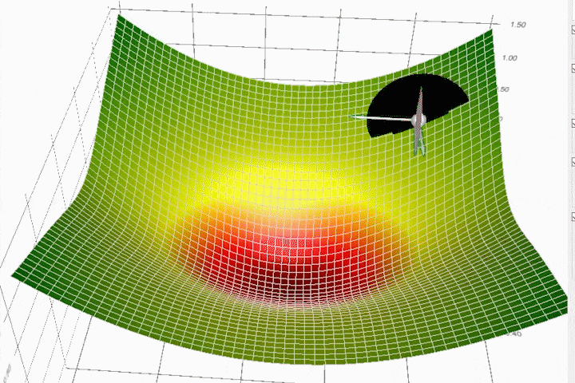
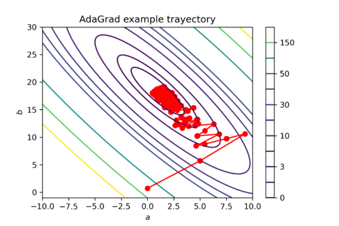
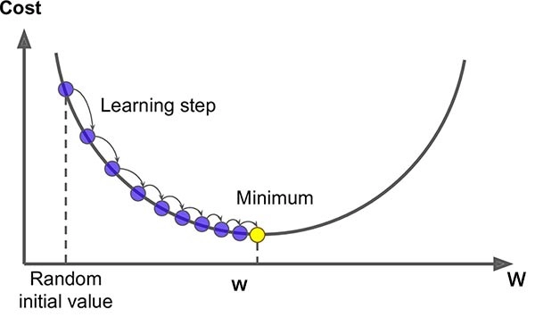

# Day_036 | 🧠 AdaGrad (Adaptive Gradient) Explained

**AdaGrad** (Adaptive Gradient) is an optimization algorithm that is a foundational step toward modern adaptive learning rate methods (like RMSprop and Adam). Its key innovation is to allow the learning rate to **adapt** for **each individual parameter** (weight or bias) based on the history of gradients for that specific parameter.

### 1. The Core Idea: Per-Parameter Learning Rates

Traditional Gradient Descent uses a single learning rate $\eta$ for all parameters. AdaGrad maintains a separate running sum of the squares of the past gradients for every parameter.

* **Infrequent Features:** Parameters associated with features that occur **infrequently** (and thus have small historical gradients) will receive a **larger effective learning rate**.
* **Frequent Features:** Parameters associated with features that occur **frequently** (and thus have large historical gradients) will receive a **smaller effective learning rate**.

This is particularly useful for sparse data, such as in natural language processing (NLP), where certain words appear very rarely.

### 2. The Mathematical Update

AdaGrad computes a parameter update $\theta_{t+1}$ based on the learning rate $\eta$, the current gradient $g_t$ (calculated at time $t$), and the cumulative sum of squared gradients $G_t$.

#### A. Accumulate Squared Gradients

At each time step $t$, the square of the current gradient $g_t$ for a parameter is accumulated into the historical term $G_t$:

$$
G_{t,ii} = G_{t-1,ii} + g_{t,i}^2
$$

Where $G_{t,ii}$ is a diagonal matrix where each diagonal element $G_{t,ii}$ contains the sum of the squares of the gradients with respect to parameter $\theta_i$ up to time $t$.

#### B. Parameter Update

The update rule divides the general learning rate by the square root of the accumulated squared gradients, plus a small smoothing term $\epsilon$:

$$\theta_{t+1, i} = \theta_{t, i} - \frac{\eta}{\sqrt{G_{t,ii} + \epsilon}} g_{t,i}$$

* $\eta$: Global learning rate (e.g., 0.01).
* $\sqrt{G_{t,ii} + \epsilon}$: The term that causes the **adaptive decrease** in the learning rate for parameter $\theta_i$.

### 3. Advantages and Disadvantages

| Feature | Advantage | Disadvantage |
| :--- | :--- | :--- |
| **Adaptivity** | Automatically adapts the learning rate for each parameter, requiring less manual tuning of the initial learning rate. | The primary drawback: the denominator $\sqrt{G_{t,ii}}$ **continuously grows** since it accumulates *all* past squared gradients. |
| **Sparse Data** | Excels at handling sparse data, as parameters associated with rare features get larger updates, helping them learn faster. | The continuously growing denominator causes the learning rate to **shrink aggressively toward zero** over the course of training. |
| **Convergence** | Starts fast and stable. | The severely shrinking learning rate can cause the model to **stop learning prematurely** before reaching the true minimum of the loss function. |

The main flaw—the aggressive, unbounded decay of the learning rate—is what motivated the development of **RMSprop** and **Adam**, which use an **Exponentially Weighted Moving Average (EWMA)** instead of a simple cumulative sum to only remember recent gradients.


Here is a **clear, intuitive, and complete explanation of AdaGrad** — what it is, why it was invented, the math, pros/cons, and examples.

---

## 🚀 **AdaGrad (Adaptive Gradient Algorithm) — Explained**

AdaGrad is one of the first **adaptive learning rate** optimizers in deep learning.
Its key idea:

> **Parameters that receive large gradients get smaller learning rates;
> parameters that receive small gradients get larger learning rates.**

This makes AdaGrad especially good for sparse data (e.g., NLP, recommendation systems).

---

## 🔹 1. Why AdaGrad Was Needed

Classic SGD uses **one global learning rate** for all parameters.
However:

* Some weights need **big updates** (rare features)
* Some weights need **tiny updates** (frequent features)

If the learning rate is wrong, training becomes slow or unstable.

AdaGrad solves this by giving each parameter **its own adaptive learning rate**.

---

## 🔹 2. How AdaGrad Works

AdaGrad keeps a **running sum of past squared gradients** for each parameter.

### **Accumulator for squared gradients**

$$
G_t = G_{t-1} + g_t^2
$$

Where:

* ( $g_t$ ) = gradient of the parameter at time t
* ( $G_t$ ) = cumulative squared gradients

### **Parameter update rule**

$$
\theta_{t+1} = \theta_t - \frac{\alpha}{\sqrt{G_t} + \epsilon} g_t
$$

Where:

* ( $\alpha$ ) = initial learning rate
* ( $\epsilon$ ) = small constant to avoid division by zero

---

## 🔹 3. Intuition Behind AdaGrad

### ✔ Frequent features → large accumulated gradients

This makes ( $\sqrt{G_t}$ ) large → **learning rate decreases**.
→ Updates get smaller → prevents over-adjusting.

### ✔ Rare features → small accumulated gradients

Small ( $\sqrt{G_t}$ ) → **learning rate increases**.
→ Helps learning rare but important signals.

This is why AdaGrad is great for sparse, high-dimensional data.

---

## 🔹 4. Strengths of AdaGrad

### ⭐ 1. Very good for sparse data

Widely used in NLP, text, and click prediction.

### ⭐ 2. No need for manual learning-rate decay

The algorithm adapts learning rates automatically.

### ⭐ 3. Works well for convex problems

AdaGrad was originally designed for convex optimization and performs strongly there.

---

## 🔹 5. Major Weakness of AdaGrad

### ❌ Learning rate **shrinks too fast**

Since ( G_t ) keeps growing forever:

$$
\sqrt{G_t} \to \infty \quad \Rightarrow \quad \alpha_\text{effective} \to 0
$$

Eventually, updates become extremely small → **training stops prematurely**.

This is the main reason AdaGrad is rarely used alone today.

---

## 🔹 6. How AdaGrad Inspired Later Optimizers

Because AdaGrad’s learning rate shrinks too much:

* **RMSProp** fixes it by using an **exponential moving average** instead of cumulative sum.
* **Adam** extends RMSProp and adds momentum.

So the evolution is:

**AdaGrad → RMSProp → Adam**

---

## 🔹 7. AdaGrad Equations in Simple Form

### 1. Accumulate squared gradients:

$$
r_t = r_{t-1} + g_t^2
$$

### 2. Update:

$$
\theta_{t+1} = \theta_t - \frac{\alpha}{\sqrt{r_t} + \epsilon}g_t
$$

---

## 🔹 8. Keras Code Example

> Keras
```python
from tensorflow.keras.optimizers import Adagrad

optimizer = Adagrad(
    learning_rate=0.01,
    epsilon=1e-7
)

model.compile(
    optimizer=optimizer,
    loss='categorical_crossentropy',
    metrics=['accuracy']
)

model.fit(x_train, y_train, epochs=10, batch_size=32)
```

---

## 🔹 9. Summary in One Sentence

**AdaGrad adaptively scales each parameter’s learning rate based on the history of squared gradients, making it great for sparse data but causing learning rates to shrink too fast.**

---

# Images


