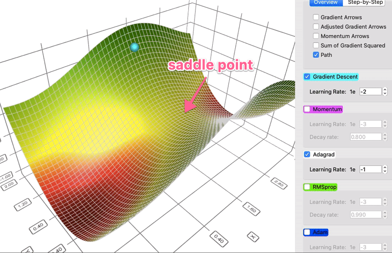
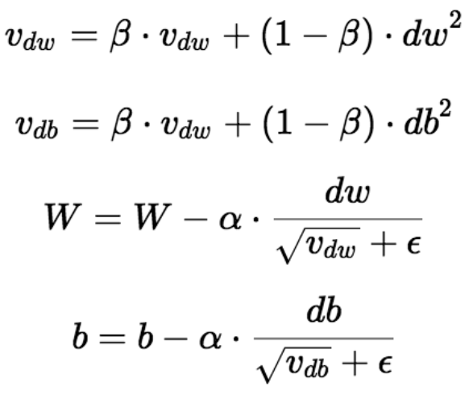

# Day_037 | 💡 RMSprop (Root Mean Square Propagation) Explained

**RMSprop** is an adaptive learning rate optimization algorithm developed by Geoff Hinton. It was created to specifically address the problem of the aggressively shrinking learning rate in the **AdaGrad** algorithm.

It is a powerful algorithm that forms the foundation for the most popular modern optimizer, **Adam**.

---

### 1. The Core Idea: Solving AdaGrad's Flaw

AdaGrad accumulates **all** past squared gradients, causing the denominator to continuously grow and eventually forcing the learning rate to zero, prematurely stopping the learning process.

RMSprop fixes this by using an **Exponentially Weighted Moving Average (EWMA)** of the squared gradients instead of a simple cumulative sum. This effectively limits the history of gradients that influence the current update, making the learning rate adaptive yet non-aggressively decaying.

### 2. The Mathematical Update

RMSprop modifies the denominator in the parameter update rule.

#### A. Compute the Exponentially Weighted Average (Second Moment)

The running average of the squared gradients ($S_t$) is calculated using an EWMA:

$$
S_t = \beta S_{t-1} + (1 - \beta) g_t^2
$$

* $S_t$: The EWMA of the squared gradients at time $t$.
* $g_t^2$: The square of the current gradient for a specific parameter.
* $\beta$: The decay rate (a hyperparameter, typically around $0.9$), which determines how much to "forget" the past.

#### B. Parameter Update

The parameter update rule then uses the square root of this new running average ($S_t$) in the denominator:

$$\theta_{t+1} = \theta_t - \frac{\eta}{\sqrt{S_t + \epsilon}} g_t$$

* $\eta$: The global learning rate (e.g., $0.001$).
* $\sqrt{S_t + \epsilon}$: The term that causes the adaptive step size.

### 3. Advantages Over AdaGrad

1.  **Sustained Learning:** By using the EWMA, RMSprop only retains a moving average of recent squared gradients, preventing the denominator from growing infinitely large. This allows the learning rate to **remain functional** throughout the entire training process.
2.  **Effective Adaptation:** Like AdaGrad, it provides **per-parameter adaptive learning rates**, allowing the model to take large steps in directions where the gradient is small (shallow valleys) and small steps where the gradient is large (steep ravines).
3.  **Fast Convergence:** It converges much faster than AdaGrad and vanilla SGD on non-stationary objectives (where the data distribution changes over time). 


Here is a **clear, intuitive, and complete explanation of RMSProp** — why it was created, how it works, the math, pros/cons, and Keras code.

---

## 🚀 **RMSProp (Root Mean Square Propagation) — Explained**

RMSProp is an adaptive learning rate optimizer, designed to fix the main problem in **AdaGrad**:

> **AdaGrad’s learning rate shrinks too quickly and eventually becomes almost zero.**

Geoffrey Hinton introduced RMSProp in his Coursera lectures.

---

## 🔹 1. Why RMSProp Was Needed

AdaGrad accumulates *all* past squared gradients:

$$
G_t = G_{t-1} + g_t^2
$$

As training goes on, ( $G_t$ ) grows without bound →

$$
\text{effective learning rate} = \frac{\alpha}{\sqrt{G_t}}
$$

shrinks to almost **zero**.

### Result:

* training stops too early
* can’t converge well on non-convex problems like deep nets

---

## 🔹 2. RMSProp’s Key Idea

Instead of summing **all** past squared gradients, RMSProp uses an:

> **Exponential Weighted Moving Average (EWMA)** of squared gradients.

This makes the optimizer remember **recent** gradients more than old ones.

---

## 🔹 3. RMSProp Equations

### **1. Running average of squared gradients**

$$
E[g^2]*t = \beta E[g^2]*{t-1} + (1 - \beta)g_t^2
$$

Where:

* ( $\beta$ ) is usually **0.9**
* This is the EWMA — recent gradients matter more.

### **2. Parameter update**

$$
\theta_{t+1} = \theta_t - \frac{\alpha}{\sqrt{E[g^2]_t} + \epsilon} g_t
$$

Where:

* ( $\alpha$ ) = learning rate
* ( $\epsilon$ ) = tiny constant to avoid division by zero

---

## 🔹 4. Intuition Behind RMSProp

### ✔ Smooths out noisy gradients

Thanks to EWMA, RMSProp filters noise in SGD.

### ✔ Keeps learning rate stable

Avoids AdaGrad’s “learning rate collapse.”

### ✔ Works very well for RNNs

RNN gradients vary wildly; RMSProp stabilizes them.

### ✔ Adapts learning per parameter

Just like AdaGrad, each parameter gets its own learning rate.

---

## 🔹 5. Behavior Summary

**If gradients are consistently large:**
→ ( $E[g^2]$ ) becomes big
→ denominator gets big
→ **learning rate becomes small**
→ optimizer avoids overshooting

**If gradients are consistently small:**
→ denominator small
→ **learning rate becomes larger**
→ optimizer makes progress on flat regions

---

# 🔹 6. Typical Hyperparameters

| Parameter                | Typical Value | Meaning                   |
| ------------------------ | ------------- | ------------------------- |
| Learning rate ( $\alpha$ ) | 0.001         | Smaller is standard       |
| Decay rate ( $\beta$ )     | 0.9           | Smooths squared gradients |
| Epsilon                  | 1e-7          | Numerical stability       |

---

# 🔹 7. Comparison: AdaGrad vs RMSProp

| Feature                             | AdaGrad | RMSProp   |
| ----------------------------------- | ------- | --------- |
| Cumulative sum of squared gradients | Yes     | No        |
| Uses EWMA                           | No      | Yes       |
| Learning rate shrinks to zero       | Yes     | No        |
| Works well for deep nets            | Poor    | Very good |
| Handles non-stationary problems     | No      | Yes       |

---

# 🔹 8. RMSProp Keras Code

> Keras
```python
from tensorflow.keras.optimizers import RMSprop

optimizer = RMSprop(
    learning_rate=0.001,
    rho=0.9,        # decay rate (beta)
    epsilon=1e-7
)

model.compile(
    optimizer=optimizer,
    loss='categorical_crossentropy',
    metrics=['accuracy']
)

model.fit(x_train, y_train, epochs=10, batch_size=32)
```

---

## 🔹 9. Summary in One Sentence

**RMSProp is AdaGrad with exponential decay, preventing learning rates from becoming too small and making it excellent for deep learning, especially RNNs.**

---

# Images


