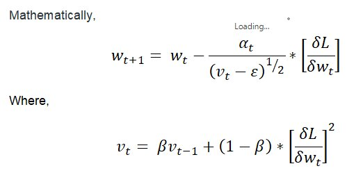
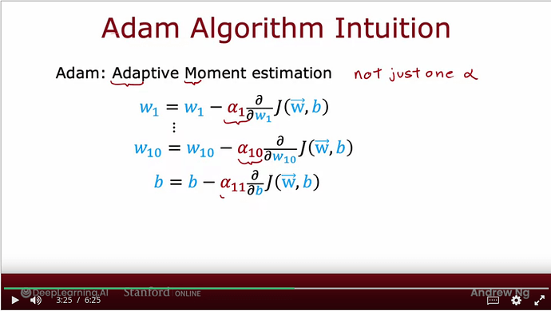

# Day_038 | 👑 Adam (Adaptive Moment Estimation) Optimizer Explained

**Adam** is the most widely used and effective optimization algorithm in deep learning today. It combines the strengths of **Momentum** and **RMSprop** to provide rapid and stable convergence.

### 1. The Core Idea: Combining Momentum and RMSprop

Adam maintains two separate moving averages for each parameter, representing the "first moment" (mean of the gradient) and the "second moment" (uncentered variance of the squared gradient):

1.  **First Moment ($m_t$):** An **Exponentially Weighted Moving Average (EWMA)** of the gradient (similar to Momentum). This helps accelerate convergence by reducing oscillation and moving in consistent directions.
2.  **Second Moment ($v_t$):** An **EWMA** of the **squared gradient** (similar to RMSprop). This provides the adaptive, per-parameter learning rate, ensuring stability and faster descent along shallow areas.

### 2. The Three-Step Update Process

Adam's update involves calculating these two moments and then performing a bias correction before the final parameter update.

#### Step 1: Compute Biased Moments

The two moment vectors, $m_t$ (first moment, or mean) and $v_t$ (second moment, or uncentered variance), are calculated using the current gradient $g_t$ and decay rates $\beta_1$ and $\beta_2$:

$$
m_t = \beta_1 m_{t-1} + (1 - \beta_1) g_t
$$

$$
v_t = \beta_2 v_{t-1} + (1 - \beta_2) g_t^2
$$

* $\beta_1$: Decay rate for the first moment (default $\approx 0.9$).
* $\beta_2$: Decay rate for the second moment (default $\approx 0.999$).

#### Step 2: Bias Correction

Since $m_t$ and $v_t$ are initialized to zero, they are biased toward zero, especially during the initial steps of training. Adam corrects this bias:

$$
\hat{m}_t = \frac{m_t}{1 - \beta_1^t}
$$

$$
\hat{v}_t = \frac{v_t}{1 - \beta_2^t}
$$

#### Step 3: Parameter Update

The parameters ($\theta$) are updated using the bias-corrected moments, similar to the RMSprop update formula:

$$
\theta_{t+1} = \theta_t - \frac{\eta}{\sqrt{\hat{v}_t} + \epsilon} \hat{m}_t
$$

* $\eta$: Learning rate (default $\approx 10^{-3}$).
* $\epsilon$: A small constant (default $10^{-8}$) for numerical stability.

### 3. Advantages of Adam

* **Fast Convergence:** The combination of momentum and adaptive learning rates ensures that Adam generally converges faster than any of its predecessors (SGD, Momentum, RMSprop).
* **Minimal Tuning:** The default hyperparameters ($\eta=10^{-3}$, $\beta_1=0.9$, $\beta_2=0.999$) work well for a vast range of deep learning problems, making it highly robust.
* **Memory Efficiency:** It requires only a small amount of memory to store the two moment vectors ($m_t$ and $v_t$) per parameter.
* **Adaptive Step:** It independently adjusts the step size for each parameter, effectively handling sparse features and varying loss landscape steepness.

Here is a **clear, intuitive, and complete explanation of the Adam Optimizer** — the most widely used optimizer in deep learning.

---

## 🚀 **Adam Optimizer — Explained**

**Adam** stands for:

### **A**daptive **M**oment **Estimation**

It combines the strengths of:

* **Momentum** (EWMA of gradients)
* **RMSProp** (EWMA of squared gradients)

This makes Adam **fast, stable, and efficient** for almost all deep learning tasks.

---

## 🔹 1. Why Adam Was Created

SGD + Momentum:

* smooths gradients
* but uses a single learning rate for all parameters

RMSProp:

* adapts learning rates per parameter
* but doesn’t keep momentum on gradients

Adam merges both:

> **Adam = Momentum + RMSProp + bias correction.**

---

## 🔹 2. Adam Keeps Two Exponential Averages

Adam tracks:

### **1. First moment → Momentum (mean of gradients)**

$$
m_t = \beta_1 m_{t-1} + (1 - \beta_1) g_t
$$

### **2. Second moment → RMSProp-style (mean of squared gradients)**

$$
v_t = \beta_2 v_{t-1} + (1 - \beta_2) g_t^2
$$

Where:

* ( $\beta_1$ = 0.9 ) (momentum factor)
* ( $\beta_2$ = 0.999 ) (smoothing of squared gradients)

---

# 🔹 3. Bias Correction (Critical Part)

Early in training, both ( m_t ) and ( v_t ) are biased toward zero.
Adam corrects this:

$$
\hat{m}_t = \frac{m_t}{1 - \beta_1^t}
$$

$$
\hat{v}_t = \frac{v_t}{1 - \beta_2^t}
$$

This makes the first few updates accurate and stable.

---

## 🔹 4. Parameter Update Rule

$$
\theta_{t+1} = \theta_t - \alpha \frac{\hat{m}_t}{\sqrt{\hat{v}_t} + \epsilon}
$$

Where:

* ( $\alpha$ ) = learning rate (default 0.001)
* ( $\epsilon$ ) = stability constant (default 1e-7)

---

## 🔹 5. Intuition for Adam

### ✔ Like Momentum

Adam smooths gradients → avoids noise
(velocity builds up over time)

### ✔ Like RMSProp

Each parameter has its own adaptive learning rate
(based on squared gradient)

### ✔ With Bias Correction

Early training becomes stable, not too conservative.

### ✔ Works incredibly well on sparse, noisy, or non-stationary problems.

---

## 🔹 6. Advantages of Adam

### ⭐ Fast convergence

Because of adaptive learning and momentum.

### ⭐ Works in almost every situation

CNNs, RNNs, Transformers, GANs, etc.

### ⭐ Good default optimizer

Often the first choice when starting training.

### ⭐ Robust to noisy gradients

Thanks to averaging.

### ⭐ Little hyperparameter tuning needed

Defaults are excellent.

---

## 🔹 7. Disadvantages of Adam

### ❌ Sometimes generalizes worse than SGD+Momentum

Especially in large-scale image classification.

### ❌ Can converge too quickly to sharp minima

Less stable long-term generalization.

### ❌ Too many moving parts compared to SGD

---

## 🔹 8. Typical Hyperparameters

| Parameter                | Default | Meaning         |
| ------------------------ | ------- | --------------- |
| Learning rate ( \alpha ) | 0.001   | base step size  |
| ( \beta_1 )              | 0.9     | momentum factor |
| ( \beta_2 )              | 0.999   | RMSProp factor  |
| ( \epsilon )             | 1e-7    | stability       |

Defaults work extremely well in practice.

---

## 🔹 9. Adam in Keras

> Keras
```python
from tensorflow.keras.optimizers import Adam

optimizer = Adam(
    learning_rate=0.001,
    beta_1=0.9,
    beta_2=0.999,
    epsilon=1e-7
)

model.compile(
    optimizer=optimizer,
    loss='categorical_crossentropy',
    metrics=['accuracy']
)

model.fit(x_train, y_train, epochs=10, batch_size=32)
```

---

## 🔹 10. Summary in One Sentence

**Adam = Momentum + RMSProp + Bias Correction → fast, adaptive, stable, and the most commonly used optimizer in deep learning.**

---

# Images



