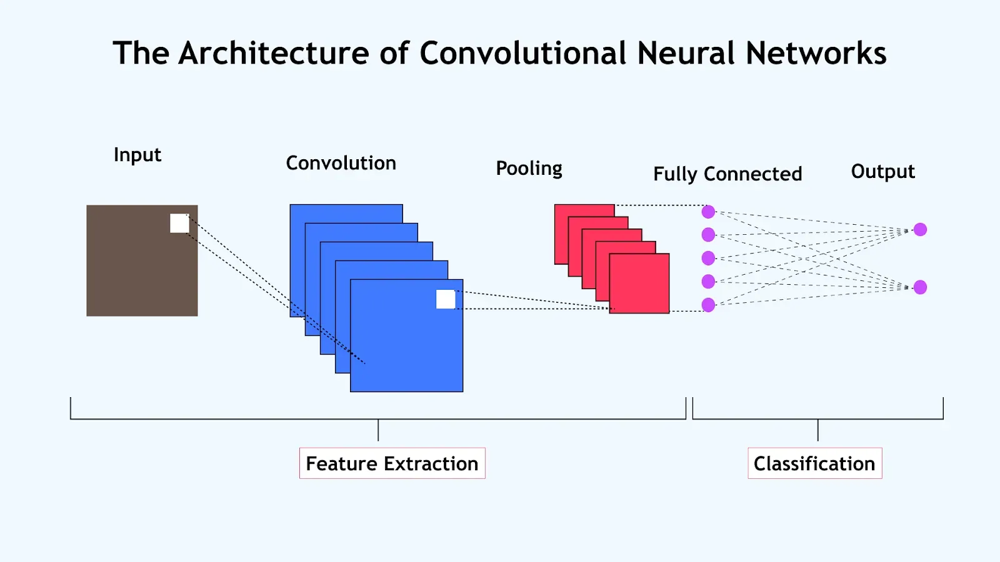
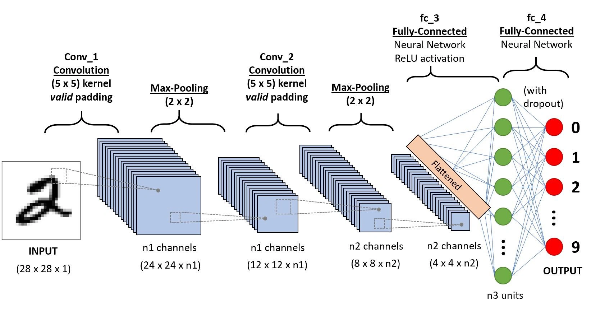

# Day_040 | 🖼️ What is Convolutional Neural Network (CNN) | CNN Intution

A **Convolutional Neural Network (CNN)**, or **ConvNet**, is a specialized type of deep neural network primarily designed to process structured grid data, such as images.

It revolutionized the field of **Computer Vision** because of its ability to automatically and efficiently extract hierarchical features directly from the raw pixel data.

---

## 🖼️ CNN Intuition: The Visual Filter

The core intuition behind a CNN is to mimic how the human visual cortex processes images: recognizing local features first (like edges and corners) and then combining them into larger, more abstract concepts (like eyes and faces).

### 1. The Core Idea: Localized Feature Detection

* **Sharing:** Unlike a Multi-Layer Perceptron (MLP), where every neuron connects to every input, a CNN exploits the fact that in an image, useful features are local. A specific neuron only needs to look at a small, localized area of the input image.
* **Translation Invariance:** If a cat is in the top-left or bottom-right corner of an image, it's still a cat. The CNN learns that the feature detector (a filter) that works in one part of the image can be reused across all other parts. This property is called **translation invariance** and dramatically reduces the number of parameters needed.

### 2. Key Building Blocks

A typical CNN architecture consists of several alternating layers that work together to downsample the image while increasing the complexity of the features:

#### A. Convolutional Layer (The Feature Extractor)
* **Mechanism:** A small, learnable matrix called a **filter** (or **kernel**) slides across the entire input image, performing a dot product operation at every position. 
* **Intuition:** Each filter acts as a feature detector. One filter might learn to detect vertical edges, another might detect horizontal edges, and another might detect curved patterns. The output of this layer is an **Activation Map** (or Feature Map) showing where in the image that specific feature was found.

#### B. Pooling Layer (The Downsampler)
* **Mechanism:** This layer reduces the spatial size (width and height) of the feature maps. The most common type is **Max Pooling**, which takes the maximum value from a small window (e.g., $2 \times 2$) of the feature map.
* **Intuition:** It reduces the computation and memory footprint while making the detected features more **robust to small shifts or distortions** in the input image. It keeps the most dominant features and throws away the less important information.

#### C. Fully Connected Layer (The Classifier)
* **Mechanism:** After several Convolutional and Pooling layers have extracted high-level features, the feature maps are flattened into a single vector. This vector is fed into a traditional **Fully Connected MLP**.
* **Intuition:** This final part uses the highly abstract features (e.g., "beak," "wings," "claws") learned by the preceding layers to perform the final classification task (e.g., "Is this a bird or an airplane?").

In summary, a CNN systematically extracts **low-level features** (edges) in early layers, combines them into **mid-level features** (shapes/textures) in middle layers, and finally detects **high-level, semantic features** (objects) in deeper layers before making a final prediction.


Below is a clear, intuitive explanation of **Convolutional Neural Networks (CNNs)**—what they are, how they work, and why they are so powerful.

## Why CNN over ANN ?
1. **High Computational Cost For ANN**: A 40x40 2D gray scale image convert into 1D, then the shape will be 1600.  now consider a very small dataset with 100 images. then the total parameter will be 1600*100 = 1,60,000. Computationally this is too big
2. Overfitting
3. Loss of important information like spatial arrangement of pixel

---

## 🧠 **What is a Convolutional Neural Network (CNN)?**

A **Convolutional Neural Network (CNN)** is a type of deep learning model designed to automatically and efficiently recognize patterns in data that have a grid-like structure—especially **images** (2D grids of pixels).

CNNs are widely used for:

* Image classification (cat vs. dog)
* Object detection (detect cars, people, etc.)
* Face recognition
* Medical imaging
* Video analysis
* NLP tasks (with 1D convolutions)

---

## 🔍 **CNN Intuition — Why Do We Need Them?**

Traditional neural networks (fully connected layers):

* Flatten images → lose spatial information (e.g., edges, textures).
* Require too many parameters for large images.

**CNNs solve these problems by:**

### ✔ Preserving spatial structure

CNNs read images as they are—height × width × channels.

### ✔ Learning local patterns

Early layers learn edges.
Mid layers learn textures.
Deep layers learn shapes and objects.

### ✔ Using fewer parameters

Instead of connecting every pixel to every neuron, CNNs use **small filters** that slide across the image.

---

## 🎨 **The Core Idea: Convolution**

**Convolution** = sliding a small *filter/kernel* across the image to extract features.

Example:

A 3×3 filter moves over an image and computes outputs like:

* Detecting vertical edges
* Detecting horizontal edges
* Detecting corners
* Detecting textures

### Intuition:

Think of filters as **pattern detectors**.

If the pattern matches what's in the region (like a vertical line), the filter outputs a high value.

---

## 🧱 **CNN Architecture Intuition**

A typical CNN has 3 major blocks:

---

## 🔸 **1. Convolution Layer**

This is the heart of CNN.

It:

* Uses filters (like tiny "pattern detectors")
* Captures important features like:

  * Edges
  * Corners
  * Textures

Each filter learns a different pattern.

### What happens?

👉 Slide → multiply → add → output feature map.

---

## 🔸 **2. Activation Function (ReLU)**

After convolution, we apply **ReLU**:

```text
ReLU(x) = max(0, x)
```

Why?
It introduces non-linearity so the model can learn complex patterns.

---

## 🔸 **3. Pooling Layer (Downsampling)**

Commonly **MaxPooling**.

**Purpose:**

* Reduce size of feature maps
* Reduce computation
* Make model more robust (small shifts don’t matter)

Example:

```
2×2 max pool:
[1, 5]
[3, 2] → 5 (take the max)
```

---

## 🔸 **4. Fully Connected Layers**

After many convolution + pooling layers, we flatten the output and use a traditional neural network to:

* Combine all features
* Make final predictions (e.g., 10 classes = digits 0–9)

---

## 🧠 How CNN Learns: Visualization Intuition

Layers learn progressively:

### **Layer 1 → Low-level features**

* edges
* lines
* corners

### **Layer 3–5 → Mid-level features**

* textures
* patterns
* shapes

### **Layer 10+ → High-level features**

* object parts (eyes, wheels, nose)
* whole objects (faces, cars)

---

## 🏞 Analogy: CNN As a Camera Lens

Think of a CNN like a camera with multiple special lenses:

* First lenses detect edges
* Next lenses detect shapes
* Later lenses detect objects
* Final layers decide what the object is

---

## 🧩 Why CNNs Work So Well?

### ✔ Local connectivity

Focus only on nearby pixels → meaningful for images.

### ✔ Parameter sharing

A filter is reused across the whole image → fewer weights → faster training.

### ✔ Translation invariance

If an object moves slightly, CNN still recognizes it.

---

## 🖼 Mini Example (Visually)

Image of a dog →
Convolution detects edges →
Next layers detect ears, eyes, fur →
Final layer: “Dog”

---

## 🏁 Summary

A **CNN** is a deep learning model specially designed for **image and pattern recognition**.

| Layer Type      | Purpose                                    |
| --------------- | ------------------------------------------ |
| Convolution     | Extract features (edges, textures, shapes) |
| ReLU            | Add non-linearity                          |
| Pooling         | Reduce size, keep important info           |
| Fully Connected | Final decision                             |

The main intuition:
👉 CNNs learn *hierarchical features* from simple to complex, using small filters that slide over the image.

---

# Images

