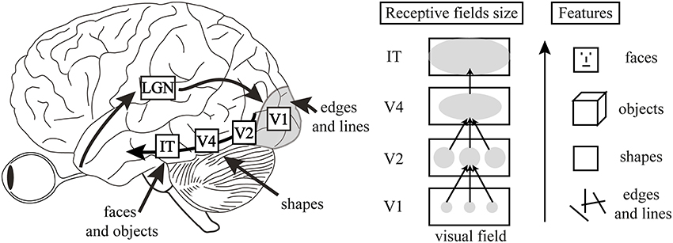
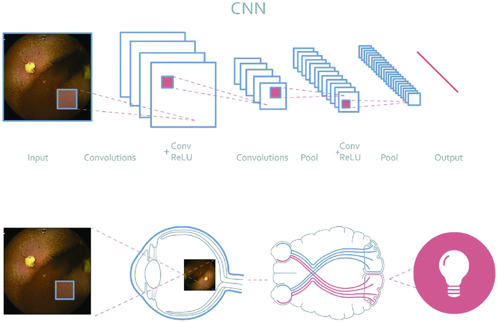
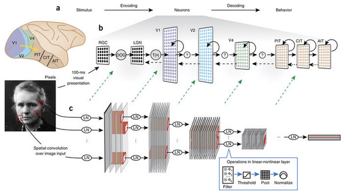

# Day_041 | CNN Vs Visual Cortex | The Famous Cat Experiment

---

## 🧠 CNN Architecture vs. The Visual Cortex

The structure of a CNN is fundamentally inspired by the functional architecture of the primate visual system, particularly the work of Nobel laureates David Hubel and Torsten Wiesel.

| Feature | Biological Visual Cortex | Artificial CNN |
| :--- | :--- | :--- |
| **Layered Processing** | Information flows from the retina $\rightarrow$ **Lateral Geniculate Nucleus (LGN)** $\rightarrow$ **Visual Cortex (V1, V2, etc.)**, with each area processing increasing complexity. | Information flows from **Input Layer** $\rightarrow$ **Conv Layers** $\rightarrow$ **Pooling Layers** $\rightarrow$ **Fully Connected Layers**, with each layer learning abstract features. |
| **Local Connectivity** | A neuron in the visual cortex only receives input from a small, localized region of the visual field (its **Receptive Field**). | A filter (kernel) only connects to a small, localized portion of the input feature map. |
| **Simple Cells (Feature Detection)** | Neurons in the primary visual cortex (V1) respond maximally to simple stimuli like **edges, lines, and orientation**. | **Convolutional Filters** learn to detect specific local features like edges, textures, and corners. |
| **Complex Cells (Tolerance)** | Neurons maintain a response even if the input feature shifts slightly within the receptive field. | **Pooling Layers** (especially Max Pooling) create **translation invariance**, making the network robust to small shifts in the input. |

While the inspiration is clear, the biological system is far more complex, involving feedback loops, parallel processing streams, and dynamic adaptation that standard CNNs do not fully replicate.

---

## 🐱 The Famous "Cat Experiment" in CNN History

The "Cat Experiment" refers to a highly influential 2012 paper from Google/Stanford researchers led by Jeff Dean and Andrew Ng, showcasing the power of **unsupervised feature learning** in massive neural networks.

### Details of the Experiment

* **Network Size:** They built a massive, **nine-layer unsupervised neural network** with over **one billion connections** (a type of autoencoder).
* **Data Size:** The network was trained on **10 million unlabeled images** (frames from YouTube videos). Crucially, the researchers did not tell the network what to look for—it had no labels.
* **Goal:** To see what features the network would **automatically learn** from the raw, uncurated internet data.

### The Key Finding

After days of training on thousands of CPU cores, the researchers probed the network's final layer neurons. They found that a specific neuron in the highest layer had learned to respond strongly and selectively to images of **cat faces**.

### Significance

This experiment was a huge early validation of the **representation learning** principle of deep learning:

1.  **Automatic Feature Extraction:** It demonstrated that very large neural networks, given massive amounts of data and computational power, can autonomously discover high-level, semantic concepts (like "a cat") without any explicit human labeling or feature engineering.
2.  **Scalability of Deep Learning:** It provided a major milestone confirming that deep learning models could scale effectively with the explosion of "Big Data" and modern hardware (like clusters of CPUs/GPUs).
3.  **Fueling the CNN Revolution:** While the 2012 ImageNet breakthrough with **AlexNet** (a supervised CNN) later that year is often cited as the *start* of the modern CNN era, the Cat Experiment established the profound *potential* of large, deep architectures to handle the unstructured chaos of the internet

## Images

