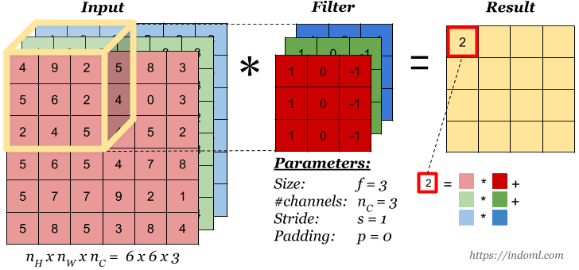
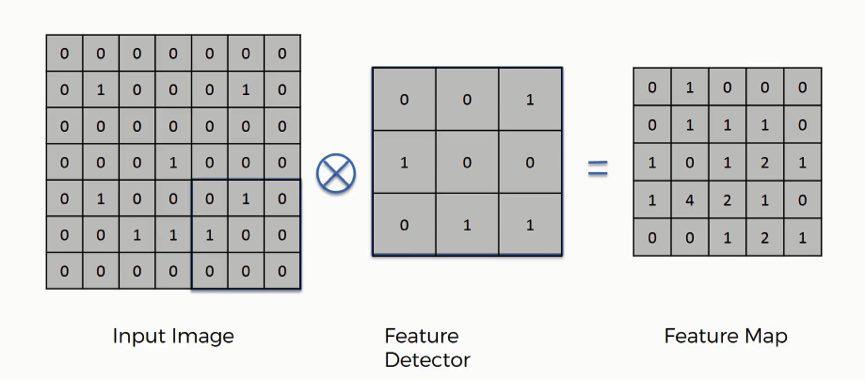
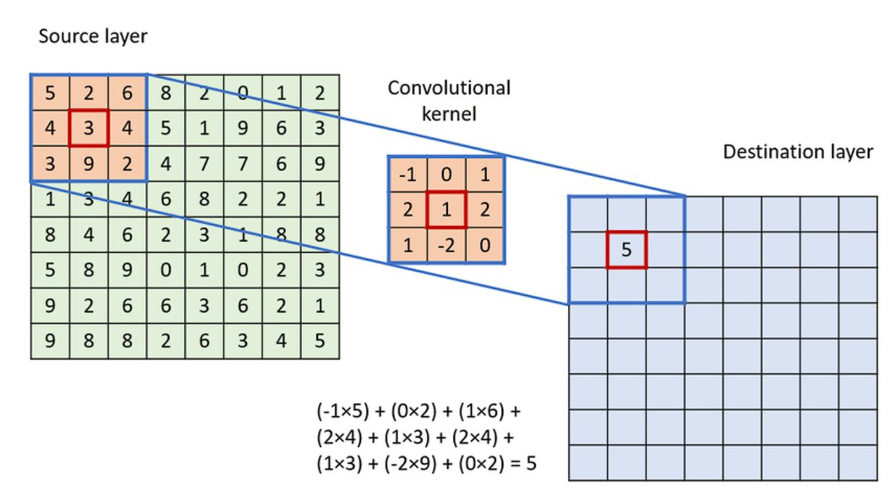
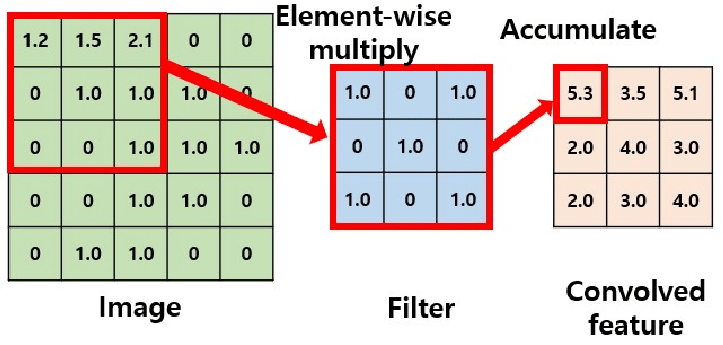

# Day_042 | Convolution Operation

The **Convolution Operation** is the fundamental mathematical mechanism of a Convolutional Neural Network (CNN). It is how the network learns to detect local patterns and features within structured grid data, most commonly images.

---

## 📐 Convolution Operation Explained

The convolution operation takes two inputs: the input feature (e.g., an image or a feature map from a previous layer) and a small, learnable matrix called the **filter** or **kernel**. The output is a single feature map that highlights where the pattern defined by the filter is present in the input.

### 1. The Inputs

* **Input Image/Feature Map ($\mathbf{I}$):** The data being processed (e.g., a $5 \times 5 \times 1$ image).
* **Filter/Kernel ($\mathbf{K}$):** A small, typically square, matrix of weights (e.g., a $3 \times 3$ matrix) that defines the pattern to be detected (e.g., a vertical edge). The values in this matrix are the **parameters the network learns**.

### 2. The Process (Sliding and Multiplication)

The operation involves four steps:

1.  **Overlay:** The filter $\mathbf{K}$ is placed over a corresponding small patch of the input $\mathbf{I}$.
2.  **Element-wise Multiplication:** Each element of the filter is multiplied by the corresponding element in the input patch.
3.  **Summation:** All the products from the multiplication are summed together.
4.  **Output:** The single resulting sum is placed as the value in the corresponding position of the output feature map $\mathbf{S}$.

This process is repeated by **sliding** the filter across the entire width and height of the input until the entire image has been covered. The stride defines the number of pixels the filter moves at each step. 

### 3. Mathematical Notation

The 2D convolution operation (often denoted by the asterisk symbol, $*$) between an input $\mathbf{I}$ and a filter $\mathbf{K}$ to produce the feature map $\mathbf{S}$ is:

$$
\mathbf{S}(i, j) = (\mathbf{I} * \mathbf{K})(i, j) = \sum_{m} \sum_{n} \mathbf{I}(i - m, j - n) \mathbf{K}(m, n)
$$

### 4. Key Intuition: Feature Detection

* **Feature Detector:** Each filter acts as a specialized feature detector. If a filter is designed (or learned) to detect vertical edges, the resulting feature map will have high positive values wherever a strong vertical edge exists in the input image and low values elsewhere.
* **Weight Sharing:** The filter weights are reused across the entire input image. This drastically reduces the number of parameters the network must learn, making CNNs highly efficient and providing **translation invariance** (the feature is detected regardless of its position).

---

## ⚙️ Convolutional Layer Hyperparameters

The behavior of the convolution operation is defined by three key hyperparameters:

* **Filter Size (Kernel Size):** The dimensions of the filter (e.g., $3 \times 3$, $5 \times 5$). Smaller filters are generally preferred in deep networks.
* **Stride:** The number of pixels the filter moves (slides) at each step. A stride of 1 means the filter moves 1 pixel at a time; a stride of 2 means it skips a pixel, resulting in a smaller output feature map.
* **Padding:** Adding zero-valued pixels around the border of the input. **"Same" padding** adds zeros to ensure the output feature map has the same spatial dimensions (width and height) as the input. **"Valid" padding** performs convolution only where the filter completely fits within the image, resulting in a smaller output.

Below is an intuitive, clear explanation of **convolution operation** in CNNs, including:

* What is an **image**
* What is a **filter/kernel**
* What is a **feature map**
* How pixel-by-pixel **convolution calculation** works (with an example)

---

## 🖼 1. **Image (Input)**

A digital image is a grid of pixel values.

For grayscale images:

* Each pixel = 0–255
* 0 = black
* 255 = white

Example image (5×5):

```ini
I =
[
 1  1  1  0  0
 0  1  1  1  0
 0  0  1  1  1
 0  0  1  1  0
 0  1  1  0  0
]
```

This is what the CNN receives as input.

---

## 🔲 2. **Filter / Kernel**

A filter (or kernel) is a small matrix that slides over the image to detect patterns.

Common sizes: **3×3**, **5×5**

Example 3×3 vertical edge detector:

```ini
K =
[
 1  0 -1
 1  0 -1
 1  0 -1
]
```

This filter detects **vertical edges**.

---

## 🌟 3. **Feature Map (Output of Convolution)**

A **feature map** is the result of sliding the filter over the image and computing:

```python
sum (image_patch × filter)
```

This highlights where the filter detects the pattern.

---

## 🧮 4. **Convolution Operation (Step-by-Step)**

We take the filter and slide it over the image one step (stride=1).
At each location:

1. Take a **3×3 patch** of the image
2. Multiply element-wise with the filter
3. Add all values
4. That sum → 1 pixel in the feature map

Let's do it.

---

## 🧩 Example: Convolution Calculation

Given:

### Image (I) 5×5

```scss
1 1 1 0 0
0 1 1 1 0
0 0 1 1 1
0 0 1 1 0
0 1 1 0 0
```

### Filter (K) 3×3

```ini
1  0 -1
1  0 -1
1  0 -1
```

### Step 1: Extract the first 3×3 image patch

Top-left patch of image:

```ini
[
1 1 1
0 1 1
0 0 1
]
```

### Step 2: Multiply element-wise (patch × filter)

```m
 1*1   + 1*0   + 1*(-1)
 0*1   + 1*0   + 1*(-1)
 0*1   + 0*0   + 1*(-1)
```

### Step 3: Compute each product

```m
 1  + 0  + (-1)
 0  + 0  + (-1)
 0  + 0  + (-1)
```

### Step 4: Add the results

```m
1 + 0 − 1 + 0 + 0 − 1 + 0 + 0 − 1 = -3
```

📌 So the **first pixel** in the feature map = **–3**

---

## 🔍 Second Example Pixel (Right Shift)

Next patch (shift one pixel to the right):

```ini
[
1 1 0
1 1 1
0 1 1
]
```

Multiply with filter:

```m
1*1 + 1*0 + 0*(-1)
1*1 + 1*0 + 1*(-1)
0*1 + 1*0 + 1*(-1)
```

Compute:

```m
1 + 0 + 0
1 + 0 − 1
0 + 0 − 1
```

Total:

```m
1 + 0 + 0 + 1 − 1 + 0 + 0 − 1 = 0
```

📌 So the **second pixel** in the feature map = **0**

---

## 🧭 Feature Map Dimensions

Formula:

```
Output size = (Input − Filter) / Stride + 1
```

For our example:

* Input = 5×5
* Filter = 3×3
* Stride = 1

Output size = (5 − 3) / 1 + 1 = **3×3 feature map**

---

## 🧾 Final 3×3 Feature Map (Conceptually)

Each value is computed like the examples above.

```css
[ -3   0   ? ]
[  ?   ?   ? ]
[  ?   ?   ? ]
```

(The “?” values are computed similarly.)

---

## 🎯 Intuition of Convolution

* The filter scans the image.
* When a pattern matches the filter → output is high.
* When the pattern is opposite → output is negative.
* When no pattern → output is near zero.

This is how CNNs detect:

* Edges
* Lines
* Corners
* Textures
* Object parts
* Whole objects

---

## ✨ Summary

| Concept           | Meaning                                                 |
| ----------------- | ------------------------------------------------------- |
| **Image**         | Grid of pixels (input to CNN)                           |
| **Filter/Kernel** | Small matrix detecting patterns                         |
| **Convolution**   | Sliding filter × image with element-wise multiplication |
| **Feature Map**   | Output highlighting detected features                   |

---

# Images




