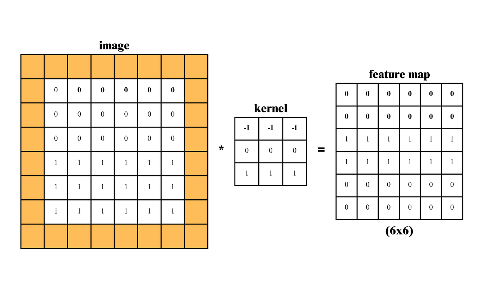
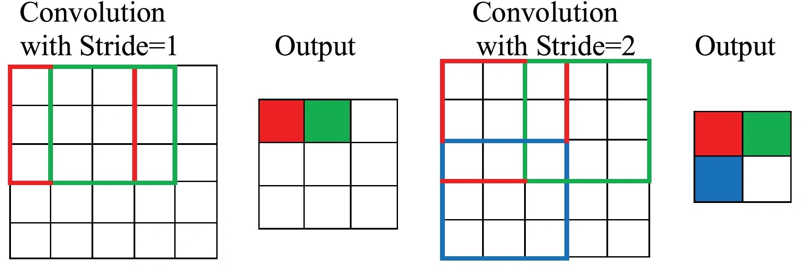
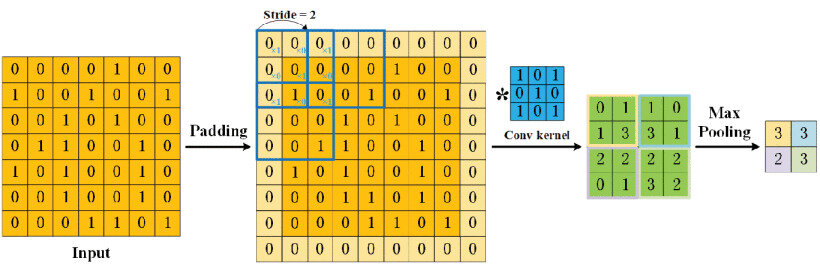

# Day_043 | Padding & Strides in CNN

Padding and Strides are critical hyperparameters in a CNN's **Convolutional Layer** that determine the spatial dimensions of the output **Feature Map**. They control how the convolutional filter interacts with the input volume.

---

## 📐 Padding (P)

**Padding** involves adding extra rows and columns of zero-valued pixels symmetrically around the border of the input image or feature map.

### Reason for Using Padding

* **Preserving Spatial Size (Input $\rightarrow$ Output):** The primary reason for using padding is to ensure that the output feature map has the **same spatial dimensions** (height $H$ and width $W$) as the input. Without padding, the output size naturally shrinks after each convolution.
* **Preventing Information Loss:** Pixels on the border of the input are covered by the filter fewer times than central pixels. Padding ensures that these border pixels are given equal weight and are included in the feature extraction process, preventing the loss of edge information.

### Types of Padding

| Type | Description |
| :--- | :--- |
| **Valid Padding (P = 0)** | No padding is added. The filter only slides over locations where it completely fits within the input boundaries. Results in an output feature map that is **smaller** than the input. |
| **Same Padding** | Zeros are added to the borders such that the output feature map size is **exactly the same** as the input size (assuming a stride of 1). |

---

## 🏃 Strides (S)

**Stride** refers to the number of pixels the convolutional filter shifts (moves) across the input volume at each step.

### Reason for Using Strides

* **Dimensionality Reduction:** The primary function of a stride $S > 1$ is to **reduce the spatial size** of the output feature map. A stride of 2 means the filter skips every other pixel, effectively downsampling the image.
* **Computational Efficiency:** Reducing the output size reduces the overall computation required for subsequent layers, accelerating the training and inference process.

---

## 📊 Feature Map Ratio Calculation

The relationship between the input size, filter size, padding, and stride determines the size of the output feature map.

Let:
* $H_{\text{in}}$: Input Height
* $W_{\text{in}}$: Input Width
* $F$: Filter Size (Kernel Size)
* $P$: Padding (number of zero pixels added to one side)
* $S$: Stride

The output height ($H_{\text{out}}$) and output width ($W_{\text{out}}$) are calculated using the following formula:

$$
H_{\text{out}} = \left\lfloor \frac{H_{\text{in}} + 2P - F}{S} \right\rfloor + 1
$$

$$
W_{\text{out}} = \left\lfloor \frac{W_{\text{in}} + 2P - F}{S} \right\rfloor + 1
$$

The ratio of the input size to the output size depends directly on $F$ and $S$.

| Condition | Resulting Output Size vs. Input Size |
| :--- | :--- |
| **Valid Padding (P=0) & S=1** | **Shrinks** (by $F-1$ pixels). |
| **Same Padding & S=1** | **Stays the Same** ($H_{\text{out}} = H_{\text{in}}$). |
| **Any Padding & S $\geq$ 2** | **Shrinks** significantly (downsampled by factor $S$). |

---

## ⭐ **1. Padding in CNN**

Padding refers to adding extra rows/columns (typically zeros) around the input before performing convolution.

## ✅ **Why Padding is Used**

### 1. **Preserve spatial size (important for deep networks)**

Without padding, the output shrinks after every convolution.
Padding (especially **same padding**) helps keep output size equal to input size.

### 2. **Better edge learning**

Padding allows filters to cover border pixels as often as central pixels, improving edge detection.

### 3. **Prevent excessive information loss**

Shrinking feature maps too quickly can cause loss of details.

---

## 📐 **Padding Effect on Feature Map Size**

For an input of size **N × N**, filter (kernel) size **F**, padding **P**, and stride **S**:

### **Output dimension:**

$$
O = \frac{N - F + 2P}{S} + 1
$$

### Common Padding Types

### 🟦 **1. Valid Padding (P = 0)**

No padding → output shrinks.

$$
O = \frac{N - F}{S} + 1
$$

### 🟩 **2. Same Padding**

Goal: **preserve height & width**

For stride **S = 1**:

$$
P = \frac{F - 1}{2}
\quad \text{(for odd filter size)}
$$

Output:

$$
O = N
$$

---

## ⭐ **2. Stride in CNN**

Stride is how many pixels the filter moves at each step.

## ✅ **Why Stride is Used**

### 1. **Downsampling**

Larger stride reduces spatial size → acts like a learnable form of pooling.

### 2. **Reduce computation**

Smaller feature maps = fewer multiplications.

### 3. **Encourage translation invariance**

With stride > 1, network focuses on broader patterns rather than pixel-level details.

---

## 📐 **Stride Effect on Feature Map Size**

Using the same general formula:

$$
O = \frac{N - F + 2P}{S} + 1
$$

### Examples

---

## 🔹 **Example 1: Same Padding, Stride = 1**

N = 32, F = 3, P = 1, S = 1

$$
O = \frac{32 - 3 + 2(1)}{1} + 1 = 32
$$

→ Output size unchanged.

---

## 🔹 **Example 2: Same Padding, Stride = 2**

N = 32, F = 3, P = 1, S = 2

$$
O = \frac{32 - 3 + 2}{2} + 1 = 16
$$

→ Feature map becomes **half** of input.

### **Feature map ratio:**

$$
\text{Output : Input} = \frac{N}{S} : 1
$$

So for stride-2 with same padding → **1/2 scaling**

---

## 🔹 **Example 3: No Padding, Stride = 1**

N = 32, F = 5, P = 0, S = 1

$$
O = 32 - 5 + 1 = 28
$$

→ Output shrinks by filter size - 1.

---

## ⭐ **Feature Map Ratio Summary**

| Condition                    | Feature Map Ratio                                 | Notes                            |
| ---------------------------- | ------------------------------------------------- | -------------------------------- |
| **Same padding, stride = 1** | 1 : 1                                             | Size preserved                   |
| **Same padding, stride = 2** | 1 : 2                                             | Downsample by factor 2           |
| **Valid padding (no pad)**   | $(\frac{N-F+1}{N})$                              | Shrinks depending on filter size |
| **General formula**          | $( \frac{O}{N} = \frac{N-F+2P}{NS} + \frac{1}{N} )$ | Most general                     |

---

## 🎯 Summary (Easy to remember)

### ✔ **Padding controls output size**

* SAME padding → same size
* VALID padding → smaller size

### ✔ **Stride controls the step of convolution**

* Stride = 1 → detailed features
* Stride = 2 → half-size downsampling

### ✔ **Feature Map Size Formula**

$$
O = \frac{N - F + 2P}{S} + 1
$$

# Images

