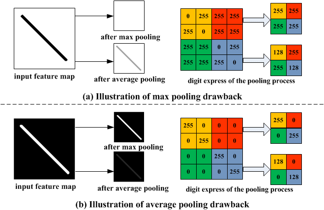
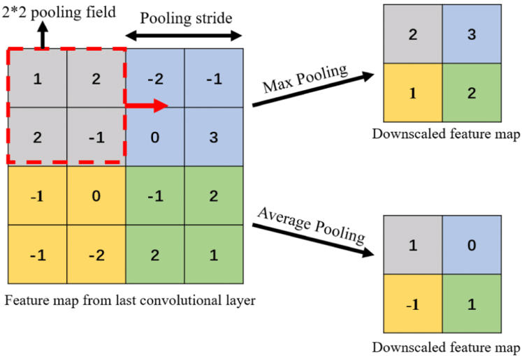
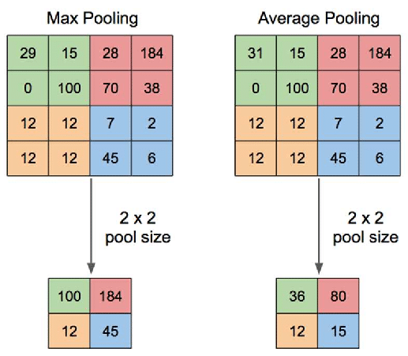

# Day_044 | ⬇️ Pooling Layer in CNN

The **Pooling Layer** (also known as a subsampling or downsampling layer) is a crucial component of a Convolutional Neural Network (CNN) that typically follows a Convolutional Layer. Its primary function is to **reduce the spatial dimensions** (width and height) of the input feature map, leading to more robust and efficient models.

---

### 1. Mechanism: Subsampling

A pooling operation is defined by a **window size (F)** and a **stride (S)**, similar to convolution, but it performs a simple aggregation function instead of a weighted sum.

1.  **Sliding Window:** A window of size $F \times F$ (e.g., $2 \times 2$) slides across the input feature map with a stride $S$ (e.g., $S=2$).
2.  **Aggregation:** Within each window, a statistical operation is applied to summarize the features.
3.  **Output:** The result is a single value in the output volume, effectively reducing the size of the feature map.

### 2. Types of Pooling

| Type | Operation | Use Case |
| :--- | :--- | :--- |
| **Max Pooling** | Selects the **maximum value** within the pooling window. | **Most Common:** Used to extract the most dominant feature presence within a local region. |
| **Average Pooling** | Calculates the **average value** within the pooling window. | Historically used more often; sometimes preferred for reducing deep feature maps, as it provides smoother regularization. |
| **Min Pooling** | Selects the **minimum value** within the pooling window. | Rarely used, as negative or minimum values often indicate the *absence* of a feature. |

### 3. Advantages and Benefits

The Pooling Layer provides several key benefits:

* **Dimensionality Reduction:** It reduces the number of parameters and the computational load for subsequent layers, which helps to speed up training.
* **Reduced Overfitting:** Fewer parameters mean less complexity, which acts as a form of **regularization** to prevent the model from overfitting the training data.
* **Translation Invariance:** This is the most critical benefit. By summarizing a small region (e.g., a $2 \times 2$ window) into a single value, the network becomes less sensitive to the exact location of a feature. If the feature (e.g., a diagonal edge) moves slightly within that window, the output maximum will likely remain the same. This makes the features more **robust to minor shifts or distortions** in the input image. 

### 4. Output Feature Map Size

The output dimensions of a Pooling Layer are calculated using the same formula as the Convolutional Layer (with $P=0$ being the typical setting for pooling):

$$
H_{\text{out}} = \left\lfloor \frac{H_{\text{in}} - F}{S} \right\rfloor + 1
$$

$$
W_{\text{out}} = \left\lfloor \frac{W_{\text{in}} - F}{S} \right\rfloor + 1
$$

A common configuration is $F=2$ and $S=2$, which results in a feature map that is exactly **half the width and half the height** (a 4x reduction in total area).

Here is a clear and complete explanation of **Pooling Layers in CNNs**, including **purpose, types, formulas, effects on feature maps, advantages, examples, and intuition**.

---

## ⭐ **Pooling Layer in CNN**

A **pooling layer** reduces the **spatial dimensions** (height and width) of feature maps while retaining the most important information.

Pooling helps make the network **faster**, **more robust**, and **less sensitive** to small image variations.

---

## 🔥 **Why Pooling Is Used**

Pooling has several key functions:

### **1. Downsampling / Dimensionality Reduction**

Reduces the size of feature maps → less computation, less memory.

### **2. Prevent Overfitting**

By compressing representations, pooling forces the network to learn more general and invariant features.

### **3. Translation Invariance**

Small shifts or distortions in the input image do not change the pooled output significantly.

### **4. Feature Consolidation**

Pooling picks the most important or representative value in a region (max/average).

---

## ⭐ **Types of Pooling**

### ## **1. Max Pooling (Most Common)**

Takes the **maximum value** within a window.

* Captures **strong activations**
* Great for detecting dominant features (edges, textures)

Example:
Pooling window 2×2 over feature map → pick the max value.

---

### ## **2. Average Pooling**

Takes the **average value** of the window.

* Smooths the feature map
* Preserves overall texture rather than specific features

Used less in modern CNNs than max pooling.

---

### ## **3. Global Pooling (Global Max / Global Average Pooling)**

Window size = entire feature map
Output = **1 number per channel**

* Removes spatial dimensions entirely
* Replaces fully connected layers in modern architectures (ResNet, MobileNet)

Global Average Pooling (GAP) is very popular since:

* No parameters
* Reduces overfitting
* Works great for classification

---

## 📐 **Pooling Output Size Formula**

For an input size **N**, filter size **F**, padding **P**, stride **S**:

$$
O = \frac{N - F + 2P}{S} + 1
$$

Same formula as convolution, but **pooling has no weights** (no learnable parameters).

### Simplest case (commonly used):

* P = 0
* Stride = F

Example: 2×2 pooling with stride 2:

$$
O = \frac{N}{2}
$$

→ Feature map is reduced to **half height and width**.

---

## 🔹 **Example: Max Pooling**

Input 4×4
Filter = 2×2
Stride = 2
Padding = 0

| 1 | 3 | 2 | 1 |
| - | - | - | - |
| 4 | 6 | 5 | 2 |
| 1 | 0 | 7 | 8 |
| 3 | 2 | 4 | 9 |

Pooling regions and outputs:

* max(1,3,4,6) = 6
* max(2,1,5,2) = 5
* max(1,0,3,2) = 3
* max(7,8,4,9) = 9

Output: 2×2

---

## ⭐ **Feature Map Ratio**

### For F = 2, S = 2 (most common):

$$
\text{Output Size} = \frac{N}{2} \quad \Rightarrow \quad \text{Feature Map Ratio} = 1 : 2
$$

### For F = 3, S = 2:

$$
\text{Output Size} = \frac{N - 1}{2}
$$

### For Global Pooling:

$$
\text{Output Size} = 1
$$

---

## 🔥 **Advantages of Pooling**

### ✔ Faster training

Feature maps shrink → fewer computations in next layers.

### ✔ Reduces parameters (especially with GAP)

### ✔ Robust to noise and translation

Pooling responds to patterns, not exact pixel positions.

### ✔ Prevents overfitting

---

## 🛑 Do Modern CNNs Still Use Pooling?

Yes and no:

### ✔ Classic CNNs (LeNet, AlexNet, VGG)

Use MaxPooling heavily.

### ✔ Modern CNNs (ResNet, MobileNet, EfficientNet)

Often **replace pooling with strided convolution** for better learning.

### ✔ Global Average Pooling is still widely used

It replaces large fully connected layers.

---

## 🎯 Summary

* Pooling downsamples feature maps.
* Most common: **Max Pooling 2×2, stride 2**.
* Reduces spatial size → faster + less overfitting.
* Increases translation invariance.
* Output size formula:

$$
O = \frac{N - F + 2P}{S} + 1
$$

---

# Images

