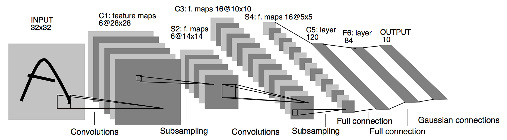
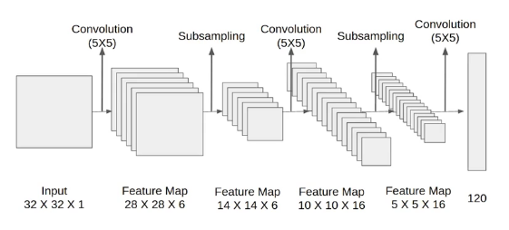

# Day_045 | 🖼️ General CNN Architecture | 🏛️ LeNet-5 Architecture

A typical **Convolutional Neural Network (CNN)** architecture is built as a sequence of three main types of layers, stacked to progressively extract complex features from the input data (usually an image). The architecture generally follows a pattern of alternating feature extraction layers with downsampling layers, followed by a final classification section.

### 1. Feature Learning Blocks (Convolutional Base)

The initial layers are responsible for learning hierarchical representations of the input data.

* **Convolutional Layer (Conv Layer):** This is the core building block. It applies a set of **learnable filters (kernels)** across the input volume to create **feature maps**. Each filter learns to detect a specific local feature, like an edge or a corner.
* **Activation Layer:** A non-linear activation function, usually **ReLU**, is applied element-wise to the output of the Conv Layer. This introduces the non-linearity necessary for the network to model complex functions.
* **Pooling Layer:** This layer, typically **Max Pooling**, periodically reduces the spatial dimensions (width and height) of the feature maps. This reduces computational load and introduces **translation invariance** (making the feature detection robust to small shifts).

These three layers (Conv $\rightarrow$ Activation $\rightarrow$ Pooling) are often repeated multiple times, with the number of filters generally increasing in deeper layers (e.g., 32, 64, 128) as the spatial dimensions decrease.

### 2. Classification Block (Dense Head)

After the feature learning blocks have extracted high-level, semantic features, the data is prepared for final classification.

* **Flattening:** The 3D output of the last pooling layer is converted into a **1D vector** (flattened).
* **Fully Connected (FC) Layer:** One or more fully connected layers (like in a standard MLP) are used for high-level reasoning. Each neuron in these layers connects to every neuron in the previous layer.
* **Output Layer:** The final FC layer uses an activation function appropriate for the task:
    * **Softmax** for multi-class classification (outputs a probability distribution).
    * **Sigmoid** for binary classification.

---

## 🏛️ LeNet-5 Architecture (1998)

**LeNet-5** is a pioneering CNN architecture developed by Yann LeCun and colleagues in 1998, primarily for recognizing handwritten digits (like those found in checks and documents). It is the archetypal example of the general CNN structure and laid the groundwork for modern computer vision.

The architecture is typically described using its input, 5 learnable layers (2 Conv, 2 Subsampling/Pooling, 1 FC), and 1 final classification layer.

### LeNet-5 Layer Breakdown

LeNet-5 processed single-channel (grayscale) images and had the following structure:

| Layer | Type | Filter/Input Size | Output Shape | Parameters | Function |
| :--- | :--- | :--- | :--- | :--- | :--- |
| **Input** | Raw Image | N/A | $32 \times 32 \times 1$ | 0 | Input image (extended from $28 \times 28$ for processing). |
| **C1** | **Convolutional** | $5 \times 5$ filter, 6 maps, Stride=1 | $28 \times 28 \times 6$ | 156 | Extracts basic features (e.g., edges). |
| **S2** | **Subsampling/Avg Pooling** | $2 \times 2$ window, Stride=2 | $14 \times 14 \times 6$ | 12 | Downsamples the feature maps by a factor of 4. |
| **C3** | **Convolutional** | $5 \times 5$ filter, 16 maps, Stride=1 | $10 \times 10 \times 16$ | 1560 | Learns more complex, combined features. |
| **S4** | **Subsampling/Avg Pooling** | $2 \times 2$ window, Stride=2 | $5 \times 5 \times 16$ | 16 | Further downsamples the features. |
| **C5** | **Convolutional** | $5 \times 5$ filter, 120 maps, Stride=1 | $1 \times 1 \times 120$ | 48,120 | Converts the feature maps into a 120-unit feature vector (acts as the first FC layer). |
| **F6** | **Fully Connected** | Input 120, Output 84 | $84$ | 10,248 | Standard dense layer for final feature mapping. |
| **Output** | **Fully Connected** | Input 84, Output 10 (Softmax) | $10$ | 850 | Final layer for classification across 10 classes (digits 0-9). |

### Key Features of LeNet-5

* **Alternating Layers:** It established the pattern of stacking Conv layers and Pooling (Subsampling) layers.
* **Local Connectivity:** Used $5 \times 5$ filters, focusing on local patches.
* **Non-Linearity:** Used the **Tanh** activation function (though $\text{sigmoid} / \tanh$ were common then, while ReLU is standard now).
* **Parameter Reduction:** The use of shared weights in C1/C3 and subsampling in S2/S4 significantly reduced the number of trainable parameters compared to a fully connected network.


Below is a **clear, structured explanation** of:

1. **General CNN Architecture**
2. **LeNet-5 Architecture (with layer-by-layer details)**

---

## ⭐ **1. General CNN Architecture**

A standard Convolutional Neural Network (CNN) consists of a sequence of layers that transform input images into class predictions.

---

## 🔷 **Typical CNN Pipeline**

### **1. Input Layer**

* Image (e.g., 32×32×3 for RGB)
* Normalization may be applied

---

### **2. Convolutional Layers**

* Apply learnable filters (kernels)
* Capture spatial features: edges → textures → shapes
* Output: Feature Maps
* Parameters:

  * Filter size (e.g., 3×3)
  * Number of filters
  * Stride
  * Padding

---

### **3. Activation Function**

Common: **ReLU**

* Adds non-linearity
* Helps deeper networks learn complex patterns

---

### **4. Pooling Layers**

Reduce spatial dimension

* **Max pooling (2×2)** most common
* Provides translation invariance
* Reduces computation

---

### **5. Repetition of Conv + ReLU + Pool**

Deep networks stack many blocks to learn hierarchical features.

---

### **6. Fully Connected Layers (FC)**

* Process flattened feature maps
* Make classification decisions
* Similar to traditional neural networks

---

### **7. Output Layer**

* Usually a **Softmax** layer for classification
* Outputs probability distribution over classes

---

### ⭐ **General CNN Architecture Summary**

```
Input → [Conv → ReLU → Pool]*N → Flatten → FC Layers → Softmax Output
```

---

## ⭐ **2. LeNet-5 Architecture**

LeNet-5 is a **classic CNN** created by Yann LeCun in 1998 for handwritten digit recognition (MNIST).

* Input: **32 × 32 grayscale image**
* Total layers: **7 (trainable)**
* Activation: **Sigmoid / Tanh** (not ReLU in original paper)

---

## 🔥 **LeNet-5 Architecture (Layer-by-Layer)**

## 🎯 **Input**

* 32 × 32 × 1 image
* Example: MNIST digit padded from 28×28 to 32×32

---

## 🔹 **Layer 1: C1 — Convolution**

* 6 filters of size **5×5**
* Stride = 1
* No padding
* Output size:

$$
(32 - 5 + 1) = 28
$$

**Output: 28 × 28 × 6**

---

## 🔹 **Layer 2: S2 — Subsampling (Avg Pooling)**

* 2×2 average pooling
* Stride = 2
* Each of the 6 maps is pooled

**Output: 14 × 14 × 6**

---

## 🔹 **Layer 3: C3 — Convolution**

* 16 filters of size **5×5**
* Not fully connected: each output map connects to selected input maps
* Output size:

$$
(14 - 5 + 1) = 10
$$

**Output: 10 × 10 × 16**

---

## 🔹 **Layer 4: S4 — Subsampling**

* 2×2 pooling
* Stride = 2

**Output: 5 × 5 × 16**

---

## 🔹 **Layer 5: C5 — Convolution**

* 120 filters of size **5×5**
* Each filter covers whole 5×5 spatial area
* Acts like an FC layer
* Output:

$$
(5 - 5 + 1) = 1
$$

**Output: 1 × 1 × 120**
(Flatten: 120-dim vector)

---

## 🔹 **Layer 6: F6 — Fully Connected**

* 84 neurons
* Uses **tanh** activation
* Inspired by shapes in biological visual cortex

**Output: 84**

---

## 🔹 **Layer 7: Output Layer**

* 10 neurons (digits 0–9)
* Uses **Euclidean RBF or Softmax** depending on implementation

**Output: 10-class vector**

---

## ⭐ **LeNet-5 Architecture Summary Table**

| Layer  | Type            | Parameters        | Output Size |
| ------ | --------------- | ----------------- | ----------- |
| Input  | Image           | 32×32×1           | 32×32×1     |
| C1     | Conv            | 6×(5×5) kernels   | 28×28×6     |
| S2     | Avg Pool        | 2×2, stride 2     | 14×14×6     |
| C3     | Conv            | 16×(5×5) kernels  | 10×10×16    |
| S4     | Avg Pool        | 2×2, stride 2     | 5×5×16      |
| C5     | Conv            | 120×(5×5) kernels | 1×1×120     |
| F6     | Fully Connected | 120 → 84          | 84          |
| Output | FC              | 84 → 10           | 10 classes  |

---

## ⭐ **LeNet-5 Architecture Diagram (Text Format)**

```scss
Input (32×32×1)
      ↓
C1: Conv 5×5×6  → 28×28×6
      ↓
S2: Pool 2×2    → 14×14×6
      ↓
C3: Conv 5×5×16 → 10×10×16
      ↓
S4: Pool 2×2    → 5×5×16
      ↓
C5: Conv 5×5×120 → 1×1×120
      ↓
F6: FC 84
      ↓
Output: 10 classes
```

---

## 🎯 Final Summary

## ⭐ **General CNN Architecture**

```
Input → Conv → Activation → Pool → (repeat) → FC → Softmax
```

## ⭐ **LeNet-5 Architecture (1998)**

* Input: **32×32**
* C1: 6@28×28
* S2: 6@14×14
* C3: 16@10×10
* S4: 16@5×5
* C5: 120
* F6: 84
* Output: 10

---

## LeNET-5 CNN Architecture
> Keras

```python
import tensorflow as tf
from tensorflow.keras import layers, models

# ---------------------------
# LeNet-5 Architecture
# ---------------------------
def LeNet5(input_shape=(32, 32, 1), num_classes=10):

    model = models.Sequential()

    # C1: Convolution 5×5, 6 filters
    model.add(layers.Conv2D(filters=6,
                            kernel_size=(5, 5),
                            activation='tanh',
                            input_shape=input_shape))
    
    # S2: Average Pooling 2×2
    model.add(layers.AveragePooling2D(pool_size=(2, 2)))
    
    # C3: Convolution 5×5, 16 filters
    model.add(layers.Conv2D(filters=16,
                            kernel_size=(5, 5),
                            activation='tanh'))
    
    # S4: Average Pooling 2×2
    model.add(layers.AveragePooling2D(pool_size=(2, 2)))
    
    # Flatten output from 5×5×16 → 400
    model.add(layers.Flatten())
    
    # C5: Fully Connected (original paper uses conv, but FC equivalent)
    model.add(layers.Dense(120, activation='tanh'))
    
    # F6: Fully Connected
    model.add(layers.Dense(84, activation='tanh'))
    
    # Output Layer
    model.add(layers.Dense(num_classes, activation='softmax'))

    return model


# ---------------------------
# Build and compile model
# ---------------------------
model = LeNet5()
model.compile(optimizer='adam',
              loss='sparse_categorical_crossentropy',
              metrics=['accuracy'])

model.summary()

```

## General CNN Architecture
> Keras

```python
import tensorflow as tf
from tensorflow.keras import layers, models

def GeneralCNN(input_shape=(32, 32, 3), num_classes=10):
    model = models.Sequential()

    # Convolution Block 1
    model.add(layers.Conv2D(32, (3, 3), activation='relu', padding='same', input_shape=input_shape))
    model.add(layers.MaxPooling2D((2, 2)))

    # Convolution Block 2
    model.add(layers.Conv2D(64, (3, 3), activation='relu', padding='same'))
    model.add(layers.MaxPooling2D((2, 2)))

    # Convolution Block 3
    model.add(layers.Conv2D(128, (3, 3), activation='relu', padding='same'))
    model.add(layers.MaxPooling2D((2, 2)))

    model.add(layers.Flatten())
    model.add(layers.Dense(128, activation='relu'))
    model.add(layers.Dense(num_classes, activation='softmax'))

    return model

model = GeneralCNN()
model.summary()

```

# Images



