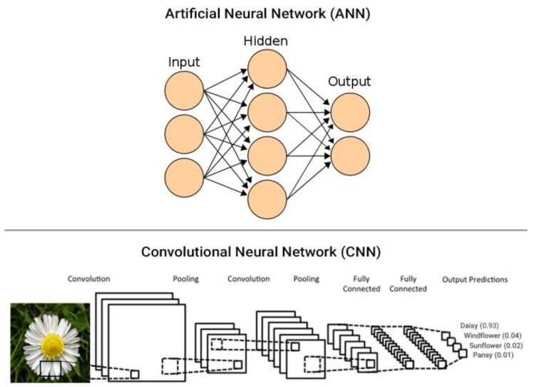

# Day_046 | ANN vs CNN

## 🤖 Comparing ANNs and CNNs

Both **Artificial Neural Networks (ANNs)**, often referring to Multi-Layer Perceptrons (MLPs), and **Convolutional Neural Networks (CNNs)** are types of deep learning models. The main distinction lies in their architecture and the type of data they are designed to process efficiently.

---

## Similarities (The Core Foundation)

CNNs are fundamentally a specialized type of ANN. They share the following core principles:

* **Neuron and Layer Structure:** Both are composed of interconnected **layers** of computational units (**neurons**), which take inputs, apply weights and biases, and produce an output via an **activation function** (e.g., ReLU).
* **Learning Mechanism:** Both models learn through the **Backpropagation** algorithm, which uses the **Gradient Descent** optimization to minimize a **Loss Function** (e.g., Cross-Entropy) by adjusting the weights and biases.
* **Universal Function Approximation:** Both are theoretically capable of approximating any continuous function, given enough data and complexity.
* **Feedforward Flow:** Both process information unidirectionally, moving from the input layer through hidden layers to the output layer (the **Forward Propagation** process).

---

## Differences (Specialization and Architecture)

The architectural differences allow CNNs to excel at processing spatial data (like images) in a way that standard ANNs cannot.

| Feature | Artificial Neural Network (ANN/MLP) | Convolutional Neural Network (CNN) |
| :--- | :--- | :--- |
| **Primary Use Case** | Tabular data, time series, simple classification/regression. | **Image, video, audio processing** (data with spatial/grid structure). |
| **Input Structure** | 1D vector (input must be **flattened**). | N-D arrays (e.g., $H \times W \times C$ for images), preserving spatial structure. |
| **Main Hidden Layer** | **Fully Connected (Dense) Layers** where every neuron connects to every neuron in the next layer. | **Convolutional Layers** and **Pooling Layers**. |
| **Weight Sharing** | **No weight sharing.** Every connection has a unique weight. | **Extensive weight sharing.** The same filter (weights) is applied across the entire input volume. |
| **Parameters** | Very **high** number of parameters, making them prone to overfitting on image data. | Significantly **fewer** parameters due to weight sharing and pooling. |
| **Invariance** | **Lacks** spatial invariance; highly sensitive to shifts or translations of features in the input. | Achieves **translation invariance** (robust to shifts) due to pooling and shared weights. |
| **Data Requirement** | Effective with moderate to large datasets. | Requires large datasets to train complex image features effectively. |

### Summary of Key Distinctions

1.  **Connectivity:** ANNs use **full connectivity**, while CNNs use **local connectivity** via the small convolutional filter.
2.  **Efficiency:** CNNs are vastly more **parameter-efficient** and better at handling high-dimensional image inputs due to **weight sharing**.
3.  **Hierarchy:** CNNs are designed to learn a natural **hierarchy of features** (edges $\rightarrow$ shapes $\rightarrow$ objects), which ANNs can only do poorly if the input is flattened.

---

# Images
