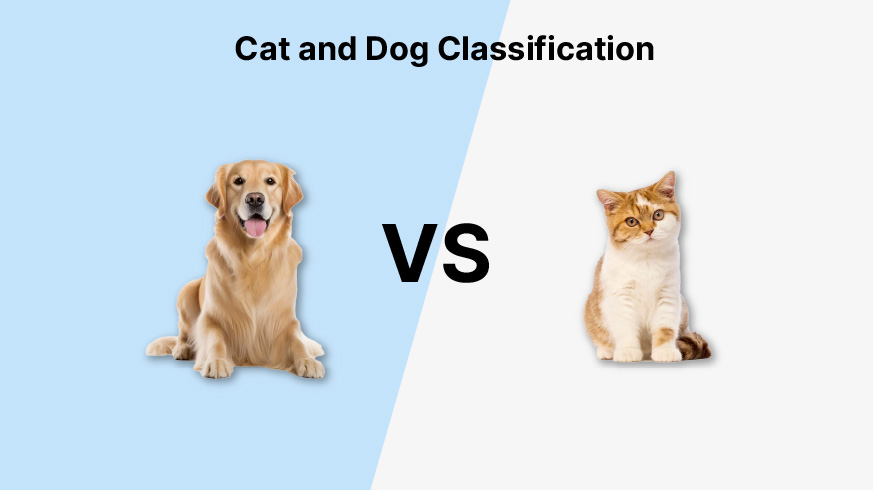

# Day_049 | 🐈🐕 Cat vs. Dog Image Classification Project Plan

The goal is to build a CNN that can accurately determine whether a given image contains a cat or a dog. This is a **Binary Classification** problem.

### 1. Data Acquisition and Preprocessing

The success of the project starts with handling the image data correctly.

* **Dataset:** Use the widely available "Cats vs. Dogs" dataset from platforms like Kaggle, which typically contains thousands of labeled images for both classes.
* **Data Structure:** Organize the data into separate directories for training, validation, and testing (e.g., `train/cats`, `train/dogs`, etc.).
* **Preprocessing Steps:**
    * **Resizing:** All images must be resized to a uniform dimension (e.g., **$150 \times 150$** pixels) to fit the CNN input layer.
    * **Scaling/Normalization:** Convert pixel values from the range $[0, 255]$ to the range **$[0, 1]$** by dividing by 255. This aids in faster and more stable training.
    * **Data Augmentation:** Apply random transformations (rotation, shifting, flipping, zooming) to the training images to artificially increase the size and diversity of the dataset and **prevent overfitting**.

---

### 2. Model Architecture: Convolutional Neural Network (CNN)

A sequential CNN is the ideal architecture.

#### A. The Feature Extraction Base

This part learns spatial hierarchies, starting from simple edges to complex shapes.

* **Input Layer:** Expects the input shape (e.g., $150, 150, 3$).
* **Convolutional Layers:** Stack several blocks of **Conv2D** layers with increasing filter counts (e.g., 32, 64, 128). Use a small kernel size (e.g., $3 \times 3$) and the **ReLU** activation function.
* **Pooling Layers:** Follow each Conv block with a **MaxPooling2D** layer (e.g., $2 \times 2$) to reduce dimensionality and achieve **translation invariance**.
* **Regularization:** Incorporate **Dropout** layers after the convolution blocks or before the final dense layers to prevent co-adaptation and overfitting.

#### B. The Classification Head (Dense Layers)

This part interprets the high-level features for the final decision.

* **Flatten Layer:** Converts the 3D output of the last pooling layer into a 1D vector.
* **Dense Hidden Layer:** One or more fully connected layers (e.g., 512 units) with ReLU activation.
* **Output Layer:** A final **Dense layer** with **1 unit** and the **Sigmoid** activation function.

---

### 3. Model Compilation and Training

#### A. Compilation Settings

| Setting | Choice | Reason |
| :--- | :--- | :--- |
| **Loss Function** | **Binary Cross-Entropy** | Standard loss for binary classification problems where the output is a probability (Sigmoid). |
| **Optimizer** | **Adam** (with default learning rate $10^{-3}$) | Generally provides fast, stable convergence without extensive hyperparameter tuning. |
| **Metrics** | **Accuracy** | The primary metric for balanced classification datasets. |

#### B. Training Best Practices

* **Early Stopping:** Monitor the **validation loss** and stop training when it stops improving, preventing overfitting.
* **Fit Generator:** Use Keras's `ImageDataGenerator` to efficiently feed batches of augmented image data to the model during training.

---

### 4. Evaluation and Prediction

* **Evaluation:** Evaluate the final model on the independent **test set** to confirm its generalization ability, reporting **accuracy** and the **loss value**.
* **Prediction:** For a new image, the model will output a probability $P$.
    * If $P > 0.5$: Predict **Dog**.
    * If $P \le 0.5$: Predict **Cat**.

✔ Dataset preparation\
✔ Train/validation split\
✔ Model architecture (Simple CNN / Transfer Learning)\
✔ Training code\
✔ Evaluation\
✔ Prediction on new images\
✔ Folder structure

This is a **full end-to-end TensorFlow/Keras project** you can run anywhere (Jupyter/Colab).

---

## 🐱🐶 **Cat vs Dog Image Classification Project (TensorFlow / Keras)**

We will use the **Cat & Dog dataset** (from Kaggle or TF datasets).
The code works with any folder structure:

```cs
dataset/
    train/
        cats/
        dogs/
    validation/
        cats/
        dogs/
```

If using Kaggle dataset, extract into this format.

---

## ⭐ Step 1: Import Libraries

```python
import tensorflow as tf
from tensorflow.keras.preprocessing.image import ImageDataGenerator
from tensorflow.keras import layers, models
import matplotlib.pyplot as plt
```

---

## ⭐ Step 2: Set Paths

```python
train_dir = "/content/dataset/train"
val_dir = "/content/dataset/validation"
```

---

## ⭐ Step 3: Data Preprocessing + Augmentation

```python
train_datagen = ImageDataGenerator(
    rescale=1./255,
    rotation_range=20,
    width_shift_range=0.1,
    height_shift_range=0.1,
    shear_range=0.2,
    zoom_range=0.2,
    horizontal_flip=True
)

val_datagen = ImageDataGenerator(rescale=1./255)

train_gen = train_datagen.flow_from_directory(
    train_dir,
    target_size=(150, 150),
    batch_size=32,
    class_mode='binary'
)

val_gen = val_datagen.flow_from_directory(
    val_dir,
    target_size=(150, 150),
    batch_size=32,
    class_mode='binary'
)
```

---

## ⭐ Step 4: Build a CNN Model (Simple and Effective)

```python
model = models.Sequential([
    layers.Conv2D(32, (3,3), activation='relu', input_shape=(150,150,3)),
    layers.MaxPooling2D(2,2),

    layers.Conv2D(64, (3,3), activation='relu'),
    layers.MaxPooling2D(2,2),

    layers.Conv2D(128, (3,3), activation='relu'),
    layers.MaxPooling2D(2,2),

    layers.Conv2D(128, (3,3), activation='relu'),
    layers.MaxPooling2D(2,2),

    layers.Flatten(),
    layers.Dense(512, activation='relu'),
    layers.Dense(1, activation='sigmoid')
])
```

---

## ⭐ Step 5: Compile the Model

```python
model.compile(
    loss='binary_crossentropy',
    optimizer=tf.keras.optimizers.Adam(1e-4),
    metrics=['accuracy']
)
model.summary()
```

---

## ⭐ Step 6: Train the Model

```python
history = model.fit(
    train_gen,
    epochs=15,
    validation_data=val_gen
)
```

---

## ⭐ Step 7: Plot Accuracy and Loss

```python
plt.plot(history.history['accuracy'], label='Train Acc')
plt.plot(history.history['val_accuracy'], label='Val Acc')
plt.legend()
plt.show()

plt.plot(history.history['loss'], label='Train Loss')
plt.plot(history.history['val_loss'], label='Val Loss')
plt.legend()
plt.show()
```

---

## ⭐ Step 8: Evaluate on Validation Set

```python
loss, acc = model.evaluate(val_gen)
print(f"Validation Accuracy: {acc*100:.2f}%")
```

---

## ⭐ Step 9: Predict on a New Image

```python
import numpy as np
from tensorflow.keras.preprocessing import image

def predict_image(img_path):
    img = image.load_img(img_path, target_size=(150, 150))
    img_array = image.img_to_array(img)/255.0
    img_array = np.expand_dims(img_array, axis=0)

    prediction = model.predict(img_array)[0][0]

    if prediction < 0.5:
        print("Prediction: 🐱 Cat")
    else:
        print("Prediction: 🐶 Dog")

predict_image("/content/my_image.jpg")
```

---

## ⭐ OPTIONAL: Transfer Learning (Much Higher Accuracy)

Using **VGG16**, **ResNet50**, or **MobileNetV2** drastically improves accuracy.

Example with **MobileNetV2**:

```python
base_model = tf.keras.applications.MobileNetV2(
    input_shape=(224,224,3),
    include_top=False,
    weights="imagenet"
)
base_model.trainable = False  # Freeze feature extractor

model = models.Sequential([
    base_model,
    layers.GlobalAveragePooling2D(),
    layers.Dense(1, activation='sigmoid')
])

model.compile(
    loss="binary_crossentropy",
    optimizer="adam",
    metrics=["accuracy"]
)
```

Train:

```python
history = model.fit(
    train_gen,
    epochs=10,
    validation_data=val_gen
)
```

Transfer learning usually gives **>95% accuracy**.

---

## ⭐ Folder Structure (Required)

```css
dataset/
    train/
        cats/
            cat001.jpg
            cat002.jpg
        dogs/
            dog001.jpg
            dog002.jpg

    validation/
        cats/
        dogs/
```

---

## ⭐ Project Summary

✔ CNN architecture created

✔ Data loaded + augmented

✔ Model trained & validated

✔ Accuracy/loss plotted

✔ New image prediction code

✔ Transfer learning version included

---

# Images

