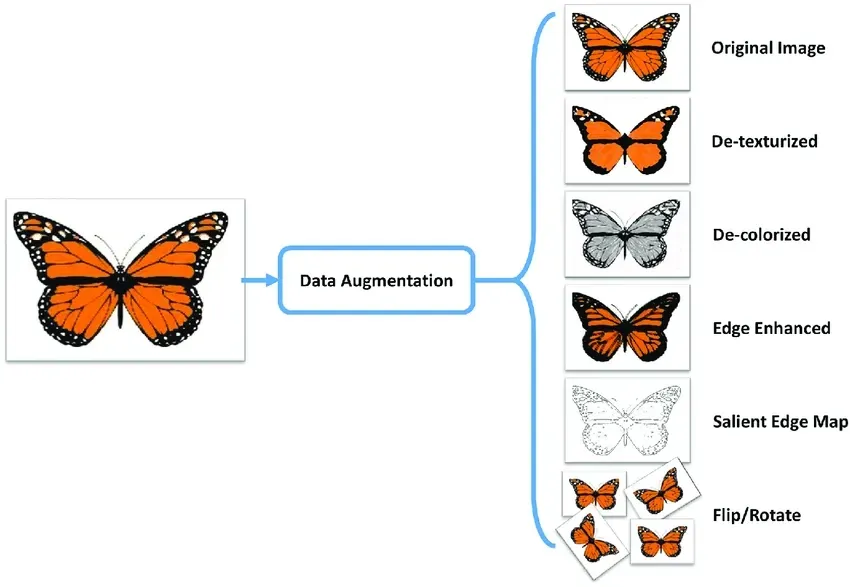
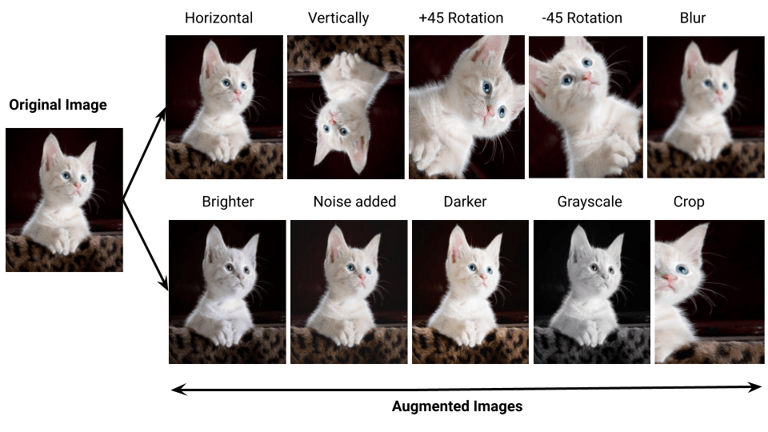

# Day_050 | Data Augmentation in Deep Learning


## 🧬 Data Augmentation in Deep Learning

**Data Augmentation** is a powerful regularization technique used in deep learning to artificially increase the size and diversity of a training dataset. It involves creating new training samples by applying various, realistic transformations to the existing data, primarily images.

This process is critical for improving a model's **generalization** ability and reducing **overfitting**, especially when the original dataset is small.

---

## 🖼️ How Data Augmentation Works

For image data, augmentation works by generating plausible variations of the original image without changing its class label.

* **Mechanism:** When a model sees many varied versions of the same core object (e.g., a cat rotated, zoomed, and flipped), it learns to recognize the fundamental features of the object rather than memorizing the specific pose or orientation of the original training samples.
* **Result:** The model becomes more **robust** and **invariant** to minor changes and distortions in the input data.

### Common Image Augmentation Techniques

| Technique | Transformation | Purpose |
| :--- | :--- | :--- |
| **Flipping** | Horizontal or vertical reflection. | Adds rotational invariance. |
| **Rotation** | Rotating the image by a random degree (e.g., $\pm 15^\circ$). | Improves tolerance to real-world object orientation changes. |
| **Translation/Shifting** | Shifting the image content left, right, up, or down. | Forces the network to look beyond the center of the image and improves **translation invariance**. |
| **Zooming** | Randomly zooming in or out of the image content. | Ensures the network recognizes objects regardless of their size in the frame. |
| **Shearing** | Distorting the image along an axis. | Adds perspective robustness. |
| **Color Jitter** | Randomly changing brightness, contrast, and saturation. | Improves robustness to variations in lighting and camera settings. |

---

## 🎯 Advantages in Deep Learning

1.  **Reduces Overfitting:** By increasing the diversity of the training set, augmentation prevents the model from simply memorizing the training examples, which is the definition of overfitting.
2.  **Improves Generalization:** The model learns to recognize the core object features under various conditions, making it more accurate on unseen, real-world data.
3.  **Cost-Effective:** It is much cheaper and faster to generate augmented data than to collect and manually label thousands of new, original samples.
4.  **Data Efficiency:** It maximizes the utility of a limited dataset, which is common in specialized domains (e.g., medical imaging).

### Implementation Note

It is crucial that augmentation is applied **only to the training data**, typically right before it is fed to the model. The validation and test sets must remain untouched to ensure an unbiased evaluation of the model's performance on realistic, untransformed data. Frameworks like Keras and PyTorch provide built-in data generators that perform these transformations on-the-fly, reducing memory overhead.


Data augmentation in **deep learning** refers to techniques used to artificially expand a training dataset by creating modified versions of existing data. It's especially important when training data is limited, as it helps models generalize better, reduces overfitting, and improves performance.

Below is a clear, comprehensive explanation.

---

## **What Is Data Augmentation?**

Data augmentation applies **label-preserving transformations** to input samples—meaning the transformed data still belongs to the same class. These transformations simulate real-world variations, helping the model become more robust.

---

## **Why Use Data Augmentation?**

### ✔️ **Prevent overfitting**

The model sees more diverse samples and doesn't memorize the training set.

### ✔️ **Improve generalization**

The model learns to handle variations like rotation, noise, lighting, etc.

### ✔️ **Increase dataset size**

Large datasets lead to better, more stable training.

### ✔️ **Improve model robustness**

It trains the model to perform well in real-world conditions.

---

## **Common Data Augmentation Techniques**

## **1. For Image Data**

### *Geometric Transformations*

* Rotation
* Flipping (horizontal, vertical)
* Scaling
* Cropping
* Translation (shifting)
* Shearing

### *Color & Lighting Adjustments*

* Brightness changes
* Contrast changes
* Saturation adjustments
* Hue shifts

### *Noise Injection*

* Gaussian noise
* Blur
* Cutout (randomly masking parts of an image)

### *Advanced Methods*

* **MixUp**: Mix pixels of two images and their labels
* **CutMix**: Replace a region of one image with a region from another
* **Random Erasing**
* **GAN-based augmentation**

---

## **2. For Text Data**

Text augmentation is more delicate because random modifications may alter meaning.

### *Common Techniques*

* Synonym replacement
* Random insertion
* Random deletion
* Random swap
* Back-translation (e.g., English → French → English)
* Noise injection (misspellings, keyboard errors)

### *Advanced Techniques*

* Contextual augmentation using language models (e.g., BERT, GPT)

---

## **3. For Audio Data**

* Time stretching
* Pitch shifting
* Adding background noise
* Shifting (temporal shift)
* SpecAugment (masking frequency/time bands in spectrograms)

---

## **4. For Tabular Data**

Augmentation is trickier but still possible:

* Noise addition to numerical fields
* SMOTE (Synthetic Minority Over-sampling Technique)
* GANs for tabular data generation

---

## **How Data Augmentation Works in Practice**

### **Example (Images) – Using PyTorch**

```python
import torchvision.transforms as transforms

transform = transforms.Compose([
    transforms.RandomHorizontalFlip(),
    transforms.RandomRotation(20),
    transforms.ColorJitter(brightness=0.2, contrast=0.2),
    transforms.ToTensor()
])
```

### **Example (Keras)**

```python
from tensorflow.keras.preprocessing.image import ImageDataGenerator

datagen = ImageDataGenerator(
    rotation_range=20,
    width_shift_range=0.1,
    height_shift_range=0.1,
    horizontal_flip=True
)
```

---

## ❗ Important Considerations

* Augmentation must **not change the label** incorrectly.
* Too much augmentation can **lower performance**.
* Realistic transformations are more useful than random distortions.
* Domain-specific augmentations often work best (e.g., medical imaging requires careful constraints).

---

## **Summary**

Data augmentation is a foundational technique in deep learning that:

* expands training datasets,
* improves robustness,
* reduces overfitting,
* and boosts performance.

It is widely used across vision, NLP, speech, and tabular data tasks.

---

# Images

