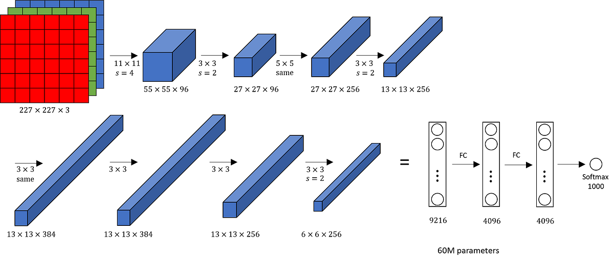
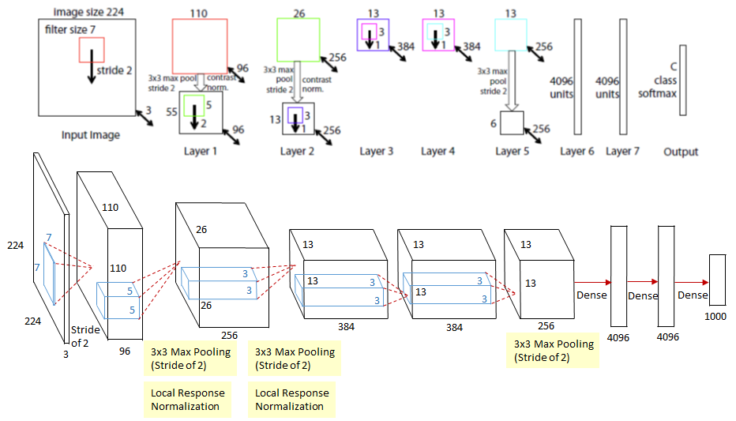
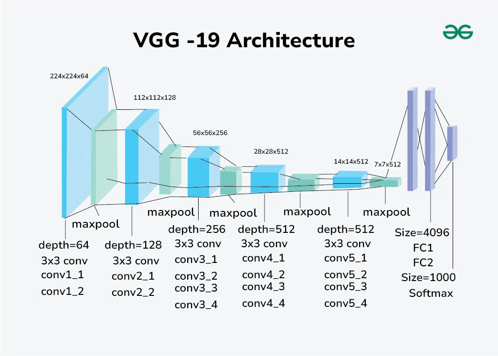
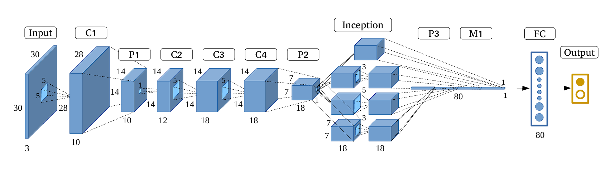
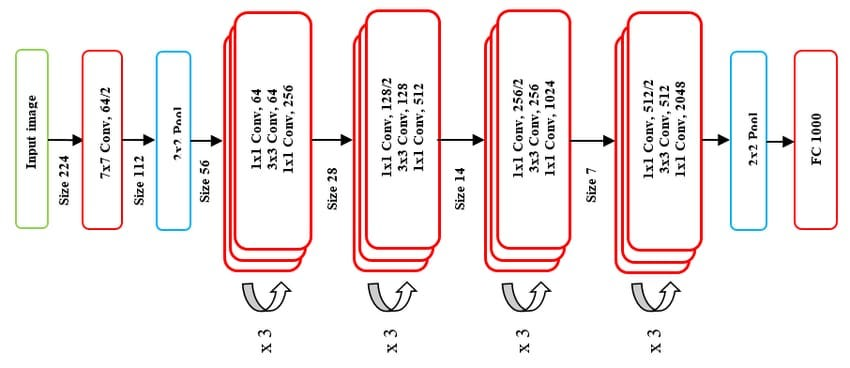
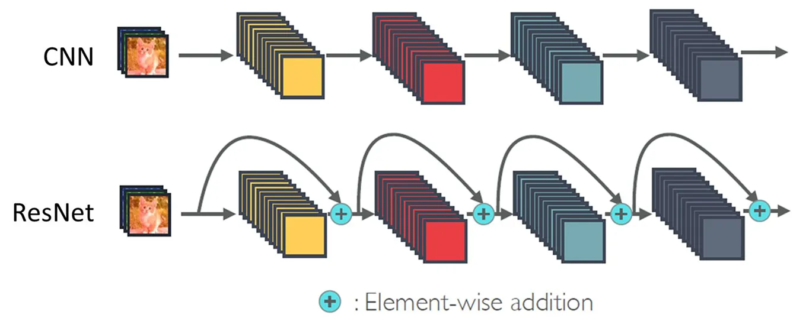
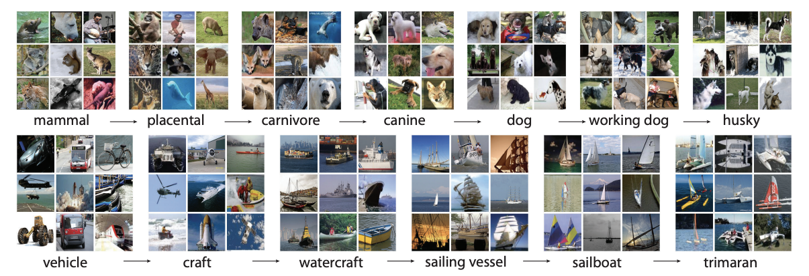

# Day_051 | Pretrained models in CNN | ImageNET Dataset | ILSVRC

Pretrained models are one of the most powerful and common tools in modern deep learning, especially for computer vision tasks. They are models that have already been trained on massive datasets and can be reused for new problems.

---

## 🧠 Pretrained Models in CNNs

A **pretrained model** is a deep learning model (usually a CNN) that has been previously trained on a large-scale benchmark dataset for a standard task, such as image classification.

### How Pretrained Models Work

1.  **Training:** The model is trained for days or weeks on a massive dataset (like ImageNet) to learn millions of general, low-level to high-level features (edges, textures, shapes, etc.).
2.  **Transfer Learning:** Instead of training a new model from scratch, you take this pretrained model and **reuse its learned weights** as a starting point for your own specific task (e.g., classifying medical scans, identifying car models).
3.  **Efficiency:** This approach is highly efficient because it saves enormous amounts of time and computational resources, and it often achieves better performance, especially when your custom dataset is small.

### Transfer Learning Techniques

* **Feature Extraction (Frozen Layers):** You keep the convolutional base (early layers) of the pretrained model frozen, using it only to extract features. You only train the weights of a new, small **Fully Connected (FC) head** attached to the end. This is best for small datasets.
* **Fine-Tuning (Unfrozen Layers):** You unfreeze the weights of the top layers of the pretrained convolutional base and train them along with the new FC head, typically using a very **low learning rate**. This allows the model to slightly adjust the generic learned features to better fit your specific data. This is better for larger datasets.

---

## 📷 ImageNet Dataset

**ImageNet** is the primary reason for the success of pretrained models and the surge of modern computer vision.

* **Size:** It is a massive visual database containing over **14 million** human-annotated images.
* **Classes:** It organizes images into more than **20,000 categories** (synsets), structured according to the WordNet hierarchy.
* **Significance:** Its sheer scale and diversity mean that a model trained on ImageNet learns to recognize a vast array of general features, making the resulting weights highly valuable for transfer learning.

---

## 🏆 ILSVRC (ImageNet Large-Scale Visual Recognition Challenge)

The **ILSVRC** was an annual competition that drove the development of modern CNN architectures.

* **Role:** Participants competed to build the best models for image classification and object localization on a subset of the ImageNet dataset (typically around 1,000 categories).
* **Historical Impact:** The ILSVRC became the proving ground for architectures like **AlexNet (2012)**, **VGG (2014)**, **GoogLeNet/Inception (2014)**, and **ResNet (2015)**, marking the key milestones in the deep learning revolution.

---

## 🌟 Famous Pretrained Models

These are the most common and powerful CNN architectures that won or performed exceptionally well in the ILSVRC and are widely used today as pretrained models:

| Model | Year | Key Innovation | Typical Layers | Pretrained Use Case |
| :--- | :--- | :--- | :--- | :--- |
| **AlexNet** | 2012 | **First CNN** to win ILSVRC; proved deep learning's superiority using ReLU and GPU acceleration. | 8 | Historical benchmark. |
| **VGG** | 2014 | Used only **$3 \times 3$ convolutional filters** stacked deeply, emphasizing uniform architecture. | 16 or 19 | Excellent for feature extraction due to its simple, deep structure. |
| **GoogLeNet / Inception** | 2014 | Introduced the **Inception Module** to perform multiple filter sizes in parallel, greatly reducing the parameter count. | 22 | Efficient for mobile and limited memory applications. |
| **ResNet (Residual Network)** | 2015 | Introduced **Skip Connections** (Residual Blocks) to solve the **Vanishing Gradient** problem in very deep networks. | 50, 101, 152 | The **most widely used** backbone for very deep and complex tasks. |
| **DenseNet** | 2017 | Each layer connects to *every* preceding layer, ensuring maximum information flow and stability. | Varies | Known for extreme parameter efficiency and high accuracy. |


Here is a clear, structured explanation of **pretrained CNN models**, the **ImageNet dataset**, and the **ILSVRC challenge**—all closely related topics in computer vision.

---

## 🌐 **Pretrained Models in CNN (Convolutional Neural Networks)**

## **What Are Pretrained CNN Models?**

Pretrained CNN models are deep neural networks that have already been trained on a large dataset (usually **ImageNet**). Instead of training a model from scratch, you can **reuse** these models and fine-tune them for your own tasks.

### **Why Use Pretrained Models?**

* **Faster training**
* **Better accuracy with fewer data**
* **Transfer learning** – leverage learned features (edges → textures → objects)
* **Avoid overfitting**, especially with small datasets

---

## **Popular Pretrained CNN Architectures**

These models are commonly used and available in frameworks like TensorFlow/Keras, PyTorch:

| Model                        | Key Features           | Highlights                        |
| ---------------------------- | ---------------------- | --------------------------------- |
| **AlexNet** (2012)           | First breakthrough CNN | Won ILSVRC 2012                   |
| **VGG16/VGG19**              | Deep but simple        | Uniform 3×3 conv filters          |
| **GoogLeNet (Inception)**    | Inception modules      | Efficient & deep                  |
| **ResNet (18, 34, 50, 101)** | Residual connections   | Solved vanishing gradient problem |
| **DenseNet**                 | Dense connectivity     | Feature reuse                     |
| **MobileNet**                | Lightweight            | Ideal for mobile/edge             |
| **EfficientNet**             | Compound scaling       | SOTA performance × efficiency     |

These models are usually pretrained on the **ImageNet** dataset, making them effective feature extractors.

---

## 🖼️ **ImageNet Dataset**

**ImageNet** is a huge labeled image dataset used for visual recognition research.

### **Key Facts**

* Contains **14+ million** images.
* Covers **21,000+** synsets (WordNet categories).
* Each image is labeled with the *object present in it*.
* High variability: different angles, lighting, backgrounds.

### **ImageNet Classification Subset**

For training CNNs, the most relevant subset is:

* **1.2 million** training images
* **1,000 categories**
* Used for ILSVRC competition

---

## 🏆 **ILSVRC — ImageNet Large Scale Visual Recognition Challenge**

ILSVRC is an annual competition (2010–2017) built on a subset of the ImageNet dataset. It pushed the field of deep learning forward.

### **Tasks in ILSVRC**

1. **Image Classification**
   Identify the object in the image (1,000 categories).

2. **Object Detection**
   Draw bounding boxes around objects.

3. **Localization**
   Classify & locate the main object.

### **Impact on Deep Learning**

ILSVRC is where many breakthrough models were introduced:

| Year     | Model         | Top-5 Error | Key Contribution                          |
| -------- | ------------- | ----------- | ----------------------------------------- |
| **2012** | **AlexNet**   | ~16%        | Deep CNN revolution                       |
| **2014** | **GoogLeNet** | ~6.7%       | Inception modules                         |
| **2015** | **ResNet**    | ~3.57%      | Residual networks                         |
| **2017** | –             | –           | Competition ended, but dataset still used |

ResNet surpassing human-level performance on ImageNet was a milestone.

---

## 🔄 **How These Concepts Connect**

### **1. Pretrained Models → Trained on → ImageNet Dataset**

CNNs like ResNet, VGG, and Inception are pretrained using the ImageNet 1K dataset.

### **2. ImageNet Dataset → Benchmark for → ILSVRC**

ILSVRC uses ImageNet’s curated 1,000-category subset for competitions.

### **3. ILSVRC → Drives Innovation in → Pretrained CNN Architectures**

Breakthrough models are often results of ILSVRC competitions.

---

## 📌 **Example Use Case: Transfer Learning with a Pretrained Model (PyTorch)**

```python
import torchvision.models as models
import torch.nn as nn

# Load a pretrained ResNet50
model = models.resnet50(pretrained=True)

# Replace the classifier for your dataset (e.g. 10 classes)
num_features = model.fc.in_features
model.fc = nn.Linear(num_features, 10)
```

---

## 🎯 **Summary**

* **Pretrained CNN models** (e.g., ResNet, VGG, MobileNet) are neural networks trained on **ImageNet**.
* **ImageNet** is a massive dataset (~14M images) with 1,000 categories used for training and evaluating CNN models.
* **ILSVRC** was the annual competition based on ImageNet that introduced breakthrough models in deep learning.

---

# Images
> AlexNET


>ZFNET


> VGGNET


> GoogleNET


> ResNET


> CNN vs ResNET


> ImageNET
