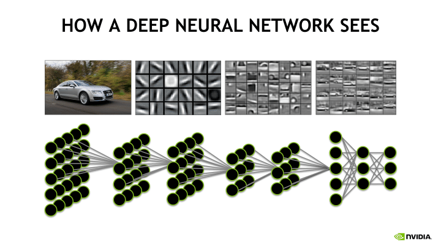
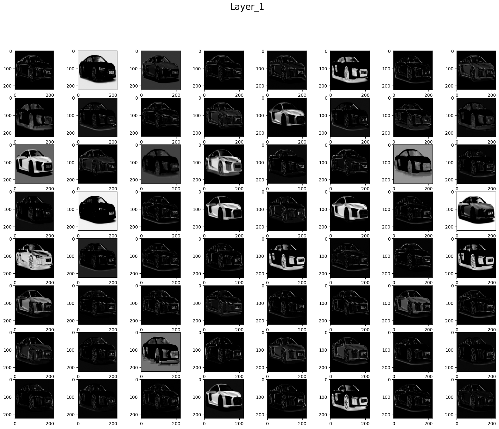
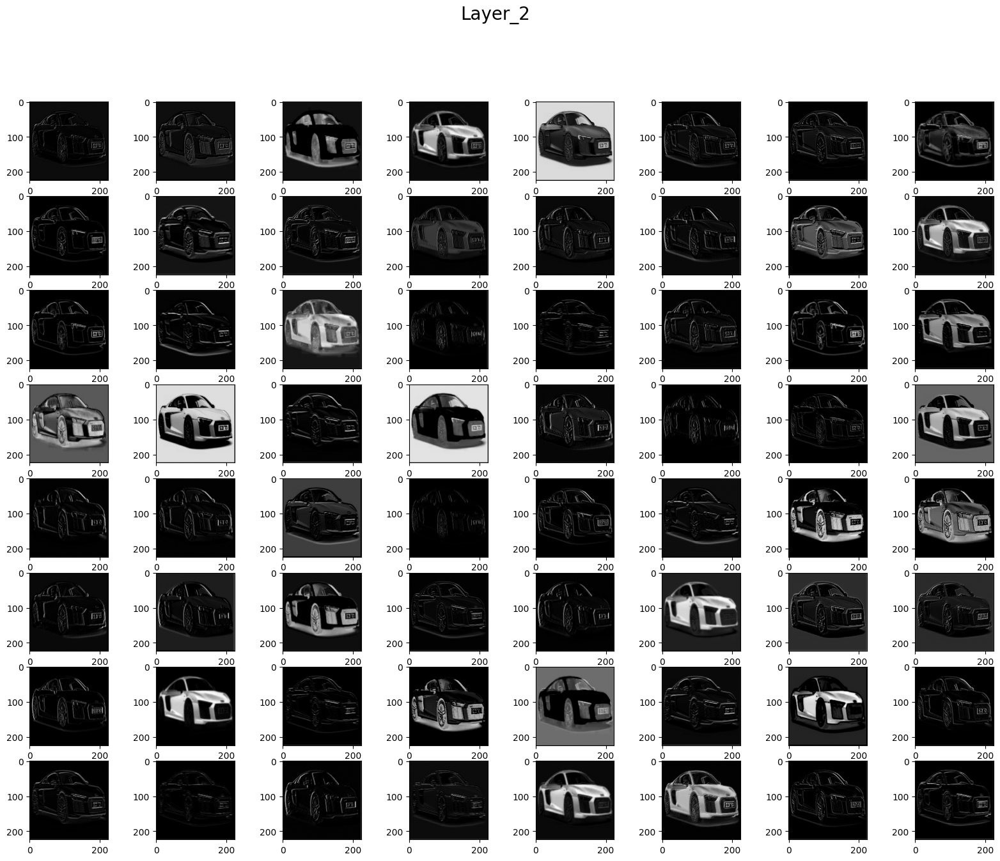
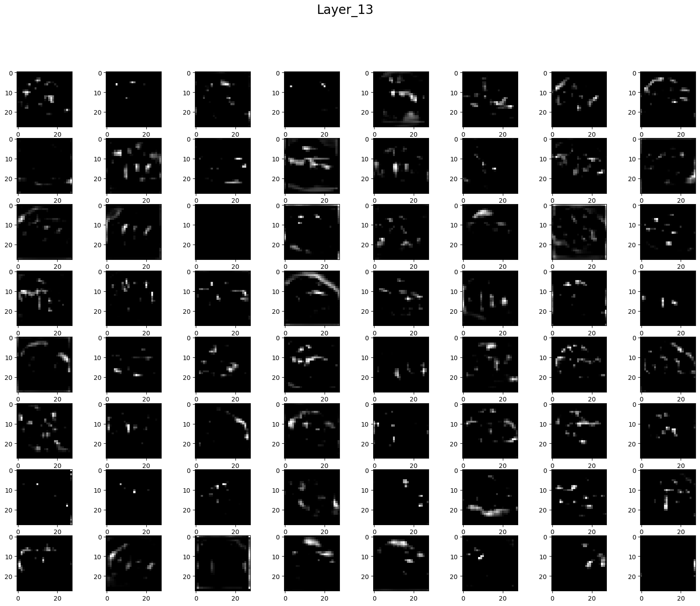
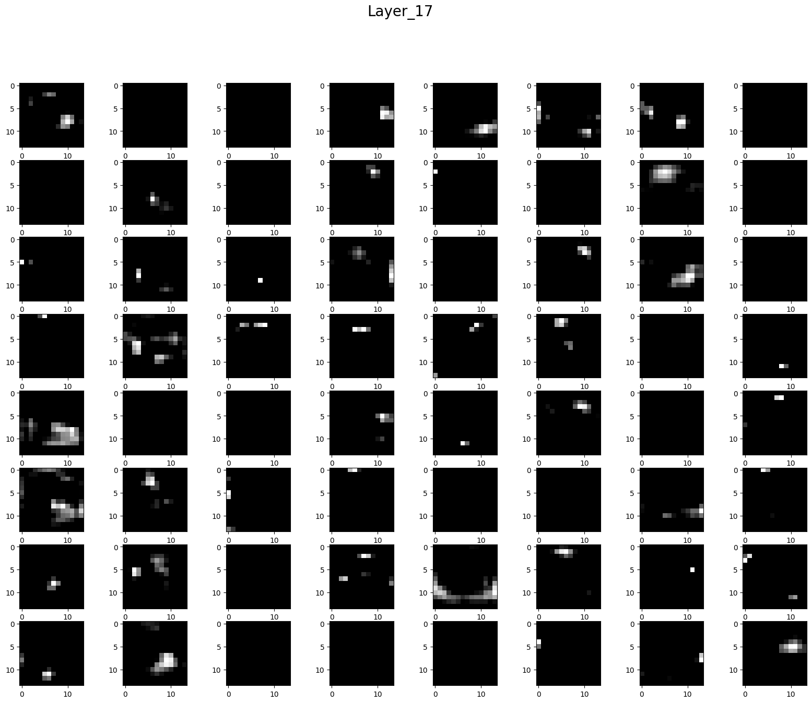
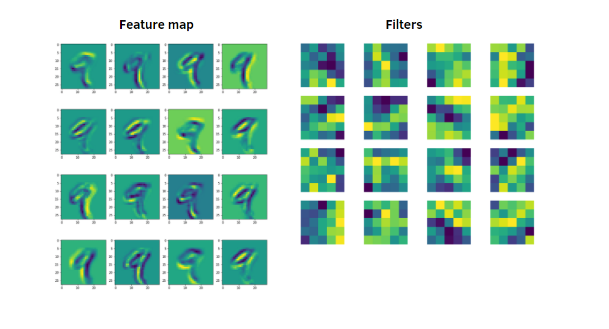
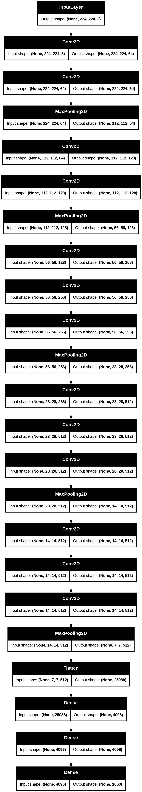

# Day_052 | 👁️ What a CNN "Sees" | 🖼️ Visualizing CNN Filters and Feature Maps

## 👁️ What a CNN "Sees"

A CNN doesn't "see" an image like a human does. Instead, it processes information by breaking the image down into hierarchical numerical representations:

1.  **Early Layers (Low-Level Features):** These layers see and learn to detect fundamental, generic features, such as **edges** (horizontal, vertical, diagonal), **corners**, and simple **color blobs**. These features are largely universal, regardless of the classification task (e.g., they look the same whether the task is cat vs. dog or car vs. truck).
2.  **Middle Layers (Mid-Level Features):** These layers combine the simple features from the previous layers to detect more complex patterns, such as **textures** (e.g., fur, fabric), **simple shapes** (e.g., circles, squares), and parts of objects (e.g., a wheel, an eye).
3.  **Late Layers (High-Level Features):** These deep layers process features that are highly **semantic** and **task-specific**. They see combinations of complex shapes that define entire objects or parts of objects required for the final classification, such as **cat ears**, a **dog nose**, or a **full human face**.

---

## 🖼️ Visualizing CNN Filters and Feature Maps

The two primary ways to peer into a CNN's mind are by visualizing the filters themselves and by visualizing the feature maps they produce.

### 1. Visualizing Filters (The Feature Detectors)

* **What is seen:** The actual pattern that a filter is designed to look for. Since the filter weights are learned during training, visualizing them shows what the network prioritizes.
* **Method:** Simply plot the weights of the convolutional filters as an image.
    * **Early Layers:** Filters often look like simple **Gabor filters** or **color oppositions**. For example, one filter might be dark on the left and bright on the right, indicating it detects **vertical edges**.
    * **Deep Layers:** Filters are much harder to interpret because they capture abstract combinations of features from previous layers.

### 2. Visualizing Feature Maps (The Activation Output)

* **What is seen:** Shows **where** in the input image a specific feature (detected by a filter) is present.
* **Method:** Pass an image through the network and plot the output of a specific convolutional layer.
    * If a layer has 64 filters, you can generate 64 corresponding feature maps.
    * **High Activation (Bright areas):** Indicate that the feature the filter is designed to detect is strongly present at that location in the image.
    * **Low Activation (Dark areas):** Indicate the feature is absent or weak. 
* **Intuition:** By inspecting the feature maps, you can see the progression: early maps will be detailed and pixel-like, middle maps will show abstract textures, and late maps will often highlight only the regions containing the target object (e.g., a bright blob over the cat's face).

### 3. Saliency Maps / Class Activation Maps (CAM/Grad-CAM)

* **What is seen:** Shows which parts of the original input image were **most important** to the model's final decision.
* **Method:** These techniques use the final gradient (or the activation output) flowing back from the predicted class to highlight the input region that maximally contributed to that prediction.
* **Intuition:** If the model classifies an image as "dog," the CAM technique generates a heatmap over the original image, showing the area (e.g., the dog's head and body) that made the model most confident. This provides a direct, localized answer to "Why did the CNN make this decision?"


Below is a **clear, simple explanation** of *what a CNN “sees”* and how to **visualize filters + feature maps**, with easy code you can copy.

---

## 🧠 **What does a CNN actually see?**

A **Convolutional Neural Network (CNN)** does not “see” images like humans.
It sees **patterns**: edges, colors, textures, shapes, and high-level concepts.

### CNN perception evolves layer by layer:

### 🔹 **1. Early layers** (close to input)

Detect:

* edges
* corners
* simple color blobs

### 🔹 **2. Middle layers**

Detect:

* textures (fur, fabric, leaves)
* shapes (circles, stripes)
* parts of objects (eyes, wheels, petals)

### 🔹 **3. Deep layers**

Detect:

* entire objects (cats, faces, phones)
* high-level concepts

---

## 🎨 **Visualizing CNN Filters (What the model looks for)**

These are the **weights of convolution kernels**.

### Example: Visualize first-layer filters of VGG/ResNet

```python
filters, biases = model.layers[1].get_weights()

print(filters.shape)
# (kernel_height, kernel_width, channels, num_filters)
```

To display them:

> Python
```python
import matplotlib.pyplot as plt
import numpy as np

n_filters = 6
plt.figure(figsize=(10, 5))

for i in range(n_filters):
    f = filters[:, :, :, i]
    f_min, f_max = f.min(), f.max()
    f = (f - f_min) / (f_max - f_min)
    plt.subplot(1, n_filters, i+1)
    plt.imshow(f)
    plt.axis('off')

plt.show()
```

You will see **edge detectors, color blobs**, etc.

---

## 🌌 **Visualizing Feature Maps (What the network extracts from YOUR image)**

Feature maps show **activations** when an image passes through a layer.

### Step 1 — Choose a layer

> Python
```python
layer_name = "conv1_conv"   # Example for ResNet50
intermediate_layer_model = keras.Model(
    inputs=model.input,
    outputs=model.get_layer(layer_name).output
)
```

### Step 2 — Get feature maps

> Python
```python
feature_maps = intermediate_layer_model.predict(img)
print(feature_maps.shape)
```

Example shape:

```
(1, 112, 112, 64)
```

Meaning:

* 64 filters produced 64 feature maps
* each of size 112×112

### Step 3 — Plot them

> Python
```python
square = 8
plt.figure(figsize=(12, 12))

for i in range(square * square):
    ax = plt.subplot(square, square, i+1)
    plt.imshow(feature_maps[0, :, :, i], cmap='viridis')
    plt.axis("off")

plt.show()
```

You will see how the CNN **activates for edges, shapes, important regions**.

---

## 🧠 **Intuition: What CNN features look like**

### Early layers:

```
|██████    | → vertical edge  
|    ██████| → horizontal edge  
|█  █  █  █| → color pattern  
```

### Deep layers:

```
🎯 Object parts  
🎯 Texture patterns  
🎯 High-level shapes  
```

---

## 🎁 Want a full compact tutorial script?

Here is a ready-to-run **complete CNN visualization code**:

> Python Keras
```python
import tensorflow as tf
from tensorflow.keras.models import Model
from tensorflow.keras.preprocessing import image
import numpy as np
import matplotlib.pyplot as plt

def load_and_prep(path):
    img = image.load_img(path, target_size=(224, 224))
    x = image.img_to_array(img)
    x = np.expand_dims(x, axis=0)
    return tf.keras.applications.resnet50.preprocess_input(x)

model = tf.keras.applications.ResNet50(weights='imagenet', include_top=True)
img = load_and_prep("your_image.jpg")

# Choose layers
layers = ['conv1_conv', 'conv2_block1_out', 'conv3_block2_out']

for layer in layers:
    extractor = Model(inputs=model.input, outputs=model.get_layer(layer).output)
    fmap = extractor.predict(img)

    print("Layer:", layer, " → shape:", fmap.shape)

    # plot first 64 feature maps
    plt.figure(figsize=(12, 12))
    for i in range(64):
        ax = plt.subplot(8, 8, i+1)
        plt.imshow(fmap[0, :, :, i], cmap='viridis')
        plt.axis("off")
    plt.show()
```

---

## 📌 Summary

| Visualization    | Shows                                      | Usefulness                            |
| ---------------- | ------------------------------------------ | ------------------------------------- |
| **Filters**      | What patterns the CNN is trained to detect | Understanding learned kernels         |
| **Feature Maps** | What the CNN sees in YOUR image            | Understanding which features activate |

---

## Images








<!-- 

 
-->