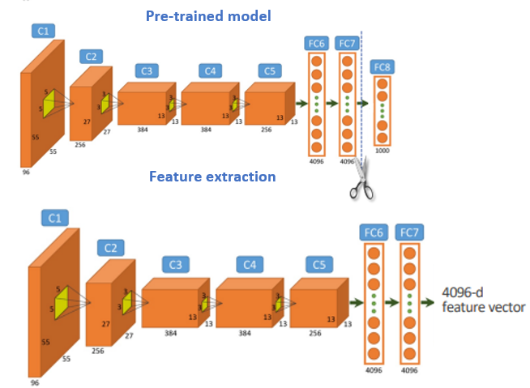
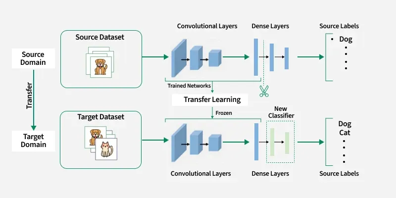
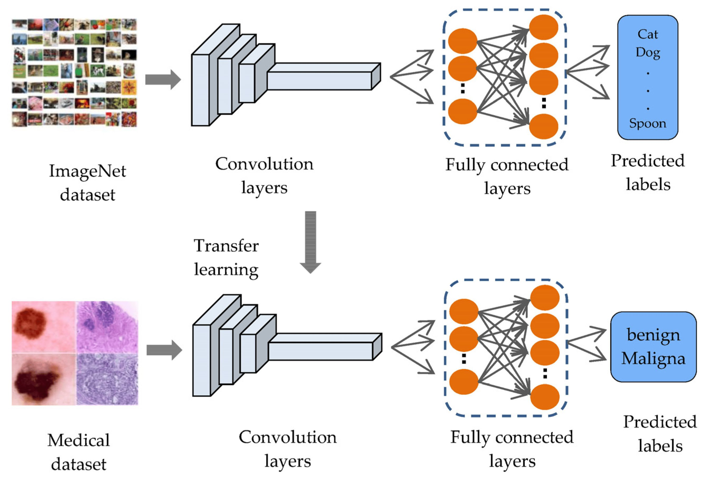

# Day_053 | 🧠 What is Transfer Learning? Transfer Learning in Keras | Fine Tuning Vs Feature Extraction

## 🧠 What is Transfer Learning?

**Transfer Learning** is a machine learning technique where knowledge gained from solving one problem (the source task) is applied and reused to solve a different but related problem (the target task).

In deep learning and especially in **Convolutional Neural Networks (CNNs)**, this means taking a model that has been pretrained on a massive, general dataset (like ImageNet) and using its learned features as a starting point for a new, specific task (like classifying medical images or specialized objects).

The core idea is that the knowledge captured in the early layers of a deep network (like detecting edges and textures) is **universal** and can be transferred, saving significant time and computational resources.

-----

## 🛠️ Transfer Learning in Keras

Keras/TensorFlow makes implementing transfer learning straightforward using models pretrained on the **ImageNet** dataset.

The typical workflow involves loading a pretrained model's **convolutional base** (the feature-extracting layers) and then adding new, trainable **classification layers** (the dense head) tailored to the new problem.

### Key Keras Steps:

1.  **Load the Base Model:** Load a model (e.g., `VGG16`, `ResNet50`) with `weights='imagenet'` but exclude the top classification layer by setting `include_top=False`.
    ```python
    from tensorflow.keras.applications import VGG16
    base_model = VGG16(weights='imagenet', include_top=False, input_shape=...)
    ```
2.  **Freeze the Base:** Set the convolutional layers to be non-trainable to prevent the initial random gradients from destroying the valuable learned weights.
    ```python
    base_model.trainable = False
    ```
3.  **Attach the Head:** Add new `Flatten` and `Dense` layers on top of the base model's output.
4.  **Compile and Train:** Compile the new combined model and train it using the new, smaller dataset.

-----

## 🆚 Fine-Tuning vs. Feature Extraction

The choice between these two primary transfer learning strategies depends mainly on two factors: the **size** of your new dataset and the **similarity** of the new task to the original ImageNet task.

### 1\. Feature Extraction (Base is Frozen)

  * **Mechanism:** The weights of the pretrained convolutional base are **frozen** and remain unchanged. The model is treated as a static feature extractor. Only the weights of the newly added classification layers are trained.
  * **When to Use:**
      * **Small Dataset, Similar Task:** The base features are likely sufficient, and a small dataset is unlikely to retrain the large base effectively.
      * **Small Dataset, Different Task:** Again, freezing the base prevents the small dataset from catastrophically corrupting the generic features.
  * **Advantage:** Faster training and prevents the small dataset from causing the large model to **overfit**.

### 2\. Fine-Tuning (Base is Unfrozen)

  * **Mechanism:** The convolutional base is initially frozen, and a new head is trained. Then, the model is unfrozen, and the weights of the entire network, or the top-most convolutional layers, are trained again using a **very low learning rate**.
  * **When to Use:**
      * **Large Dataset, Similar Task:** A large dataset allows you to fine-tune the high-level features slightly, leading to better results.
      * **Large Dataset, Different Task:** A large dataset provides enough information to adjust even the low-level features to be more relevant to the new domain.
  * **Advantage:** Achieves the **highest potential accuracy** by optimizing the original features for the specific nuances of the new data.
  * **Caution:** Must use a **low learning rate** to ensure the valuable pretrained weights are adjusted incrementally, not destroyed by large initial updates.

| Feature | Feature Extraction | Fine-Tuning |
| :--- | :--- | :--- |
| **Model Base** | Frozen (Untrainable) | Unfrozen (Trainable) |
| **Learning Rate** | Standard ($\approx 10^{-3}$) | Very Low ($\approx 10^{-5}$) |
| **Training Speed** | Fast | Slower (More parameters to train) |
| **Risk of Overfitting**| Low | Moderate to High |
| **When Preferred** | Small datasets, quick results | Large datasets, highest performance |


## ChatGPT

✅ What is **Transfer Learning**\
✅ **Feature Extraction** vs **Fine-Tuning**\
✅ How Transfer Learning works in **Keras**\
✅ Example code included

---

## 🔵 **What is Transfer Learning?**

Transfer Learning is a technique where you **take a pre-trained model** (trained on a large dataset like ImageNet) and **reuse its learned features** for a new task.

### Why use it?

* You don’t need a large dataset
* Training becomes much faster
* Accuracy improves dramatically
* Helps when your dataset is small or similar to ImageNet

A pre-trained model like **VGG16, ResNet50, InceptionV3, EfficientNet** has already learned:

* Edges, curves → early layers
* Textures, shapes → middle layers
* Object parts → deep layers

We reuse these learned features.

---

## 🟢 **Two Ways to Use Transfer Learning**

There are **two main approaches**:

1️⃣ **Feature Extraction**\
2️⃣ **Fine-Tuning**

## 1️⃣ **Feature Extraction (Freezing the base model)**

“Freeze the pre-trained model → Train only new layers on top.”

### When to use:

✔ Small dataset
✔ Dataset similar to ImageNet
✔ You want fast training

### How it works:

* Load pre-trained model with `include_top=False`
* **Freeze** all convolutional layers
* Add new classification layers (Dense, Dropout, etc.)
* Train only the new layers

### Keras Example (Feature Extraction)

> Keras
```python
base = tf.keras.applications.ResNet50(
    include_top=False, weights='imagenet', input_shape=(224,224,3)
)

base.trainable = False   # freeze base

inputs = tf.keras.Input(shape=(224,224,3))
x = base(inputs, training=False)
x = tf.keras.layers.GlobalAveragePooling2D()(x)
x = tf.keras.layers.Dense(128, activation='relu')(x)
outputs = tf.keras.layers.Dense(5, activation='softmax')(x)

model = tf.keras.Model(inputs, outputs)
model.compile(optimizer='adam', loss='categorical_crossentropy', metrics=['accuracy'])
```

---

## 2️⃣ **Fine-Tuning (Unfreezing some layers)**

“Unfreeze the **top few layers** of the pre-trained model and train them with a low learning rate.”

### When to use:

✔ Your dataset is **larger**
✔ Dataset is **different** from ImageNet
✔ You need high accuracy
✔ You want the model to **adapt to your domain**

### How it works:

* First do **feature extraction**
* Then unfreeze the **last block** of the pre-trained model
* Continue training with **small learning rate**

### Keras Example (Fine-Tuning)

> Keras
```python
# unfreeze last few layers for fine-tuning
for layer in base.layers[-20:]:
    layer.trainable = True

model.compile(
    optimizer=tf.keras.optimizers.Adam(1e-5),   # very small LR
    loss='categorical_crossentropy',
    metrics=['accuracy']
)

history = model.fit(train_ds, validation_data=val_ds, epochs=10)
```

Why small learning rate?

👉 To avoid destroying the pre-trained weights\
👉 To let the model slowly adapt to your dataset

---

### ⚖️ **Feature Extraction vs Fine-Tuning (Comparison Table)**

| Aspect              | Feature Extraction  | Fine-Tuning                     |
| ------------------- | ------------------- | ------------------------------- |
| What’s trained?     | Only new top layers | Some deeper layers + top layers |
| Speed               | Fast                | Slower                          |
| Dataset size        | Small               | Medium to large                 |
| Risk of overfitting | Low                 | Higher                          |
| Accuracy            | Good                | Best                            |
| Use case            | Similar images      | Different images                |

---

### 🧠 **Why Transfer Learning Works**

The early layers of CNNs learn universal visual features:

* lines
* curves
* textures
* patterns
* shapes

These features are useful for almost all visual tasks.

Transfer learning lets you **reuse these features** instead of training from scratch.

---

### 📌 Summary

### **Transfer Learning**

Reusing a pre-trained CNN to solve a new task.

### **Feature Extraction**

Freeze base model → train only new layers.
Fast, useful for small & similar datasets.

### **Fine-Tuning**

Unfreeze top layers → train with low LR.
Slower, best accuracy, useful for larger/different datasets.

---

## Images


