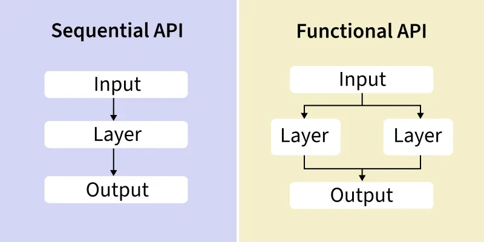

# Day_054 | 🚀 Keras Functional Model — Building Non-Linear Neural Networks | Sequential vs. Functional Model

## 🧠 Keras Functional Model: Building Non-Linear Networks

The **Keras Functional API** is a way to define complex, non-linear neural network architectures that the simpler `Sequential` API cannot handle. It allows you to explicitly define how layers connect, enabling models to have multiple inputs, multiple outputs, and shared layers.

-----

## 🆚 Sequential vs. Functional Model

The key difference lies in the **layer connectivity structure**:

| Feature | `Sequential` Model | `Functional` Model |
| :--- | :--- | :--- |
| **Connectivity** | **Linear** (A $\rightarrow$ B $\rightarrow$ C) | **Non-Linear** (Arbitrary graph structure) |
| **Inputs/Outputs** | Single Input, Single Output | **Multiple Inputs, Multiple Outputs** |
| **Layer Reuse** | Cannot reuse layers | **Can share layers** across different branches. |
| **Complexity** | Simple, feedforward networks. | Complex architectures (e.g., Inception, ResNet, Siamese networks). |
| **Definition** | Layers are added to a `Sequential` list. | Layers are explicitly **called** on previous layers' outputs. |

-----

## 🛠️ How to Build a Functional Model (Example)

Building a functional model involves treating layers as functions that take the output of the previous layer as input.

### Step 1: Define Inputs

You must explicitly create an **Input Layer** that defines the shape of the data entering the model.

> Keras
```python
from tensorflow.keras.layers import Input, Dense
from tensorflow.keras.models import Model

# Define the input layer with a shape of 10 features
input_tensor = Input(shape=(10,), name='main_input')
```

### Step 2: Define Layer Connectivity

Each layer is a function call, linking it to its predecessor.

```python
# First Hidden Layer
x = Dense(32, activation='relu')(input_tensor)

# Second Hidden Layer (connected to x)
x = Dense(16, activation='relu')(x) 
```

### Step 3: Define Outputs and Create the Model

The final step is to define the model by specifying the initial input and the final output(s).

```python
# Output Layer
output_tensor = Dense(1, activation='sigmoid', name='output')(x)

# Create the Model object
model = Model(inputs=input_tensor, outputs=output_tensor)
```

-----

## 💡 Use Cases and Non-Linear Architectures

The Functional API is essential for building networks with complex, non-linear data flows:

### 1\. Multi-Input Models

  * **Scenario:** A model needs to combine tabular data with image data.
  * **Example:** One input (images) goes through a CNN, a second input (user age/gender) goes through an MLP, and their final features are **concatenated** and fed into a final classification head.

### 2\. Multi-Output Models

  * **Scenario:** A single network must perform multiple tasks simultaneously (e.g., classifying a car's make *and* predicting its resale price).
  * **Example:** The main feature extraction path splits into two separate output layers: one with `softmax` activation for classification and one with `linear` activation for regression.

### 3\. Layer Sharing (Shared Sub-Networks)

  * **Scenario:** Building a **Siamese Network** to compare two inputs (e.g., two images to check if they are the same person).
  * **Example:** The same exact set of convolutional layers is applied to two separate image inputs. This forces the single sub-network to learn highly robust and generalized feature representations.

### 4\. Architectures with Skip Connections

  * **Scenario:** Implementing advanced architectures like **ResNet** or **DenseNet** that feature **skip connections** to solve the vanishing gradient problem.
  * **Example (ResNet Block):** A layer's input is added directly to its output, bypassing several intermediate layers (e.g., `output = add([x, input_tensor])`). This parallel path cannot be defined in the `Sequential` model.


Below is a clear explanation of **Keras Functional API**, how to build **non-linear neural networks**, and when to use **Sequential (linear)** vs **Functional (non-linear / multi-branch)** models—with examples and use cases.

---

## 🚀 Keras Functional Model — Building Non-Linear Neural Networks

## 1. **What is the difference between Linear (Sequential) vs Functional Models?**

### ✅ **Sequential Model** (linear stack)

* Layers go **strictly one after another**.
* Only supports **one input, one output**, and **no branching or layer reuse**.
* Good for simple feed-forward architectures.

```
Input → Dense → Dense → Dense → Output
```

### ✅ **Functional Model** (graph structure)

* Lets you create **arbitrary directed acyclic graphs (DAG)**.
* Supports:

  * Multiple inputs
  * Multiple outputs
  * Skip connections
  * Shared layers
  * Complex branching
* Ideal for modern deep architectures (ResNet, Transformers, Siamese networks, etc.)

```
          → Dense →  
Input → Dense → Concatenate → Dense → Output
          → Dense →
```

---

## 2. **Why the Functional API allows non-linearity**

“Non-linear” in this context means that network **topology does not have to be a single chain**.
You can build networks with:

* **Parallel branches**
* **Skip (residual) connections**
* **Concatenation or addition of intermediate outputs**
* **Multiple data flows**

This lets you design networks **beyond sequential stacking**.

---

## 3\. **Simple Example: Sequential vs Functional**

## **A. Linear (Sequential) Model**

> Keras
```python
from keras.models import Sequential
from keras.layers import Dense

model = Sequential([
    Dense(32, activation='relu', input_shape=(10,)),
    Dense(16, activation='relu'),
    Dense(1, activation='sigmoid')
])
```

This is strictly a straight pipeline.

---

## **B. Non-linear (Functional) Model Example**

**Two branches → concatenation → output**

> Keras
```python
from keras.layers import Input, Dense, Concatenate
from keras.models import Model

# Input layer
inputs = Input(shape=(10,))

# Branch 1
x1 = Dense(32, activation='relu')(inputs)
x1 = Dense(16, activation='relu')(x1)

# Branch 2
x2 = Dense(64, activation='relu')(inputs)

# Merge branches
merged = Concatenate()([x1, x2])

# Output
outputs = Dense(1, activation='sigmoid')(merged)

model = Model(inputs=inputs, outputs=outputs)
```

### Plot of the structure (conceptually):

```
     Input
       |
  --------------
  |            |
Dense32       Dense64
  |            |
Dense16        |
  |            |
   ----Concat----
         |
       Dense1
```

This is **not possible** with a Sequential model.

---

## 4. **Example: Residual (Skip Connection) Network**

Functional API makes ResNet-like skip connections easy:

```python
from keras.layers import Input, Dense, Add
from keras.models import Model

inp = Input(shape=(20,))
x = Dense(64, activation='relu')(inp)
skip = x
x = Dense(64, activation='relu')(x)
x = Add()([x, skip])     # skip connection
out = Dense(3, activation='softmax')(x)

model = Model(inp, out)
```

Sequential **cannot** express this.

---

## 5. **Example: Multi-Input Functional Model**

Useful for models that take multiple feature types.

> Keras
```python
from keras.layers import Input, Dense, Concatenate
from keras.models import Model

# Two inputs
img_input = Input(shape=(64, 64, 3))
metadata_input = Input(shape=(10,))

# Branch 1: image features
img_features = Dense(128, activation='relu')(img_input)

# Branch 2: metadata
meta_features = Dense(32, activation='relu')(metadata_input)

# Combine
combined = Concatenate()([img_features, meta_features])

output = Dense(1, activation='sigmoid')(combined)

model = Model(inputs=[img_input, metadata_input], outputs=output)
```

---

## 6. **Use Cases: When to Use Which Model**

### ✔️ Use **Sequential** when:

* The model is a **simple stack**.
* Only **one input & one output**.
* No branching, no skip connections.

Typical:
CNN → Pool → CNN → Dense → Output
Small MLPs
Basic LSTM stacks

---

### ✔️ Use **Functional API** when model is non-linear:

#### ⭐ Multi-branch networks

(e.g., wide & deep models, parallel transforms)

#### ⭐ Multi-input or multi-output networks

(e.g., image + text networks, forecasting multiple targets)

#### ⭐ Skip connections / residual networks

(e.g., ResNet, UNet, DenseNet)

#### ⭐ Shared layers

(e.g., Siamese networks)

#### ⭐ More control or introspection

(e.g., exporting intermediate outputs)

---

## Summary Table

| Feature                                 | Sequential  | Functional         |
| --------------------------------------- | ----------- | ------------------ |
| Multiple Inputs                         | ❌           | ✔️                 |
| Multiple Outputs                        | ❌           | ✔️                 |
| Branching                               | ❌           | ✔️                 |
| Skip Connections                        | ❌           | ✔️                 |
| Layer Reuse                             | ❌           | ✔️                 |
| Complex Architectures (ResNet, Siamese) | ❌           | ✔️                 |
| Ease of use                             | ✔️ simplest | Slightly more code |

---

## 📌 Final Takeaway

If your network is simply a **linear chain of layers**, use **Sequential**.

If your network has **any non-linearity in topology (parallel paths, merges, skips, multiple inputs)**, use the **Functional API**.

---

## Images
