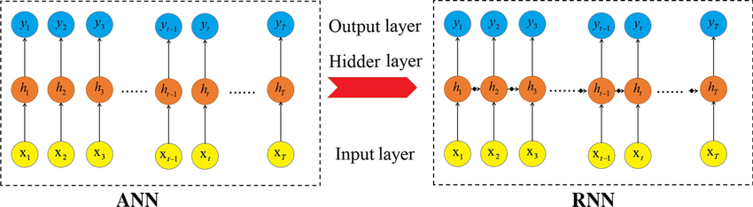

# Day_055 | 🔄 Why RNNs are Needed | RNNs Vs ANNs

## 🔄 Why Recurrent Neural Networks (RNNs) are Needed

**Recurrent Neural Networks (RNNs)** were developed specifically to handle **sequential data**, where the order of information is crucial and dependencies exist between elements in a sequence. Standard **Artificial Neural Networks (ANNs)**, like MLPs, treat all inputs independently, making them fundamentally incapable of modeling time-series, text, or audio effectively.

### The Limitation of ANNs

Traditional ANNs have a **feedforward** architecture, meaning information flows only in one direction—from input to output. If you feed an ANN the words "The quick brown fox," the network treats those four words as four independent inputs, unable to remember the context provided by "The quick brown." This makes them unsuitable for tasks requiring memory or contextual understanding.

## 🧠 RNNs vs. ANNs

The core difference lies in the introduction of a **hidden state (memory)** and a **recurrent connection**.

| Feature | Artificial Neural Network (ANN/MLP) | Recurrent Neural Network (RNN) |
| :--- | :--- | :--- |
| **Data Type** | Independent inputs (e.g., images, tabular data). | **Sequential Data** (e.g., text, time series, speech). |
| **Internal Structure** | No feedback loops. | **Recurrent Loop** allows information from a previous step to influence the current step. |
| **Memory** | **Stateless.** Processes each input independently. | **Stateful.** Maintains a **hidden state ($h_t$)** that acts as the network's short-term memory. |
| **Weight Sharing** | Weights are unique for each layer. | **Weights are shared** across all time steps. This is crucial for generalized learning across sequences. |
| **Architecture** | Simple feedforward. | Unrolled through time, forming a deep structure across the sequence length. |

## 💡 RNN Introduction and Intuition

An RNN is a network with a **loop** in its structure, allowing information to be passed from one step of the network to the next.

* **Hidden State ($h_t$):** At any time step $t$, the RNN takes two inputs: the current input data ($x_t$) and the previous hidden state ($h_{t-1}$). The hidden state is the network's way of summarizing the entire history of the sequence up to that point.
* **Calculation:** The current hidden state $h_t$ is calculated based on the previous hidden state $h_{t-1}$ and the current input $x_t$.

$$
h_t = f(W_{hh} h_{t-1} + W_{xh} x_t + b_h)
$$

* **Unrolling:** To understand how an RNN processes a sequence, we conceptually **unroll** the loop across time steps. This creates a chain-like structure where the output of one step feeds into the input of the next. 

## 🌐 Applications of RNNs

RNNs and their advanced variants (LSTMs, GRUs) are the backbone of many modern AI applications involving sequence processing:

* **Natural Language Processing (NLP):**
    * **Machine Translation:** Google Translate, etc.
    * **Text Generation:** Generating coherent sentences or paragraphs.
    * **Sentiment Analysis:** Determining the emotional tone of text.
* **Speech Processing:**
    * **Speech Recognition:** Converting spoken words to text.
* **Time Series Analysis:**
    * **Stock Market Prediction:** Forecasting future values based on past data.
    * **Weather Forecasting:** Predicting sequences of meteorological events.
* **Video Processing:**
    * **Action Recognition:** Classifying actions occurring over a sequence of video frames.


Here’s a clear and concise explanation of **why RNNs are needed** and how they compare to **ANNs (traditional feed-forward networks)**:

---

## 🌟 **Why RNNs Are Needed**

Traditional Artificial Neural Networks (ANNs) treat all inputs as **independent** of each other.
But many real-world tasks involve **sequences**, where previous inputs influence future ones. Examples:

* Language (a sentence depends on previous words)
* Speech (sound waves unfold over time)
* Time-series forecasting (stock prices, weather)
* Video processing (frames depend on earlier frames)

ANNs cannot **remember** what came before.
They only map a fixed input to a fixed output.

### ✔ The Need for Memory

Recurrent Neural Networks (RNNs) solve this by introducing a **hidden state** that carries information from previous steps.
This gives RNNs a type of **short-term memory**.

RNNs can handle:

* variable-length sequences
* temporal dependencies
* contextual relationships

That’s why RNNs became essential for sequence modeling before Transformers became dominant.

---

## 🔄 **RNNs vs ANNs (Feed-Forward Networks)**

| Feature                    | ANN (Feed-forward NN)              | RNN (Recurrent NN)                          |
| -------------------------- | ---------------------------------- | ------------------------------------------- |
| **Input type**             | Fixed size                         | Sequences of variable length                |
| **Memory**                 | No memory of past inputs           | Has memory via hidden state                 |
| **Computation**            | One-pass; no feedback              | Loops over time steps; feedback connections |
| **Use cases**              | Images, classification, regression | Text, speech, time-series, sequences        |
| **Mathematical structure** | ( y = f(Wx + b) )                  | ( h_t = f(Wx_t + U h_{t-1} + b) )           |
| **Temporal modeling**      | Not possible                       | Built-in                                    |
| **Training difficulty**    | Easy                               | Harder (vanishing/exploding gradients)      |
| **Parallelization**        | Easy                               | Hard (sequential processing)                |

---

## 🧠 **Intuition: When to Use Each?**

### Use **ANNs** when:

* Each input sample stands alone
* Order does NOT matter
* Problems like image classification, tabular data, simple regressions

### Use **RNNs** when:

* Data is sequential
* Earlier steps influence later ones
* Tasks require context or memory

Examples:

* Predicting next word in a sentence
* Generating music
* Translating languages
* Forecasting time-series

---

## Roadmap of RNN

```yaml
SimpleRNN --> Backpropagation --> Problem Solving (Vanishing, Exploding) --> LSTM/GRU --> Types of RNN --> Deep RNN --> Bidirectional RNN --> Sequence2Sequence Model
```


## 🧩 Summary

* **ANNs** → No memory, fixed input, good for independent data
* **RNNs** → Memory of previous inputs, good for sequential data
* RNNs were created to overcome the limitation of ANNs in handling **temporal dependencies**

---

## Images

