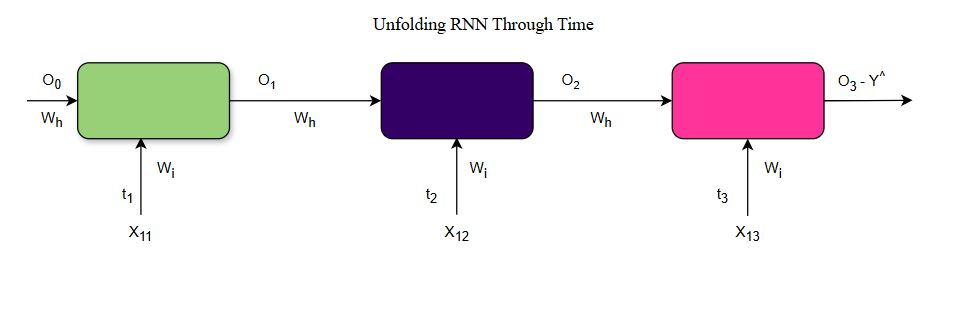
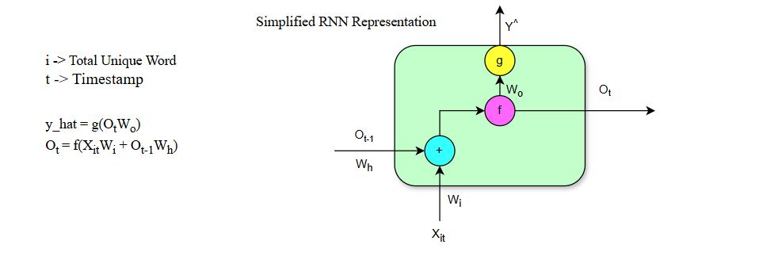
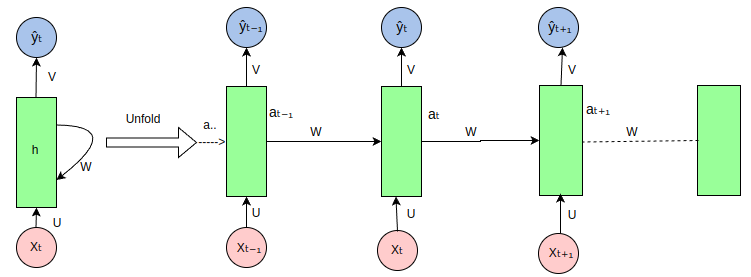
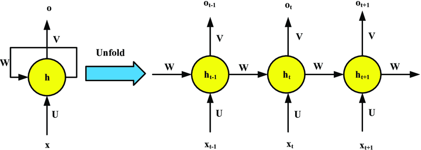
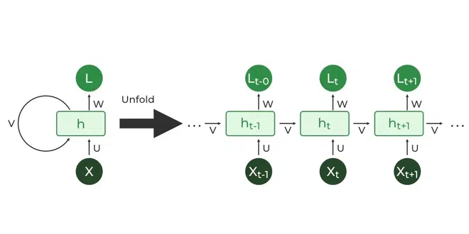

# Day_056 | 🏗️ Recurrent Neural Network | Forward Propagation | Architecture

A **Recurrent Neural Network (RNN)** is an architecture designed for processing **sequential data** by maintaining an internal **hidden state**, often called memory. This allows information from previous steps in the sequence to influence the processing of the current step.

---

## 🏗️ RNN Architecture: Unrolling Through Time

The fundamental difference between an RNN and a traditional ANN is the **recurrent connection** that feeds the output of the hidden layer at time $t-1$ back into the hidden layer at time $t$.

When dealing with a sequence of data (like a sentence of $T$ words), we conceptualize the single RNN unit as being **unrolled** or unfolded over the $T$ time steps.

### The Unrolled Architecture

In the unrolled view, the network looks like a deep feedforward network where the number of layers equals the length of the sequence. 

* **Input Sequence ($\mathbf{x}$):** The input sequence is $\mathbf{x} = (x_1, x_2, \dots, x_T)$.
* **Hidden State Sequence ($\mathbf{h}$):** The sequence of hidden states is $\mathbf{h} = (h_1, h_2, \dots, h_T)$, which acts as the network's memory. The initial hidden state, $h_0$, is often initialized to zero.
* **Output Sequence ($\mathbf{y}$):** The output sequence is $\mathbf{y} = (y_1, y_2, \dots, y_T)$.

### Parameter Sharing

A critical feature of the RNN architecture is **parameter sharing** across time steps:
* The weights connecting the input to the hidden layer ($\mathbf{W}_{xh}$).
* The weights connecting the previous hidden state to the current hidden state ($\mathbf{W}_{hh}$).
* The weights connecting the hidden layer to the output layer ($\mathbf{W}_{hy}$).

Using the **same** weight matrices at every time step is what allows the network to generalize and learn features across different parts of the sequence.

---

## ➡️ RNN Forward Propagation

Forward propagation in an RNN is an iterative process where the calculations at time $t$ depend on the results from time $t-1$.

### 1. Hidden State Calculation

At each time step $t$, the new hidden state $h_t$ is calculated by combining the current input $x_t$ and the previous hidden state $h_{t-1}$:

$$
h_t = g_h(\mathbf{W}_{hh} h_{t-1} + \mathbf{W}_{xh} x_t + \mathbf{b}_h)
$$

* $g_h$: The hidden layer activation function (often $\tanh$ or $\text{ReLU}$).
* $\mathbf{W}_{hh}$: Weights for the recurrent connection.
* $\mathbf{W}_{xh}$: Weights for the input connection.
* $\mathbf{b}_h$: Bias vector for the hidden layer.

### 2. Output Calculation

The output $y_t$ at time $t$ is calculated based on the current hidden state $h_t$:

$$
y_t = g_y(\mathbf{W}_{hy} h_t + \mathbf{b}_y)
$$

* $g_y$: The output activation function (e.g., $\text{Softmax}$ for classification, $\text{Sigmoid}$ for binary classification, or $\text{Identity}$ for regression).
* $\mathbf{W}_{hy}$: Weights for the output connection.
* $\mathbf{b}_y$: Bias vector for the output layer.

This two-step process is repeated sequentially from $t=1$ to $t=T$, feeding the computed $h_t$ into the next iteration as $h_{t-1}$.

---

## 🧠 **Recurrent Neural Network (RNN)**

A **Recurrent Neural Network** is a type of neural network designed to process **sequential data** (e.g., text, speech, time-series).
Its key idea is that it has a **loop** inside the network, allowing information to persist over time.

An RNN remembers previous inputs using a **hidden state**, which is updated at every time step.

---

## 🏗 **RNN Architecture**

An RNN processes an input sequence step-by-step:

**Inputs:**

* ( $x_1, x_2, x_3, ..., x_T$ )

**Outputs:**

* ( $y_1, y_2, ..., y_T$ ) (or just the final output depending on the task)

**Hidden state:**

* ( $h_t$ ) is the memory at time step ( t )

### 🔄 Architecture Diagram (Conceptual)

```
x1 →( )→ y1
      ↑  
      h1

x2 →( )→ y2
      ↑  
      h2

x3 →( )→ y3
      ↑  
      h3
```

Inside each block:

* It receives the current input ( $x_t$ )
* It receives the previous hidden state ( $h_{t-1}$ )
* It outputs a new hidden state ( $h_t$ )
* It may produce an output ( $y_t$ )

This recurrence makes RNNs different from feed-forward neural networks.

---

## ➡ **Forward Propagation in RNNs**

Forward propagation happens **across time steps**.

### **1. Hidden State Update**

At each time step ( t ):

$$
h_t = \tanh(W_{xh} x_t + W_{hh} h_{t-1} + b_h)
$$

Where:

* ( $W_{xh}$ ) = weights from input to hidden layer
* ( $W_{hh}$ ) = recurrent weights (hidden → hidden)
* ( $b_h$ ) = bias
* ( $h_{t-1}$ ) = previous hidden state
* ( $\tanh$ ) = activation function (sometimes ReLU)

### **2. Output Calculation**

If the RNN produces an output at each step:

$$
y_t = W_{hy} h_t + b_y
$$

Where:

* ( $W_{hy}$ ) = weights from hidden → output
* ( $b_y$ ) = output bias

### **3. Initial Hidden State**

$$
h_0 = \text{initial state (often zeros)}
$$

---

## 🔁 **Unrolling the RNN**

To visualize the temporal behavior, RNNs are “unrolled”:

```
h0 → x1 → h1 → x2 → h2 → x3 → h3 → ... → hT
```

Each step shares the **same weights**, making the model time-dependent but parameter-efficient.

---

## 📌 Summary

### **RNN Architecture Has:**

* Input sequence
* Hidden (recurrent) layer
* Output layer
* Shared weights across time

### **Forward Propagation Does:**

1. Takes input at each time step
2. Updates hidden state based on previous memory
3. Produces output (optionally)
4. Repeats for each time step

---

## Forward Propagation

$$
O_1 = f(X_{11} \cdot W_i + O_0 \cdot W_h)
$$

$$
O_2 = f(X_{12} \cdot W_i + O_1 \cdot W_h)
$$

$$
O_3 = f(X_{13} \cdot W_i + O_2 \cdot W_h)
$$


Where,\
$X_{11} -$ First Word Vector [1, 0, 0, ..., 0]\
$X_{12} -$ Second Word Vector [0, 1, 0, ..., 0]\
$X_{13} -$ Third Word Vector [0, 0, 1, ..., 0]

$O_0 -$ Initial Word First Layer Output. (all Zeros)\
$O_1 -$ First Word First Layer Output\
$O_2 -$ Second Word First Layer Output\
$O_3 -$ Third Word First Layer Output

$W_i -$ First vector/input Weights\
$W_h -$ First Hidden (Loop) weights

$f(x) -$ Activation Function `ReLU`, `Tanh`

---

## Custom RNN Layer
> Keras

```python
import tensorflow as tf
from tensorflow.keras import layers, models

class CustomRNN(layers.Layer):
    def __init__(self, units, **kwargs):
        super(CustomRNN, self).__init__(**kwargs)
        self.units = units

    def build(self, input_shape):
        # input_shape = (batch_size, time_steps, input_dim)
        self.W_x = self.add_weight(
            shape=(input_shape[-1], self.units),
            initializer='glorot_uniform',
            trainable=True,
            name='W_x'
        )
        self.W_h = self.add_weight(
            shape=(self.units, self.units),
            initializer='orthogonal',
            trainable=True,
            name='W_h'
        )
        self.b = self.add_weight(
            shape=(self.units,),
            initializer='zeros',
            trainable=True,
            name='b'
        )

    def call(self, inputs):
        # inputs shape: (batch_size, time_steps, input_dim)
        batch_size = tf.shape(inputs)[0]
        time_steps = tf.shape(inputs)[1]
        
        # Initialize hidden state to zeros
        h = tf.zeros((batch_size, self.units))
        outputs = []

        # Loop over time steps
        for t in range(time_steps):
            x_t = inputs[:, t, :]  # shape: (batch_size, input_dim)
            h = tf.tanh(tf.matmul(x_t, self.W_x) + tf.matmul(h, self.W_h) + self.b)
            outputs.append(h)

        # Stack outputs: shape -> (batch_size, time_steps, units)
        return tf.stack(outputs, axis=1)

```

## Test RNN

> Keras
``` python
# Create some fake sequential data
import numpy as np

x_train = np.random.randn(32, 10, 8).astype(np.float32)  # (batch, time_steps, input_dim)
y_train = np.random.randn(32, 10, 5).astype(np.float32)  # output_dim=5

# Define model
inputs = layers.Input(shape=(10, 8))
rnn_out = CustomRNN(16)(inputs)  # 16 hidden units
outputs = layers.Dense(5)(rnn_out)  # map to output_dim
model = models.Model(inputs, outputs)

# Compile and train
model.compile(optimizer='adam', loss='mse')
model.summary()

model.fit(x_train, y_train, epochs=5)

```

---

## Images





