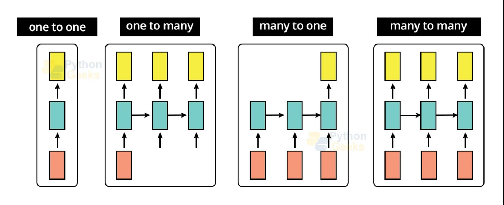
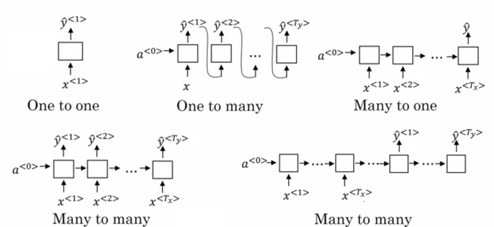
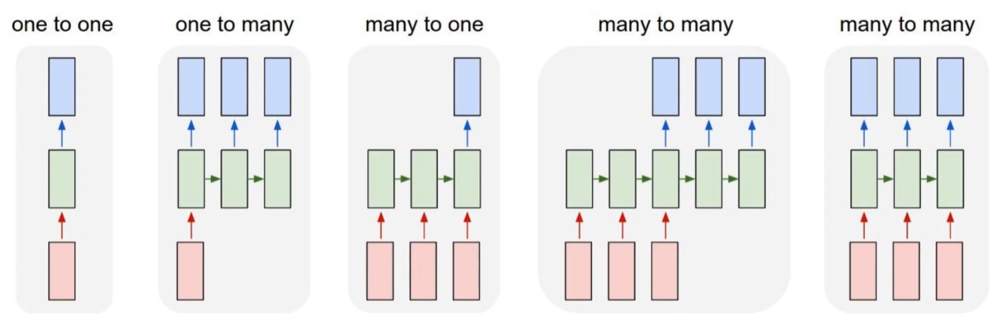

# Day_058 | Types of RNN

The different types of RNN architectures are classified based on the relationship between the number of inputs and the number of outputs in a sequence, often called **Sequence-to-Sequence (Seq2Seq)** models.

Here are the four primary types of RNN architectures:

---

## 🔁 Types of RNN Architectures

### 1. One-to-One (Standard ANN/MLP)

This is the traditional model used when there are no sequence dependencies.

* **Inputs:** One single input ($x$).
* **Outputs:** One single output ($y$).
* **Use Case:** This is the standard **Artificial Neural Network (ANN)** or **Multi-Layer Perceptron (MLP)** structure. It's used for tasks like image classification (one image input $\rightarrow$ one label output) or basic regression on tabular data.
* **Example:** Classifying a single image of a cat as "Cat."

### 2. One-to-Many

The network takes a single input and generates a sequence as output.

* **Inputs:** One single input ($x$).
* **Outputs:** A sequence of outputs ($y_1, y_2, \dots, y_T$).
* **Mechanism:** The single input is typically fed into the RNN at the first time step, and the network then uses the internal hidden state to generate a sequence of outputs.
* **Use Case:** **Image Captioning** (Image $\rightarrow$ "A cat sitting on a rug"), **Music Generation** (single input note/style $\rightarrow$ sequence of notes).
* **Example:** Given an image, generate a descriptive sentence. 

### 3. Many-to-One

The network takes an input sequence and produces a single output.

* **Inputs:** A sequence of inputs ($x_1, x_2, \dots, x_T$).
* **Outputs:** One single output ($y$).
* **Mechanism:** The network processes the entire input sequence, and the final hidden state ($h_T$), which summarizes all context, is used to generate the single output.
* **Use Case:** **Sentiment Analysis** (Sentence $\rightarrow$ Positive/Negative), **Text Classification** (Document $\rightarrow$ Topic), **Video Classification** (Sequence of frames $\rightarrow$ Single label of action).
* **Example:** Analyzing a movie review sentence to determine if the sentiment is positive.

### 4. Many-to-Many

This is the most flexible type, where both the input and output are sequences. It has two common variations:

#### A. Synchronous (Output sequence length = Input sequence length)
* **Inputs:** A sequence of inputs ($x_1, x_2, \dots, x_T$).
* **Outputs:** A corresponding sequence of outputs ($y_1, y_2, \dots, y_T$).
* **Mechanism:** An output is generated at every time step.
* **Use Case:** **Video Frame-by-Frame Classification** (Labeling the activity in each frame), **Part-of-Speech Tagging** (Word $\rightarrow$ Noun/Verb/Adjective), **Time Series Prediction** (Predicting the next value in a sequence).
* **Example:** Predicting the stock price for the next 5 days based on the last 5 days.

#### B. Asynchronous (Encoder-Decoder)
* **Inputs:** A sequence of inputs ($x_1, x_2, \dots, x_M$).
* **Outputs:** A sequence of outputs ($y_1, y_2, \dots, y_T$), where $M$ is often $\neq T$.
* **Mechanism:** The network consists of an **Encoder** (processes the input sequence to generate a context vector) and a **Decoder** (uses the context vector to generate the output sequence). There is a delay between the input sequence and the output sequence.
* **Use Case:** **Machine Translation** (Sentence in one language $\rightarrow$ Sentence in another language), **Sequence Summarization**.
* **Example:** Translating an English sentence into a German sentence. 

## 🔄 **RNN Architectures**

## 1. **One-to-One**

**Also called:** Vanilla neural network (not really sequence modeling)

* **Input:** Single value
* **Output:** Single value

**Use case examples:**

* Image classification
* Simple regression
* Non-sequence tasks

**Diagram:**

```
Input → RNN → Output
```

---

## 2. **One-to-Many**

**Also called:** Sequence generation from a single input

* **Input:** Single value
* **Output:** Sequence

**Use case examples:**

* Image captioning (1 image → many words)
* Music generation from a starting note

**Diagram:**

```
Input → RNN → Output1 → Output2 → Output3 → ...
```

---

## 3. **Many-to-One**

**Most common RNN usage**

* **Input:** Sequence
* **Output:** Single value

**Use case examples:**

* Sentiment analysis (sequence of words → 1 label)
* Sequence classification
* Document classification

**Diagram:**

```
Input1 → Input2 → Input3 → ... → RNN → Output
```

---

## 4. **Many-to-Many**

Two variants:

### **(A) Many-to-Many (synchronous)**

Input and output sequences have **same length**.

**Use case examples:**

* Named Entity Recognition (NER)
* POS tagging
* Time-series forecasting with per-step predictions

**Diagram:**

```
I1 → I2 → I3 → ...  
↓   ↓   ↓  
O1  O2  O3  ...
```

---

### **(B) Many-to-Many (sequence-to-sequence / seq2seq)**

Input and output lengths **differ**, and output begins after the input ends.

**Use case examples:**

* Machine translation
* Chatbots
* Speech-to-text

**Diagram:**

```
Encoder RNN          Decoder RNN
I1 → I2 → I3 → ... → [context] → O1 → O2 → O3 → ...
```

---

## 🧠 **Summary Table**

| Type                   | Input    | Output                      | Applications                                |
| ---------------------- | -------- | --------------------------- | ------------------------------------------- |
| One-to-One             | Single   | Single                      | Classification (non-sequence)               |
| One-to-Many            | Single   | Sequence                    | Image captioning, music generation          |
| Many-to-One            | Sequence | Single                      | Sentiment analysis, sequence classification |
| Many-to-Many (aligned) | Sequence | Sequence (same length)      | NER, POS tagging                            |
| Many-to-Many (seq2seq) | Sequence | Sequence (different length) | Translation, chatbot                        |

---

## Images


