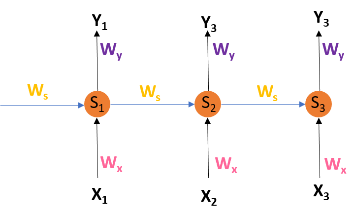

# Day_059 | 🔄 Backpropagation Through Time (BPTT)

**Backpropagation Through Time (BPTT)** is the specific name given to the algorithm used to train Recurrent Neural Networks (RNNs). It is simply the application of the standard **Backpropagation** algorithm, extended to account for the recurrent nature of the network across its entire time sequence.

---

## 💡 The Core Idea

Since an RNN is conceptually a very deep feedforward network when **unrolled** across time steps, BPTT treats it as such. It calculates the gradient of the loss function with respect to the RNN's shared weights by summing up the contributions of the gradient at *each time step*.

### Why Time Matters

In a standard ANN, the gradient flows only backward through the layers. In an RNN, the gradient must flow backward not only through the layers but also **backward through the time steps** to account for how the hidden state at $t-1$ contributed to the output at $t$.

## ⚙️ The BPTT Process

The goal of BPTT is to find the gradient of the total loss ($\mathbf{L}$) with respect to the shared recurrent weights ($\mathbf{W}_{hh}$), the input weights ($\mathbf{W}_{xh}$), and the output weights ($\mathbf{W}_{hy}$).

The total loss $\mathbf{L}$ is typically calculated as the sum of the losses at each time step $t$:

$$
\mathbf{L} = \sum_{t=1}^{T} \mathbf{L}_t(\mathbf{y}_t, \text{target}_t)
$$

### 1. The Output Layer Gradient (Standard Backprop)

At each time step $t$, the error signal ($\boldsymbol{\delta}_t$) is first calculated at the output layer, exactly as in a standard ANN:

$$
\boldsymbol{\delta}_t^{\text{out}} = \frac{\partial \mathbf{L}_t}{\partial \mathbf{y}_t} \odot g'_y(\mathbf{z}_t^{\text{out}})
$$

### 2. The Recurrent Backpropagation Step (The Chain Rule across Time)

This is the BPTT-specific step. The gradient for the weights $\mathbf{W}_{hh}$ and $\mathbf{W}_{xh}$ depends on the sum of the gradients from all preceding time steps.

To find the error signal at the hidden layer $\boldsymbol{\delta}_t^{\text{h}}$, we must consider two sources of error flowing into the hidden layer at time $t$:

1.  **From the Output:** The gradient flowing directly from the output $\mathbf{y}_t$.
2.  **From the Future:** The gradient flowing backward from the next hidden state, $\boldsymbol{\delta}_{t+1}^{\text{h}}$.

$$
\boldsymbol{\delta}_t^{\text{h}} = \left( (\mathbf{W}_{hy})^T \boldsymbol{\delta}_t^{\text{out}} + (\mathbf{W}_{hh})^T \boldsymbol{\delta}_{t+1}^{\text{h}} \right) \odot g'_h(\mathbf{z}_t^{\text{h}})
$$

This calculation is repeated iteratively backward from $t=T$ to $t=1$. The gradient at time $t$ has a long chain of multiplications:

$$
\frac{\partial \mathbf{L}}{\partial \mathbf{W}_{hh}} = \sum_{t=1}^{T} \frac{\partial \mathbf{L}_t}{\partial \mathbf{W}_{hh}}
$$

### 3. Total Gradient Calculation

The final gradient for a weight matrix (e.g., $\mathbf{W}_{hh}$) is the **sum** of the gradients calculated at every single time step.

$$
\frac{\partial \mathbf{L}}{\partial \mathbf{W}} = \sum_{t=1}^{T} \frac{\partial \mathbf{L}_t}{\partial \mathbf{W}}
$$

This summation is vital because it ensures that the weight updates account for the influence of that weight across the entire sequence, enforcing the **parameter sharing** principle.

---

## ⚠️ Challenges of BPTT

Because the gradient involves multiplying the same recurrent weight matrix ($\mathbf{W}_{hh}$) many times (once for each time step), RNNs are highly susceptible to instability:

* **Vanishing Gradient Problem:** If the spectral radius of $\mathbf{W}_{hh}$ is less than 1, gradients shrink exponentially as they propagate backward in time. This prevents the network from learning long-term dependencies (i.e., the first words in a long sentence have no effect on the end).
* **Exploding Gradient Problem:** If the spectral radius of $\mathbf{W}_{hh}$ is greater than 1, gradients grow exponentially, leading to numerical overflow and chaotic updates. This is often mitigated using **Gradient Clipping**.

These problems necessitated the invention of more advanced recurrent architectures, namely **LSTMs** and **GRUs**.


---

## 🔄 **Backpropagation in RNN (Backpropagation Through Time – BPTT)**

## ⭐ 1. Why BPTT is needed

In a Recurrent Neural Network (RNN), the same network layer is applied **repeatedly over time** as it processes a sequence:

```
x1 → h1 → y1  
x2 → h2 → y2  
x3 → h3 → y3  
...
```

Where:

* ( $h_t$ ) = hidden state at time ( t )
* ( $x_t$ ) = input at time ( t )
* ( $y_t$ ) = output at time ( t )

Each hidden state depends on:

* the current input
* the previous hidden state

So the output at time ( t ) depends on **all previous time steps**.

Therefore, gradients must flow through **all time steps**, hence the name:

## **Backpropagation Through Time (BPTT)**.

---

## ⭐ 2. BPTT Step-by-Step

### **Step 1: Unroll the RNN**

We "unroll" the RNN across time:

```
h0 → h1 → h2 → h3 → ... → hT
```

This exposes all the repeated layers so we can apply regular backpropagation.

---

## ⭐ 3. Forward Pass

For each time step ( t ):

### Hidden state:

$$
h_t = f(W_{xh}x_t + W_{hh}h_{t-1} + b_h)
$$

### Output:

$$
y_t = g(W_{hy}h_t + b_y)
$$

### Loss:

If total loss is the sum of losses at each step:

$$
L = \sum_{t=1}^{T} L_t
$$

---

## ⭐ 4. Backward Pass (Core Idea)

We compute gradients of ( L ) with respect to:

* recurrent weights ( $W_{hh}$ )
* input weights ( $W_{xh}$ )
* output weights ( $W_{hy}$ )
* hidden states

### The challenge:

Since the same weight matrix is used at every time step, we must **accumulate gradients across all time steps**.

---

## ⭐ 5. Gradients Through Time

### Gradient w.r.t hidden state:

$$
\frac{\partial L}{\partial h_t} = \frac{\partial L_t}{\partial h_t}

* \frac{\partial L_{t+1}}{\partial h_t}
* \frac{\partial L_{t+2}}{\partial h_t}
* ...
$$

This is where RNNs struggle with **vanishing or exploding gradients**.

---

### Gradient w.r.t recurrent weight ( W_{hh} ):

$$
\frac{\partial L}{\partial W_{hh}}
= \sum_{t=1}^{T}
\frac{\partial L}{\partial h_t}
\frac{\partial h_t}{\partial W_{hh}}
$$

Gradient is summed over **all time steps**.

---

### Gradient w.r.t input weight ( W_{xh} ):

$$
\frac{\partial L}{\partial W_{xh}}
= \sum_{t=1}^{T}
\frac{\partial L_t}{\partial h_t}
\frac{\partial h_t}{\partial x_t}
$$

---

### Gradient w.r.t output weight ( W_{hy} ):

$$
\frac{\partial L}{\partial W_{hy}}
= \sum_{t=1}^{T}
\frac{\partial L_t}{\partial y_t}
\frac{\partial y_t}{\partial h_t}
$$

---

## ⭐ 6. Final Step: Update Weights

Using any optimizer:

$$
W = W - \eta \cdot \frac{\partial L}{\partial W}
$$

This happens for all:

* ( $W_{xh}$ )
* ( $W_{hh}$ )
* ( $W_{hy}$ )

---

## ⭐ 7. Important: Why Gradients Vanish/Explode

Because during BPTT, repeated multiplication occurs:

$$
\frac{\partial L}{\partial h_t}
= \frac{\partial L_{t+1}}{\partial h_{t+1}}
\cdot
\frac{\partial h_{t+1}}{\partial h_t}
$$

And:

$$
\frac{\partial h_{t+1}}{\partial h_t}
\approx W_{hh}
$$

If eigenvalues of ( $W_{hh}$ ):

* < 1 → **vanishing gradient**
* > 1 → **exploding gradient**

This is why:\
✔ LSTM\
✔ GRU\
✔ Gradient clipping

are used.

---

## ⭐ 8. Types of BPTT

## **1. Full BPTT**

* Backpropagate through the entire sequence.
* Accurate but slow.

## **2. Truncated BPTT**

* Only backpropagate through last *k* steps (e.g., last 20 steps).
* Common in training long sequences (e.g., language models).

---

## ⭐ 9. Intuitive Summary

Here’s the **simplest understanding**:

1. Unroll RNN across time
2. Do normal forward propagation
3. Compute loss at each time step
4. Backpropagate error from last step back to the first
5. Sum gradients across all time steps
6. Update weights

---

## Images

