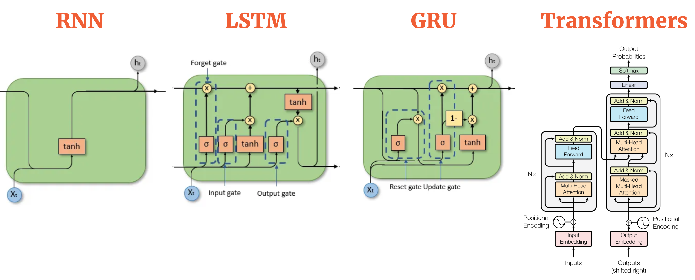
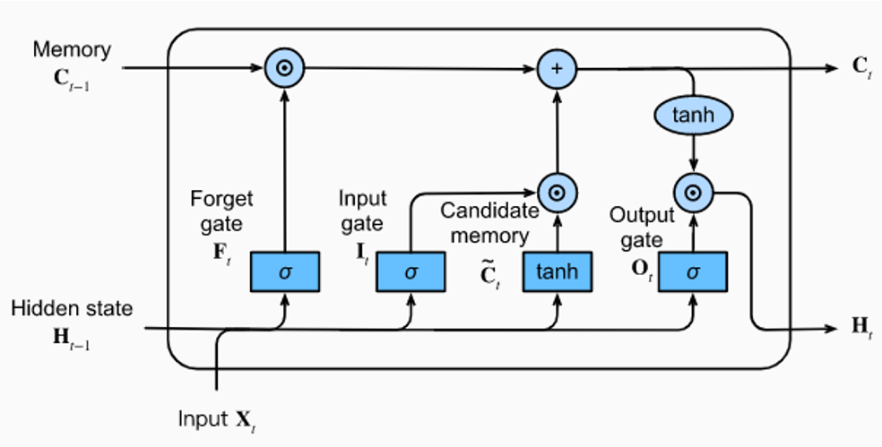
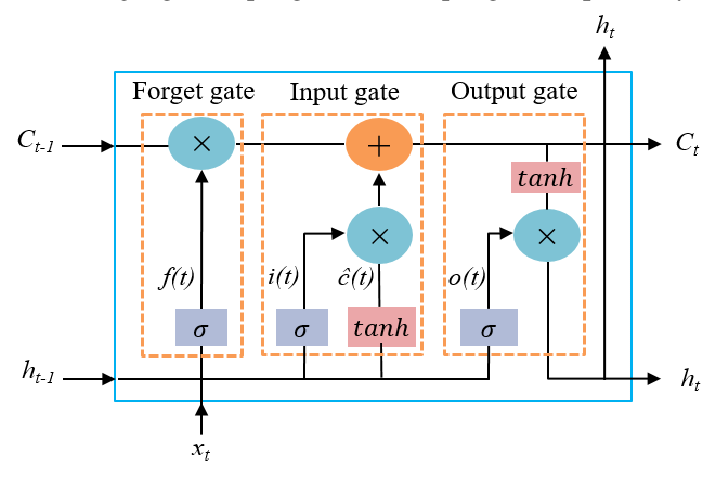
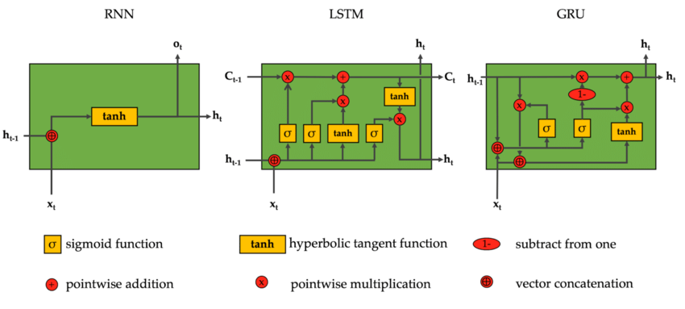
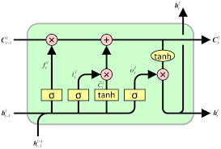

# Day_061 | 🧠 LSTM: Long Short-Term Memory | LSTM | Part 1 | The What?

## 🧠 LSTM: Long Short-Term Memory

**Long Short-Term Memory (LSTM)** is a special kind of **Recurrent Neural Network (RNN)** architecture designed to solve the **vanishing gradient problem**. It was introduced to effectively model and learn **long-term dependencies** in sequence data.

In essence, LSTMs are specialized RNN units that have an internal mechanism, called **gates**, that regulate the flow of information, allowing them to selectively **remember** or **forget** data over extended periods.

---

## 💡 The Core Intuition: The Cell State (The Memory Highway)

The key component that sets the LSTM apart from a simple RNN is the **Cell State ($C_t$)**.

* **Standard RNN:** Information flows through the single hidden state ($h_t$), which is constantly being overwritten. This makes it vulnerable to vanishing gradients.
* **LSTM:** The Cell State ($C_t$) acts as a separate **memory highway** running straight through the entire sequence. It allows information to flow mostly unchanged. The three gates simply introduce a few key linear and non-linear interactions to regulate this flow.

This nearly linear path for the Cell State ensures that the gradient can flow backward much more easily, solving the vanishing gradient issue and allowing the network to retain information from hundreds of time steps ago.

---

## 🚪 The Four Components of an LSTM Cell

The magic of the LSTM happens inside the cell, where there are four main components that interact with the input ($x_t$), the previous hidden state ($h_{t-1}$), and the previous cell state ($C_{t-1}$):

1.  **Three Gates:** These are the regulating structures, typically built using a **Sigmoid** activation function ($\sigma$). A sigmoid output of 0 means "let nothing pass," and an output of 1 means "let everything pass."
    * **Forget Gate ($f_t$):** Decides what information to throw away from the previous Cell State $C_{t-1}$.
    * **Input Gate ($i_t$):** Decides what new information from the current input $x_t$ is relevant and should be stored in the Cell State.
    * **Output Gate ($o_t$):** Decides what part of the Cell State $C_t$ should be exposed as the current **Hidden State ($h_t$)**.
2.  **The Candidate Memory ($\tilde{C}_t$):** A $\tanh$ layer that creates a vector of new candidate values (potential new information) that could be added to the Cell State.

Here is **Part 1** of LSTM explained in the clearest, beginner-friendly way:
**“The WHAT?” — What is an LSTM?**
(No equations yet, just the concept.)

---

## 🟦 **LSTM (Long Short-Term Memory) — Part 1: The WHAT?**

## ⭐ **What is an LSTM?**

**LSTM is a special type of Recurrent Neural Network (RNN)** designed to **remember information for long periods of time**.

Traditional RNNs forget information quickly due to **vanishing gradients**.
LSTMs were invented to solve this.

---

## ⭐ **Simple Definition**

**LSTM is an advanced RNN that uses gates to decide:**

1. **What to remember**
2. **What to forget**
3. **What to output**

It has a built-in **memory cell** that can carry information across many time steps.

---

## ⭐ Why is it called “Long Short-Term Memory”?

Because it can store **long-term information** while still handling **short-term inputs**.

* “Short-Term” → the current input and recent steps
* “Long-Term” → what needs to be remembered far into the future

Traditional RNNs only had short-term memory.
LSTM gives them **long + short-term memory**.

---

## ⭐ **How is LSTM different from a simple RNN?**

### 🔴 RNN:

* Has **one hidden state**
* Forgets quickly
* Suffers from vanishing gradient
* Can’t learn long-range dependencies (e.g., remembering a subject far apart in a sentence)

### 🟢 LSTM:

* Has **two states**:

  * hidden state (**hₜ**)
  * cell state (**cₜ**) ← **long-term memory**
* Uses gates (forget, input, output) to control information
* Solves vanishing gradient problem
* Learns long-range dependencies successfully

---

## ⭐ **What Problems Does LSTM Solve?**

### 1. **Vanishing Gradients**

LSTM’s cell state maintains information over time → gradient doesn’t vanish easily.

### 2. **Long-Term Dependency**

LSTM can remember information from **hundreds of time steps** back.

### 3. **Selective Memory**

LSTM remembers only what is useful → forgets irrelevant details.

---

## ⭐ **Where do we use LSTMs?**

✔ Natural language processing
✔ Machine translation
✔ Speech recognition
✔ Time series forecasting
✔ Music generation
✔ Video classification
✔ Stock prediction

Basically: **Any problem involving sequences over time**.

---

## 🟩 QUICK SUMMARY — PART 1 (The WHAT?)

* LSTM is an improved RNN.
* It is designed to **remember long-term information**.
* It uses a **memory cell** + **gates** to control information flow.
* It solves the **vanishing gradient problem**.
* It is widely used in sequence tasks.

---

## Images

