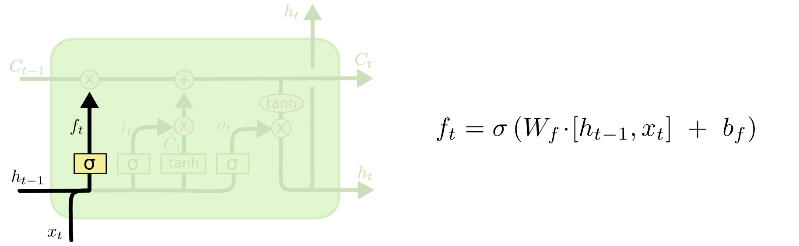
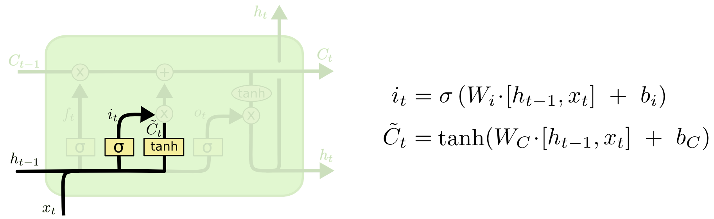
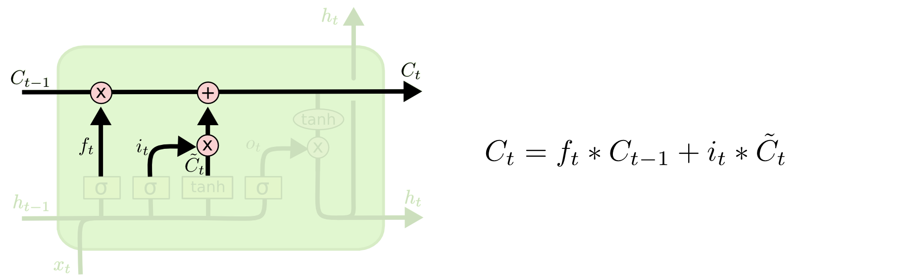
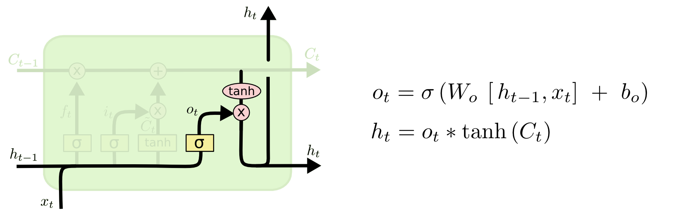

# Day_062 | LSTM Architecture | Part-2 | How

## 🧠 LSTM Architecture: How the Gates Work

The **Long Short-Term Memory (LSTM)** cell uses three key **gates** to control the flow of information into and out of the **Cell State ($C_t$)**, which serves as the network's long-term memory. All gates use the **Sigmoid function ($\sigma$)** to output values between 0 and 1, acting as digital regulators.

The calculation at time $t$ uses the current input ($x_t$) and the previous hidden state ($h_{t-1}$).

---

## 1. The Forget Gate ($\mathbf{f}_t$)

The Forget Gate decides what information to discard from the previous cell state, $C_{t-1}$.

* **Calculation:** It looks at $h_{t-1}$ and $x_t$ and outputs a number between 0 and 1 for each number in the cell state.

$$
\mathbf{f}_t = \sigma(\mathbf{W}_f \cdot [h_{t-1}, x_t] + \mathbf{b}_f)
$$

* **Action:** A value of **0** means completely **forget** the old information, and a value of **1** means completely **keep** it.
* **Intuition:** If the input sequence is a new sentence, the Forget Gate might output 1 for the grammar rules learned from the previous sentence but output 0 for the previous sentence's specific subject and context.

---

## 2. The Input Gate ($\mathbf{i}_t$)

The Input Gate decides what new information from the current input, $x_t$, will be stored in the Cell State. This involves two sub-steps:

### A. The Input Gate Layer
* **Calculation:** Uses a Sigmoid function to decide which values to update (i.e., which values are important enough to change the cell state).

$$
\mathbf{i}_t = \sigma(\mathbf{W}_i \cdot [h_{t-1}, x_t] + \mathbf{b}_i)
$$

### B. The Candidate Memory ($\mathbf{\tilde{C}}_t$)
* **Calculation:** Uses the **$\tanh$ function** to create a vector of new candidate values (potential additions) that could be added to the cell state. The $\tanh$ function squashes values to the range $[-1, 1]$.

$$
\mathbf{\tilde{C}}_t = \tanh(\mathbf{W}_C \cdot [h_{t-1}, x_t] + \mathbf{b}_C)
$$

---

## 3. The New Cell State ($\mathbf{C}_t$)

The new Cell State is created by combining the Forget and Input decisions:

* **Mechanism:**
    1.  The **old cell state ($C_{t-1}$) is multiplied element-wise by the Forget Gate ($\mathbf{f}_t$)**—this is the "forgetting" step.
    2.  The **candidate memory ($\mathbf{\tilde{C}}_t$) is multiplied element-wise by the Input Gate ($\mathbf{i}_t$)**—this is the "inputting" step.
    3.  The results from 1 and 2 are **added** to create the new cell state.
* **Calculation:**

$$
\mathbf{C}_t = \mathbf{f}_t \odot \mathbf{C}_{t-1} + \mathbf{i}_t \odot \mathbf{\tilde{C}}_t
$$

---

## 4. The Output Gate ($\mathbf{h}_t$)

The Output Gate decides what part of the Cell State will be visible as the **Hidden State ($\mathbf{h}_t$)**, which is then passed to the next layer and the next time step.

### A. The Output Gate Layer
* **Calculation:** Uses a Sigmoid function to decide which parts of the cell state are relevant for the current output.

$$
\mathbf{o}_t = \sigma(\mathbf{W}_o \cdot [h_{t-1}, x_t] + \mathbf{b}_o)
$$

### B. The New Hidden State
* **Mechanism:** The new Cell State ($\mathbf{C}_t$) is run through the $\tanh$ function to squash the values (preparing them to be the output) and then multiplied element-wise by the Output Gate ($\mathbf{o}_t$).
* **Calculation:**

$$
\mathbf{h}_t = \mathbf{o}_t \odot \tanh(\mathbf{C}_t)
$$

This final hidden state, $h_t$, is the output of the LSTM cell at time $t$ and is used as $h_{t-1}$ in the next iteration. 

---

## 1️⃣ Recap: Why LSTMs?

Traditional RNNs struggle with **long-term dependencies** because of vanishing/exploding gradients. LSTMs solve this by introducing **gates** that control information flow.

---

## 2️⃣ The LSTM Cell: Step-by-Step

An LSTM cell has **three gates** and a **cell state**:

1. **Forget Gate $(f_t)$** – decides what information to discard.
2. **Input Gate $(i_t)$** – decides what new information to store.
3. **Output Gate $(o_t)$** – decides what information to output.

### a) Forget Gate

This gate looks at the previous hidden state ($h_{t-1}$) and the current input (($x_t$)):

$$
f_t = \sigma(W_f \cdot [h_{t-1}, x_t] + b_f)
$$

* ($\sigma$) is the sigmoid function (outputs 0–1, acting like a “filter”).
* 0 = completely forget, 1 = completely keep.

---

### b) Input Gate & Candidate Values

Decides what new information to add:

1. **Input gate:**

$$
i_t = \sigma(W_i \cdot [h_{t-1}, x_t] + b_i)
$$

2. **Candidate values (new memory content):**

$$
\tilde{C}*t = \tanh(W_C \cdot [h*{t-1}, x_t] + b_C)
$$

* ($i_t$) decides *how much* of $(\tilde{C}_t)$ to write to the cell.

---

### c) Update Cell State

The cell state $(C_t)$ is updated:

$$
C_t = f_t \cdot C_{t-1} + i_t \cdot \tilde{C}_t
$$

* This is the “memory” of the LSTM.
* **Forget old info + add new info**.

---

### d) Output Gate

Decides what to output:

$$
o_t = \sigma(W_o \cdot [h_{t-1}, x_t] + b_o)
$$

Then the hidden state (h_t) is:

$$
h_t = o_t \cdot \tanh(C_t)
$$

* The output is filtered through the output gate and scaled by ($\tanh$) of the cell state.

---

## 3️⃣ Summary: Flow Inside LSTM

1. **Decide what to forget** →  $f_t$
2. **Decide what new info to add** → $i_t$ & $\tilde{C}_t$
3. **Update cell memory** → $C_t$
4. **Decide output** → $o_t$
5. **Compute hidden state** → $h_t$

> Think of it as a train of thought: the gates are your brain’s attention, deciding what to remember, what to ignore, and what to express.

---

## 4️⃣ Quick Diagram (Text Version)

```
x_t ----> |           |
          |  LSTM     | ---> h_t
h_{t-1} ->|  Cell     |
          |           |
C_{t-1} --+--> C_t ---+
```

* The gates sit inside the LSTM cell.
* ($C_t$) is like a conveyor belt for long-term memory.

---


## Images







# Videos
[LSTM-video](assets/m2-res_480p.mp4)