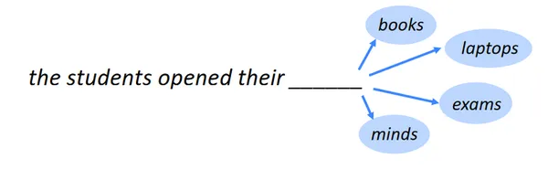
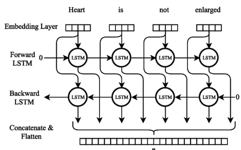

# Day_061 | LSTM | Part-3 | Next Word Predictor with LSTM in Keras

The **Next Word Predictor** is a classic application of the **Many-to-One** or **Many-to-Many (Synchronous)** Recurrent Neural Network architecture. We use an **LSTM** network due to its ability to capture long-range contextual dependencies within the training text.

-----

### 1\. How the Model Works

The model learns to predict the next word in a sequence based on all the preceding words.

1.  **Sequence Creation:** The input text is first tokenized (split into words). Training examples are created by sliding a window across the text, where the **input sequence ($X$)** is a string of $N$ words, and the **target ($Y$)** is the $(N+1)^{th}$ word.
      * *Example:* For the sentence "The quick brown fox," and $N=3$:
          * Input ($X$): "The quick brown"
          * Target ($Y$): "fox"
2.  **Embedding:** Each word index in the input sequence is converted into a dense vector via the **Embedding layer**. This transforms sparse word IDs into a lower-dimensional, meaningful representation.
3.  **LSTM Processing:** The sequence of embeddings is fed into the **LSTM layer**. The LSTM processes the words sequentially, using its internal gates (Input, Forget, Output) to build a final **contextual hidden state** that summarizes the entire input sequence.
4.  **Prediction:** The final hidden state is passed to a **Dense output layer**. This layer has a size equal to the entire vocabulary and uses the **Softmax activation function** to output a probability distribution over every possible word in the vocabulary, indicating the most likely next word.
5.  **Loss:** The model is trained using **Categorical Cross-Entropy** loss, which penalizes the model when the predicted probability distribution is far from the true next word.

-----

### 2\. Keras Architecture for Next Word Prediction

The architecture is typically a **Many-to-One** model, where the entire input sequence is collapsed into a single prediction.

> Python
```python
from tensorflow.keras.models import Sequential
from tensorflow.keras.layers import Embedding, LSTM, Dense, Dropout

# Hyperparameters (must be determined from your corpus)
VOCAB_SIZE = 15000  # Total unique words + 1 (for 0-padding)
SEQ_LENGTH = 10     # Length of the input sequence (N words)
EMBEDDING_DIM = 100 

model = Sequential([
    # 1. Embedding Layer: Converts word indices to dense vectors.
    Embedding(VOCAB_SIZE, EMBEDDING_DIM, input_length=SEQ_LENGTH),
    
    # 2. LSTM Layer: Processes the sequence and maintains context.
    # We use return_sequences=False as we only need the final hidden state 
    # to predict the next word (Many-to-One).
    LSTM(units=128),
    
    # 3. Dropout Layer: Regularization to prevent overfitting.
    Dropout(0.2),
    
    # 4. Output Layer: Predicts the next word probability.
    # Output size is equal to VOCAB_SIZE, with Softmax activation.
    Dense(VOCAB_SIZE, activation='softmax')
])

model.compile(loss='categorical_crossentropy', optimizer='adam', metrics=['accuracy'])
```

-----

## 3\. Challenges and Solutions

Building an effective text generation model presents several data and computational challenges:

| Problem | Cause | Solution (How to Overcome) |
| :--- | :--- | :--- |
| **High Dimensionality Output** | The output layer size is equal to the **vocabulary size** (e.g., 15,000 to 50,000). The Softmax calculation is slow, and the output layer has a huge number of parameters. | **Vocabulary Filtering:** Prune the vocabulary to only include the top $K$ most frequent words, replacing rare words with an `<UNK>` token. |
| **Data Sparsity** | Language is vast. Even small corpora have thousands of unique words, leading to sparsely populated one-hot vectors and poor gradient signals. | **Embedding Layer:** The embedding layer transforms sparse input into dense vectors, significantly reducing dimensionality and capturing semantic relationships. |
| **Short-Term Memory** | The standard issue of simple RNNs. The model struggles to link words separated by many steps (e.g., 20+ words). | **Use LSTM (or GRU):** The gating mechanisms in LSTMs are specifically designed to overcome this by mitigating the **vanishing gradient problem**. |
| **Overfitting** | Training data is often repetitive, causing the model to memorize phrases instead of learning grammar rules. | **Dropout:** Use dropout layers (e.g., $20\%$) to randomly zero out activations, forcing the network to learn more robust feature representations. |
| **Long Sequence Processing** | Processing very long texts (e.g., full documents) can be slow, and BPTT can still struggle. | **Fixed Sequence Length:** Standardize all input sequences to a fixed, manageable length (e.g., 10-50 words) using `pad_sequences`. Longer sequences are truncated; shorter sequences are padded with zeros. |

---

## LSTM Next Word Predictor Using Keras – Documentation

## 1. Overview

A **Next Word Predictor** is a model that predicts the next word in a sequence given a context of previous words. This is commonly used in text generation, autocomplete systems, and conversational AI.

**LSTM (Long Short-Term Memory)** networks are a type of recurrent neural network (RNN) capable of learning long-term dependencies, which makes them suitable for sequence prediction tasks like next-word prediction.

**Keras** provides a high-level API for building LSTM-based models efficiently.

---

## 2. How It Works

The workflow of an LSTM next-word predictor typically involves the following steps:

### 2.1 Data Preparation

1. **Text Cleaning**: Remove special characters, lowercasing, and tokenization.
2. **Tokenization**: Convert words to integers using Keras `Tokenizer`.
3. **Sequence Creation**: Create sequences of fixed length `n` where:

   ```
   sequence = [w1, w2, ..., wn] -> target = wn+1
   ```
4. **Padding**: Pad sequences to ensure uniform length using `pad_sequences`.

Example:

> Python
```python
text = "I love deep learning"
tokenizer.fit_on_texts([text])
sequences = tokenizer.texts_to_sequences([text])
# sequences: [[1, 2, 3, 4]]
```

---

### 2.2 Model Architecture

A typical LSTM-based next-word predictor includes:

1. **Embedding Layer**: Converts integer tokens into dense vectors.
2. **LSTM Layer(s)**: Captures sequence dependencies.
3. **Dense Layer**: Output layer with softmax activation to predict the probability of the next word.

Example:

> Python
```python
model = Sequential()
model.add(Embedding(input_dim=vocab_size, output_dim=50, input_length=max_seq_len-1))
model.add(LSTM(100))
model.add(Dense(vocab_size, activation='softmax'))

model.compile(loss='categorical_crossentropy', optimizer='adam', metrics=['accuracy'])
```

---

### 2.3 Model Training

* Use `categorical_crossentropy` as the loss function (for multi-class word prediction).
* `adam` is a common optimizer.
* Use one-hot encoding for the target word.

---

### 2.4 Prediction

* Given a seed sequence, the model predicts the next word.
* This word can be appended to the sequence to generate longer text iteratively.

```python
predicted_index = model.predict_classes(seed_sequence)
predicted_word = tokenizer.index_word[predicted_index[0]]
```

---

## 3. Common Problems During Model Building

1. **Memory Issues / Large Vocabulary**

   * Problem: Large text corpora lead to huge vocabularies and high memory usage.
   * Solution:

     * Limit vocabulary size using `num_words` in the tokenizer.
     * Use smaller embedding dimensions.
     * Use `pad_sequences` with `maxlen` to keep sequences short.

2. **Sequence Length Too Long**

   * Problem: Very long sequences can cause slow training and overfitting.
   * Solution:

     * Choose a reasonable sequence length (20–50 words).
     * Consider truncated backpropagation through time (handled internally by LSTM).

3. **Vanishing / Exploding Gradients**

   * Problem: RNNs suffer from unstable gradients for long sequences.
   * Solution:

     * Use LSTM or GRU layers instead of vanilla RNN.
     * Clip gradients using `clipvalue` or `clipnorm` in optimizer.

4. **Model Overfitting**

   * Problem: The model memorizes training sequences but fails to generalize.
   * Solution:

     * Add dropout in LSTM layers.
     * Reduce model complexity.
     * Use more training data.

5. **Slow Training**

   * Problem: LSTMs can be slow for large datasets.
   * Solution:

     * Use GPU acceleration.
     * Reduce embedding and LSTM size.
     * Consider using `CuDNNLSTM` in TensorFlow for faster training.

6. **Poor Predictions**

   * Problem: Model predicts repetitive or irrelevant words.
   * Solution:

     * Tune learning rate.
     * Increase training epochs gradually.
     * Use temperature sampling during text generation for diversity.

---

## 4. Tips for Better Performance

* **Pre-trained embeddings**: Use GloVe or Word2Vec for better semantic understanding.
* **Bidirectional LSTM**: Improves context comprehension.
* **Stacked LSTM layers**: Can capture more complex patterns.
* **Regularization**: Dropout and recurrent dropout help prevent overfitting.
* **Batch size tuning**: Smaller batch sizes often help in sequence prediction tasks.

---

## 5. Summary

An LSTM next-word predictor:

* **Learns context** from sequences of words.
* **Predicts the next word** in a sentence with probabilities over the vocabulary.
* **Handles long-term dependencies** better than standard RNNs.
* **Requires careful preprocessing, sequence length tuning, and vocabulary management** to avoid memory and overfitting issues.

---

## Images

q