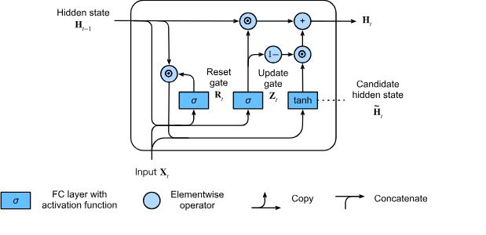
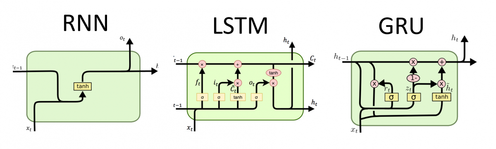
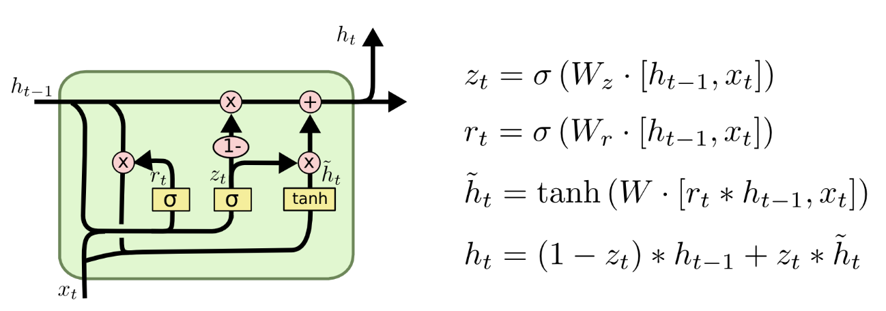
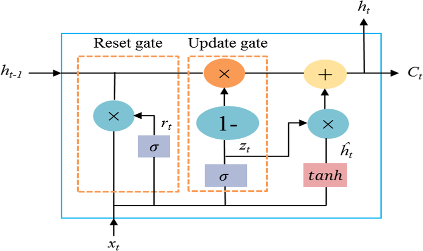

# Day_064 | 🧠 GRU (Gated Recurrent Unit) Explained

The **Gated Recurrent Unit (GRU)** is a powerful and more streamlined variant of the Recurrent Neural Network (RNN) architecture, developed by Kyunghyun Cho et al. in 2014. Like the LSTM, the GRU was specifically designed to solve the **vanishing gradient problem** and effectively capture **long-term dependencies** in sequential data.

---

## 🏗️ GRU Architecture

The GRU simplifies the LSTM cell structure by combining the functionality of the cell state and the hidden state into a single **Hidden State ($\mathbf{h}_t$)** and reducing the number of gates from three to two: the **Update Gate** and the **Reset Gate**.

### 1. Update Gate ($\mathbf{z}_t$)

The Update Gate controls how much of the **past information** (from $h_{t-1}$) should be carried over to the current hidden state ($h_t$).

* It acts as a combination of the Forget Gate and the Input Gate of the LSTM.
* A value close to **1** means the model retains old information (memory).
* A value close to **0** means the model focuses on the new input, essentially forgetting the past.

$$\mathbf{z}_t = \sigma(\mathbf{W}_z \cdot [\mathbf{h}_{t-1}, \mathbf{x}_t] + \mathbf{b}_z)$$

### 2. Reset Gate ($\mathbf{r}_t$)

The Reset Gate decides how much the new input ($\mathbf{x}_t$) should be combined with the past hidden state ($\mathbf{h}_{t-1}$) to form a **Candidate Hidden State ($\mathbf{\tilde{h}}_t$)**.

* A value close to **0** means the model largely ignores the past hidden state, effectively **resetting** the memory to focus on the current input.
* A value close to **1** means the model incorporates the full history.

$$\mathbf{r}_t = \sigma(\mathbf{W}_r \cdot [\mathbf{h}_{t-1}, \mathbf{x}_t] + \mathbf{b}_r)$$

### 3. Candidate Hidden State ($\mathbf{\tilde{h}}_t$)

The candidate hidden state represents the new, potential information calculated from the current input and the **reset** version of the previous hidden state.

$$\mathbf{\tilde{h}}_t = \tanh(\mathbf{W} \cdot [\mathbf{r}_t \odot \mathbf{h}_{t-1}, \mathbf{x}_t] + \mathbf{b})$$

### 4. Final Hidden State ($\mathbf{h}_t$)

The final hidden state is a linear combination of the previous state ($\mathbf{h}_{t-1}$) and the candidate state ($\mathbf{\tilde{h}}_t$), weighted by the update gate ($\mathbf{z}_t$):

$$\mathbf{h}_t = (\mathbf{1} - \mathbf{z}_t) \odot \mathbf{h}_{t-1} + \mathbf{z}_t \odot \mathbf{\tilde{h}}_t$$

* If $\mathbf{z}_t$ is close to 1, $\mathbf{h}_t$ mostly contains $\mathbf{\tilde{h}}_t$ (new information).
* If $\mathbf{z}_t$ is close to 0, $\mathbf{h}_t$ mostly retains $\mathbf{h}_{t-1}$ (old memory). 

---

## ⚖️ GRU vs. LSTM Differences

| Feature | LSTM (Long Short-Term Memory) | GRU (Gated Recurrent Unit) |
| :--- | :--- | :--- |
| **Memory Unit** | Separate **Cell State ($\mathbf{C}_t$)** for long-term memory. | Single **Hidden State ($\mathbf{h}_t$)** that serves as both output and memory. |
| **Number of Gates** | **Three** gates: Forget, Input, and Output. | **Two** gates: Update and Reset. |
| **Complexity** | More complex, higher computational cost. | Simpler, more streamlined, faster to train. |
| **Output Control**| The **Output Gate** explicitly controls what is exposed from the cell state. | The **Hidden State** is always fully exposed. |
| **Performance** | Often slightly better performance on very large, complex datasets. | Performs comparably to LSTM on many common tasks. |

---

## ✅ Advantages and Disadvantages

### Advantages (Adv.)

* **Computational Efficiency:** With fewer gates and parameters (LSTMs typically have 4 sets of weights, GRUs have 3), GRUs train and run faster than LSTMs.
* **Reduced Overfitting Risk:** Fewer parameters mean less risk of overfitting, especially on smaller datasets.
* **Effective Gradient Flow:** Like LSTMs, the gating mechanism provides linear pathways for the gradient, effectively solving the vanishing gradient problem.

### Disadvantages (Disadv.)

* **Slight Performance Trade-off:** In some highly complex tasks requiring meticulous control over the long-term memory, LSTMs can occasionally outperform GRUs due to the separation of the cell state and the explicit output gate.
* **Interpretability:** While simpler than LSTMs, the gate mechanisms still make GRUs complex compared to simple RNNs, making them less transparent.

---

## **Gated Recurrent Unit (GRU): A Comprehensive Overview**

## **1. Introduction**

A **Gated Recurrent Unit (GRU)** is a type of recurrent neural network (RNN) architecture introduced by **Cho et al. (2014)**. GRUs address the vanishing gradient problem and are designed for sequential data such as language, audio, time-series, and video.
GRUs are **simpler and more computationally efficient** than LSTMs while achieving comparable performance in many tasks.

---

## **2. GRU Architecture**

Unlike a traditional RNN, which maintains a simple hidden state, a GRU uses **gates** to selectively control the flow of information.

A GRU has **two gates**:

### **1️⃣ Update Gate (zₜ)**

* Determines how much of the previous hidden state should be carried forward.
* Works like a combination of LSTM’s input and forget gate.

### **2️⃣ Reset Gate (rₜ)**

* Determines how much past information to forget.
* Helps the model reset memory when needed.

### **Key Components**

* **Hidden state:** $( h_t )$
* **Input vector:** $( x_t )$
* **Weights:** $( W_z, W_r, W_h )$ and corresponding recurrent weights $( U_z, U_r, U_h )$

---

## **3. GRU Equations (Step-by-Step State Calculation)**

Below are the exact operations performed inside a GRU at each time step ( t ):

---

## **Step 1: Update Gate**

Controls how much past information should remain.

$$
z_t = \sigma(W_z x_t + U_z h_{t-1})
$$

---

## **Step 2: Reset Gate**

Controls how much of the previous state to forget.

$$
r_t = \sigma(W_r x_t + U_r h_{t-1})
$$

---

## **Step 3: Candidate Hidden State**

Uses reset gate to determine how much old info is used.

$$
\tilde{h}*t = \tanh(W_h x_t + U_h (r_t \odot h*{t-1}))
$$

---

## **Step 4: Final Hidden State**

A blend of the old state and the candidate state.

$$
h_t = (1 - z_t) \odot h_{t-1} + z_t \odot \tilde{h}_t
$$

### Interpretation

* If $( z_t )$ is close to 1 → mostly use **candidate** state (new info).
* If $( z_t )$ is close to 0 → keep **previous** state (long-term memory).

---

## **4. Diagram (Conceptual)**

```
             x_t
              │
         ┌────┴─────┐
         │  GRU Cell │
         └────┬─────┘
   ┌──────────┼──────────┐
reset gate   update gate  │
   r_t         z_t        │
                          ▼
                     h_t (output)
```

---

## **5. Difference Between GRU and LSTM**

| Feature        | GRU                                   | LSTM                                        |
| -------------- | ------------------------------------- | ------------------------------------------- |
| Gates          | 2 (update, reset)                     | 3 (input, forget, output)                   |
| Memory cell    | ❌ No separate cell state              | ✔ Has cell state (c_t)                      |
| Complexity     | Lower (fewer parameters)              | Higher                                      |
| Training speed | Faster                                | Slower                                      |
| Performance    | Comparable to LSTM                    | Often slightly better for long dependencies |
| Suitability    | Small datasets or lower compute needs | Longer sequences / more complex patterns    |

---

## **6. GRU vs LSTM Equations (Simplified)**

### **LSTM** has:

* Input gate $( i_t )$
* Forget gate $( f_t )$
* Output gate $( o_t )$
* Candidate cell state $( \tilde{c}_t )$
* Hidden state $( h_t )$
* Cell state $( c_t )$

### **GRU** merges:

* Input + forget gate → update gate $( z_t )$
* No output gate
* No cell state $( c_t )$, only hidden state $( h_t )$

---

## **7. Advantages of GRUs**

### ✔ **Faster training and inference**

Fewer parameters → computationally more efficient.

### ✔ **Less risk of overfitting**

Because the architecture is simpler.

### ✔ **Comparable performance to LSTM**

Often matches or exceeds LSTM on tasks like speech recognition, translation, and time-series prediction.

### ✔ **Handles vanishing gradients well**

Thanks to gating mechanisms.

### ✔ **Good for smaller datasets**

Less parameter-heavy than LSTMs.

---

## **8. Disadvantages of GRUs**

### ❌ No separate memory cell

Cannot explicitly control short-term vs. long-term memory as effectively as LSTM.

### ❌ May underperform on very long sequences

For extremely long dependencies (e.g., long documents), LSTMs sometimes perform better.

### ❌ Less expressive than LSTM

fewer gates = fewer degrees of control.

### ❌ Not as widely adopted for cutting-edge language models

Transformers now dominate most NLP tasks.

---

## **9. When to Use GRU**

Use GRUs when:

* You want **faster training**.
* You have **limited computational resources**.
* The dataset is **medium or small**.
* Tasks include:

  * Speech processing
  * Time-series forecasting
  * Sequence classification
  * Machine translation (small/medium models)
  * Video frame prediction

Avoid GRUs when:

* Your sequences are **very long**.
* You need **explicit long-term memory control**.
* You're working with **state-of-the-art NLP** (Transformers preferred).

---

## **10. Summary (Short Version)**

**GRU is a streamlined RNN with two gates (update & reset) that manages memory efficiently without a separate cell state.**
It’s simpler and faster than LSTM, with performance that’s often equally good.
Ideal for many practical sequence tasks, especially when compute is limited.

---


## Images





<!-- 
 -->