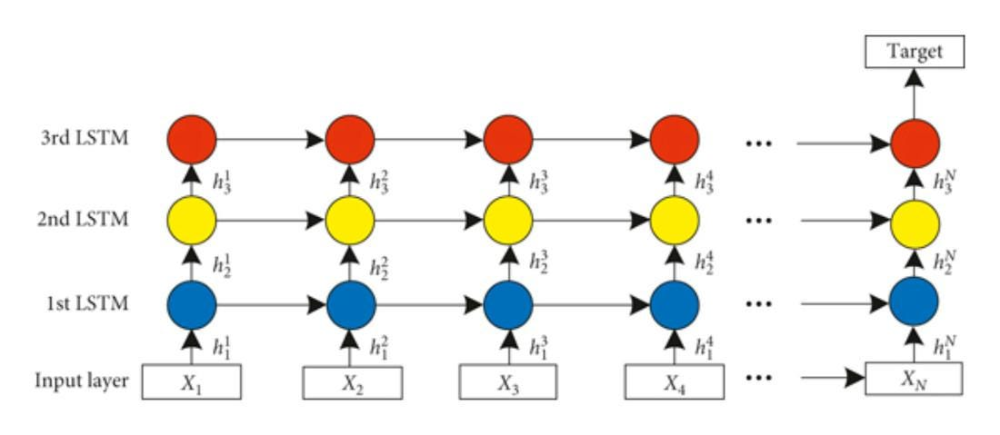
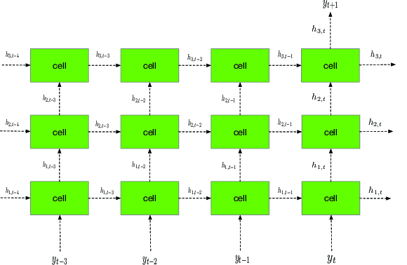
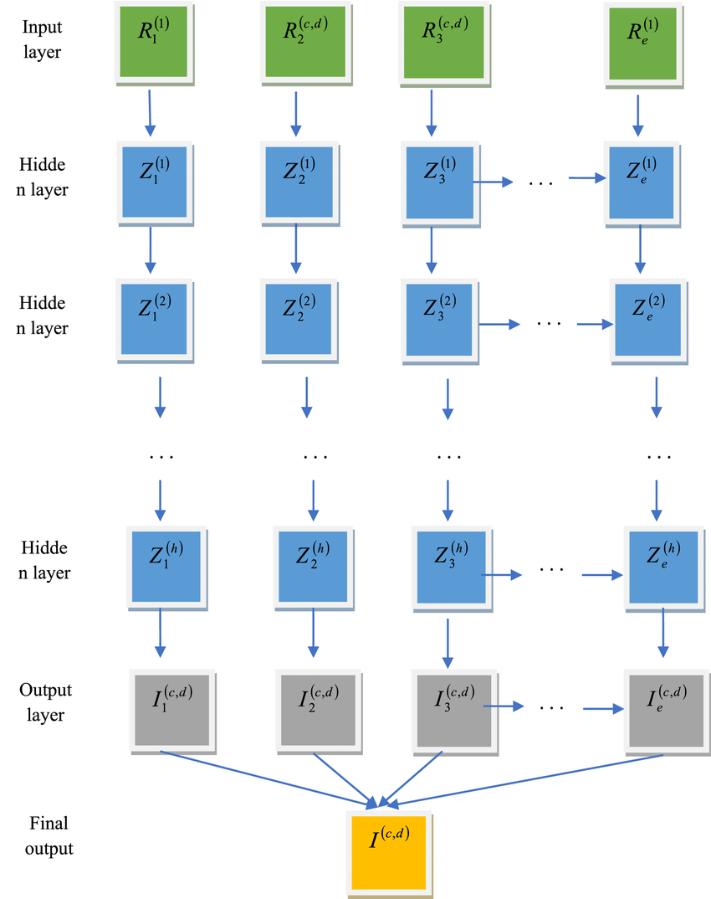
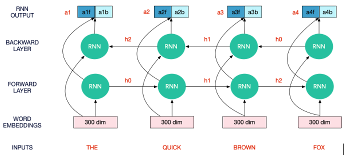
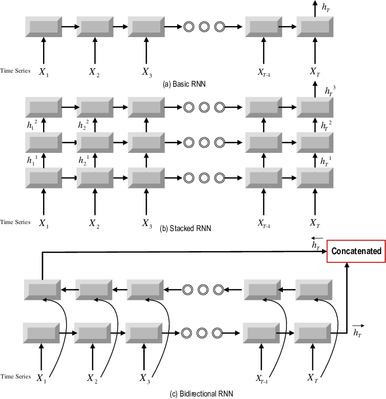

# Day_065 | 疊 Deep RNNs: Stacked Architectures

A **Deep RNN**, often referred to as a **Stacked RNN**, is a neural network architecture that uses multiple recurrent layers (like RNN, LSTM, or GRU) stacked on top of each other. This is analogous to stacking multiple fully connected or convolutional layers in a feedforward network.

The purpose of stacking is to allow the network to learn **hierarchical representations** of the input sequence, increasing the model's capacity and expressive power.

---

### 1. Stacked RNN Architecture

In a stacked architecture:

* **Layer 1:** The input sequence ($\mathbf{x}_t$) is processed by the first recurrent layer. This layer outputs a sequence of hidden states ($\mathbf{h}^{(1)}_t$).
* **Subsequent Layers:** The sequence of hidden states from one layer ($\mathbf{h}^{(l-1)}_t$) is treated as the input sequence for the next recurrent layer ($\mathbf{h}^{(l)}_t$).
* **The Key Requirement:** For information to flow up the stack, all recurrent layers except the final one must output a **full sequence of hidden states** rather than just the final state.

### 2. Stacked LSTMs and GRUs

While you can stack simple RNNs, the severe vanishing gradient problem makes this impractical. Therefore, stacking is almost exclusively done using **LSTMs** or **GRUs** because their gating mechanisms maintain stable gradient flow both through time (horizontally) and up the stack (vertically).

#### Layer Output Requirement in Keras

In frameworks like Keras, this requirement is handled by a parameter in the recurrent layer:

* **Intermediate Layers:** Must have `return_sequences=True`. This ensures the full sequence of hidden states is passed up to the next layer.
* **Final Layer:** Typically has `return_sequences=False` (the default) if the output is a single vector for classification (Many-to-One), or `return_sequences=True` if the output is a full sequence (Many-to-Many).

---

## 📈 Advantages of Stacked RNNs

1.  **Hierarchical Feature Learning:** Each layer learns representations at a different level of abstraction:
    * **Lower Layers:** Learn short-term, local dependencies (e.g., recognizing simple word pairings or phonemes).
    * **Higher Layers:** Combine the output of the lower layers to capture long-term context and complex semantic meaning (e.g., understanding the grammatical structure of a long sentence).
2.  **Increased Capacity:** Deep models have more parameters, allowing them to model more complex functions and achieve higher performance on challenging tasks like advanced machine translation or complex question answering.
3.  **Performance:** Stacked LSTMs/GRUs generally outperform shallow, single-layer networks on complex sequence tasks where understanding the subtle, layered structure of the data is crucial.

## 📉 Disadvantages

1.  **Training Time:** Stacked architectures significantly increase the number of parameters, which leads to much longer training times and requires more computational resources (GPU memory).
2.  **Data Requirement:** Deep models are more prone to overfitting; thus, they require much larger datasets to train effectively compared to single-layer models.

Below is **concise documentation-style reference material** for the terms:

## 📘 Recurrent Neural Network Architecture Terminology

## 1. **Deep RNNs**

**Definition:**
A *Deep RNN* is any recurrent neural network architecture that has depth in **time or space**. In practice, “deep” usually refers to **multiple layers of nonlinear transformations**, not necessarily stacked recurrent layers.

**Characteristics:**

* May include depth in:

  * **Input-to-hidden transformations**
  * **Hidden-to-hidden transitions**
  * **Output layers**
* Not required to stack multiple RNN layers.
* A broader category than “stacked” RNNs.

**Use cases:**
Complex sequence modeling, deeper hierarchical feature extraction.

---

## 2. **Stacked RNNs**

**Definition:**
A *Stacked RNN* is a recurrent neural network with **multiple recurrent layers placed on top of each other** (vertically stacked).

**Characteristics:**

* Layer 1 outputs → become inputs for Layer 2, and so on.
* Depth specifically refers to **multiple recurrent layers**.
* Applies to any RNN variant (Vanilla RNN, LSTM, GRU).

**Use cases:**
Tasks requiring more representational power (speech, language modeling).

---

## 3. **Stacked LSTMs**

**Definition:**
A *Stacked LSTM* is a stacked RNN where **each recurrent layer is an LSTM cell**.

**Characteristics:**

* Multiple layers of LSTMs.
* Each layer maintains its own hidden state and cell state.
* More expressive and stable than stacked vanilla RNNs.

**Use cases:**
NLP, translation, long-term dependencies, speech recognition.

---

## 4. **Stacked GRUs**

**Definition:**
A *Stacked GRU* is a stacked RNN where **each recurrent layer is a GRU cell**.

**Characteristics:**

* Multiple GRU layers.
* Fewer parameters than LSTMs (no separate cell state).
* Often faster and easier to train while performing competitively.

**Use cases:**
Real-time systems, resource-constrained environments, sequential pattern modeling.

---

## 📌 Quick Comparison Table

| Term              | Meaning                              | Depth Source                               | Uses LSTM/GRU?        | Notes                            |
| ----------------- | ------------------------------------ | ------------------------------------------ | --------------------- | -------------------------------- |
| **Deep RNNs**     | Broad concept of deep recurrent nets | Any depth (input, hidden, output, stacked) | Could be any RNN cell | More general than “stacked”      |
| **Stacked RNNs**  | Multiple recurrent layers            | Vertical stacking of RNN layers            | Any RNN cell          | Subclass of Deep RNNs            |
| **Stacked LSTMs** | Stacked RNNs using LSTM cells        | Recurrent layer stack                      | Yes (LSTM only)       | Most common stacked architecture |
| **Stacked GRUs**  | Stacked RNNs using GRU cells         | Recurrent layer stack                      | Yes (GRU only)        | Fewer parameters; often faster   |

---

## Images

<!--  -->