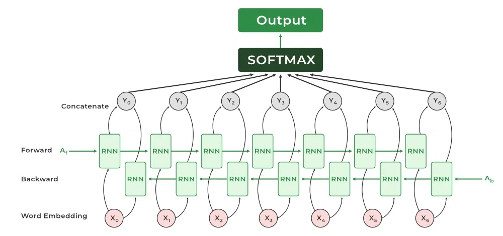
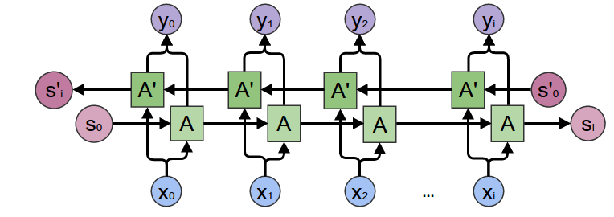

# Day_066 | ↔️ Bidirectional Recurrent Neural Networks (BiRNNs) | Bidirectional LSTMs | Bidirectional GRUs

**Bidirectional Recurrent Neural Networks (BiRNNs)**, and their modern variants **BiLSTMs** and **BiGRUs**, are a variation of recurrent architectures designed to capture context from **both the past and the future** of a sequence.

Standard RNNs only use the information that has *already occurred* in the sequence (the left-to-right or forward context). BiRNNs overcome this limitation by processing the sequence in two directions simultaneously.

---

## 💡 What & Why: The Core Concept

A BiRNN consists of two separate, distinct recurrent layers:

1.  **Forward Layer:** Processes the input sequence from **left-to-right** ($\mathbf{x}_1 \rightarrow \mathbf{x}_T$). This captures the context from the preceding elements.
2.  **Backward Layer:** Processes the input sequence from **right-to-left** ($\mathbf{x}_T \rightarrow \mathbf{x}_1$). This captures the context from the succeeding elements (the "future").

At any time step $t$, the final output is based on the concatenation or some combination of the hidden states from both the forward ($\overrightarrow{\mathbf{h}}_t$) and backward ($\overleftarrow{\mathbf{h}}_t$) layers.

### The Need for Bidirectional Processing

The key benefit is context. For many sequence tasks, understanding an element requires knowing what comes after it.

> *Example:* In the sentence, "The bank was slippery," the word "bank" can mean a financial institution or the side of a river. If the word "slippery" follows, the backward context immediately resolves the ambiguity toward the river bank.

| Standard RNN | Bidirectional RNN |
| :--- | :--- |
| **Only uses Past Context** | **Uses Past and Future Context** |
| Suitable for real-time prediction (where future is unknown). | Essential for tasks requiring full sequence comprehension. |

---

## 🏗️ Architecture and Calculation

The output $\mathbf{y}_t$ at any time step $t$ is calculated by combining the two hidden states:

1.  **Forward Hidden State:** $\overrightarrow{\mathbf{h}}_t = \text{RecurrentCell}(\mathbf{x}_t, \overrightarrow{\mathbf{h}}_{t-1})$
2.  **Backward Hidden State:** $\overleftarrow{\mathbf{h}}_t = \text{RecurrentCell}(\mathbf{x}_t, \overleftarrow{\mathbf{h}}_{t+1})$

3.  **Final Output:** The two hidden states are typically **concatenated** and passed to an output layer:
    $$
    \mathbf{y}_t = \mathbf{W}_y [\overrightarrow{\mathbf{h}}_t; \overleftarrow{\mathbf{h}}_t] + \mathbf{b}_y
    $$
    *Note: The weights and biases for the forward and backward layers are separate and independently learned.* 

The recurrent cells can be:
* **BiRNN:** Uses simple RNN cells (rarely used due to vanishing gradients).
* **BiLSTM:** Uses LSTM cells (most common and effective).
* **BiGRU:** Uses GRU cells (a good balance of speed and performance).

---

## 🌐 Applications

BiRNNs are indispensable for tasks where the entire input sequence is available *before* predictions are made:

* **Named Entity Recognition (NER):** Identifying names, dates, and locations. (e.g., Knowing "Street" follows "Wall" helps classify "Wall Street" as a location).
* **Part-of-Speech Tagging:** Labeling words as nouns, verbs, etc.
* **Machine Translation:** The context of the whole source sentence is required to translate any part of it accurately.
* **Handwriting Recognition:** Recognizing a letter often depends on the surrounding letters in the word.

---

## ⚠️ Drawbacks and Limitations

1.  **Non-Causality:** The biggest drawback is that BiRNNs are **not causal**. They require the *entire input sequence* to be present before they can begin processing the backward pass and generate any prediction. This means they cannot be used for **real-time sequence prediction** (e.g., predicting the next word a user types or forecasting a live stock price).
2.  **Increased Parameters:** A BiRNN essentially doubles the number of recurrent units and weights (one set for the forward pass, one for the backward pass), leading to higher computational cost and increased memory usage.
3.  **Exploding/Vanishing Gradients:** While BiLSTMs and BiGRUs effectively mitigate these issues within each cell, the overall deep architecture still relies on careful implementation and training stability.

---

## ✅ **1. What Is “Bidirectional” in RNNs?**

A **Bidirectional** recurrent neural network processes sequence data **in both directions**:

* **Forward direction** → from past → future
* **Backward direction** → from future → past

Both outputs are combined (via concatenation, sum, or averaging).

### **Why?**

Because sometimes **future context helps interpret the past**.

Example:

* In NLP, to understand the word *“bank”*, you need the words *after* it (river bank vs financial bank).

---

## ✅ **2. Bidirectional RNN (BiRNN)**

### **Architecture**

A Bidirectional RNN has:

* One **forward RNN**
* One **backward RNN**

For each time step (t):

```
forward_output_t = RNN_forward(x_t)
backward_output_t = RNN_backward(x_t_from_end)
output_t = concat(forward_output_t, backward_output_t)
```

### **Characteristics**

* Simple recurrent units
* Prone to vanishing gradient
* Mostly outdated, replaced by LSTM/GRU-based versions

### **Applications**

* Basic NLP tasks
* Sequence labeling
* Simple time-series tasks (where full sequence is available)

### **Drawbacks**

* Cannot handle long dependencies well
* Training instability
* High memory cost
* Needs full sequence → **no real-time prediction**

---

## ✅ **3. Bidirectional LSTM (BiLSTM)**

### **Architecture**

Same bidirectional setup but each direction uses an **LSTM cell**:

LSTM solves vanishing gradient via:

* Memory cell
* Input, forget, output gates

### **Why BiLSTM Is Powerful**

* Can model long-term dependencies
* Can learn from **past and future simultaneously**
* Great for NLP because context exists on both sides

### **Applications**

BiLSTM is extremely popular in:

* Named Entity Recognition (NER)
* POS tagging
* Machine translation (encoder-side)
* Text classification
* Speech recognition
* Handwriting recognition
* Sequence-to-sequence models
* Biomedical sequence analysis

### **Drawbacks**

* Computationally heavy
* High memory usage (2× LSTM direction)
* Slow inference → not ideal for real-time systems
* Requires entire sequence → **no streaming or online prediction**

---

## ✅ **4. Bidirectional GRU (BiGRU)**

### **Architecture**

Same bidirectional setup, with **GRU** cells instead of LSTM.

GRU has:

* Update gate
* Reset gate
* No separate memory cell → simpler, faster

### **Why Use BiGRU?**

* Almost LSTM-level accuracy
* Much faster training
* Fewer parameters → less overfitting
* Good for small datasets or low-resource systems

### **Applications**

Similar to BiLSTM, especially:

* Chatbots
* Emotion detection
* Sentiment analysis
* Time-series forecasting (offline)
* Speech enhancement tasks

### **Drawbacks**

* Still requires full sequence
* Not as expressive as LSTM
* Still slower than unidirectional RNN/GRU
* Limited real-time capability

---

## ✅ **5. When to Use Which?**

### **Choosing Between BiRNN, BiLSTM, and BiGRU**

| Model      | Pros                                     | Cons                     | Best Use                         |
| ---------- | ---------------------------------------- | ------------------------ | -------------------------------- |
| **BiRNN**  | Simple, fast                             | Vanishing gradient       | toy tasks, teaching              |
| **BiLSTM** | Best accuracy, stable for long sequences | Slow, heavy              | NLP, speech, handwriting         |
| **BiGRU**  | Fast, fewer parameters                   | Slightly less expressive | Low-resource NLP, small datasets |

---

## ✅ **6. Why Use Bidirectional Models?**

### **Because Many Tasks Require Both Past and Future Context**

Examples:

* Understand meaning of a word in a sentence
* Determine entity boundaries
* Classify sentiment (“not good *at all*”)
* Speech recognition (need future phonemes)

They significantly improve accuracy in sequence labeling tasks.

---

## ✅ **7. Drawbacks of Bidirectional Models**

### ❗ **Major Limitations**

1. **Cannot be used for real-time / streaming prediction**
   They require the **entire sequence** before prediction.

2. **Double computation cost**
   Two RNNs → ~2× parameters → 2× memory.

3. **Not suitable for extremely long sequences**
   Even LSTM/GRU can struggle.

4. **Slower training and inference**

5. **Large memory footprint**
   Increases GPU RAM requirements.

---

## ✅ **8. Architecture Summary Diagram (Text Concept)**

```
Input sequence: x1, x2, x3 ... xn

Forward RNN:   → h1_f → h2_f → h3_f → ... → hn_f
Backward RNN:  ← h1_b ← h2_b ← h3_b ← ... ← hn_b

Output for each time step:
h_t = [h_t_f ; h_t_b]   (concatenation)
```

This is true for:

* Bidirectional RNN
* Bidirectional LSTM
* Bidirectional GRU
  Only the **cell type** changes.

---

## ✅ **9. Summary in Short**

### **Bidirectional = Using past + future context**

### **BiRNN**

* Basic
* Fast but unstable

### **BiLSTM**

* Most powerful
* Best for NLP and long sequences
* But heavy/slow

### **BiGRU**

* Almost as good as LSTM
* Faster, fewer parameters
* Good compromise

---

## Images


