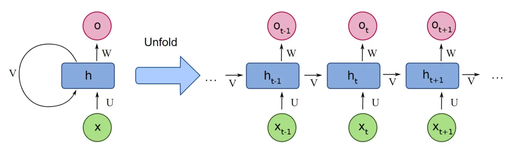
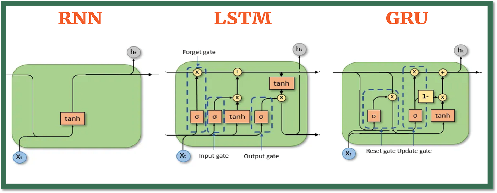
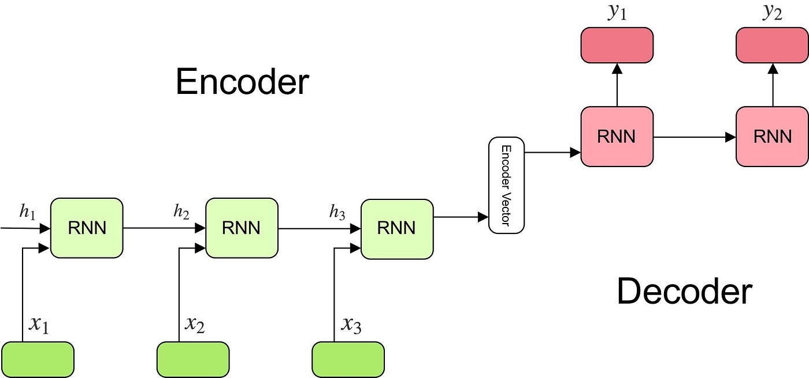
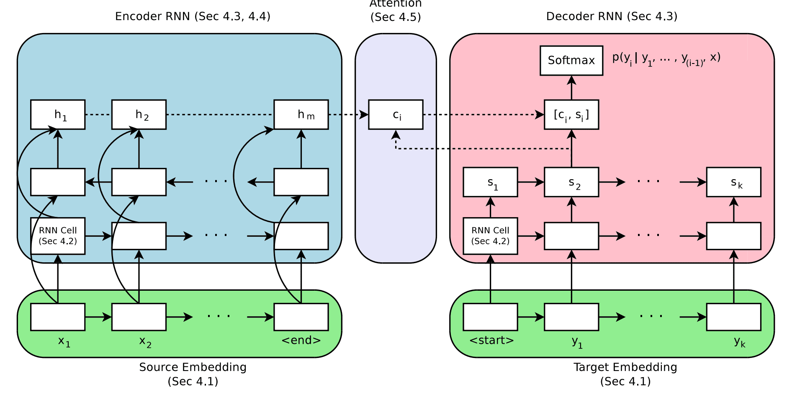
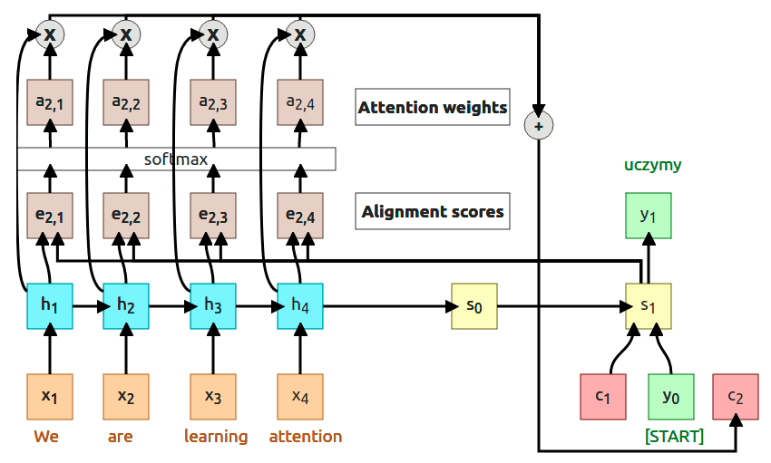
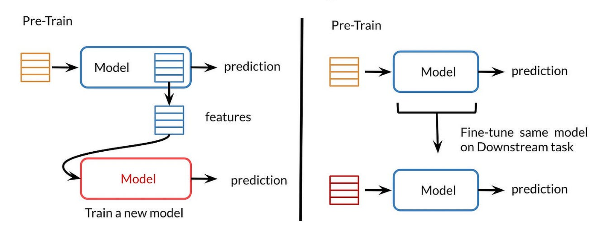
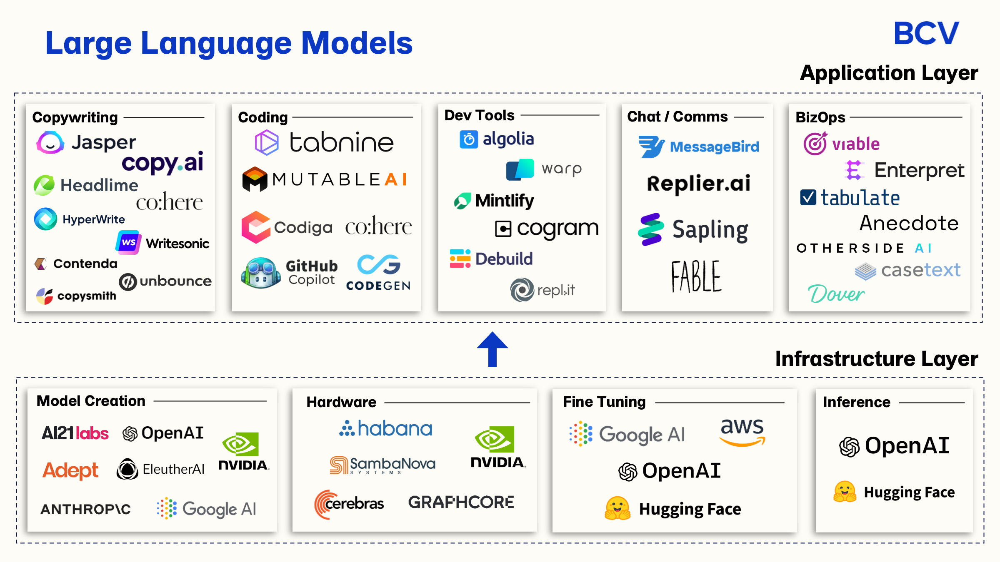

# Day_067 | The Epic History of Large Language Models (LLMs) | From LSTMs to ChatGPT

The epic history of Large Language Models (LLMs) is a recent journey, starting from early sequential models to today's massive, generative transformers. It represents a shift from focusing on local word relationships to understanding global context across vast amounts of text.

---

## ⏳ The Starting Point: Pre-Deep Learning & Early RNNs

The journey began with the transition from traditional statistical methods to sequence-aware neural networks.

### Where it Started: Early Models

| Era | Core Model | Problem Solved | Famous Paper Suggestion |
| :--- | :--- | :--- | :--- |
| **Statistical NLP** (Pre-2000s) | N-gram Models | Solved basic language modeling by predicting the next word based on a fixed preceding $N$ words. | Claude Shannon's *A Mathematical Theory of Communication* (1948) |
| **Recurrent Neural Networks (RNNs)** (1980s-1990s) | Simple RNN | Solved the **Fixed-Context Problem** of N-grams by introducing a **hidden state** to handle sequences of arbitrary length. | *Simple Recurrent Networks* (Elman, 1990) |
| **Long Short-Term Memory (LSTM)** (1997) | Gated RNN | Solved the **Vanishing Gradient Problem** in simple RNNs, allowing models to learn **long-term dependencies** (memory). | *Long Short-Term Memory* (Hochreiter & Schmidhuber, 1997) |

---

## 🌐 The Deep Learning Breakthrough: The Attention Era

The modern era of LLMs truly began with the introduction of the **Attention mechanism**, which led directly to the Transformer architecture.

| Model / Concept | Innovation | Problem Solved | Famous Paper Suggestion |
| :--- | :--- | :--- | :--- |
| **Attention** (2014-2015) | Allowed models to selectively focus on the most relevant parts of the input sequence when making a prediction. | Solved the **Information Bottleneck** in RNN Encoder-Decoders by creating direct links between inputs and outputs. | *Neural Machine Translation by Jointly Learning to Align and Translate* (Bahdanau et al., 2014) |
| **The Transformer** (2017) | Abandoned recurrence entirely, relying solely on **Self-Attention** to capture context. | Solved the **Sequential Processing Bottleneck** of RNNs by enabling massive **parallelization** of training. | ***Attention Is All You Need*** (Vaswani et al., 2017) |

---

## 🤖 Modern LLMs: Pre-training and Scaling

Today's LLMs are all built upon the Transformer architecture and are distinguished by their scale, pre-training objectives, and architectural variations (Encoder-only, Decoder-only, or Encoder-Decoder).

### BERT (Bidirectional Encoder Representations from Transformers)

* **Type:** **Encoder-Only**
* **Architecture:** Uses the Transformer Encoder stack.
* **Pre-training:** **Masked Language Modeling (MLM)** and **Next Sentence Prediction (NSP)**. It predicts masked words in a sentence based on the full surrounding context (bidirectional).
* **Use Case:** Excellent for **understanding and classification** tasks (e.g., sentiment analysis, question answering, summarization).

### GPT (Generative Pre-trained Transformer)

* **Type:** **Decoder-Only**
* **Architecture:** Uses the Transformer Decoder stack with a crucial modification: **Masked Self-Attention**, which prevents tokens from attending to future tokens.
* **Pre-training:** **Causal Language Modeling (CLM)**. It is trained only to predict the next token based on all preceding tokens (unidirectional).
* **Use Case:** Excellent for **generative tasks** (e.g., text completion, chatbots, creative writing). *ChatGPT, GPT-4, and many others are based on this architecture.*

### DeepSeek

* **Type:** **Decoder-Only** (or variants)
* **Architecture:** Often uses sparse attention mechanisms or other innovations to improve efficiency.
* **Goal:** DeepSeek models are known for their focus on **code-related tasks** and achieving high performance across multiple domains, often using a mixture of expert (MoE) architectures in their larger versions for efficiency.

| Model Family | Key Architectural Role | Primary Use |
| :--- | :--- | :--- |
| **BERT, RoBERTa** | **Encoder** (Bidirectional) | Understanding, Classification, Extraction |
| **GPT, Llama, Mistral, DeepSeek** | **Decoder** (Unidirectional/Causal) | Generation, Chatbots, Code Completion |
| **T5, BART** | **Encoder-Decoder** (Full Transformer) | Translation, Summarization |

Below is a **complete, clear, structured, chronological history** of modern NLP and LLMs—from RNNs to DeepSeek—covering:

---

## 🌟 The Complete History of NLP → LLMs

### *RNN → LSTM/GRU → Encoder–Decoder → Attention → Transformer → Transfer Learning → GPT/BERT → Modern LLMs (DeepSeek)*

---

## 1️⃣ **Recurrent Neural Networks (RNNs) – early 1990s**

### 📌 *The Beginning of Neural Sequence Modeling*

### 🔧 How they work

RNNs process input **one token at a time**, keeping a **hidden state** that “remembers” information.

### ❗ Problems they solved

Before RNNs, models could not process sequences well. RNNs allowed:

* sequential text modeling
* variable-length inputs
* early language generation

### ❌ Limitations / Problems

* **Vanishing and exploding gradients**
* Could not learn **long-term dependencies**
* Hard to train, unstable

### 🔗 Key paper

* *Elman Networks* (1990)
* *Backpropagation Through Time (BPTT)*

### 📘 Applications

* Early speech recognition
* Basic language modeling
* Time-series prediction

---

## 2️⃣ **LSTM & GRU – 1997 → 2014**

### 📌 *Solution to the vanishing gradient problem*

### 🔧 How they work

LSTM introduces **gates** (input, forget, output) to control information flow.
GRU is a simplified LSTM (update + reset gates).

### ✔ Problems they solved

* Long-term memory
* Gradient stability
* Better performance in text and speech tasks

### 🔗 Famous papers

* **LSTM (1997)** – Hochreiter & Schmidhuber
* **GRU (2014)** – Cho et al.

### 📘 Applications

* Google Translate (pre-2017)
* Siri/Alexa early speech engines
* Sentiment analysis & text classification

---

## 3️⃣ **Encoder–Decoder Architecture – 2014**

### 📌 *Foundation for sequence-to-sequence (seq2seq) tasks*

### 🔧 How it works

**Encoder:** Converts input text → context vector
**Decoder:** Generates output text from vector

Used heavily in translation.

### ✔ Problems it solved

* Variable-length input → variable-length output
* Allowed machine translation, summarization, captioning

### ❌ Limitation

* The entire input is compressed into **one vector** → information bottleneck
* Still uses RNNs → slow, sequential processing

### 🔗 Key paper

* **Seq2Seq (Sutskever et al., 2014)**

### 📘 Applications

* Translation
* Dialogue systems
* Text summarization

---

## 4️⃣ **Attention Mechanism – 2014**

### 📌 *"Let the decoder look at relevant parts of the input."*

### 🔧 How it works

Instead of using a single context vector, the model assigns **attention weights** to each input token.

### ✔ Problems it solved

* Removes information bottleneck
* Helps with long sentences
* Dramatically improves translation quality

### 🔗 Key paper

* **Bahdanau Attention (2014)** – *Neural Machine Translation by Jointly Learning to Align and Translate*

### 📘 Applications

* Translation
* Speech recognition
* Many encoder–decoder tasks

---

## 5️⃣ **Transformer – 2017**

### 📌 *The revolution: No recurrence, only attention.*

### 🔧 How it works

Uses **self-attention** instead of recurrence, allowing parallel processing of tokens.

### ✔ Problems it solved

* Can process sequences **in parallel** → fast training
* Can model **very long dependencies**
* Scales with data and GPU power → foundation for modern LLMs

This paper marks the beginning of **modern AI**.

### 🔗 Key paper

* **Attention Is All You Need (Vaswani et al., 2017)**

### 📘 Applications

* All modern LLMs
* Vision transformers
* Speech models
* Multimodal models

---

## 6️⃣ **Transfer Learning in NLP – 2018**

### 📌 *Train on massive text → fine-tune on small tasks.*

### 🔧 How it works

A model is first **pretrained** on huge datasets using self-supervised objectives such as:

* Masked Language Modeling (MLM)
* Next word prediction

Then it is **fine-tuned** on downstream tasks:

* classification
* sentiment
* QA
* translation

### ✔ Problems it solved

Before 2018, every NLP task required training from scratch.
Transfer learning allowed:

* low-data learning
* fast adoption
* generalization across tasks

### 🔗 Key papers

* **ULMFiT (Howard & Ruder, 2018)** – first NLP transfer learning success
* **ELMo (2018)** – contextual embeddings

### 📘 Applications

* All modern NLP pipelines
* Enterprise text systems
* Chatbots, classification tools

---

## 7️⃣ **BERT – 2018**

### 📌 *Bidirectional Transformers for Understanding*

### 🔧 How it works

BERT uses **Transformer encoder only**, trained with:

* **Masked Language Modeling (MLM)**
* **Next Sentence Prediction (NSP)**

It learns deep contextual understanding of text.

### ✔ Problems it solved

* Bidirectional context understanding
* State-of-the-art on all NLP benchmarks
* Strong performance on: classification, QA, NER, sentiment

### ❌ Limitations

* Cannot generate text
* Costly to train
* Not suitable for chatbots

### 🔗 Famous paper

* **BERT: Pre-training of Deep Bidirectional Transformers** (Devlin et al., 2018)

### 📘 Applications

* Search engines (Google uses BERT)
* Sentiment analysis
* Question answering
* Language understanding tasks

---

## 8️⃣ **GPT Family – 2018 → Today**

### 📌 *Autoregressive decoder-only models for generation*

### 🔧 How they work

GPT predicts the **next word** token by token (autoregressive).

Trained on massive datasets → learns:

* long-range reasoning
* text generation
* dialogue
* coding
* chain-of-thought

### ✔ Problems they solved

* Natural, human-like text generation
* Zero-shot / few-shot learning
* Conversational AI
* Multi-task generalization

### Model timeline

* **GPT-1** (2018) – early proof
* **GPT-2** (2019) – large-scale generation
* **GPT-3** (2020) – few-shot learning
* **ChatGPT (2022)** – RLHF & alignment breakthrough
* **GPT-4, 4o (2023–2024)** – multimodal & reasoning
* **GPT-5 era (2025)** – frontier intelligence

### 🔗 Key papers

* GPT-1: *Improving Language Understanding by Generative Pretraining*
* GPT-3: *Language Models are Few-Shot Learners*

### 📘 Applications

* Chatbots
* Writing & content generation
* Code assistants
* Knowledge retrieval
* Enterprise automation

---

## 9️⃣ **Modern LLM Era – 2023 to now**

## 📌 *Mixture-of-Experts, Efficiency, and Open-Source LLMs*

### 🟢 DeepSeek (China)

DeepSeek is known for:

* Efficiency-focused training
* **Mixture-of-Experts (MoE)** architecture
* High reasoning/coding performance
* Competing with GPT-4-level models at lower cost

### 🔧 How DeepSeek works

MoE = multiple expert networks, but only a few activate per token → efficient but powerful.

### ✔ Problems it solved

* Large-scale training efficiency
* Faster inference
* Lower compute cost
* High accuracy on benchmarks

### 🔗 Representative papers

* **DeepSeekMoE: Towards Efficient Mixture-of-Experts Models**
* DeepSeek-V2 / V3 papers

### 📘 Applications

* Code generation
* Reasoning assistants
* AI development tools
* Research & enterprise LLMs

---

## 🔟 Additional Important Topics (optional but useful)

Here are some topics you *can* add for a complete course-style outline:

### ✔ Word Embeddings (Word2Vec, GloVe) – 2013–2015

* Introduced dense vector representations
* Allowed semantic similarity (king – man + woman ≈ queen)

### ✔ Self-Supervised Learning

* Foundation of LLM pretraining
* No labels needed
* Huge scaling possible

### ✔ RLHF (Reinforcement Learning from Human Feedback)

* Core of ChatGPT
* Makes models safe, helpful, conversational

### ✔ Mixture-of-Experts (MoE)

* Used by DeepSeek, Gemini, some versions of GPT
* Improves efficiency by routing computation

### ✔ Multimodal Models

* GPT-4o, Gemini, Claude 3
* Understand images, video, audio, text

---

## 📦 Summary Table (One Look)

| Stage               | Innovation                  | Problem Solved                      | Famous Model / Paper               |
| ------------------- | --------------------------- | ----------------------------------- | ---------------------------------- |
| RNN                 | Sequence modeling           | Basic sequential memory             | Elman (1990)                       |
| LSTM/GRU            | Long-term dependencies      | Vanishing gradients                 | Hochreiter & Schmidhuber (1997)    |
| Encoder–Decoder     | Seq2Seq tasks               | Translation bottleneck              | Sutskever et al. (2014)            |
| Attention           | Focus on relevant tokens    | Context bottleneck                  | Bahdanau (2014)                    |
| Transformer         | Parallel, scalable modeling | RNN is slow & weak for long context | *Attention Is All You Need* (2017) |
| Transfer Learning   | Pretrain → Finetune         | Data scarcity                       | ULMFiT, ELMo                       |
| BERT                | Text understanding          | Bidirectional context               | Devlin (2018)                      |
| GPT                 | Text generation             | Autoregressive generation           | Radford, Brown                     |
| DeepSeek & MoE LLMs | Efficiency                  | Compute cost, scaling               | DeepSeekMoE                        |

---

## 🎯 Final Summary Sentence

> The evolution of LLMs is a chain of breakthroughs that solved specific problems—
> from memory (RNNs) → long-term dependencies (LSTMs) → translation bottlenecks (Encoder–Decoder) → attention limits → scalability (Transformers) → universal language understanding (BERT) → generative intelligence (GPT) → efficient frontier models (DeepSeek).

---

## Images

<!--  -->
