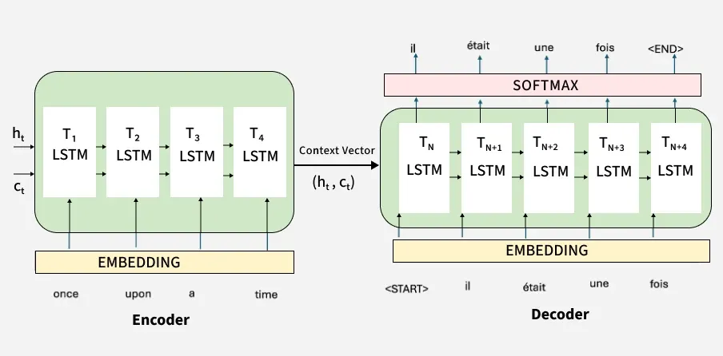
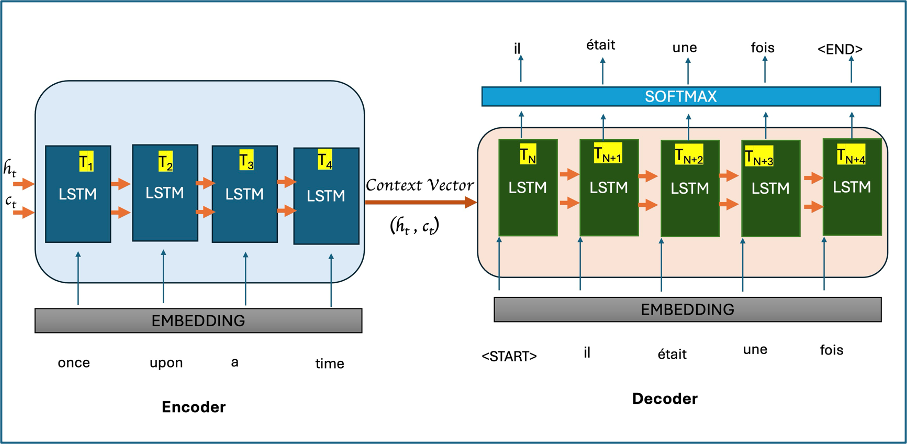
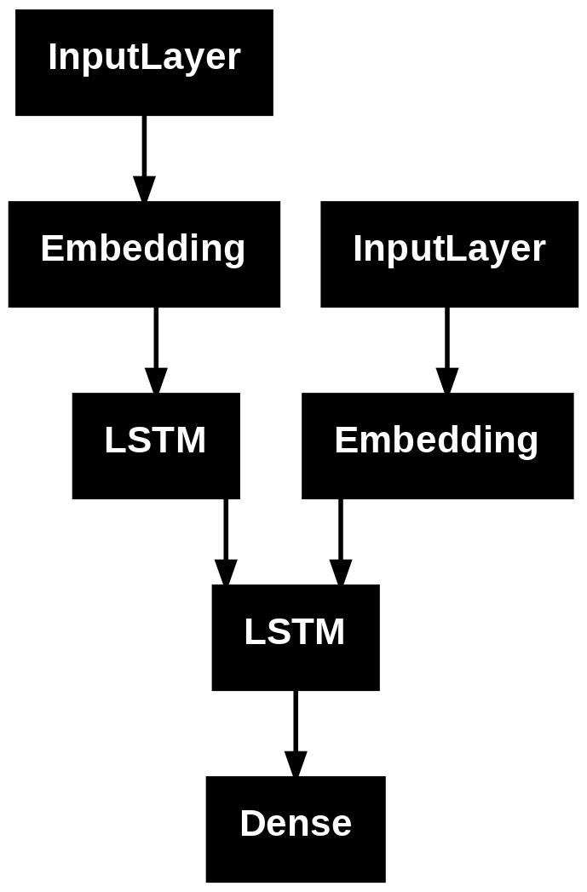

# Day_068 | 🔄 Encoder-Decoder: The Sequence-to-Sequence (Seq2Seq) Architecture

The **Encoder-Decoder** architecture, also known as **Sequence-to-Sequence (Seq2Seq)**, is a powerful framework designed to transform an input sequence of arbitrary length into an output sequence of arbitrary length. This architecture is the foundation for tasks like **Machine Translation** and **Text Summarization**.

---

## 🏗️ Architecture and How It Works

The Seq2Seq model is built using two separate, cooperating recurrent neural networks (RNNs), typically **LSTMs** or **GRUs**, allowing it to handle sequences of varying lengths.

### 1. The Encoder

The Encoder processes the entire input sequence $\mathbf{X} = (x_1, x_2, \dots, x_M)$ one element at a time.

* **Mechanism:** It iteratively updates its internal hidden state. The output sequence of hidden states is usually ignored (in the original design), and only the **final hidden state** ($\mathbf{h}_M$) is retained.
* **Role:** The final hidden state $\mathbf{h}_M$ is the **Context Vector ($\mathbf{C}$)**. This vector is a dense, fixed-size numerical summary that is supposed to encapsulate the entire meaning and context of the input sequence.

### 2. The Decoder

The Decoder uses the Context Vector ($\mathbf{C}$) as its initial state (or as an input at every time step) and then generates the output sequence $\mathbf{Y} = (y_1, y_2, \dots, y_T)$ one element at a time.

* **Mechanism:** It operates iteratively. At each step $t$, it takes the **Context Vector ($\mathbf{C}$)** and the **previous output element ($y_{t-1}$)** as input to predict the current output element ($y_t$).
* **Role:** To decode the information contained in the fixed-size context vector into the target sequence.

[Image of RNN Encoder-Decoder architecture]

---

## 🎯 Sequence Prediction (Inference)

During prediction (inference), the model must rely on its own previous output, a process distinct from training where **teacher forcing** (using the true target word) is often employed.

1.  **Start Token:** The decoder is initialized with the Context Vector $\mathbf{C}$ and a special start-of-sequence token (e.g., `<START>`).
2.  **Iterative Prediction:** The decoder outputs a probability distribution over the entire vocabulary via a Softmax layer. The word with the highest probability is selected as $y_1$.
3.  **Feedback Loop:** This newly predicted word $y_1$ is then fed back as the input to the decoder for the next time step, to generate $y_2$, and so on.
4.  **End Condition:** The process continues until a special end-of-sequence token (e.g., `<END>`) is predicted, or a predefined maximum sequence length is reached.

---

## 📉 Backpropagation in Seq2Seq

Backpropagation in a Seq2Seq model involves training two separate RNNs simultaneously, connected by the context vector, using the **Backpropagation Through Time (BPTT)** algorithm.

1.  **Loss Calculation:** The total loss is the sum of the losses at all time steps of the decoder ($\mathbf{y}_1$ through $\mathbf{y}_T$).
2.  **Decoder BPTT:** BPTT is first applied to the Decoder to find the gradients for its weights, flowing backward from $\mathbf{y}_T$ to $\mathbf{y}_1$.
3.  **Gradient Flow to Encoder:** The gradients then flow from the Decoder's initial state (the Context Vector $\mathbf{C}$) back into the Encoder's final hidden state ($\mathbf{h}_M$).
4.  **Encoder BPTT:** BPTT is applied to the Encoder to distribute the error across all input time steps ($\mathbf{x}_M$ to $\mathbf{x}_1$), updating the Encoder's weights.

---

## ✨ Improvements and the Rise of the Transformer

The original RNN Encoder-Decoder model faced a major limitation: the fixed-size **Context Vector** struggled to compress all necessary information for very long sequences, creating a **bottleneck**.

### 1. The Attention Mechanism (2015)

* **Problem Solved:** The fixed-size Context Vector bottleneck.
* **Mechanism:** Instead of passing only $\mathbf{h}_M$, the Decoder is allowed to selectively access and weigh the **entire sequence of the Encoder's hidden states** ($\mathbf{h}_1, \dots, \mathbf{h}_M$) at every step of decoding.
* **Impact:** This dramatically improved performance on tasks like Machine Translation by allowing the decoder to "look back" at the relevant source words as needed.

### 2. The Transformer Architecture (2017)

The Transformer superseded the recurrent Encoder-Decoder.

* **Problem Solved:** The **Sequential Processing Bottleneck** (RNNs are inherently slow because they must wait for the previous step) and the **Vanishing Gradient** problem.
* **Mechanism:** It completely replaces the RNNs with layers built solely on the **Self-Attention** mechanism.
* **Impact:** Enabled massive parallelization and scaling, leading to the creation of modern LLMs like BERT (Encoder-only) and GPT (Decoder-only).

---

## **Encoder–Decoder / Seq2Seq Architecture**

Seq2Seq models are neural network architectures designed to **map one sequence to another**, often of different lengths.
Examples: machine translation, summarization, speech recognition, dialogue systems, code generation.

---

## **1. Architecture Overview**

A **Seq2Seq** model has two main components:

## **1.1 Encoder**

* Takes an **input sequence** (e.g., words in a sentence).
* Processes tokens step by step.
* Produces:

  * A sequence of hidden states (for attention models), or
  * A final context vector (for vanilla models).

## **1.2 Decoder**

* Generates an **output sequence**, one step at a time.
* Uses:

  * The encoder’s representation
  * Its own previous outputs
  * Possibly attention over encoder states.

---

## **2. How It Works (Step-by-Step)**

### **Step 1 — Input Processing**

Given input ( x = [x_1, x_2, ..., x_T] ):

1. Each token is embedded into a vector.
2. Encoder processes them using **RNN (LSTM/GRU) / CNN / Transformer layers**.

---

### **Step 2 — Encoder Representation**

Two possible styles:

### **(a)** *Vanilla Seq2Seq (no attention)*

Encoder outputs a single vector:

$$
h_{\text{enc}} = f(x_1, x_2, ..., x_T)
$$

This is called the **context vector**.

### **(b)** *Attention-based Seq2Seq*

Encoder outputs **all hidden states**:

$$
H = [h_1, h_2, ..., h_T]
$$
---

### **Step 3 — Decoder Initialization**

Decoder receives:

* Encoder final state (or a learned initialization)
* `<SOS>` token (start of sequence)

---

### **Step 4 — Autoregressive Decoding**

At each time step ( t ):

$$
y_t = \text{Decoder}(y_{t-1}, s_{t-1}, \text{context})
$$

Decoder uses:

* Previous predicted token ( y_{t-1} )
* Its own previous hidden state ( s_{t-1} )
* Encoder information (context or attention)

---

## **3. Predictions (Inference)**

Ways to generate the next token:

### **3.1 Greedy Decoding**

Choose the most probable token at each step.

### **3.2 Beam Search**

Track multiple candidate sequences, choose best overall.

### **3.3 Sampling / Temperature**

Randomized generation with tunable creativity.

---

## **4. Attention Mechanism**

Attention computes a weighted combination of encoder states:

$$
\alpha_{t,i} = \text{softmax}(s_{t-1}^\top h_i)
$$

$$
c_t = \sum_i \alpha_{t,i} h_i
$$

Meaning:
**Decoder learns which parts of the input to “look at” at each step.**

This solves the bottleneck of vanilla Seq2Seq.

---

## **5. Backpropagation in Seq2Seq**

Training is done via **Backpropagation Through Time (BPTT)**.

### **5.1 Loss Function**

Usually **cross-entropy** over each predicted token:

$$
L = -\sum_{t=1}^T \log P(y_t^* | y_{<t}, x)
$$

Where ( $y_t^*$ ) is the ground truth.

---

### **5.2 Gradients Flow Through:**

1. **Decoder steps** (unrolled RNN / Transformer layers)
2. **Attention mechanism** (if used)
3. **Encoder steps**
4. **Embeddings and parameters**

Because the decoder depends on encoder outputs, errors propagate back through the **entire model**, modifying how the encoder represents the input.

---

## **6. Common Improvements & Modern Enhancements**

### **6.1 Attention**

* Bahdanau attention
* Luong attention
  Solves the fixed bottleneck of the context vector.

### **6.2 Bidirectional Encoder**

Processes input left-to-right and right-to-left.

### **6.3 Beam Search**

Better inference.

### **6.4 Teacher Forcing**

During training, decoder uses the ground-truth token rather than its own prediction.

### **6.5 Scheduled Sampling**

Gradually replace true tokens with model predictions during training.

### **6.6 Copy Mechanism / Pointer Networks**

Allows model to copy rare or unseen tokens (e.g., names, numbers).

### **6.7 Coverage Mechanisms**

Avoids repeated or missing information.

### **6.8 Transformers**

The modern replacement for RNN-based Seq2Seq.

Advantages:

* No recurrence
* Parallelizable
* Better long-range dependencies

### **6.9 Pretraining (BART, T5, mT5)**

Large-scale unsupervised pretraining dramatically improves performance.

---

## **7. Summary**

| Component           | Role                                                                       |
| ------------------- | -------------------------------------------------------------------------- |
| **Encoder**         | Converts input sequence → learned representation                           |
| **Decoder**         | Generates output sequence autoregressively                                 |
| **Attention**       | Dynamically focuses on relevant encoder states                             |
| **Backpropagation** | Flows through decoder → attention → encoder                                |
| **Improvements**    | Attention, Transformers, beam search, pointer networks, pretrained Seq2Seq |

---

## Images

