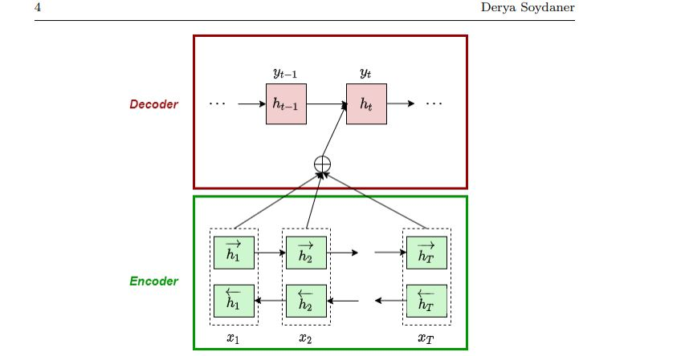
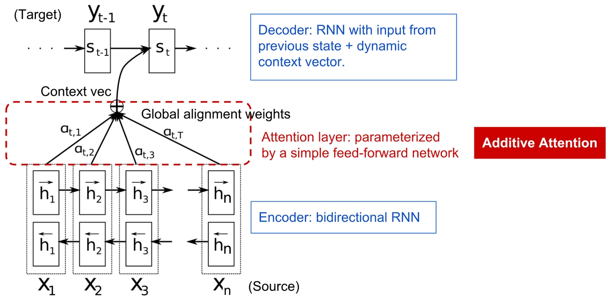
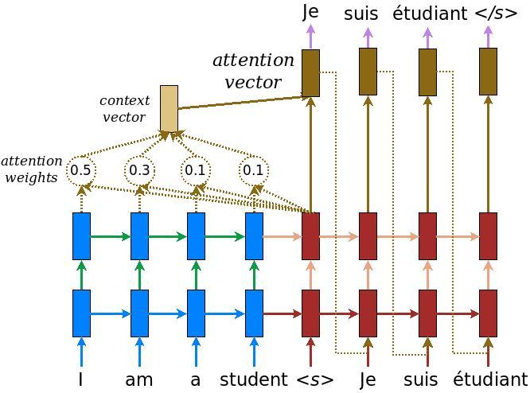

# Day_069 | 🧠 Attention Mechanism in Seq2Seq

The **Attention Mechanism** was introduced to solve the major flaw in the original RNN Encoder-Decoder architecture: the **Context Vector Bottleneck**. It allows the decoder to selectively focus on the most relevant parts of the input sequence during decoding.

---

## 🛑 Why Simple Encoder-Decoder Fails (The Bottleneck)

In the original Sequence-to-Sequence (Seq2Seq) model, the Encoder's final hidden state is compressed into a single, fixed-size **Context Vector ($\mathbf{C}$)**.

1.  **Fixed-Size Constraint:** Regardless of the input sequence length (e.g., 5 words vs. 50 words), this vector must have the same dimension.
2.  **Information Loss:** For long input sequences, it is impossible for this fixed-size vector to retain all the necessary information and nuances of the entire input. As the sequence length increases, the model often **forgets** the information contained in the early parts of the sequence.
3.  **Performance Degradation:** This information bottleneck causes a significant drop in performance, especially in tasks like Machine Translation involving long, complex sentences.

---

## ✨ What is Attention?

**Attention** is a mechanism that allows the decoder to access **all** the hidden states of the encoder, not just the final one. When the decoder predicts an output word, it computes a set of **weights** (or **scores**) that quantify the relevance of each input word's hidden state to the current decoding step.

### How It Works: The Three Steps

At each decoding time step $t$, the Attention mechanism performs the following:

#### 1. Calculate Alignment Scores (Relevance)

The decoder's current hidden state ($\mathbf{h}_t^{\text{dec}}$) is compared to every hidden state from the encoder ($\mathbf{h}_i^{\text{enc}}$) to calculate an **alignment score ($e_{ti}$)**. This score measures how well the input word $i$ aligns with the current output step $t$.

* **Mechanism:** Typically calculated using a dot product, concatenation followed by a dense layer, or a simple function:

$$e_{ti} = \text{Score}(\mathbf{h}_t^{\text{dec}}, \mathbf{h}_i^{\text{enc}})$$

#### 2. Normalize to Attention Weights

The raw alignment scores are normalized across all input positions using the **Softmax function** to create the **Attention Weights ($\alpha_{ti}$)**.

* **Mechanism:** These weights sum up to 1 ($\sum_i \alpha_{ti} = 1$). They represent a probability distribution, showing which input words are most important for the current output.

$$\alpha_{ti} = \frac{\exp(e_{ti})}{\sum_{k=1}^{M} \exp(e_{tk})}$$

#### 3. Compute the Context Vector

The attention weights ($\alpha_{ti}$) are used to take a **weighted sum** of the encoder's hidden states. This produces the **Attention Context Vector ($\mathbf{C}_t$)** for the current time step $t$.

* **Mechanism:** This new, dynamic context vector ($\mathbf{C}_t$) is now a customized summary of the input, focusing on the relevant parts.

$$\mathbf{C}_t = \sum_{i=1}^{M} \alpha_{ti} \mathbf{h}_i^{\text{enc}}$$

* **Final Output:** This new $\mathbf{C}_t$ is then concatenated with the decoder's hidden state $\mathbf{h}_t^{\text{dec}}$ to make the final prediction. 

---

## 📊 Difference from Simple Encoder-Decoder

The introduction of Attention fundamentally changes how context is transferred from the Encoder to the Decoder.

| Feature | Simple Encoder-Decoder | Encoder-Decoder with Attention |
| :--- | :--- | :--- |
| **Context Vector** | **Fixed-size ($\mathbf{C}$)**, created only from $\mathbf{h}_M$. | **Dynamic ($\mathbf{C}_t$)**, calculated uniquely at every decoding step $t$. |
| **Information Flow** | **Single Bottleneck:** All information must be compressed into one vector. | **Direct Access:** Decoder accesses all Encoder states, bypassing the bottleneck. |
| **Contextual Focus** | **Global/Static:** Cannot adapt to which input words are needed. | **Local/Dynamic:** Focuses only on the most relevant input words for the current output. |
| **Interpretability** | Poor. | **Good:** Attention weights ($\alpha_{ti}$) show which input words the model is focusing on (a form of interpretability). |
| **Performance (Long Seq)** | Degrades rapidly. | Maintains high performance. |

---

## 1. **Seq2Seq without attention**

A standard **encoder-decoder model** works like this:

1. **Encoder**: Takes the input sequence $(X = (x_1, x_2, ..., x_T))$ and compresses it into a **single fixed-size context vector** (c) (usually the final hidden state of the encoder).

$$
h_t = \text{RNN}(x_t, h_{t-1})
$$

$$
c = h_T
$$

2. **Decoder**: Generates the output sequence $(Y = (y_1, y_2, ..., y_{T'}))$ using only (c) as the initial hidden state.

$$
s_t = \text{RNN}(y_{t-1}, s_{t-1}, c)
$$

$$
y_t = \text{softmax}(W s_t)
$$

**Problem:**

* The encoder must compress **all information from the input sequence** into a **single fixed-length vector (c)**.
* For long sequences, this vector cannot capture all relevant information → the model struggles with long sentences (information bottleneck).

---

## 2. **Why we need attention**

Attention solves the **information bottleneck**:

* Instead of forcing the decoder to rely on **one fixed vector**, attention allows it to **look at all encoder hidden states** at each decoding step.
* Intuition: When translating a word, not all input words are equally relevant. Attention lets the decoder “focus” on the most relevant parts of the input.

Example (translation):

* Input: `"The cat sat on the mat"`
* When generating `"gato"` (Spanish for cat), the decoder should focus more on `"cat"` rather than `"mat"` or `"sat"`.

---

## 3. **How attention works**

1. **Encoder** produces a sequence of hidden states:

$$
H = (h_1, h_2, ..., h_T)
$$

2. **Decoder** has a current hidden state (s_t).

3. Compute **attention scores** $(e_{t,i})$ between decoder state $(s_t)$ and each encoder hidden state $(h_i)$:

$$
e_{t,i} = \text{score}(s_t, h_i)
$$

* Common scoring functions:

  * **Dot product:** $(e_{t,i} = s_t^\top h_i)$
  * **General:** $(e_{t,i} = s_t^\top W_a h_i)$
  * **Concat:** $(e_{t,i} = v_a^\top \tanh(W_a[s_t; h_i]))$

4. Normalize scores with **softmax** to get **attention weights** (\alpha_{t,i}):

$$
\alpha_{t,i} = \frac{\exp(e_{t,i})}{\sum_{k=1}^T \exp(e_{t,k})}
$$

* These $(\alpha_{t,i})$ sum to 1 and indicate **how much to focus on each encoder state**.

5. Compute **context vector** (c_t) as a weighted sum of encoder hidden states:

$$
c_t = \sum_{i=1}^T \alpha_{t,i} h_i
$$

6. Use (c_t) along with (s_t) to predict output:

$$
y_t = \text{softmax}(W [s_t; c_t])
$$

✅ Key idea: **Different context vector for each output time step**.

---

## 4. **Difference from vanilla encoder-decoder**

| Feature                       | Vanilla Seq2Seq                                             | Seq2Seq with Attention                          |
| ----------------------------- | ----------------------------------------------------------- | ----------------------------------------------- |
| Context                       | Single fixed vector $(c = h_T)$                               | Dynamic context $(c_t = \sum \alpha_{t,i} h_i)$   |
| Input focus                   | Decoder has no direct access to intermediate encoder states | Decoder can “attend” to any encoder state       |
| Performance on long sequences | Poor                                                        | Much better                                     |
| Interpretability              | Low                                                         | Attention weights $(\alpha_{t,i})$ show alignment |

---

## 5. **Intuition**

* Vanilla seq2seq: “compress entire book into a single sentence summary.”
* Attention: “read the book, then choose the relevant sentences when writing each part of the summary.”

---

## Images

