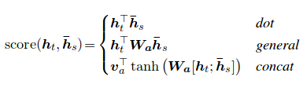
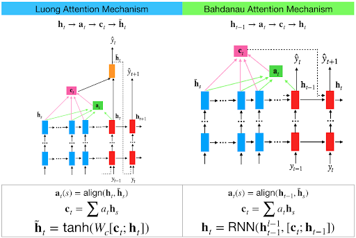
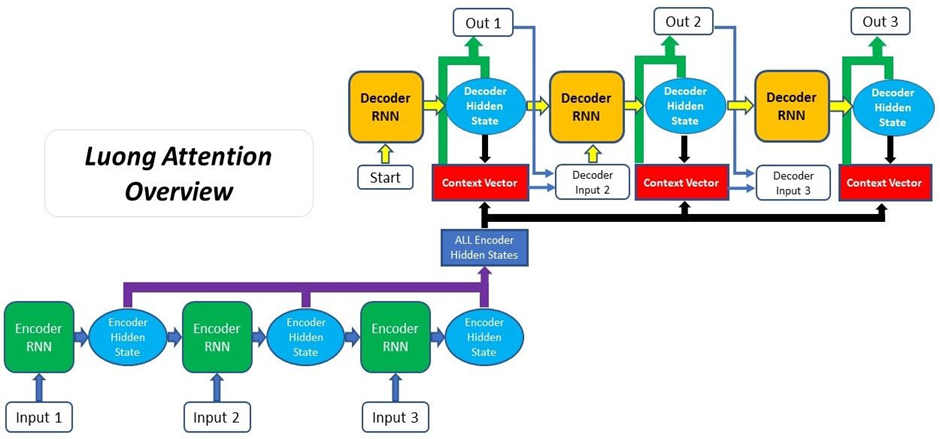
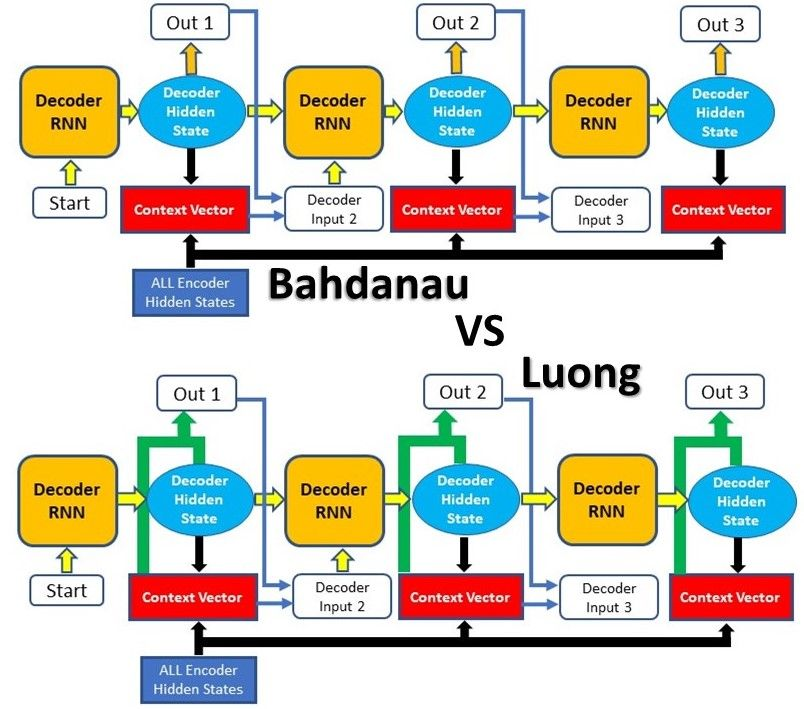

# Day_070 | 🔍 Bahdanau and Luong Attention

The **Bahdanau Attention** and **Luong Attention** are the two most influential types of attention mechanisms used in the **Encoder-Decoder (Seq2Seq)** framework, particularly for Neural Machine Translation (NMT). They differ primarily in where and how the attention score is calculated and how the context vector is used.

---

## 🆚 Comparison of Bahdanau and Luong Attention

| Feature | Bahdanau Attention (Additive/Concatenative) | Luong Attention (Multiplicative/Dot-Product) |
| :--- | :--- | :--- |
| **Calculation Location** | **Previous Decoder Hidden State** ($\mathbf{h}_{t-1}^{\text{dec}}$) | **Current Decoder Hidden State** ($\mathbf{h}_t^{\text{dec}}$) |
| **Alignment Function** | **Additive/Concatenative:** Uses an additional feedforward layer ($\mathbf{v}^\top \tanh(\dots)$) to compute alignment scores. | **Multiplicative/Dot-Product:** Uses simple matrix multiplications (Dot, General, Concat). |
| **Complexity** | More complex; uses an extra weight matrix ($\mathbf{W}$) and bias ($\mathbf{b}$). | Simpler and faster computationally. |
| **Context Vector Usage** | Concatenates the Attention Context Vector ($\mathbf{C}_t$) with the **Previous** hidden state ($\mathbf{h}_{t-1}^{\text{dec}}$) to compute the next hidden state. | Concatenates the Attention Context Vector ($\mathbf{C}_t$) with the **Current** hidden state ($\mathbf{h}_t^{\text{dec}}$) to calculate the final output ($\tilde{\mathbf{h}}_t$). |
| **Memory** | Global (similar to Luong Global). | Both **Global** and **Local** variants. |
| **Paper** | *Neural Machine Translation by Jointly Learning to Align and Translate* (2014) | *Effective Approaches to Attention-based Neural Machine Translation* (2015) |

---

## 1. Bahdanau Attention (Additive/Global)

Bahdanau attention was the **first widely adopted attention mechanism** and solved the fixed-size context bottleneck.

### How it Works

1.  **Alignment Score:** The score $e_{ti}$ is calculated using the **previous** hidden state of the decoder ($\mathbf{h}_{t-1}^{\text{dec}}$) and the encoder's hidden state ($\mathbf{h}_i^{\text{enc}}$). The scoring function is **additive** (involves concatenation and an extra dense layer).

$$e_{ti} = \mathbf{v}^\top \tanh(\mathbf{W}_1 \mathbf{h}_{t-1}^{\text{dec}} + \mathbf{W}_2 \mathbf{h}_i^{\text{enc}} + \mathbf{b})$$

2.  **Context Usage:** The computed Attention Context Vector ($\mathbf{C}_t$) is used to compute the next hidden state, integrating the attention mechanism directly into the **recurrent loop** of the decoder.

---

## 2. Luong Attention (Multiplicative/Global & Local)

Luong attention introduced simpler scoring mechanisms and defined the distinction between global and local attention.

### A. Global Attention

Luong Global Attention uses **all** of the encoder's hidden states, similar to Bahdanau.

1.  **Alignment Score:** The score $e_{ti}$ is calculated using the **current** hidden state of the decoder ($\mathbf{h}_t^{\text{dec}}$) and $\mathbf{h}_i^{\text{enc}}$. The scoring is typically **multiplicative** (e.g., Dot or General):

$$\text{Dot: } e_{ti} = (\mathbf{h}_t^{\text{dec}})^\top \mathbf{h}_i^{\text{enc}}$$

$$\text{General: } e_{ti} = (\mathbf{h}_t^{\text{dec}})^\top \mathbf{W} \mathbf{h}_i^{\text{enc}}$$

2.  **Context Usage:** The computed Attention Context Vector ($\mathbf{C}_t$) is concatenated with the current decoder hidden state ($\mathbf{h}_t^{\text{dec}}$) to form a **"Attended Hidden State" ($\tilde{\mathbf{h}}_t$)**, which is then used to generate the final output $\mathbf{y}_t$. The attention does **not** directly influence the recurrent hidden state calculation.

### B. Local Attention

Local Attention is a refinement where the model first predicts a single aligned position in the source sentence and only attends to a small **window** of surrounding encoder hidden states. This is computationally cheaper and can be more effective for very long sentences.

---

## 🔑 Key Takeaway

The most common difference cited is the **scoring function**: Bahdanau uses **Additive** scoring (more complex but argued to be better for varying dimensions), while Luong often uses **Multiplicative** scoring (simpler and faster).

The second key difference is **where the attention is calculated and applied**: Bahdanau uses the previous hidden state and integrates the context early; Luong uses the current hidden state and integrates the context later to compute the output.

---

## 🔍 **Bahdanau Attention vs. Luong Attention**

Both mechanisms were designed for **seq2seq models** (especially Neural Machine Translation), but they differ in **how they compute alignment scores** and how they use decoder states.

---

## 1. **Bahdanau Attention (Additive Attention) — 2014**

**Paper:** *“Neural Machine Translation by Jointly Learning to Align and Translate”* (Bahdanau et al.)

### ✅ **Key Ideas**

* Introduced attention.
* Uses **additive scoring** (a small feed-forward network).
* Attention is computed using the **previous decoder state** (s_{t-1}).
* Designed for GRU encoder-decoder originally.

---

### 🔢 **Scoring Function**

(Additive attention)

$$
e_{t,i} = v_a^\top \tanh(W_a s_{t-1} + U_a h_i)
$$

Where:

* ($s_{t-1}$): previous decoder hidden state
* ($h_i$): encoder hidden state
* ($W_a, U_a, v_a$): learned parameters

---

### ⭐ Properties

| Property           | Bahdanau                                 |
| ------------------ | ---------------------------------------- |
| Score type         | Additive (MLP)                           |
| Inputs             | (s_{t-1}), (h_i)                         |
| Computational cost | Higher (MLP per pair)                    |
| Alignment          | More flexible, better for long sequences |
| Accuracy           | Often more accurate than Luong           |

---

## 2. **Luong Attention (Multiplicative Attention) — 2015**

**Paper:** *“Effective Approaches to Attention-based Neural Machine Translation”* (Luong et al.)

### ✅ **Key Ideas**

* Uses **multiplicative scoring**, faster than Bahdanau.
* Attention uses the **current decoder state** (s_t).
* Proposed **three types of scoring functions**.

---

### 🔢 **Scoring Functions**

#### **a) Dot Product**

$$
e_{t,i} = s_t^\top h_i
$$

#### **b) General**

$$
e_{t,i} = s_t^\top W_a h_i
$$

#### **c) Concat (less common in Luong)**

$$
e_{t,i} = v_a^\top \tanh(W_a[s_t; h_i])
$$

---

### ⭐ Properties

| Property           | Luong                         |
| ------------------ | ----------------------------- |
| Score type         | Multiplicative (dot/general)  |
| Inputs             | $(s_t), (h_i)$                |
| Computational cost | Lower, faster                 |
| Alignment          | Slightly weaker than Bahdanau |
| Best use           | Real-time or large models     |

---

## 3. **High-Level Differences**

| Feature            | Bahdanau (Additive)              | Luong (Multiplicative)          |
| ------------------ | -------------------------------- | ------------------------------- |
| Decoder state used | Previous decoder state ($s_{t-1}$) | Current decoder state ($s_t$)     |
| Alignment model    | Feed-forward neural network      | Dot/General (faster)            |
| Complexity         | Slower (more parameters)         | Faster (matrix multiplications) |
| Accuracy           | Slightly better alignment        | Good but sometimes weaker       |
| When proposed      | 2014                             | 2015                            |
| Original model     | RNN (GRU)                        | RNN (LSTM)                      |

---

## 4. **Illustration in One Sentence**

**Bahdanau Attention**:

> “Compare decoder state and encoder states through a learnable MLP → slower but more expressive.”

**Luong Attention**:

> “Use fast dot-products with current decoder state → simpler, faster, good performance.”

---

## 5. **Which one is used today?**

* Transformers use **scaled dot-product attention** → closest to **Luong dot-product attention**.
* Most modern seq2seq systems prefer **Luong-style** or **Transformer attention** because:

  * Fast
  * Parallelizable
  * Works well with large data

---

## Images

